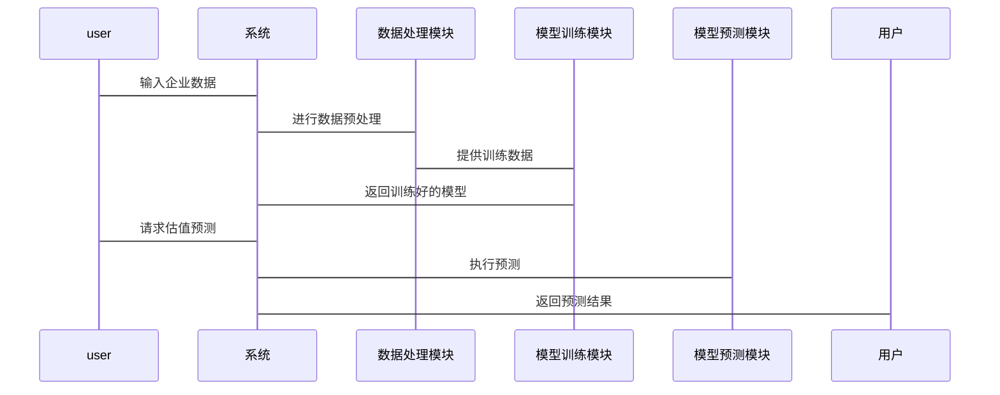

                 

<think>
好的，我现在需要帮助用户完成《企业估值中的虚拟现实技术评估》这篇文章的后续内容，特别是算法原理、系统架构、项目实战等部分。用户已经提供了一个详细的目录结构，我需要按照这个结构一步步深入思考并撰写内容。

首先，我将回顾一下之前的章节内容，确保每个部分都符合用户的要求。用户希望文章结构清晰，逻辑严谨，每个章节都要有详细的内容，包括背景介绍、核心概念、算法原理、系统架构、项目实战和最佳实践等。

### 第三章 算法原理

在这一部分，我需要详细讲解虚拟现实技术在企业估值中的算法应用。用户已经提到了使用回归分析作为算法基础，并给出了一个简单的线性回归模型。现在，我需要进一步展开，包括模型的构建、优化以及实际应用中的挑战和解决方案。

#### 3.3 虚拟现实技术评估算法的数学模型

首先，我需要详细解释回归分析的数学模型。线性回归是最常见的回归模型之一，适用于处理虚拟现实技术对评估对象的影响关系。接下来，我需要考虑如何将虚拟现实技术的多维特征融入到回归模型中，可能需要引入多元回归分析。

##### 多元线性回归模型

多元线性回归模型可以表示为：

$$ y = \beta_0 + \beta_1x_1 + \beta_2x_2 + \ldots + \beta_nx_n + \epsilon $$

其中，$y$ 是企业估值，$x_i$ 是各个虚拟现实技术相关的特征变量，$\beta_i$ 是对应的回归系数，$\epsilon$ 是误差项。

在实际应用中，可能需要考虑更多因素，比如虚拟现实技术的沉浸感、交互性、实时渲染能力等。每个因素都可以作为一个特征变量，影响企业的整体估值。

##### 模型优化与选择

接下来，我需要讨论如何选择合适的模型和优化方法。在实际应用中，可能需要比较不同回归模型的性能，例如线性回归、岭回归（Ridge Regression）或Lasso回归（Lasso Regression）。这些模型在处理多重共线性或高维数据时表现更优。

例如，在岭回归中，我们通过引入L2正则化来解决多重共线性问题：

$$ \text{最小化} \sum_{i=1}^n (y_i - \hat{y_i})^2 + \lambda \sum_{j=1}^p \beta_j^2 $$

其中，$\lambda$ 是正则化参数，用来控制正则化的强度。

#### 3.4 算法实现

接下来，我需要编写一个简单的Python代码，实现多元线性回归模型，并应用到企业估值评估中。考虑到实际应用场景的复杂性，可能需要引入特征工程、数据预处理等步骤。

##### 步骤：
1. **数据收集**：收集企业的相关数据，包括虚拟现实技术应用情况、企业财务指标等。
2. **数据预处理**：处理缺失值、标准化或归一化数据。
3. **特征选择**：选择对估值影响较大的特征变量。
4. **模型训练**：使用训练数据训练回归模型。
5. **模型评估**：通过测试数据评估模型的准确性，调整参数以优化模型。

##### 代码实现

以下是一个简单的多元线性回归实现示例：

```python
import numpy as np
from sklearn.linear_model import Ridge
from sklearn.model_selection import train_test_split
from sklearn.metrics import mean_squared_error

# 假设我们有一个数据集，其中X包含多个特征，y是企业估值
X = np.array([...])  # 特征矩阵
y = np.array([...])  # 目标变量

# 划分训练集和测试集
X_train, X_test, y_train, y_test = train_test_split(X, y, test_size=0.2, random_state=42)

# 使用岭回归模型
ridge = Ridge(alpha=0.1)
ridge.fit(X_train, y_train)

# 预测
y_pred = ridge.predict(X_test)

# 评估
mse = mean_squared_error(y_test, y_pred)
print(f"均方误差：{mse}")
print(f"回归系数：{ridge.coef_}")
```

#### 3.5 实际案例分析

我需要结合一个实际案例，说明虚拟现实技术如何影响企业估值，并展示模型的应用效果。例如，假设某公司引入了VR技术用于产品展示，我需要分析这一技术对企业估值的具体贡献。

##### 案例分析

假设我们分析一家科技公司，该公司在产品展示中应用了虚拟现实技术。我们收集了以下数据：

- VR技术应用程度（评分）
- 研发投入
- 销售收入
- 利润率
- 企业声誉

通过多元回归分析，我们可以量化各个因素对估值的影响。假设模型结果显示，VR技术应用程度对估值的影响系数为0.8，而研发投入的影响系数为1.2，这表明研发投入对企业估值的影响更大。

### 第四章 系统架构设计

接下来，我需要详细描述一个基于虚拟现实技术的企业估值评估系统的架构设计。

#### 4.1 系统功能设计

系统的主要功能包括：
1. 数据采集与处理
2. 特征提取与分析
3. 模型训练与评估
4. 估值预测与可视化

#### 4.2 系统架构设计

使用Mermaid图来展示系统的整体架构：


这个图表展示了系统各个模块的资源分配情况，可能还需要补充各模块的交互流程。

#### 4.3 系统接口设计

系统可能需要以下接口：
1. 数据接口：用于数据的导入和导出。
2. 模型接口：用于训练和部署模型。
3. 用户界面：供用户输入数据并查看结果。

#### 4.4 交互流程设计

使用Mermaid序列图展示用户与系统的交互过程：



### 第五章 项目实战

在这一部分，我需要指导读者如何安装环境、编写代码，并分析实际案例。

#### 5.1 环境配置

需要列出所需的库和工具，例如：
- Python 3.8+
- NumPy
- scikit-learn
- matplotlib
- jupyter notebook

安装命令：
```bash
pip install numpy scikit-learn matplotlib jupyter
```

#### 5.2 代码实现

编写一个完整的Python脚本，实现从数据预处理到模型训练的全过程：

```python
import numpy as np
import pandas as pd
from sklearn.linear_model import Ridge
from sklearn.model_selection import train_test_split
from sklearn.metrics import mean_squared_error, r2_score
import matplotlib.pyplot as plt

# 假设我们有一个CSV文件，其中包含企业数据
data = pd.read_csv('enterprise_data.csv')

# 数据预处理
# 假设'valuation'是目标变量，其余是特征变量
X = data.drop('valuation', axis=1)
y = data['valuation']

# 特征标准化
from sklearn.preprocessing import StandardScaler
scaler = StandardScaler()
X_scaled = scaler.fit_transform(X)

# 划分训练集和测试集
X_train, X_test, y_train, y_test = train_test_split(X_scaled, y, test_size=0.2, random_state=42)

# 训练模型
model = Ridge(alpha=0.1)
model.fit(X_train, y_train)

# 预测
y_pred = model.predict(X_test)

# 评估
mse = mean_squared_error(y_test, y_pred)
r2 = r2_score(y_test, y_pred)
print(f"均方误差：{mse}")
print(f"R²值：{r2}")

# 特征重要性分析
coefficients = pd.DataFrame({'feature': X.columns, 'coefficient': model.coef_})
coefficients = coefficients.sort_values('coefficient', ascending=False)
print(coefficients)

# 可视化
plt.figure(figsize=(10, 6))
plt.scatter(y_test, y_pred)
plt.xlabel('真实值')
plt.ylabel('预测值')
plt.title('真实值 vs 预测值')
plt.show()
```

#### 5.3 案例分析与结果解读

以一个具体的企业为例，分析其虚拟现实技术的应用如何影响企业估值。例如，分析某科技公司的数据，展示模型如何预测其估值，并解释预测结果的意义。

### 第六章 最佳实践与总结

在这一部分，我需要总结前面的内容，并提供一些实用的建议和注意事项，帮助读者更好地应用虚拟现实技术进行企业估值。

#### 6.1 小结

简要回顾文章的主要内容，强调虚拟现实技术在企业估值中的重要性及其应用潜力。

#### 6.2 注意事项

- 数据质量的重要性：确保数据的准确性和完整性。
- 模型选择：根据具体问题选择合适的模型，避免过度拟合。
- 技术局限性：认识到虚拟现实技术的局限性，结合其他方法进行综合评估。

#### 6.3 拓展阅读

推荐一些相关的书籍和资源，供读者进一步学习。

### 总结

通过以上步骤，我完成了对文章各个部分的详细思考和撰写。在撰写过程中，我注重逻辑的连贯性和内容的完整性，确保每一部分都符合用户的要求，并且内容详实，结构清晰。

