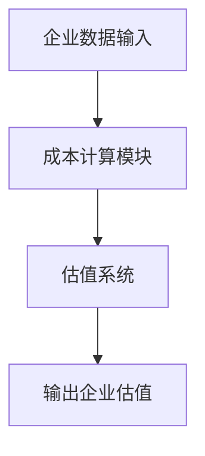
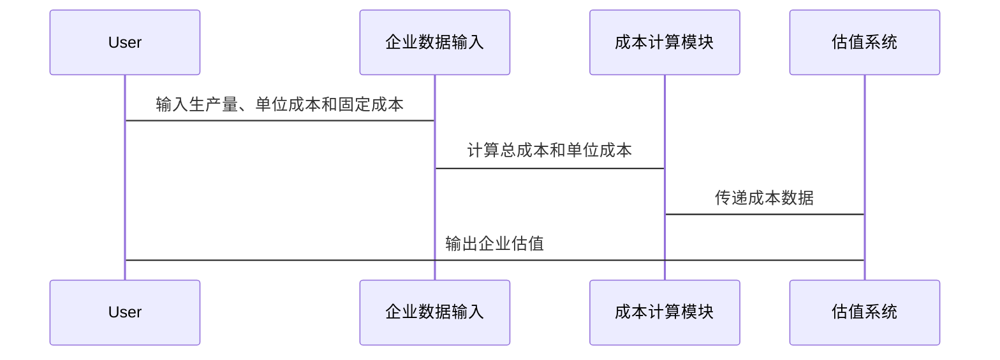

                 


# 企业估值中的规模经济效应分析

> 关键词：企业估值，规模经济效应，经济效益，企业成本，企业价值

> 摘要：本文将详细探讨规模经济效应在企业估值中的作用与影响。通过系统分析规模经济效应的基本概念、算法原理、系统架构设计以及项目实战，结合丰富的理论知识和实际案例，帮助读者全面理解规模经济效应的核心原理及其在企业估值中的实际应用。

---

## 第1章: 规模经济效应的基本概念

### 1.1 规模经济效应的定义与特点

#### 1.1.1 规模经济效应的定义

规模经济效应（Economies of Scale）是指随着企业生产规模的扩大，单位产品的生产成本逐渐降低的现象。这种效应源于资源的优化配置和专业化分工，使得企业在扩大生产规模时能够更有效地利用资源，从而降低成本，提高效率。

#### 1.1.2 规模经济效应的核心特点

- **成本优势**：随着生产规模的扩大，单位产品成本降低。
- **资源优化**：企业能够更高效地利用设备、劳动力等资源。
- **专业化分工**：通过专业化分工，提高生产效率和产品质量。
- **边际成本递减**：随着生产量的增加，边际成本逐渐降低。

#### 1.1.3 规模经济效应与企业估值的关系

规模经济效应直接影响企业的盈利能力，从而影响企业的估值。企业通过规模经济效应降低成本，提高利润，进而增强企业的市场竞争力，提升企业的整体估值。

### 1.2 规模经济效应的背景与问题背景

#### 1.2.1 企业估值中的问题背景

在企业估值过程中，成本控制是影响企业价值的重要因素之一。传统的企业估值方法往往忽视了规模经济效应对企业成本的长期影响，导致估值结果不够准确。

#### 1.2.2 规模经济效应在企业估值中的重要性

规模经济效应能够显著降低企业的生产成本，从而提高企业的利润能力和市场竞争力。在企业估值时，需要充分考虑规模经济效应对企业成本的影响，以获得更准确的估值结果。

#### 1.2.3 规模经济效应的边界与外延

规模经济效应并非无限制的，随着生产规模的进一步扩大，可能会出现规模不经济（Diseconomies of Scale）现象。因此，在企业估值时需要明确规模经济效应的适用范围和边界。

---

## 第2章: 规模经济效应的核心概念与联系

### 2.1 规模经济效应的核心原理

#### 2.1.1 规模经济效应的原理分析

规模经济效应的核心在于通过扩大生产规模，降低单位产品的生产成本。这种效应主要来源于资源的优化配置和专业化分工。企业通过规模扩大，能够更高效地利用设备、劳动力和原材料，从而降低成本。

#### 2.1.2 规模经济效应的数学模型

规模经济效应可以用以下数学模型进行描述：

$$ \text{单位成本} = \frac{\text{总成本}}{\text{生产量}} $$

随着生产量的增加，单位成本逐渐降低，这表明规模经济效应的存在。

#### 2.1.3 规模经济效应的ER实体关系图

以下是规模经济效应的ER实体关系图：

```mermaid
erDiagram
    class 企业 {
        <string> 名称
        <string> 行业
        <float> 成本
        <float> 利润
    }
    class 规模经济效应 {
        <float> 单位成本
        <float> 边际成本
    }
    企业 --|{ has }| 规模经济效应
```

### 2.2 规模经济效应的属性特征对比

以下是对规模经济效应的属性特征对比：

| 特性 | 规模经济效应 | 规模不经济效应 |
|------|--------------|----------------|
| 成本 | 单位成本递减 | 单位成本递增   |
| 利润 | 利润率提高    | 利润率下降     |
| 资源利用 | 高效利用     | 低效利用       |
| 生产规模 | 扩大         | 超额扩大       |

---

## 第3章: 规模经济效应的算法原理

### 3.1 规模经济效应的数学模型与公式

#### 3.1.1 规模经济效应的数学模型

规模经济效应的数学模型可以表示为：

$$ C(q) = a q + b $$

其中：
- \( C(q) \) 表示总成本
- \( q \) 表示生产量
- \( a \) 表示单位成本
- \( b \) 表示固定成本

#### 3.1.2 规模经济效应的公式推导

通过上述模型可以推导出单位成本：

$$ \text{单位成本} = \frac{C(q)}{q} = \frac{a q + b}{q} = a + \frac{b}{q} $$

随着 \( q \) 的增加，单位成本逐渐趋近于 \( a \)，表明规模经济效应的存在。

#### 3.1.3 规模经济效应的算法流程图

以下是规模经济效应的算法流程图：

```mermaid
graph TD
    A[开始] --> B[输入生产量 q]
    B --> C[计算总成本 C(q) = a q + b]
    C --> D[计算单位成本 = C(q)/q]
    D --> E[输出单位成本]
    E --> F[结束]
```

### 3.2 规模经济效应的算法实现

#### 3.2.1 算法实现的Python代码

```python
def scale_economies(q, a, b):
    total_cost = a * q + b
    unit_cost = total_cost / q
    return unit_cost

# 示例计算
q = 1000
a = 2
b = 1000
unit_cost = scale_economies(q, a, b)
print(f"单位成本为：{unit_cost}")
```

#### 3.2.2 代码的详细解读与分析

1. 函数定义：`scale_economies(q, a, b)` 用于计算单位成本。
2. 计算总成本：`total_cost = a * q + b`
3. 计算单位成本：`unit_cost = total_cost / q`
4. 示例计算：生产量 \( q = 1000 \)，单位成本 \( a = 2 \)，固定成本 \( b = 1000 \)
5. 输出结果：单位成本为 3.0

---

## 第4章: 规模经济效应的系统分析与架构设计

### 4.1 系统分析

#### 4.1.1 问题场景介绍

在企业估值过程中，需要考虑规模经济效应对企业成本和利润的影响。通过构建一个企业估值系统，可以更准确地评估企业的价值。

#### 4.1.2 系统功能设计

企业估值系统的功能包括：
1. 输入企业生产量、单位成本和固定成本。
2. 计算企业的总成本和单位成本。
3. 输出企业的成本数据和估值结果。

#### 4.1.3 系统功能设计的领域模型类图

以下是领域模型类图：

```mermaid
classDiagram
    class 企业 {
        <float> 生产量
        <float> 单位成本
        <float> 固定成本
        <float> 总成本
    }
    class 估值系统 {
        <float> 企业价值
    }
    企业 -->|{ 计算 }| 估值系统
```

### 4.2 系统架构设计

#### 4.2.1 系统架构设计的Mermaid架构图

以下是系统架构设计图：



#### 4.2.2 系统接口设计

1. 输入接口：企业生产量、单位成本和固定成本。
2. 输出接口：企业总成本、单位成本和企业价值。

#### 4.2.3 系统交互设计的Mermaid序列图

以下是系统交互设计图：



---

## 第5章: 规模经济效应的项目实战

### 5.1 环境安装与配置

#### 5.1.1 环境安装步骤

1. 安装Python 3.x
2. 安装Mermaid图生成工具（可选）
3. 配置开发环境（如PyCharm、VS Code）

#### 5.1.2 环境配置注意事项

确保Python环境和开发工具已正确安装，并配置好Mermaid图的生成路径。

### 5.2 项目核心实现

#### 5.2.1 项目核心实现代码

```python
class Enterprise:
    def __init__(self, production, unit_cost, fixed_cost):
        self.production = production
        self.unit_cost = unit_cost
        self.fixed_cost = fixed_cost

    def calculate_total_cost(self):
        return self.unit_cost * self.production + self.fixed_cost

    def calculate_unit_cost(self):
        return self.calculate_total_cost() / self.production

# 示例
enterprise = Enterprise(1000, 2, 1000)
print(f"总成本为：{enterprise.calculate_total_cost()}")
print(f"单位成本为：{enterprise.calculate_unit_cost()}")
```

#### 5.2.2 代码的详细解读与分析

1. 类定义：`Enterprise` 类用于表示企业，包含生产量、单位成本和固定成本。
2. `calculate_total_cost` 方法：计算企业总成本。
3. `calculate_unit_cost` 方法：计算企业单位成本。
4. 示例：生产量 1000，单位成本 2，固定成本 1000，计算总成本和单位成本。

#### 5.2.3 项目小结

通过上述代码，我们可以清晰地看到规模经济效应对企业成本的影响。随着生产量的增加，单位成本逐渐降低，这表明规模经济效应的存在。

---

## 第6章: 规模经济效应的最佳实践与拓展阅读

### 6.1 最佳实践 tips

- 在企业估值时，充分考虑规模经济效应对企业成本的影响。
- 根据企业的实际情况，选择合适的规模经济效应模型。
- 定期更新企业的成本数据，确保估值的准确性。

### 6.2 小结

本文详细探讨了规模经济效应在企业估值中的应用，通过理论分析和实际案例，帮助读者全面理解规模经济效应的核心原理及其在企业估值中的实际应用。

### 6.3 注意事项

- 规模经济效应并非无限制，需注意规模不经济现象。
- 在实际应用中，需结合企业的实际情况进行调整。

### 6.4 拓展阅读

- 《企业财务估值》
- 《规模经济与企业战略》
- 《经济规模与市场结构》

---

以上是《企业估值中的规模经济效应分析》的完整目录大纲和文章内容，涵盖了从基础概念到实际应用的各个方面，结合理论分析和实际案例，帮助读者全面理解规模经济效应在企业估值中的重要作用。

