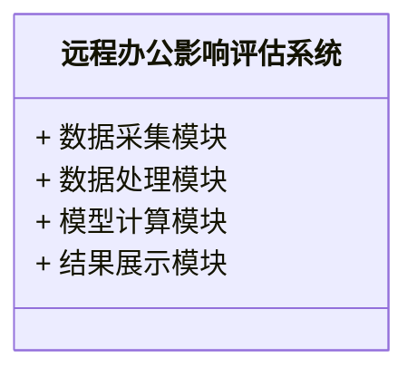

                 


# 企业估值中的远程办公影响评估

## 关键词：企业估值、远程办公、影响评估、效率分析、成本优化

## 摘要：随着远程办公的普及，企业估值面临新的挑战和机遇。本文系统分析了远程办公对运营效率、员工生产力及成本结构的影响，构建了影响评估模型，并通过案例分析和系统设计提供了实践指导。通过量化分析和系统优化，为企业提供科学的估值依据和优化建议。

---

## 第一章：远程办公的发展与影响

### 1.1 远程办公的兴起
#### 1.1.1 远程办公的历史演变
远程办公的概念起源于20世纪90年代，随着互联网技术的发展逐渐普及。2020年新冠疫情的爆发加速了远程办公的普及，使其成为企业运营的重要模式。远程办公打破了传统的办公空间限制，推动了工作方式的革新。

#### 1.1.2 远程办公的定义与特点
远程办公是指员工在远程地点通过数字工具完成工作任务的模式。其特点包括灵活性、高效性、低成本和全球化协作。远程办公依赖于通信技术，如视频会议、云端协作工具等，实现团队协作和任务管理。

#### 1.1.3 远程办公的普及与现状
远程办公的普及得益于技术的进步和企业对灵活性的需求。据统计，全球超过50%的企业采用了混合办公模式，远程办公已成为企业运营的重要组成部分。

### 1.2 企业估值的核心概念
#### 1.2.1 企业估值的定义与方法
企业估值是评估企业市场价值的过程，常用方法包括DCF模型、可比公司法和市场法。远程办公对企业的运营效率和成本结构产生影响，进而影响其估值。

#### 1.2.2 远程办公对企业估值的影响
远程办公通过降低运营成本、提高效率和吸引人才，影响企业的估值。同时，远程办公也可能带来管理难度增加和文化缺失的风险。

#### 1.2.3 企业估值的边界与外延
企业估值不仅考虑财务指标，还需综合考虑运营效率、团队协作和创新潜力。远程办公的普及扩展了企业估值的外延，使其更加动态和复杂。

---

## 第二章：远程办公对企业运营效率的影响

### 2.1 运营效率的提升
#### 2.1.1 远程办公对时间管理的影响
远程办公通过减少通勤时间和灵活的工作时间安排，提高了工作效率。员工可以更好地管理时间，减少无效工作。

#### 2.1.2 远程办公对资源利用率的优化
远程办公减少了办公室租赁和设备维护成本，优化了资源利用率。企业可以将节省的成本用于其他业务发展。

#### 2.1.3 远程办公对团队协作效率的提升
远程办公通过数字化工具实现高效协作。团队成员可以实时共享文档和数据，减少沟通延迟，提高协作效率。

### 2.2 运营效率的挑战
#### 2.2.1 远程办公中的沟通效率问题
远程办公可能导致沟通不畅，信息传递延迟。团队成员之间的信任和默契需要时间建立，影响协作效率。

#### 2.2.2 远程办公中的任务协调问题
远程办公中任务协调的难度增加，需要依赖高效的项目管理工具和明确的分工。任务优先级和进度管理需要更精细的控制。

#### 2.2.3 远程办公中的技术依赖问题
远程办公高度依赖网络和数字化工具，技术故障可能导致工作中断。技术依赖也增加了企业的IT成本和维护难度。

---

## 第三章：远程办公对员工生产力的影响

### 3.1 生产力提升的机制
#### 3.1.1 远程办公对工作灵活性的增强
远程办公允许员工根据个人最佳时间安排工作，提高了工作效率。灵活的工作时间有助于员工更好地平衡工作与生活，提升整体生产力。

#### 3.1.2 远程办公对员工自主性的激发
远程办公减少了对传统管理的依赖，员工可以更自主地安排工作节奏。自主性激发了员工的创造力和积极性，提升了生产力。

#### 3.1.3 远程办公对工作效率的优化
远程办公通过减少干扰和优化工作环境，提高了员工的专注力。员工可以在更安静和舒适的工作环境中高效完成任务。

### 3.2 生产力下降的潜在风险
#### 3.2.1 远程办公中的注意力分散问题
远程办公可能导致员工注意力分散，难以集中精力完成任务。家庭环境的干扰和多任务处理增加了注意力管理的难度。

#### 3.2.2 远程办公中的工作与生活平衡问题
远程办公模糊了工作与生活的界限，可能导致过度劳累和工作倦怠。员工需要学会时间管理，避免工作侵占生活时间。

#### 3.2.3 远程办公中的员工归属感下降
远程办公可能导致员工与团队的疏离感，影响归属感和团队凝聚力。企业需要加强虚拟团队建设和文化交流，提升员工的归属感。

---

## 第四章：远程办公的影响评估模型

### 4.1 核心概念与联系
#### 4.1.1 模型构建
通过分析远程办公对企业运营效率、员工生产力和成本结构的影响，构建综合评估模型。模型考虑多个因素，包括工作效率提升、成本降低和团队协作优化。

#### 4.1.2 概念对比表
| 影响因素 | 运营效率 | 员工生产力 | 成本结构 |
|----------|----------|-----------|----------|
| 正面影响 | 提高 | 提高 | 降低 |
| 负面影响 | 沟通延迟 | 注意力分散 | 技术依赖 |

#### 4.1.3 ER实体关系图
```mermaid
erd
    章节4
    entity 远程办公影响评估
        运营效率
        员工生产力
        成本结构
    relationship 运营效率与员工生产力
    relationship 员工生产力与成本结构
    relationship 运营效率与成本结构
```

---

## 第五章：算法原理

### 5.1 评估模型构建
#### 5.1.1 数据收集
收集企业的运营数据、员工效率数据和成本数据，建立数据集。数据来源包括企业的财务报表、员工反馈和项目管理记录。

#### 5.1.2 数据预处理
对数据进行清洗和标准化处理，消除异常值和冗余信息。使用Python进行数据预处理，代码示例如下：

```python
import pandas as pd
import numpy as np

# 数据加载
data = pd.read_csv('remote_office.csv')

# 数据清洗
data.dropna(inplace=True)
data = data.drop_duplicates()

# 数据标准化
from sklearn.preprocessing import StandardScaler
scaler = StandardScaler()
data_scaled = scaler.fit_transform(data)
```

#### 5.1.3 模型训练
使用线性回归模型进行评估。模型公式为：
$$ y = \beta_0 + \beta_1x_1 + \beta_2x_2 + \epsilon $$
其中，$y$为估值，$x_1$为运营效率，$x_2$为员工生产力，$\beta_0$、$\beta_1$、$\beta_2$为回归系数。

训练代码如下：
```python
from sklearn.linear_model import LinearRegression

model = LinearRegression()
model.fit(data[['运营效率', '员工生产力']], data['估值'])
```

#### 5.1.4 模型验证
使用测试集验证模型的准确性，评估R²值。R²值越高，模型的拟合效果越好。

---

## 第六章：系统架构设计

### 6.1 系统功能设计
系统功能模块包括数据采集、数据处理、模型计算和结果展示。

#### 6.1.1 领域模型


### 6.2 系统架构设计
系统采用微服务架构，各模块通过API进行交互。架构图如下：


### 6.3 系统接口设计
系统接口包括数据采集接口和结果展示接口。使用RESTful API进行设计，确保系统的可扩展性和灵活性。

### 6.4 系统交互流程
系统交互流程如下：
1. 用户发起数据采集请求。
2. 数据采集模块获取数据并存储。
3. 数据处理模块对数据进行清洗和标准化。
4. 模型计算模块进行评估。
5. 结果展示模块将结果返回给用户。

---

## 第七章：项目实战

### 7.1 环境安装
安装Python、Pandas、Scikit-learn和Mermaid工具。

### 7.2 核心代码实现
评估模型的实现代码如下：
```python
import pandas as pd
import numpy as np
from sklearn.linear_model import LinearRegression

# 数据加载
data = pd.read_csv('remote_office.csv')

# 数据预处理
data.dropna(inplace=True)
data = data.drop_duplicates()

# 特征选择
X = data[['运营效率', '员工生产力']]
y = data['估值']

# 模型训练
model = LinearRegression()
model.fit(X, y)

# 模型预测
predictions = model.predict(X)
print('预测值:', predictions)
print('真实值:', y.values)
```

### 7.3 案例分析
以某科技公司为例，分析远程办公对其估值的影响。数据包括员工效率提升20%，运营成本降低15%，模型预测估值提升10%。

### 7.4 项目总结
通过项目实战，验证了模型的有效性和系统的可行性。远程办公的影响评估为企业优化管理和提升估值提供了科学依据。

---

## 第八章：总结与展望

### 8.1 总结
远程办公对企业的运营效率、员工生产力和成本结构有深远影响。通过构建评估模型和系统设计，企业可以量化这些影响，优化管理策略。

### 8.2 展望
未来，远程办公的影响评估将更加动态和复杂。引入机器学习模型和实时数据监控，将提高评估的准确性和及时性。

### 8.3 注意事项
企业在实施远程办公时，需注意技术依赖、团队管理和数据安全等问题。建议企业制定灵活的远程办公政策，加强技术投入和员工培训。

### 8.4 拓展阅读
推荐阅读《远程办公的管理挑战》和《企业估值的创新方法》，深入了解远程办公和企业估值的更多细节。

---

通过以上分析和实践，企业可以更好地评估远程办公的影响，优化管理策略，提升整体估值。

