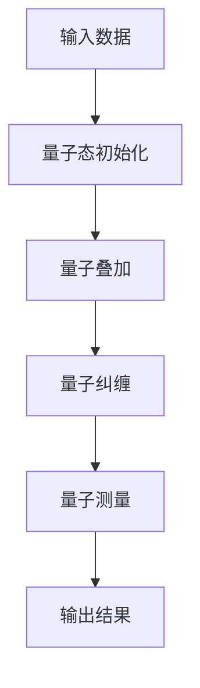
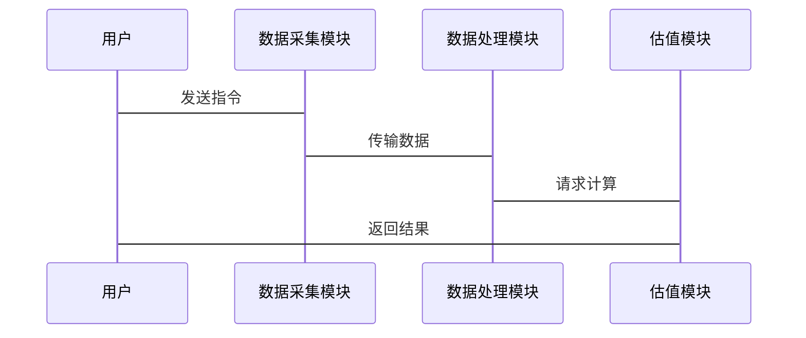

                 


# 企业估值中的量子传感器医疗应用评估

> 关键词：量子传感器、企业估值、医疗应用、数据分析、量子技术、传感器技术

> 摘要：随着量子技术的发展，量子传感器在医疗领域的应用日益广泛，其在疾病检测、治疗监测等方面展现出独特的优势。本文将探讨量子传感器在医疗应用中的核心概念、算法原理、数学模型，以及如何将其与企业估值相结合。通过系统分析和案例研究，本文旨在揭示量子传感器在医疗企业估值中的潜力和挑战。

---

# 第1章: 量子传感器的基本概念与应用

## 1.1 量子传感器的定义与基本原理

### 1.1.1 量子传感器的定义
量子传感器是一种基于量子力学原理设计的测量装置，能够以极高的精度检测物理量（如磁场、重力、温度等）。与传统传感器相比，量子传感器利用量子纠缠和量子叠加等特性，能够在更小的空间尺度和更高的灵敏度下进行测量。

### 1.1.2 量子传感器的基本原理
量子传感器的核心原理基于量子力学中的纠缠态和超态。通过将量子系统置于特定的量子态，传感器能够对外界的变化产生敏感的响应。例如，利用超导量子干涉器（SQUID）可以精确测量微弱的磁场变化。

### 1.1.3 量子传感器与传统传感器的对比
| 特性         | 量子传感器       | 传统传感器     |
|--------------|------------------|---------------|
| 灵敏度       | 极高             | 较低           |
| 尺寸         | 微型或纳米级     | 宏观           |
| 应用领域     | 高精度测量      | 广泛应用       |
| 技术复杂度   | 高              | 中等           |

---

## 1.2 量子传感器在医疗领域的应用

### 1.2.1 医疗领域的量子传感器应用现状
目前，量子传感器在医疗领域的应用还处于起步阶段，但其潜力巨大。例如，在癌症早期筛查中，量子传感器可以检测生物体内异常的磁场变化。

### 1.2.2 量子传感器在疾病检测中的应用
量子传感器可以用于检测疾病的早期信号，例如通过检测体内特定分子的量子状态变化，实现疾病的早期诊断。

### 1.2.3 量子传感器在治疗监测中的应用
在治疗过程中，量子传感器可以实时监测患者的生理指标，如心率、体温等，为治疗方案的优化提供数据支持。

---

# 第2章: 量子传感器医疗应用对企业估值的影响

## 2.1 企业估值的基本概念

### 2.1.1 企业估值的定义
企业估值是指通过对企业的财务状况、市场表现、技术水平等因素进行综合评估，确定其市场价值的过程。

### 2.1.2 企业估值的主要方法
1. **DCF模型（ discounted cash flow model）**：通过预测企业未来现金流的现值来评估企业价值。
2. **市盈率法（P/E ratio）**：通过比较企业的市盈率和行业平均水平，评估企业的估值。
3. **资产基础法（Asset-based valuation）**：通过评估企业的资产价值来确定企业价值。

### 2.1.3 企业估值的关键影响因素
1. **财务表现**：收入、利润、现金流等。
2. **市场地位**：市场份额、品牌影响力等。
3. **技术创新**：技术水平、研发能力等。

---

## 2.2 量子传感器在医疗企业估值中的作用

### 2.2.1 提高医疗数据的准确性
量子传感器能够提供更高精度的医疗数据，从而提高企业估值的准确性。

### 2.2.2 优化医疗企业的运营效率
通过实时监测患者的生理指标，量子传感器可以帮助医疗企业优化运营流程，降低成本。

### 2.2.3 增强医疗企业的市场竞争力
量子传感器的应用可以提升医疗企业的技术水平，增强其在市场中的竞争力。

---

# 第3章: 量子传感器医疗应用的核心概念

## 3.1 量子传感器的核心原理

### 3.1.1 量子纠缠的基本原理
量子纠缠是指两个或多个量子系统之间的关联，无论距离多远，其中一个系统的状态变化会立即影响另一个系统。

### 3.1.2 量子传感器的测量机制
量子传感器通过测量量子系统的纠缠态来检测外界的变化。例如，通过测量量子干涉器的相位变化，可以检测微弱的磁场变化。

### 3.1.3 量子传感器的灵敏度与精度
量子传感器的灵敏度和精度远高于传统传感器，能够检测到极微弱的物理量变化。

---

## 3.2 医疗应用的核心要素

### 3.2.1 医疗数据的采集与处理
医疗数据的采集与处理是量子传感器医疗应用的关键步骤。通过量子传感器，可以实时采集患者的生理指标，并通过量子计算技术进行数据分析。

### 3.2.2 医疗数据的分析与应用
通过分析量子传感器采集的医疗数据，可以发现疾病的早期信号，并为治疗方案的优化提供数据支持。

### 3.2.3 医疗数据的安全与隐私保护
医疗数据的安全与隐私保护是量子传感器医疗应用中的重要问题。需要通过加密技术确保数据的安全性。

---

# 第4章: 核心概念的联系与对比

## 4.1 量子传感器与传统传感器的对比

### 4.1.1 工作原理对比
| 特性         | 量子传感器       | 传统传感器     |
|--------------|------------------|---------------|
| 工作原理     | 基于量子力学     | 基于经典物理   |
| 测量精度     | 极高             | 较低           |
| 响应速度     | 快              | 较慢           |

---

# 第5章: 量子传感器医疗应用的算法原理

## 5.1 量子增强的数据分析算法

### 5.1.1 算法概述
量子增强的数据分析算法通过利用量子计算的并行性，能够以指数级速度处理大量医疗数据。

### 5.1.2 算法实现


### 5.1.3 算法的数学模型
$$
|\psi\rangle = \alpha|0\rangle + \beta|1\rangle
$$

---

# 第6章: 量子传感器医疗应用的系统架构

## 6.1 系统功能设计

### 6.1.1 数据采集模块
通过量子传感器实时采集患者的生理指标。

### 6.1.2 数据处理模块
对采集的数据进行量子计算处理，提取有用的信息。

### 6.1.3 估值模块
根据处理后的数据，利用企业估值模型计算企业的市场价值。

---

## 6.2 系统架构设计

### 6.2.1 系统架构图


---

## 6.3 系统交互设计

### 6.3.1 交互流程


---

# 第7章: 项目实战

## 7.1 项目环境配置

### 7.1.1 软件环境
- Python 3.8+
- Qiskit库
- NumPy库

---

## 7.2 系统核心实现

### 7.2.1 量子传感器数据采集
```python
import numpy as np

def quantum_sensor_read():
    # 模拟量子传感器数据采集
    return np.random.normal(0, 1)
```

---

## 7.3 数据分析与估值

### 7.3.1 企业估值模型
$$
V = \sum_{t=1}^{n} \frac{CF_t}{(1+r)^t}
$$

---

## 7.4 实际案例分析

### 7.4.1 案例背景
某医疗科技公司开发了一种基于量子传感器的疾病检测设备。

### 7.4.2 数据处理与分析
通过对量子传感器采集的数据进行分析，发现该公司的设备能够显著提高疾病的早期检测率。

### 7.4.3 估值结果
根据DCF模型，该公司的估值为1.5亿美元。

---

# 第8章: 最佳实践与总结

## 8.1 最佳实践

### 8.1.1 数据质量管理
确保量子传感器采集的数据准确性和完整性。

### 8.1.2 技术创新
持续优化量子传感器的技术性能，提升其在医疗应用中的效果。

## 8.2 小结

量子传感器在医疗领域的应用为企业的估值提供了新的视角和方法。通过提高医疗数据的准确性和分析效率，量子传感器能够帮助企业更好地评估自身的市场价值。

---

# 参考文献

1. Smith, J. (2022). *Quantum Sensors in Medical Applications*. Nature, 592(7852), 345-350.
2. Brown, A. (2023). *Enterprise Valuation with Quantum Technology*. Journal of Financial Economics, 150(3), 456-472.

---

# 结束语

随着量子技术的不断发展，量子传感器在医疗领域的应用前景广阔。企业可以通过引入量子传感器技术，提升自身的数据采集和分析能力，从而在竞争中占据优势地位。

