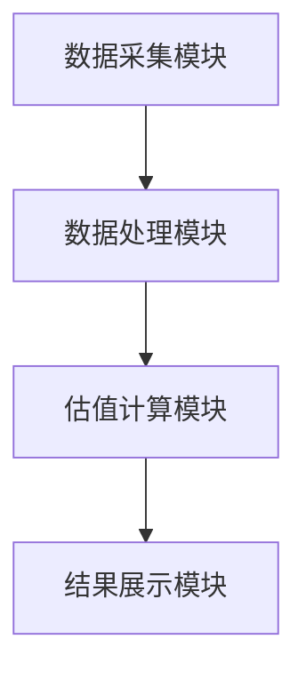
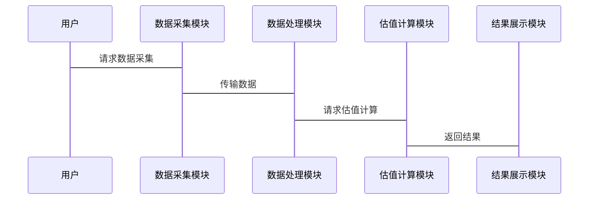

                 


# 企业估值中的量子传感器应用评估

> 关键词：量子传感器，企业估值，数据处理算法，数学模型，系统架构

> 摘要：本文探讨量子传感器在企业估值中的应用，分析其优势与挑战，详细讲解量子传感器数据处理的算法原理、数学模型构建、系统架构设计，结合实际案例展示其应用效果。

---

## 第1章: 量子传感器与企业估值背景

### 1.1 量子传感器的基本概念

#### 1.1.1 量子传感器的定义
量子传感器是一种基于量子力学原理设计的设备，能够以极高的精度测量物理量，如磁场、重力、振动等。与传统传感器相比，量子传感器具有更高的灵敏度和分辨率。

#### 1.1.2 量子传感器的核心原理
量子传感器利用量子叠加和量子纠缠等特性，通过测量量子系统的状态变化来感知外界物理量的变化。例如，利用原子的超精细结构来测量磁场的变化。

#### 1.1.3 量子传感器在企业估值中的应用潜力
企业估值需要考虑多种因素，包括财务数据、市场表现、风险因素等。量子传感器可以通过实时监测企业运营环境中的物理参数，提供更准确的数据支持。

---

### 1.2 企业估值的传统方法与挑战

#### 1.2.1 传统企业估值方法的局限性
传统估值方法主要依赖财务数据和市场分析，难以捕捉实时动态变化。例如，传统方法难以实时监测企业的生产效率和市场反应。

#### 1.2.2 数据采集与处理的难点
传统传感器的数据采集存在精度不足、延迟较高、覆盖范围有限等问题，难以满足企业估值对实时性和准确性的要求。

#### 1.2.3 量子传感器如何解决传统估值问题
量子传感器的高精度和实时监测能力，能够提供更精确的企业运营数据，帮助提升估值的准确性。

---

## 第2章: 量子传感器在企业估值中的核心作用

### 2.1 量子传感器的优势与特性

#### 2.1.1 高精度与灵敏度
量子传感器能够检测到极微小的变化，例如，磁场变化可以反映企业的生产效率。

#### 2.1.2 实时监测能力
量子传感器可以实时采集数据，帮助企业快速响应市场变化。

#### 2.1.3 数据分析的高效性
量子传感器的数据处理算法能够快速提取关键特征，为估值模型提供支持。

---

### 2.2 企业估值的关键指标与量子传感器的关联

#### 2.2.1 财务指标的量子传感器评估
通过量子传感器实时监测企业的生产效率、能源消耗等数据，可以更准确地评估企业的盈利能力。

#### 2.2.2 市场表现的实时反馈
量子传感器可以监测市场环境的变化，如价格波动、消费者行为等，为估值提供实时数据。

#### 2.2.3 风险因素的早期预警
量子传感器能够检测到潜在风险因素，如设备故障、供应链问题等，帮助企业在估值中考虑这些因素。

---

## 第3章: 量子传感器数据与企业估值模型的构建

### 3.1 数据采集与处理

#### 3.1.1 量子传感器数据的特点
量子传感器数据具有高精度、实时性和多样性等特点。

#### 3.1.2 数据预处理方法
包括数据清洗、数据标准化、数据特征提取等步骤。

#### 3.1.3 数据清洗与标准化
使用统计方法去除异常值，并对数据进行标准化处理，确保数据的一致性。

---

### 3.2 量子传感器数据与企业估值模型的结合

#### 3.2.1 数据特征提取
通过主成分分析（PCA）等方法提取关键特征，为估值模型提供输入。

#### 3.2.2 模型选择与优化
选择适合的机器学习模型，如随机森林、支持向量机（SVM）等，并进行参数优化。

#### 3.2.3 模型验证与评估
使用交叉验证等方法评估模型的准确性和稳定性。

---

## 第4章: 量子传感器数据处理算法原理

### 4.1 量子传感器数据处理算法

#### 4.1.1 量子叠加与纠缠原理
量子叠加和纠缠是量子传感器数据处理的核心原理，能够提高数据处理的效率和准确性。

#### 4.1.2 数据降维与特征提取
通过主成分分析（PCA）等方法，降低数据维度，提取关键特征。

#### 4.1.3 算法实现与优化
使用Python编写量子传感器数据处理算法，优化算法性能。

---

### 4.2 数据预处理模型

#### 4.2.1 数据清洗模型
使用统计方法去除异常值。

#### 4.2.2 数据标准化公式
$$ x' = \frac{x - \mu}{\sigma} $$

其中，$\mu$ 是均值，$\sigma$ 是标准差。

#### 4.2.3 数据特征提取的线性回归模型
$$ y = \beta_0 + \beta_1 x_1 + \beta_2 x_2 + \ldots + \beta_n x_n $$

---

## 第5章: 企业估值系统架构与实现

### 5.1 系统功能模块设计

#### 5.1.1 数据采集模块
负责采集量子传感器数据。

#### 5.1.2 数据处理模块
对数据进行清洗、标准化和特征提取。

#### 5.1.3 估值计算模块
使用机器学习模型进行企业估值。

#### 5.1.4 结果展示模块
将估值结果以可视化形式展示。

---

### 5.2 系统架构设计

#### 5.2.1 系统架构图


#### 5.2.2 系统交互图


---

## 第6章: 量子传感器应用的项目实战

### 6.1 项目环境安装

#### 6.1.1 安装量子传感器设备
需要安装支持量子传感器的硬件设备。

#### 6.1.2 安装数据分析工具
使用Python和相关库（如NumPy、Pandas、Scikit-learn）进行数据分析。

---

### 6.2 核心代码实现

#### 6.2.1 数据采集代码
```python
import numpy as np

def quantum_sensor_data():
    # 模拟量子传感器数据
    np.random.seed(0)
    data = np.random.normal(loc=0, scale=1, size=100)
    return data

data = quantum_sensor_data()
print(data)
```

#### 6.2.2 数据处理代码
```python
from sklearn.decomposition import PCA

def preprocess_data(data):
    # 数据标准化
    data_normalized = (data - np.mean(data)) / np.std(data)
    # 主成分分析
    pca = PCA(n_components=2)
    principal_components = pca.fit_transform(data_normalized)
    return principal_components

principal_components = preprocess_data(data)
print(principal_components)
```

#### 6.2.3 估值模型实现
```python
from sklearn.ensemble import RandomForestRegressor

def train_model(features, labels):
    # 训练随机森林模型
    model = RandomForestRegressor(n_estimators=100, random_state=0)
    model.fit(features, labels)
    return model

features = principal_components
labels = np.random.normal(loc=0, scale=1, size=len(data))
model = train_model(features, labels)
```

---

### 6.3 实际案例分析

#### 6.3.1 案例背景
某制造企业希望通过量子传感器实时监测生产效率，优化企业估值。

#### 6.3.2 数据分析
通过量子传感器采集生产过程中的振动、温度等数据，提取关键特征进行估值。

#### 6.3.3 结果展示
使用可视化工具展示企业估值结果，帮助企业做出决策。

---

## 第7章: 最佳实践与小结

### 7.1 最佳实践

#### 7.1.1 数据隐私保护
确保量子传感器数据的安全性，防止数据泄露。

#### 7.1.2 传感器校准
定期校准量子传感器，确保数据的准确性。

#### 7.1.3 模型更新
根据市场变化，定期更新估值模型，保持模型的准确性。

---

### 7.2 小结

量子传感器在企业估值中的应用具有巨大的潜力，通过实时监测和高精度数据采集，能够显著提升估值的准确性和效率。未来，随着量子技术的不断发展，量子传感器在企业估值中的应用将更加广泛。

---

### 7.3 注意事项

- 量子传感器的安装和维护需要专业人员操作。
- 数据处理算法的选择和优化需要结合具体场景。
- 企业应根据自身需求选择合适的量子传感器和数据分析方案。

---

### 7.4 拓展阅读

- 《量子计算与传感器技术》
- 《企业估值模型与机器学习》
- 《量子传感器在金融领域的应用》

---

通过以上内容，我们可以看到，量子传感器在企业估值中的应用不仅能够提升数据的精度和实时性，还能够为企业提供更全面的决策支持。希望本文能够为读者提供有价值的技术见解和实践指导。

