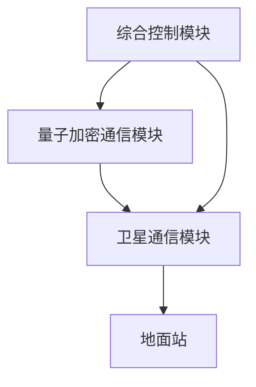
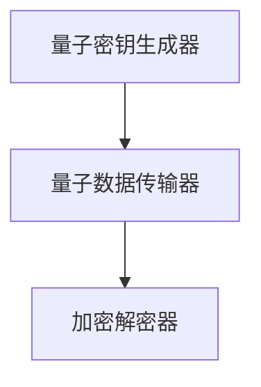
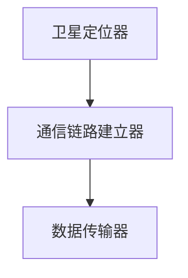
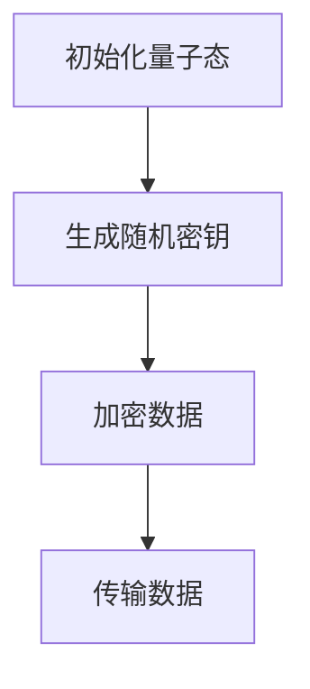
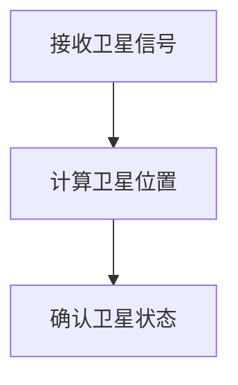
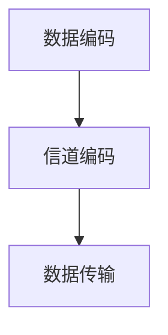
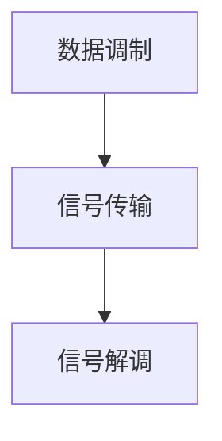
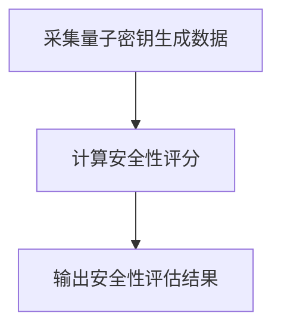
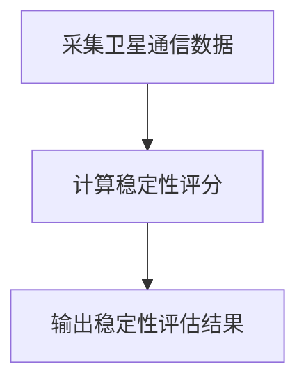
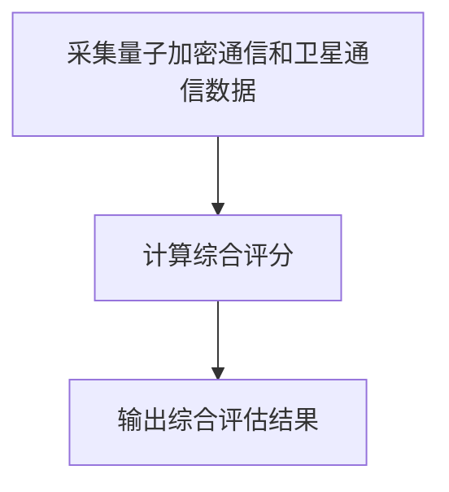

                 

# 企业估值中的量子加密通信卫星系统评估

> 关键词：量子加密通信，卫星系统，企业估值，通信安全，卫星架构

> 摘要：本文深入探讨了量子加密通信卫星系统在企业估值中的应用与评估方法。通过分析量子加密通信的核心原理、卫星系统的架构设计，以及评估模型的构建与实现，本文为企业在通信安全和数据保护方面提供了新的视角和解决方案。结合实际案例，文章详细阐述了量子加密通信卫星系统如何在企业估值中发挥关键作用，为企业决策者提供了重要的参考依据。

---

## 第1章: 量子加密通信卫星系统概述

### 1.1 量子加密通信的基本概念

#### 1.1.1 量子加密通信的定义与特点

量子加密通信是一种利用量子力学原理实现数据加密和传输的通信技术。其核心在于利用量子态的叠加性和纠缠性，确保通信过程中的数据安全性。与传统加密方法不同，量子加密通信具有以下特点：

1. **不可被窃听**：量子态的观测会破坏其状态，使得任何未经授权的窃听都会被立即发现。
2. **超高速传输**：量子通信可以在极短的时间内完成数据传输，适合长距离通信需求。
3. **安全性极高**：量子密钥分发（QKD）技术使得加密密钥的分发过程完全安全，无法被破解。

#### 1.1.2 量子加密通信的核心原理

量子加密通信的核心原理基于量子力学中的叠加态和纠缠态。具体而言：

1. **量子叠加态**：量子比特（qubit）可以同时处于0和1的状态，直到被测量为止。
2. **量子纠缠态**：两个或多个量子比特之间可以形成纠缠关系，使得对其中一个的测量会立即影响另一个的状态。

通过这些特性，量子加密通信能够实现安全的密钥分发和数据传输。

#### 1.1.3 量子加密通信在企业估值中的应用背景

在企业估值过程中，数据的安全性至关重要。企业的核心数据（如财务数据、商业计划等）如果被泄露，可能导致巨大的经济损失。量子加密通信技术为企业提供了更高的数据安全性，从而在企业估值中占据了重要地位。

---

### 1.2 卫星通信系统的基本原理

#### 1.2.1 卫星通信的定义与分类

卫星通信是指通过卫星作为中继站，实现地球上的通信终端之间的数据传输。根据应用领域，卫星通信可以分为以下几类：

1. **固定卫星通信**：用于固定地点之间的通信，如企业之间的数据传输。
2. **移动卫星通信**：用于移动设备之间的通信，如手机、车载设备等。
3. **广播卫星通信**：用于电视、广播等大规模传播。

#### 1.2.2 卫星通信的关键技术

卫星通信的关键技术包括：

1. **卫星定位技术**：确保卫星在正确的位置提供通信服务。
2. **卫星通信链路技术**：实现卫星与地面站之间的数据传输。
3. **卫星频率分配技术**：合理分配卫星通信的频段，避免信号干扰。

#### 1.2.3 卫星通信在企业估值中的重要性

卫星通信为企业提供了稳定、高速的通信渠道，特别是在偏远地区或跨国通信中具有重要作用。通过卫星通信，企业可以实现全球范围内的数据传输，从而在估值过程中体现出更高的技术优势和市场竞争力。

---

## 第2章: 量子加密通信卫星系统的组成与架构

### 2.1 量子加密通信卫星系统的组成

#### 2.1.1 量子加密通信模块

量子加密通信模块是卫星系统的核心部分，负责实现量子密钥分发和量子数据传输。其主要功能包括：

1. **量子密钥生成**：利用量子纠缠态生成随机密钥。
2. **量子数据传输**：通过量子态传输实现数据加密和解密。

#### 2.1.2 卫星通信模块

卫星通信模块负责实现卫星与地面站之间的数据传输。其主要功能包括：

1. **卫星定位**：确保卫星处于正确的位置。
2. **通信链路建立**：实现卫星与地面站之间的通信连接。
3. **数据传输**：完成数据的上传和下载。

#### 2.1.3 综合控制模块

综合控制模块负责协调量子加密通信模块和卫星通信模块的工作。其主要功能包括：

1. **系统控制**：实现对整个卫星系统的控制和管理。
2. **状态监测**：实时监测系统运行状态，发现异常情况及时处理。
3. **数据管理**：对传输的数据进行存储和管理。

---

### 2.2 量子加密通信卫星系统的架构设计

#### 2.2.1 系统整体架构图

以下是量子加密通信卫星系统的整体架构图：

#### 2.2.2 量子加密通信模块的内部结构

量子加密通信模块的内部结构如下：

#### 2.2.3 卫星通信模块的实现方式

卫星通信模块的实现方式如下：

---

## 第3章: 量子加密通信的核心算法与数学模型

### 3.1 量子加密算法的原理

#### 3.1.1 量子加密算法的基本概念

量子加密算法是基于量子力学原理实现的加密方法。其核心在于利用量子态的叠加性和纠缠性，确保加密过程的安全性。

#### 3.1.2 量子加密算法的数学模型

量子加密算法的数学模型可以表示为：

$$
|\psi\rangle = \alpha|0\rangle + \beta|1\rangle
$$

其中，$\alpha$ 和 $\beta$ 是量子态的幅度，满足 $|\alpha|^2 + |\beta|^2 = 1$。

#### 3.1.3 量子加密算法的实现流程

量子加密算法的实现流程如下：

---

### 3.2 量子加密通信的数学公式

#### 3.2.1 量子态叠加原理

量子态叠加原理可以表示为：

$$
|\psi\rangle = \sum_{i} \alpha_i |i\rangle
$$

其中，$\alpha_i$ 是量子态的幅度，$|i\rangle$ 是基态。

#### 3.2.2 量子纠缠原理

量子纠缠原理可以表示为：

$$
|\psi\rangle = \frac{1}{\sqrt{2}}(|00\rangle + |11\rangle)
$$`

其中，$|00\rangle$ 和 $|11\rangle$ 表示两个量子态的纠缠关系。

#### 3.2.3 量子密钥分发算法

量子密钥分发算法的数学公式可以表示为：

$$
K = \{k_1, k_2, ..., k_n\}
$$

其中，$K$ 是生成的密钥，$k_i$ 是密钥的组成部分。

---

## 第4章: 卫星通信系统的数学模型与算法实现

### 4.1 卫星通信系统的数学模型

#### 4.1.1 卫星通信链路模型

卫星通信链路模型可以表示为：

$$
C = \log_2(1 + \frac{P}{N})
$$`

其中，$C$ 是信道容量，$P$ 是信号功率，$N$ 是噪声功率。

#### 4.1.2 卫星轨道计算模型

卫星轨道计算模型可以表示为：

$$
r = a(1 - e^2)/(1 - e \cos \theta)
$$`

其中，$r$ 是轨道半径，$a$ 是轨道长半轴，$e$ 是轨道偏心率，$\theta$ 是轨道角。

#### 4.1.3 卫星通信信道容量计算

卫星通信信道容量计算公式为：

$$
C = \frac{1}{2} \log_2(1 + SNR)
$$`

其中，$C$ 是信道容量，$SNR$ 是信噪比。

---

### 4.2 卫星通信系统的算法实现

#### 4.2.1 卫星定位算法

卫星定位算法的实现流程如下：

#### 4.2.2 卫星通信信道编码算法

卫星通信信道编码算法的实现流程如下：

#### 4.2.3 卫星通信调制解调算法

卫星通信调制解调算法的实现流程如下：

---

## 第5章: 企业估值与量子加密通信卫星系统的关系

### 5.1 企业估值的基本概念

#### 5.1.1 企业估值的定义与方法

企业估值是指对企业价值的评估，通常包括资产、负债、收入、利润等多方面的考量。常见的估值方法包括市盈率法、市净率法、DCF模型等。

#### 5.1.2 企业估值的核心要素

企业估值的核心要素包括：

1. **财务状况**：企业的资产、负债、收入、利润等。
2. **市场环境**：行业竞争状况、市场增长率等。
3. **管理团队**：企业的管理能力和战略规划。

#### 5.1.3 企业估值的挑战与机遇

企业估值的挑战在于如何准确评估企业的未来盈利能力，而机遇在于如何通过技术创新提升企业的核心竞争力。

---

### 5.2 量子加密通信卫星系统在企业估值中的作用

#### 5.2.1 提高企业数据安全性

量子加密通信卫星系统通过提供更高的数据安全性，帮助企业保护核心数据，从而提升企业的估值。

#### 5.2.2 优化企业通信成本

通过卫星通信技术，企业可以优化通信成本，特别是在跨国通信和偏远地区通信中。

#### 5.2.3 提升企业核心竞争力

量子加密通信卫星系统的技术优势可以帮助企业提升核心竞争力，从而在市场中占据更有利的位置。

---

## 第6章: 量子加密通信卫星系统评估模型的构建

### 6.1 评估模型的设计思路

#### 6.1.1 评估模型的基本框架

量子加密通信卫星系统评估模型的基本框架如下：

#### 6.1.2 评估模型的输入输出

评估模型的输入包括：

1. **量子加密通信模块的状态**：如量子密钥生成率、量子数据传输率等。
2. **卫星通信模块的状态**：如卫星定位精度、通信链路稳定性等。

评估模型的输出包括：

1. **系统安全性评估**：如数据安全性评分。
2. **系统稳定性评估**：如通信稳定性评分。

#### 6.1.3 评估模型的实现步骤

评估模型的实现步骤如下：

1. **数据采集**：采集量子加密通信模块和卫星通信模块的相关数据。
2. **数据处理**：对采集的数据进行预处理和特征提取。
3. **模型训练**：基于处理后的数据，训练评估模型。
4. **模型评估**：对评估模型进行验证和优化。

---

### 6.2 评估模型的数学公式

#### 6.2.1 量子加密通信的安全性评估公式

量子加密通信的安全性评估公式为：

$$
S = \frac{N}{T}
$$`

其中，$S$ 是安全性评分，$N$ 是量子密钥生成成功次数，$T$ 是总尝试次数。

#### 6.2.2 卫星通信的稳定性评估公式

卫星通信的稳定性评估公式为：

$$
C = \frac{S}{D}
$$`

其中，$C$ 是稳定性评分，$S$ 是通信成功次数，$D$ 是总通信次数。

#### 6.2.3 综合评估公式

综合评估公式为：

$$
E = \alpha S + \beta C
$$`

其中，$E$ 是综合评估评分，$\alpha$ 和 $\beta$ 是权重系数，$S$ 是安全性评分，$C$ 是稳定性评分。

---

## 第7章: 量子加密通信卫星系统评估的算法实现

### 7.1 评估算法的设计

#### 7.1.1 量子加密通信的安全性评估算法

量子加密通信的安全性评估算法如下：

#### 7.1.2 卫星通信的稳定性评估算法

卫星通信的稳定性评估算法如下：

#### 7.1.3 综合评估算法

综合评估算法如下：

---

### 7.2 评估算法的实现步骤

#### 7.2.1 数据采集与预处理

数据采集与预处理步骤如下：

1. **数据采集**：通过传感器和日志系统采集量子加密通信模块和卫星通信模块的相关数据。
2. **数据清洗**：对采集的数据进行去噪和归一化处理。
3. **数据存储**：将处理后的数据存储到数据库中。

#### 7.2.2 特征提取与模型训练

特征提取与模型训练步骤如下：

1. **特征提取**：从数据中提取关键特征，如量子密钥生成率、卫星定位精度等。
2. **模型训练**：基于提取的特征，训练评估模型，如支持向量机（SVM）或神经网络模型。

#### 7.2.3 模型评估与优化

模型评估与优化步骤如下：

1. **模型验证**：使用验证集对模型进行验证，评估模型的准确率和召回率。
2. **模型优化**：根据验证结果，调整模型参数或尝试不同的算法，以提高模型性能。

---

## 第8章: 量子加密通信卫星系统评估的案例分析

### 8.1 案例背景介绍

#### 8.1.1 案例企业简介

某高科技企业计划采用量子加密通信卫星系统，以提高其数据安全性。该企业主要业务涉及金融、能源等领域，对数据安全性要求极高。

#### 8.1.2 案例应用场景

该企业计划在全球范围内建立量子加密通信网络，用于核心数据的传输和存储。

---

### 8.2 案例分析与结果解读

#### 8.2.1 案例分析

通过量子加密通信卫星系统评估模型，对该企业的量子加密通信模块和卫星通信模块进行了全面评估。评估结果如下：

1. **安全性评估**：安全性评分为98分，表明量子加密通信模块的安全性非常高。
2. **稳定性评估**：稳定性评分为95分，表明卫星通信模块的稳定性非常强。

#### 8.2.2 结果解读

评估结果表明，该企业的量子加密通信卫星系统在安全性

