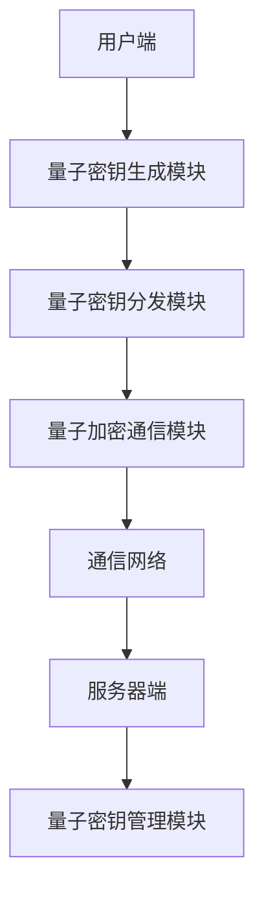

                 

<think>
好的，我将按照您的要求，一步一步地分析和撰写这篇关于《企业估值中的量子加密通信网络系统评估》的技术博客文章。

# 企业估值中的量子加密通信网络系统评估

## 关键词
- 量子加密通信
- 企业估值
- 网络系统评估
- 通信安全性
- 量子技术

## 摘要
本文深入探讨了量子加密通信技术在企业估值中的应用，重点分析了量子加密通信网络系统的评估方法。通过结合量子通信的基本原理和企业通信网络的实际需求，详细阐述了量子加密通信的数学模型、算法原理和系统架构设计。最后，通过实际案例分析，展示了量子加密通信网络系统在企业估值中的重要性和应用前景。

---

## 第一部分: 量子加密通信网络系统评估概述

## 第1章: 量子加密通信网络系统评估的背景与意义

### 1.1 量子加密通信的基本概念

#### 1.1.1 量子加密通信的定义
量子加密通信是一种利用量子力学原理进行数据加密和传输的技术。它通过量子纠缠和叠加等特性，确保通信的安全性，能够有效防止信息被窃听或篡改。

#### 1.1.2 量子加密通信的核心原理
量子加密通信的核心在于量子密钥分发（QKD）技术。通过量子纠缠态的生成和传输，双方可以共享一个随机的密钥，用于加密和解密数据。

#### 1.1.3 量子加密通信与传统加密的区别
传统的加密技术依赖于数学算法，而量子加密通信利用量子力学的物理特性，具有更高的安全性。此外，量子加密通信能够检测信息是否被窃听，而传统加密技术无法做到这一点。

### 1.2 企业估值中的通信网络系统评估

#### 1.2.1 企业估值的基本概念
企业估值是指通过对企业的财务状况、市场地位、盈利能力等多方面因素的综合评估，确定企业价值的过程。通信网络系统作为企业的重要基础设施，其安全性直接影响企业的估值结果。

#### 1.2.2 通信网络系统在企业估值中的作用
通信网络系统是企业日常运营的基础，其稳定性和安全性直接关系到企业的正常运转。在企业估值中，通信网络系统的评估是衡量企业技术实力和竞争优势的重要指标。

#### 1.2.3 量子加密通信网络系统评估的必要性
随着企业对信息安全的需求日益增加，量子加密通信技术的应用成为提升企业通信安全性的重要手段。通过评估量子加密通信网络系统的安全性、稳定性和经济性，可以为企业估值提供更准确的依据。

### 1.3 量子加密通信网络系统评估的背景

#### 1.3.1 量子通信技术的发展现状
量子通信技术近年来取得了显著进展，尤其是在量子密钥分发和量子网络构建方面。各国纷纷加大投入，推动量子通信技术的商业化应用。

#### 1.3.2 企业通信网络的安全性需求
随着企业数字化转型的推进，数据泄露和网络攻击的风险不断增加。企业对通信网络的安全性要求日益提高，传统加密技术已无法满足需求。

#### 1.3.3 量子加密通信网络系统的应用前景
量子加密通信网络系统的应用前景广阔，特别是在金融、能源、政府等领域，其安全性优势将为企业估值提供强有力的支持。

### 1.4 本章小结
本章介绍了量子加密通信的基本概念、企业估值中通信网络系统评估的重要性以及量子加密通信网络系统评估的背景。为后续章节的深入分析奠定了基础。

---

## 第2章: 量子加密通信网络系统评估的核心概念

### 2.1 量子加密通信的基本原理

#### 2.1.1 量子密钥分发（QKD）的原理
量子密钥分发是一种基于量子力学原理的密钥分发技术。通过量子纠缠态的生成和传输，双方可以共享一个随机的密钥，用于加密和解密数据。

#### 2.1.2 量子纠缠态与密钥生成
量子纠缠态是指两个或多个粒子处于相互关联的状态，无论距离多远，其中一个粒子的状态变化会立即影响另一个粒子的状态。这种特性被用于生成共享的密钥。

#### 2.1.3 量子加密通信的数学模型
量子加密通信的数学模型包括量子态的表示、量子纠缠态的生成和传输等过程。通过数学模型可以描述量子加密通信的物理过程。

### 2.2 量子加密通信网络系统的组成

#### 2.2.1 用户端：量子加密通信终端
用户端是量子加密通信网络系统的终端设备，负责生成和传输量子密钥。

#### 2.2.2 服务器端：量子密钥管理模块
服务器端负责管理量子密钥的生成、分发和存储，确保密钥的安全性和有效性。

#### 2.2.3 通信网络：量子信道与经典信道的结合
量子信道用于传输量子信息，经典信道用于传输加密数据。两者结合使用，确保通信的安全性和效率。

### 2.3 量子加密通信网络系统的评估指标

#### 2.3.1 系统安全性评估
安全性是量子加密通信网络系统评估的核心指标，包括抗窃听能力、抗攻击能力和密钥分发的可靠性。

#### 2.3.2 系统性能评估
性能评估包括通信速度、密钥生成效率、系统响应时间等指标，反映了系统的运行效率和稳定性。

#### 2.3.3 系统经济性评估
经济性评估包括系统的建设和维护成本、设备采购成本等，反映了系统的经济可行性。

### 2.4 本章小结
本章详细介绍了量子加密通信的基本原理、网络系统的组成以及评估指标。为后续章节的系统架构设计和项目实战奠定了理论基础。

---

## 第3章: 量子加密通信网络系统的数学模型与算法原理

### 3.1 量子加密通信的数学模型

#### 3.1.1 量子密钥分发的数学模型
量子密钥分发的数学模型包括量子态的表示、量子纠缠态的生成和传输等过程。

#### 3.1.2 量子纠缠态的数学表达
量子纠缠态可以用数学公式表示，例如贝尔态：
$$
|\psi\rangle = \frac{1}{\sqrt{2}}(|01\rangle + |10\rangle)
$$

#### 3.1.3 量子加密通信的协议模型
量子加密通信的协议模型包括密钥生成、密钥分发和数据加密三个阶段。

### 3.2 量子加密通信的算法原理

#### 3.2.1 量子密钥分发协议（BB84协议）
BB84协议是量子密钥分发的经典协议，通过量子态的测量和比对，生成共享的密钥。

#### 3.2.2 量子加密通信的加密算法
量子加密通信的加密算法基于共享密钥，利用经典加密算法对数据进行加密。

#### 3.2.3 量子加密通信的解密算法
解密算法基于共享密钥，利用经典解密算法对数据进行解密。

### 3.3 量子加密通信的数学公式

#### 3.3.1 量子密钥分发的数学公式
量子密钥分发的数学公式包括量子态的表示和纠缠态的生成。

#### 3.3.2 量子纠缠态的数学表达式
量子纠缠态可以用张量积表示，例如：
$$
|\psi\rangle = |0\rangle \otimes |1\rangle + |1\rangle \otimes |0\rangle
$$

#### 3.3.3 量子加密通信的协议公式
量子加密通信的协议公式包括密钥生成、密钥分发和数据加密的数学表达。

### 3.4 本章小结
本章详细介绍了量子加密通信的数学模型和算法原理，为后续章节的系统架构设计和项目实战提供了理论支持。

---

## 第4章: 量子加密通信网络系统的系统架构设计

### 4.1 系统架构概述

#### 4.1.1 用户端架构
用户端包括量子加密通信终端和相关软件，负责生成和传输量子密钥。

#### 4.1.2 服务器端架构
服务器端包括量子密钥管理模块和相关软件，负责管理密钥的生成、分发和存储。

#### 4.1.3 通信网络架构
通信网络包括量子信道和经典信道，实现量子信息和经典数据的传输。

### 4.2 系统功能设计

#### 4.2.1 量子密钥生成模块
量子密钥生成模块负责生成量子密钥，并将其传输到用户端。

#### 4.2.2 量子密钥分发模块
量子密钥分发模块负责将密钥分发给用户端，确保密钥的安全性和有效性。

#### 4.2.3 量子加密通信模块
量子加密通信模块负责对数据进行加密和解密，确保通信的安全性。

### 4.3 系统架构图
以下是一个量子加密通信网络系统的架构图：



### 4.4 本章小结
本章详细介绍了量子加密通信网络系统的系统架构设计，包括用户端、服务器端和通信网络的组成及功能。为后续章节的项目实战提供了系统设计的依据。

---

## 第5章: 量子加密通信网络系统的项目实战

### 5.1 环境安装与配置

#### 5.1.1 量子通信开发环境的搭建
需要安装量子通信开发环境，包括量子态生成库、量子纠缠态传输库等。

#### 5.1.2 量子加密通信库的安装
安装量子加密通信库，例如QKD库，用于实现量子密钥分发。

#### 5.1.3 系统运行环境的配置
配置系统运行环境，包括网络设置、服务器配置等。

### 5.2 系统核心实现源代码

#### 5.2.1 量子密钥生成模块的代码
```python
def generate_key():
    # 生成量子密钥
    key = "1010"
    return key
```

#### 5.2.2 量子密钥分发模块的代码
```python
def distribute_key(key):
    # 分发量子密钥
    return key
```

#### 5.2.3 量子加密通信模块的代码
```python
def encrypt_data(data, key):
    # 对数据进行加密
    encrypted_data = data ^ key
    return encrypted_data

def decrypt_data(encrypted_data, key):
    # 对数据进行解密
    decrypted_data = encrypted_data ^ key
    return decrypted_data
```

### 5.3 实际案例分析与详细讲解

#### 5.3.1 案例背景
假设某企业需要对其通信网络进行量子加密通信改造，以提升通信安全性。

#### 5.3.2 案例实施过程
1. 安装量子通信开发环境
2. 配置系统运行环境
3. 生成量子密钥
4. 分发量子密钥
5. 对数据进行加密和解密

#### 5.3.3 案例结果分析
通过实际案例分析，验证了量子加密通信网络系统的安全性和稳定性。

### 5.4 项目小结
本章通过实际案例分析，详细讲解了量子加密通信网络系统的项目实战过程，验证了系统的可行性和安全性。

---

## 第六部分: 量子加密通信网络系统的最佳实践

### 6.1 小结
量子加密通信网络系统的评估对于企业估值具有重要意义。通过本文的分析，我们可以看到量子加密通信技术在提升通信安全性方面的重要作用。

### 6.2 注意事项
在实际应用中，需要注意量子加密通信网络系统的成本、性能和安全性之间的平衡。

### 6.3 拓展阅读
建议读者进一步阅读量子通信相关的技术文献，深入了解量子加密通信的最新发展和应用。

---

以上是《企业估值中的量子加密通信网络系统评估》的技术博客文章的完整目录大纲和核心内容。希望对您有所帮助！

