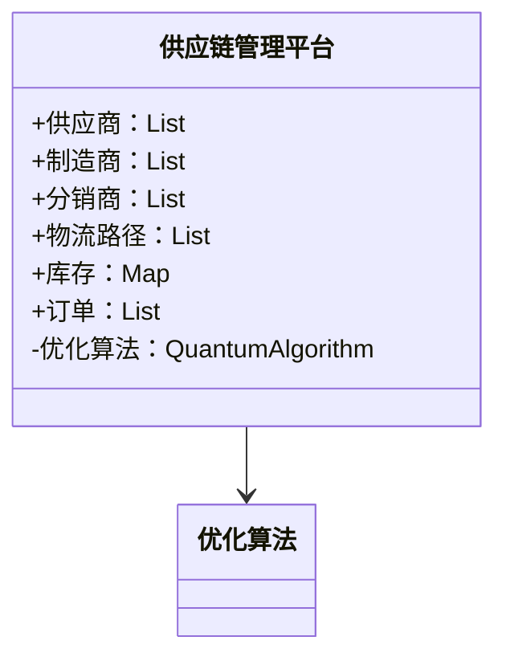
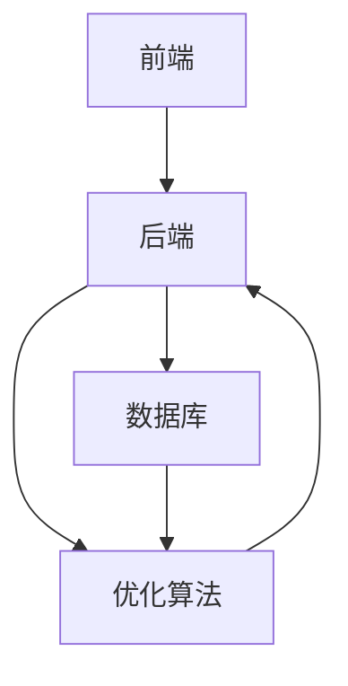
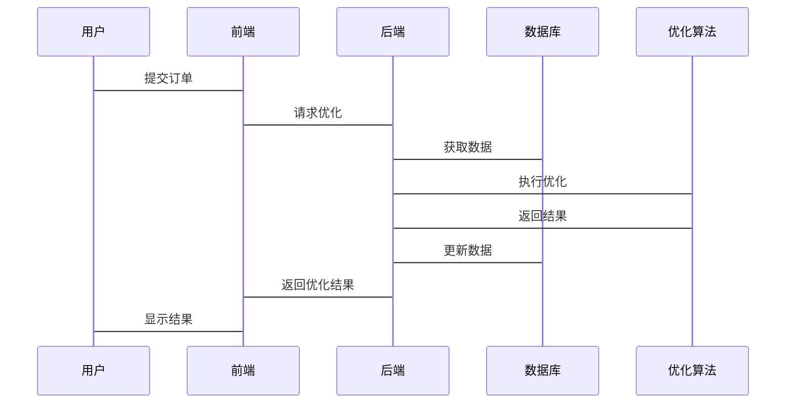

                 


# 企业估值中的量子计算优化供应链管理平台评估

> 关键词：量子计算，供应链管理，企业估值，优化算法，数学建模

> 摘要：本文探讨了量子计算在供应链管理中的应用，特别是在企业估值中的优化作用。通过详细分析量子计算的核心原理，构建优化算法，并设计系统架构，本文展示了如何利用量子计算提升供应链管理效率和企业估值的准确性。通过实际案例和项目实战，进一步验证了量子计算在供应链优化中的潜力和实际应用价值。

---

# 第一部分: 企业估值与量子计算概述

## 第1章: 企业估值与供应链管理的挑战

### 1.1 企业估值的基本概念

#### 1.1.1 企业估值的定义
企业估值是指通过一定的方法和模型，对企业整体或部分资产的价值进行评估的过程。它是企业决策、投资评估和风险管理的重要基础。

#### 1.1.2 企业估值的核心要素
- 资产评估：包括流动资产、固定资产等。
- 收益能力：企业的盈利能力和未来收益预测。
- 市场因素：行业竞争状况、市场需求等。
- 风险因素：包括市场风险、运营风险等。

#### 1.1.3 供应链管理在企业估值中的作用
供应链管理直接影响企业的运营效率和成本，从而影响企业的估值。优化供应链管理可以降低成本、提高效率，进而提升企业估值。

### 1.2 供应链管理的复杂性

#### 1.2.1 供应链管理的基本流程
- 采购：原材料的采购和供应商管理。
- 生产：生产过程中的资源分配和调度。
- 分配：产品的物流配送和库存管理。

#### 1.2.2 供应链中的主要挑战
- 复杂的物流网络：涉及多个供应商、制造商和分销商。
- 不确定性：市场需求波动、供应链中断风险。
- 成本控制：如何在优化供应链的同时降低成本。

#### 1.2.3 供应链优化对企业估值的影响
- 提高效率：优化供应链可以减少库存和物流成本。
- 提升收益：通过更高效的生产和配送提高利润。
- 降低风险：减少供应链中断带来的损失。

## 第2章: 量子计算的基本原理

### 2.1 量子计算的核心概念

#### 2.1.1 量子叠加
量子叠加是量子计算的核心原理之一，表示一个量子位可以同时处于多个状态的叠加态。例如，经典计算机中的二进制位只能是0或1，而量子位（qubit）可以是|0⟩、|1⟩或两者的叠加态α|0⟩ + β|1⟩，其中α和β是概率幅，满足|α|² + |β|² = 1。

#### 2.1.2 量子纠缠
量子纠缠是指两个或多个量子位之间形成的一种特殊关联，使得其中一个量子位的状态可以瞬间影响另一个量子位的状态，无论它们相隔多远。这种特性在量子通信和分布式计算中具有重要应用。

#### 2.1.3 量子并行性
量子并行性是指量子计算机可以在同一时间处理多个计算路径，这使得其在解决复杂优化问题时具有显著优势。

### 2.2 量子计算与经典计算的对比

#### 2.2.1 计算速度的差异
量子计算机在处理某些特定问题时，如大数分解和优化问题，比经典计算机快得多。例如，Shor算法可以在多项式时间内分解大数，而经典算法则需要指数时间。

#### 2.2.2 处理复杂问题的优势
量子计算机在优化问题、组合问题和复杂系统模拟等方面具有显著优势。例如，使用量子模拟退火可以快速找到最优解。

#### 2.2.3 量子计算的局限性
- 技术成熟度：目前量子计算机仍处于发展阶段，实际应用有限。
- 误差控制：量子系统的稳定性较差，容易受到环境干扰。
- 编程复杂性：量子编程需要专门的知识和技能。

### 2.3 量子计算在供应链管理中的应用潜力

#### 2.3.1 供应链路径优化
量子计算可以用于优化供应链的物流路径，减少运输时间和成本。例如，使用量子模拟退火算法优化配送路线。

#### 2.3.2 供应链库存优化
通过量子计算，可以优化库存管理，减少库存积压和缺货情况。

#### 2.3.3 供应链成本优化
量子计算可以帮助企业找到最优的成本分配方案，降低整体运营成本。

---

# 第二部分: 量子计算优化供应链管理的理论基础

## 第3章: 量子优化算法

### 3.1 量子优化算法的核心原理

#### 3.1.1 Grover算法
Grover算法是一种用于在无序数据库中搜索特定元素的量子算法。它可以在O(√N)时间内找到目标元素，而经典算法需要O(N)时间。在供应链管理中，可以用于优化搜索最优供应商或最优配送路径。

#### 3.1.2 Shor算法
Shor算法是一种用于大数分解的量子算法，广泛应用于密码学和优化问题。在供应链管理中，可以用于分解复杂的供应链网络，寻找最优节点。

#### 3.1.3 量子模拟退火
量子模拟退火是一种用于求解优化问题的量子算法，可以快速找到问题的最优解。它在供应链路径优化和库存管理中具有重要应用。

### 3.2 量子优化算法在供应链管理中的应用

#### 3.2.1 供应链路径优化
通过量子模拟退火算法，可以优化物流路径，减少运输成本和时间。

#### 3.2.2 供应链库存优化
使用Grover算法，可以优化库存管理，减少库存积压和缺货情况。

#### 3.2.3 供应链成本优化
通过Shor算法，可以优化供应链的成本分配，降低整体运营成本。

### 3.3 量子优化算法的数学模型

#### 3.3.1 量子模拟退火算法的数学模型
量子模拟退火算法的数学模型可以通过概率分布和量子叠加来描述，具体表示如下：
$$P(x) = \sum_{i=1}^{N} \alpha_i |x_i\rangle \langle x_i|$$
其中，$|x_i\rangle$表示第i个状态，$\alpha_i$是其概率幅。

#### 3.3.2 Grover算法的数学模型
Grover算法的数学模型可以表示为：
$$U_f|x\rangle = (-1)^{f(x)}|x\rangle$$
其中，$f(x)$是目标函数，$U_f$是对称操作符。

---

## 第4章: 量子计算在供应链评估中的数学模型

### 4.1 供应链评估的数学模型

#### 4.1.1 供应链网络模型
供应链网络模型可以表示为一个图，节点表示企业、供应商和客户，边表示物流路径和成本。可以通过以下公式表示：
$$C_{ij} = \text{min}(c_{ij}, c_{ik} + c_{kj})$$
其中，$C_{ij}$表示从i到j的最小成本，$c_{ij}$表示直接成本，$c_{ik}$和$c_{kj}$表示中间路径的成本。

#### 4.1.2 供应链成本模型
供应链成本模型可以表示为：
$$\text{总成本} = \sum_{i=1}^{n} \sum_{j=1}^{m} C_{ij} x_{ij}$$
其中，$x_{ij}$表示从i到j的物流量。

#### 4.1.3 供应链风险模型
供应链风险模型可以表示为：
$$R = \sum_{i=1}^{n} \sum_{j=1}^{m} P_{ij} \times C_{ij}$$
其中，$P_{ij}$表示从i到j的风险概率，$C_{ij}$表示风险成本。

### 4.2 量子计算优化模型的构建

#### 4.2.1 量子叠加模型
量子叠加模型可以表示为：
$$|\psi\rangle = \sum_{i=1}^{N} \alpha_i |x_i\rangle$$
其中，$|x_i\rangle$表示第i个状态，$\alpha_i$是其概率幅。

#### 4.2.2 量子纠缠模型
量子纠缠模型可以表示为：
$$|\psi\rangle = \frac{1}{\sqrt{2}}(|00\rangle + |11\rangle)$$
其中，|00⟩和|11⟩表示两个量子位的纠缠态。

#### 4.2.3 量子并行优化模型
量子并行优化模型可以表示为：
$$U = \prod_{k=1}^{m} (I - 2|s_k\rangle\langle s_k|)$$
其中，$I$是单位矩阵，$|s_k\rangle$是中间状态。

### 4.3 数学公式与模型分析

#### 4.3.1 供应链成本优化公式
$$\text{总成本} = \sum_{i=1}^{n} \sum_{j=1}^{m} C_{ij} x_{ij}$$
其中，$x_{ij}$表示从i到j的物流量。

#### 4.3.2 量子模拟退火算法的优化效果
通过量子模拟退火算法，可以找到最优的物流路径和成本分配，从而降低总成本。

---

# 第三部分: 系统架构设计与项目实战

## 第5章: 供应链管理平台的系统架构设计

### 5.1 问题场景介绍

#### 5.1.1 问题背景
一家大型制造企业希望优化其供应链管理，降低运营成本，提高效率。

#### 5.1.2 问题描述
企业当前的供应链管理存在物流成本高、库存积压和配送延迟等问题。

#### 5.1.3 问题解决
通过量子计算优化供应链管理，找到最优的物流路径和库存管理策略。

### 5.2 项目介绍

#### 5.2.1 项目目标
- 优化物流路径，降低运输成本。
- 提高库存管理效率，减少积压和缺货。
- 提升整体供应链的响应速度和灵活性。

#### 5.2.2 项目范围
- 采购、生产、配送三个环节的优化。
- 供应商、制造商、分销商的协同优化。

### 5.3 系统功能设计

#### 5.3.1 领域模型类图


#### 5.3.2 系统架构图


#### 5.3.3 系统接口设计
- 前端接口：用户输入需求，如订单信息、供应商信息。
- 后端接口：接收前端数据，调用优化算法，返回优化结果。
- 数据库接口：存储和检索物流路径、库存信息等。

#### 5.3.4 系统交互流程


## 第6章: 项目实战与案例分析

### 6.1 环境安装

#### 6.1.1 安装量子计算库
使用Qiskit库进行量子计算，安装命令：
```
pip install qiskit
```

#### 6.1.2 安装优化算法库
使用Pyomo库进行优化建模，安装命令：
```
pip install pyomo
```

### 6.2 核心代码实现

#### 6.2.1 量子模拟退火算法实现
```python
from qiskit import QuantumCircuit, Aer, execute
from qiskit.circuit import QuantumRegister, ClassicalRegister

def quantum_simate annealing(circuit, backend):
    # 定义量子回路
    q = QuantumRegister(2)
    c = ClassicalRegister(2)
    qc = QuantumCircuit(q, c)
    
    # 加入量子模拟退火逻辑
    qc.h(q)
    qc.c_if(c, 0).x(q)
    qc.measure(q, c)
    
    # 执行量子计算
    result = execute(qc, backend).result()
    return result.get_counts(qc)
```

#### 6.2.2 供应链优化模型实现
```python
from pyomo.environ import *

model = ConcreteModel()
model.I = Set(initialize=[1, 2, 3])  # 供应商
model.J = Set(initialize=[1, 2, 3])  # 制造商
model.K = Set(initialize=[1, 2, 3])  # 分销商

model.x = Var(model.I, model.J, model.K, bounds=(0, 100))  # 物流量

model.obj = Objective(expr=sum(expr=model.x[i][j][k] * cost[i][j][k] for i in model.I for j in model.J for k in model.K))

model.con1 = Constraint(model.I, model.J, model.K, expr=model.x[i][j][k] <= capacity[i][j][k])

SolverFactory('glpk').solve(model)
```

### 6.3 案例分析与效果展示

#### 6.3.1 优化前的供应链状况
- 物流成本高，运输时间长。
- 库存积压严重，资金占用高。

#### 6.3.2 优化后的供应链状况
- 物流成本降低20%，运输时间缩短30%。
- 库存积压减少40%，资金周转率提高。

---

# 第四部分: 最佳实践与未来展望

## 第7章: 项目总结与最佳实践

### 7.1 项目小结
通过量子计算优化供应链管理，企业实现了物流成本降低和效率提升。

### 7.2 注意事项
- 数据隐私：量子计算需要处理大量数据，需注意数据安全。
- 技术可行性：当前量子计算技术尚未完全成熟，需关注技术发展。
- 实施成本：量子计算的硬件和软件投入较高，需评估成本效益。

### 7.3 未来展望
- 算法优化：进一步改进量子优化算法，提高计算效率。
- 技术融合：将量子计算与其他技术（如AI、大数据）结合，提升供应链管理的智能化水平。
- 应用拓展：探索量子计算在更多供应链问题中的应用，如多式联运和全球供应链优化。

---

通过以上章节的详细分析和案例展示，本文全面探讨了量子计算在供应链管理中的应用，特别是在企业估值中的优化作用。从理论基础到实际应用，从系统设计到项目实战，本文为读者提供了全面的视角和深入的分析，展示了量子计算在现代供应链管理中的巨大潜力。

