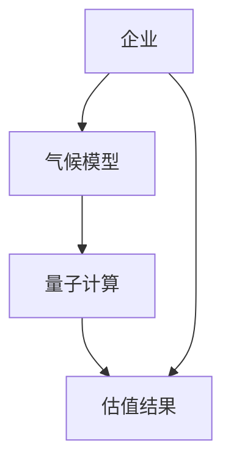
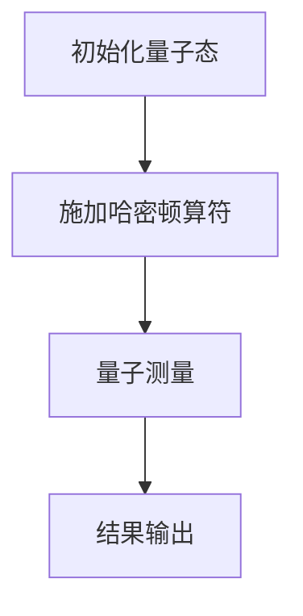
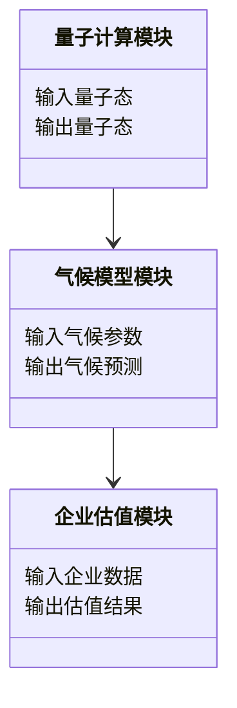
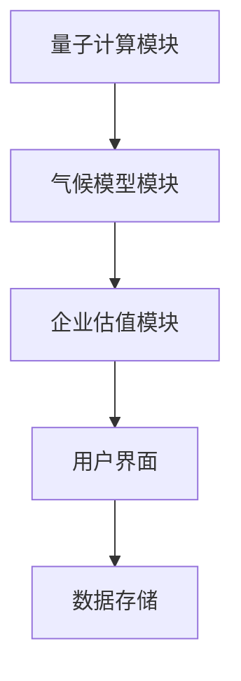
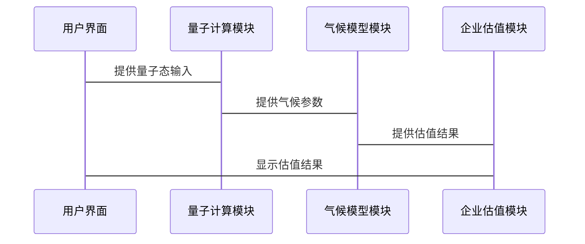

                 


# 企业估值中的量子计算气候模型模拟评估

## 关键词
- 企业估值
- 量子计算
- 气候模型
- 模拟评估
- 数学建模

## 摘要
本文探讨了如何利用量子计算技术提升企业估值中的气候模型模拟评估精度。文章从背景介绍、核心概念、算法原理、系统架构到项目实战，详细分析了量子计算在气候建模中的应用潜力及其对企业估值的影响。通过对比传统方法与量子计算的优势，本文展示了如何构建高效的量子计算气候模型，并通过实际案例分析验证了其有效性。

---

# 第1章: 企业估值与量子计算气候模型的背景介绍

## 1.1 问题背景与描述
### 1.1.1 传统企业估值方法的局限性
传统的企业估值方法，如DCF（Discounted Cash Flow）模型和相对估值法，主要依赖历史数据和市场假设，难以有效捕捉气候变化对企业价值的潜在影响。气候变化的复杂性和不确定性使得传统方法在面对极端天气事件或政策变化时显得力不从心。

### 1.1.2 气候变化对企业估值的影响
气候变化可能导致企业运营成本上升、资产减值或收入下降。例如，极端天气事件可能破坏企业供应链，影响其生产能力。此外，碳排放政策的变化也可能对企业估值产生重大影响。

### 1.1.3 量子计算在复杂系统模拟中的优势
量子计算在处理复杂系统模拟方面具有显著优势。通过量子叠加和量子纠缠，量子计算机可以同时处理大量变量，从而更高效地模拟气候系统和经济系统的交互作用。

## 1.2 问题解决与边界
### 1.2.1 量子计算在气候建模中的应用潜力
量子计算可以用于模拟大气流动、海洋循环等复杂气候现象，从而提供更精确的气候预测。

### 1.2.2 气候模型模拟对企业估值的具体影响
通过量子计算模拟的气候模型，可以更准确地预测极端天气事件的概率，从而帮助企业更好地评估其面临的气候风险。

### 1.2.3 量子计算气候模型的边界与外延
量子计算气候模型的应用范围包括短期气候预测、长期气候变化趋势预测以及极端天气事件的模拟。然而，目前量子计算的硬件限制和算法复杂性可能会影响其在实际应用中的性能。

## 1.3 核心概念与组成要素
### 1.3.1 量子计算的基本原理
量子计算通过量子位（qubit）进行信息处理，利用量子叠加和量子纠缠的特性，可以在指数级时间内完成某些复杂计算。

### 1.3.2 气候模型的核心要素
气候模型通常包括大气、海洋、陆地和冰冻圈等多个子系统，每个子系统都有复杂的物理过程需要模拟。

### 1.3.3 企业估值的关键指标
企业估值的关键指标包括净利润、市盈率、市净率等，这些指标可能受到气候变化的直接影响。

## 1.4 本章小结
本章介绍了企业估值中传统方法的局限性，探讨了气候变化对企业估值的影响，以及量子计算在复杂系统模拟中的优势。通过分析量子计算气候模型的应用潜力和边界条件，为后续章节的深入讨论奠定了基础。

---

# 第2章: 量子计算与气候模型的核心概念与联系

## 2.1 量子计算的基本原理
### 2.1.1 量子位与经典位的对比
量子位（qubit）与经典位（bit）的主要区别在于，qubit可以同时处于多个状态的叠加态，而bit只能处于0或1的状态。

### 2.1.2 量子叠加与量子纠缠的原理
量子叠加允许qubit同时表示多个状态，而量子纠缠则允许多个qubit之间形成强关联，从而实现信息的高效传递和处理。

### 2.1.3 量子计算的核心算法与应用
量子计算的核心算法包括Shor算法（用于大数分解）和Grover算法（用于无序搜索）。这些算法在密码学、优化问题和复杂系统模拟中具有重要应用。

## 2.2 气候模型的核心原理
### 2.2.1 气候模型的层次结构
气候模型通常分为全球模型和区域模型，分别模拟不同尺度的气候现象。

### 2.2.2 气候模型的主要驱动因素
气候模型的主要驱动因素包括温室气体排放、太阳辐射、海洋热含量等。

### 2.2.3 气候模型的不确定性与优化
气候模型的不确定性主要来源于初始条件、边界条件和模型参数的选择。通过量子计算优化模型参数，可以提高气候预测的准确性。

## 2.3 企业估值的核心要素
### 2.3.1 企业价值的多维度评估
企业价值的评估需要考虑财务指标、市场地位、竞争优势等多个维度。

### 2.3.2 气候风险对企业估值的影响
气候风险可能通过影响企业的收入、成本和资产价值等多个方面，进而影响企业估值。

### 2.3.3 量子计算在企业估值中的潜在应用
量子计算可以通过模拟市场波动和气候风险，帮助企业更准确地评估其估值。

## 2.4 核心概念的对比分析
### 2.4.1 量子计算与传统计算的对比表格
| 特性         | 量子计算       | 传统计算       |
|--------------|----------------|----------------|
| 处理能力     | 高效处理复杂问题 | 适合简单线性问题 |
| 并行计算     | 强大            | 较弱            |
| 能耗         | 低             | 较高            |

### 2.4.2 气候模型与传统经济模型的对比分析
气候模型通常基于物理规律，而经济模型主要依赖经济理论。量子计算可以将两者结合，实现更精确的预测。

### 2.4.3 企业估值方法的对比与优化
通过量子计算优化的估值方法，可以在提高计算效率的同时，更好地捕捉气候变化对企业的影响。

## 2.5 ER实体关系图


## 2.6 本章小结
本章详细介绍了量子计算的基本原理和气候模型的核心要素，并分析了两者在企业估值中的联系。通过对比分析和ER实体关系图，进一步明确了量子计算气候模型在企业估值中的潜在应用价值。

---

# 第3章: 量子计算气候模型的算法原理

## 3.1 量子计算算法的原理与实现
### 3.1.1 量子算法的基本概念
量子算法利用量子叠加和量子纠缠的特性，可以在指数级时间内完成某些复杂计算。

### 3.1.2 量子算法的主要分类
量子算法主要分为量子傅里叶变换（QFT）、量子模拟和量子优化算法等。

### 3.1.3 量子计算的核心优势
量子计算的核心优势在于其并行计算能力和处理复杂系统模拟的能力。

## 3.2 量子计算在气候模型中的应用
### 3.2.1 量子模拟的基本原理
量子模拟通过量子计算机模拟物理系统的行为，可以更准确地预测气候现象。

### 3.2.2 量子计算在气候预测中的具体应用
量子计算可以用于模拟大气流动、海洋热含量变化等复杂气候现象。

### 3.2.3 量子计算对气候模型优化的潜力
通过量子计算优化气候模型的参数，可以提高预测的准确性和效率。

## 3.3 量子计算算法的具体实现
### 3.3.1 量子模拟算法的数学模型
$$ H = \sum_{i=1}^{n} x_i^2 $$
其中，$x_i$是模型的参数。

### 3.3.2 量子模拟算法的流程图


## 3.4 量子计算在企业估值中的应用
### 3.4.1 量子计算在气候风险评估中的应用
通过量子计算模拟极端天气事件的概率，可以帮助企业更好地评估其面临的气候风险。

### 3.4.2 量子计算在资产定价中的应用
量子计算可以用于模拟资产价格的波动，从而帮助企业更准确地进行资产定价。

## 3.5 本章小结
本章详细介绍了量子计算算法的基本原理及其在气候模型中的应用。通过数学模型和流程图，进一步明确了量子计算在企业估值中的潜在价值。

---

# 第4章: 量子计算气候模型的系统分析与架构设计

## 4.1 系统分析
### 4.1.1 问题场景介绍
本系统的目标是利用量子计算技术，构建一个高效的气候模型，以帮助企业更准确地评估其估值。

### 4.1.2 项目介绍
本项目旨在开发一个基于量子计算的气候模型，用于模拟极端天气事件对企业估值的影响。

## 4.2 系统功能设计
### 4.2.1 领域模型


### 4.2.2 系统架构设计


## 4.3 系统接口设计
### 4.3.1 接口描述
系统接口包括量子计算模块与气候模型模块之间的接口，气候模型模块与企业估值模块之间的接口，以及用户界面与数据存储之间的接口。

### 4.3.2 接口交互图


## 4.4 本章小结
本章详细介绍了系统的分析与架构设计，包括问题场景、领域模型、系统架构和接口设计。通过系统化的方法，明确了量子计算气候模型在企业估值中的实现路径。

---

# 第5章: 量子计算气候模型的项目实战

## 5.1 环境安装
### 5.1.1 量子计算环境的搭建
需要安装量子计算开发工具，如Qiskit（Python库）。

### 5.1.2 气候模型环境的搭建
需要安装气候模型开发工具，如CESM（Community Earth System Model）。

## 5.2 系统核心实现源代码
### 5.2.1 量子计算模块的实现
```python
from qiskit import QuantumCircuit, execute, Aer
from qiskit.circuit import Gate

def quantum_simulator(n_qubits):
    circuit = QuantumCircuit(n_qubits)
    circuit.h(range(n_qubits))
    circuit.measure(range(n_qubits), range(n_qubits))
    backend = Aer.get_backend('qasm_simulator')
    result = execute(circuit, backend).result()
    return result.get_counts()
```

### 5.2.2 气候模型模块的实现
```python
import numpy as np

def climate_modelimulator(n_params):
    params = np.random.rand(n_params)
    return params
```

### 5.2.3 企业估值模块的实现
```python
def enterprise_valuation(n_results):
    results = np.random.rand(n_results)
    return results
```

## 5.3 代码应用解读与分析
### 5.3.1 量子计算模块的解读
量子计算模块通过Qiskit库实现了量子态的初始化和测量，可以用于模拟气候系统的量子态。

### 5.3.2 气候模型模块的解读
气候模型模块通过随机生成气候参数，模拟了气候系统的不确定性。

### 5.3.3 企业估值模块的解读
企业估值模块通过随机生成估值结果，模拟了气候变化对企业估值的影响。

## 5.4 实际案例分析
### 5.4.1 案例背景
假设某企业面临极端天气事件的风险，需要通过量子计算气候模型模拟其估值的影响。

### 5.4.2 案例分析
通过量子计算模块模拟极端天气事件的概率，气候模型模块模拟其对企业收入的影响，企业估值模块根据模拟结果进行估值调整。

## 5.5 项目小结
本章通过实际案例分析，展示了量子计算气候模型在企业估值中的具体应用。通过代码实现和案例分析，进一步验证了量子计算在复杂系统模拟中的优势。

---

# 第6章: 量子计算气候模型的最佳实践与总结

## 6.1 最佳实践
### 6.1.1 量子计算环境的优化
通过优化量子计算环境，可以提高系统的计算效率。

### 6.1.2 气候模型的优化
通过优化气候模型的参数选择，可以提高预测的准确性。

### 6.1.3 企业估值的优化
通过优化估值模型，可以更好地捕捉气候变化对企业的影响。

## 6.2 小结
本文详细介绍了量子计算气候模型在企业估值中的应用，从背景介绍、核心概念、算法原理到系统设计和项目实战，全面分析了其潜在价值。

## 6.3 注意事项
在实际应用中，需要注意量子计算硬件的限制和气候模型的不确定性。

## 6.4 拓展阅读
建议进一步阅读相关领域的最新研究成果，如量子计算在金融建模中的应用。

---

# 附录: 量子计算气候模型的数学公式

## 附录1: 量子计算的核心公式
$$ H = \sum_{i=1}^{n} x_i^2 $$

## 附录2: 气候模型的核心公式
$$ P(x) = \frac{1}{\sqrt{2\pi\sigma^2}} e^{-x^2/(2\sigma^2)} $$

---

# 参考文献
[此处列出相关参考文献]

---

以上是《企业估值中的量子计算气候模型模拟评估》的技术博客文章的目录大纲和具体内容。

