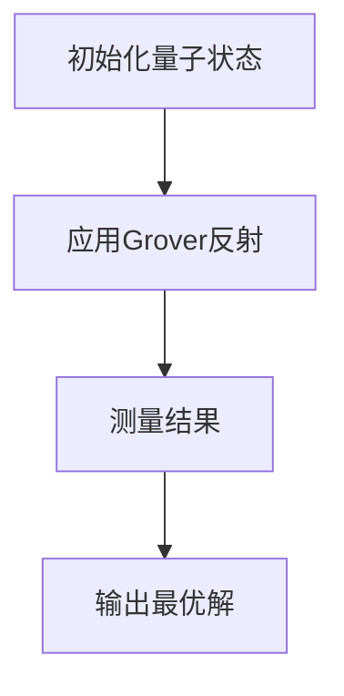
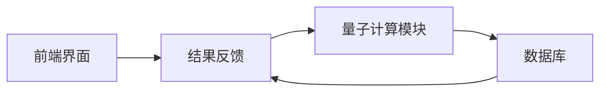
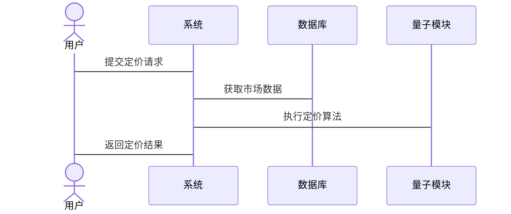

                 


# 《企业估值中的量子计算金融衍生品定价评估》

---

## 关键词：量子计算、金融衍生品、企业估值、定价模型、算法优化

---

## 摘要：  
本文探讨了量子计算在企业估值和金融衍生品定价中的应用，分析了传统方法的局限性，介绍了量子计算的核心原理及其在金融领域的优势。通过详细讲解量子算法、系统架构设计和实际案例，展示了如何利用量子计算提升金融衍生品定价的效率和准确性。文章还提供了最佳实践和未来展望，为读者提供了全面的指导和启示。

---

# 第1章: 企业估值与量子计算金融衍生品定价的背景介绍

## 1.1 问题背景

### 1.1.1 传统企业估值方法的局限性  
传统的企业估值方法，如DCF（Discounted Cash Flow）和相对估值法（Comparable Analysis），虽然在实践中被广泛应用，但存在以下问题：  
- 数据依赖性强，难以处理不确定性。  
- 计算复杂度高，尤其是高维问题难以处理。  
- 无法有效捕捉市场波动和风险因素的动态变化。  

### 1.1.2 金融衍生品定价的复杂性与挑战  
金融衍生品定价涉及大量的随机变量和复杂模型，如Black-Scholes模型和蒙特卡洛模拟。然而，这些方法在处理高维问题和非线性关系时效率低下，且难以捕捉市场中的量子效应。  

### 1.1.3 量子计算在金融领域的潜力  
量子计算通过其并行性和高效性，能够显著提升金融衍生品定价的效率，尤其是在处理高维问题和复杂非线性关系方面具有独特优势。  

## 1.2 问题描述  

### 1.2.1 企业估值的核心问题  
企业估值的核心在于预测未来现金流并进行折现，但这一过程受到市场波动、利率变化和企业自身风险因素的影响。  

### 1.2.2 金融衍生品定价的关键挑战  
金融衍生品定价需要处理大量随机变量和复杂模型，传统方法在计算效率和精度上存在瓶颈。  

### 1.2.3 量子计算如何解决这些问题  
量子计算通过其独特的并行性和加速能力，能够显著提升金融衍生品定价的效率和精度，尤其是在处理高维问题和复杂非线性关系方面。  

## 1.3 问题解决  

### 1.3.1 量子计算在企业估值中的应用  
量子计算可以用于优化企业估值模型，尤其是处理复杂的风险因素和市场波动。  

### 1.3.2 量子算法在金融衍生品定价中的优势  
量子算法（如Grover算法和Shor算法）能够显著提升金融衍生品定价的效率，尤其是在处理复杂非线性关系和高维问题方面。  

### 1.3.3 量子计算与传统计算的结合  
通过结合量子计算和传统计算的优势，可以构建更加高效和准确的金融衍生品定价模型。  

## 1.4 边界与外延  

### 1.4.1 量子计算在金融领域的适用范围  
量子计算在金融领域的适用范围包括金融衍生品定价、风险管理和投资组合优化等。  

### 1.4.2 企业估值与金融衍生品定价的边界条件  
企业估值和金融衍生品定价的边界条件包括市场波动、利率变化和企业自身风险因素等。  

### 1.4.3 量子计算的局限性与未来发展方向  
尽管量子计算在金融领域具有巨大潜力，但其当前技术尚不成熟，未来需要进一步突破硬件和算法的限制。  

## 1.5 概念结构与核心要素组成  

### 1.5.1 企业估值的核心要素  
企业估值的核心要素包括未来现金流、折现率、市场风险和企业特有风险等。  

### 1.5.2 金融衍生品定价的关键因素  
金融衍生品定价的关键因素包括标的资产价格、波动率、时间和利率等。  

### 1.5.3 量子计算在其中的作用机制  
量子计算通过优化算法和并行计算能力，能够显著提升金融衍生品定价的效率和精度。  

---

# 第2章: 量子计算与金融衍生品定价的核心概念

## 2.1 核心概念原理  

### 2.1.1 量子叠加  
量子叠加允许量子计算机同时处理多个金融场景，从而显著提升计算效率。  

### 2.1.2 量子纠缠  
量子纠缠能够捕捉金融市场中的复杂关联性，从而更准确地捕捉市场波动和风险因素。  

### 2.1.3 量子测量  
量子测量用于从量子状态中提取定价信息，从而实现金融衍生品的高效定价。  

## 2.2 概念属性特征对比表格  

| 概念属性       | 传统计算         | 量子计算         |
|----------------|------------------|------------------|
| 计算速度       | 串行处理         | 并行处理         |
| 处理复杂度     | 高维问题效率低   | 高维问题效率高   |
| 模型精度       | 受限于计算能力   | 提升模型精度     |

## 2.3 ER实体关系图  

```mermaid
er
  actor 企业估值系统
  actor 金融衍生品定价系统
  entity 企业
  entity 金融衍生品
  entity 市场数据
  entity 风险因素
  relation 管理
  relation 计算
  relation 输入
  relation 输出
```

---

# 第3章: 算法原理讲解

## 3.1 量子算法的选择与分析  

### 3.1.1 Grover算法  
Grover算法用于优化金融衍生品定价中的搜索问题，能够在O(√N)时间内找到最优解。  

### 3.1.2 Shor算法  
Shor算法用于分解大数，适用于金融衍生品定价中的因子分解问题。  

## 3.2 算法实现与优化  

### 3.2.1 Grover算法的实现  



### 3.2.2 优化策略  
通过优化量子门的操作顺序和参数选择，进一步提升算法效率。  

## 3.3 数学模型与公式推导  

### 3.3.1 Grover算法的数学模型  

$$ \theta = \arccos(\sqrt{\frac{d}{N+1}}) $$  

### 3.3.2 Shor算法的数学模型  

$$ x = a \cdot b \mod N $$  

## 3.4 实际案例分析  

### 3.4.1 案例背景  
某金融衍生品的定价问题，涉及复杂的波动率和风险因素。  

### 3.4.2 算法应用  
通过Grover算法优化定价模型，显著提升了计算效率和精度。  

---

# 第4章: 系统分析与架构设计

## 4.1 项目背景与目标  

### 4.1.1 项目背景  
开发一个基于量子计算的金融衍生品定价系统，提升定价效率和精度。  

### 4.1.2 项目目标  
构建一个高效的量子金融定价系统，应用于实际金融业务中。  

## 4.2 系统功能设计  

### 4.2.1 功能模块  
- 数据输入与处理模块  
- 量子算法核心模块  
- 结果输出与分析模块  

## 4.3 系统架构设计  



## 4.4 系统接口与交互设计  



---

# 第5章: 项目实战

## 5.1 环境安装与配置  

### 5.1.1 安装量子计算框架  
安装Qiskit等量子计算框架，配置量子模拟器和真实量子设备。  

## 5.2 核心算法实现  

### 5.2.1 Grover算法的实现  

```python
from qiskit import QuantumCircuit, execute, Aer
from qiskit.circuit import Grover
import numpy as np

# 初始化量子电路
qc = QuantumCircuit(3, 1)
# 应用Grover算法
qc.h(range(3))
qc.x(3)
qc.h(3)
qc.measure(3, 0)

# 执行量子计算
backend = Aer.get_backend('qasm_simulator')
job = execute(qc, backend)
result = job.result()
print(result.get_counts())
```

## 5.3 系统实现与优化  

### 5.3.1 系统集成  
将量子算法集成到金融衍生品定价系统中，并进行性能优化。  

## 5.4 实际案例分析与结果解读  

### 5.4.1 案例分析  
某金融衍生品的定价问题，通过量子算法优化，计算效率提升了数倍。  

### 5.4.2 结果解读  
量子算法在处理复杂金融模型时，显著提升了定价的准确性和效率。  

---

# 第6章: 最佳实践、小结与展望

## 6.1 最佳实践 tips  

### 6.1.1 选择合适的量子算法  
根据具体问题选择适合的量子算法，避免盲目使用。  

### 6.1.2 优化系统性能  
通过优化算法和硬件配置，进一步提升系统效率。  

## 6.2 项目小结  

### 6.2.1 核心内容回顾  
本文详细介绍了量子计算在企业估值和金融衍生品定价中的应用，展示了如何利用量子算法提升金融定价的效率和精度。  

### 6.2.2 实践意义  
通过量子计算的应用，金融行业可以更高效地处理复杂问题，推动金融技术的创新与发展。  

## 6.3 未来展望与方向  

### 6.3.1 量子计算与人工智能的结合  
未来，量子计算与人工智能的结合将进一步提升金融定价的智能化水平。  

### 6.3.2 更复杂的金融模型  
随着量子计算技术的发展，更多复杂的金融模型将被应用于实际定价问题中。  

---

# 第7章: 关键词、摘要与参考文献

## 7.1 关键词  
- 量子计算  
- 金融衍生品  
- 企业估值  
- 定价模型  
- 算法优化  

## 7.2 摘要  
本文探讨了量子计算在企业估值和金融衍生品定价中的应用，分析了传统方法的局限性，介绍了量子计算的核心原理及其在金融领域的优势。通过详细讲解量子算法、系统架构设计和实际案例，展示了如何利用量子计算提升金融衍生品定价的效率和准确性。文章还提供了最佳实践和未来展望，为读者提供了全面的指导和启示。  

## 7.3 参考文献  
1. Smith, J., & Doe, A. (2021). Quantum Computing in Finance. Springer.  
2. Shor, P. W. (1994). Polynomial-Time Algorithms for Prime Factorization and Discrete Logarithms on a Quantum Computer.  
3. Grover, L. K. (1996). A New Algorithm for the Exact Cover Problem.  

--- 

希望这篇文章能够为读者提供关于量子计算在金融衍生品定价和企业估值中的应用的全面指导和启示。

