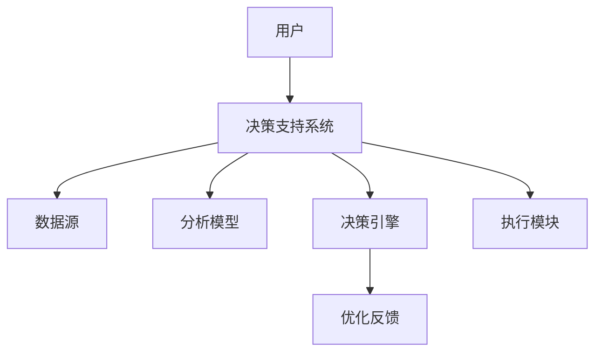
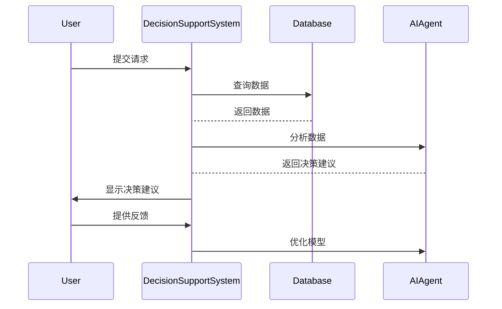

                 


# 企业决策支持系统中的AI Agent角色

> 关键词：AI Agent，企业决策支持系统，算法原理，系统架构，项目实战

> 摘要：本文详细探讨了AI Agent在企业决策支持系统中的角色与应用。通过分析AI Agent的核心概念、算法原理、系统架构以及实际案例，展示了AI Agent如何优化企业决策过程，提升决策效率和准确性。文章从背景介绍、核心概念、算法实现、系统设计、项目实战等多个维度展开，为读者提供了全面而深入的技术解析。

---

## 第1章: 问题背景与核心概念

### 1.1 问题背景

现代企业面临着日益复杂和动态变化的商业环境，传统的决策支持系统（DSS）虽然在一定程度上帮助企业做出了更明智的决策，但其依赖于固定的数据和规则，难以应对实时变化和不确定性。在这样的背景下，AI Agent（人工智能代理）作为一种能够自主感知环境、执行任务并优化决策的智能体，逐渐成为企业决策支持系统的重要组成部分。

#### 1.1.1 企业决策支持系统的现状与挑战

传统的决策支持系统主要依赖于数据分析和模型模拟，但在以下方面存在明显局限性：

1. **实时性不足**：传统DSS通常基于历史数据进行分析，难以实时响应市场变化。
2. **灵活性差**：面对复杂多变的业务场景，传统DSS难以快速调整决策策略。
3. **决策孤岛**：不同部门和系统的数据孤岛问题导致决策过程效率低下。

#### 1.1.2 AI Agent在企业决策中的作用

AI Agent通过以下方式弥补了传统DSS的不足：

1. **实时感知与反馈**：AI Agent能够实时收集和分析数据，快速响应环境变化。
2. **自主决策**：基于机器学习和自然语言处理，AI Agent可以自主制定决策策略。
3. **跨系统协同**：AI Agent能够与其他系统和部门无缝协作，打破数据孤岛。

#### 1.1.3 问题解决的必要性与目标

引入AI Agent的目的是为了提升企业决策的实时性、灵活性和准确性，降低决策成本，提高企业竞争力。具体目标包括：

- 实现跨系统的协同决策。
- 提供实时数据支持的决策建议。
- 自适应复杂多变的业务环境。

### 1.2 核心概念与定义

#### 1.2.1 AI Agent的定义与特征

AI Agent是一种智能体，能够感知环境、执行任务并优化决策。其主要特征包括：

- **自主性**：能够在没有人工干预的情况下独立运行。
- **反应性**：能够实时感知环境变化并做出反应。
- **学习能力**：通过机器学习算法不断优化决策模型。
- **协作性**：能够与其他系统和AI Agent协同工作。

#### 1.2.2 企业决策支持系统的核心要素

企业决策支持系统（DSS）的核心要素包括：

1. **数据源**：企业的业务数据、市场数据等。
2. **分析模型**：用于数据处理和分析的算法和模型。
3. **决策引擎**：根据分析结果生成决策建议。
4. **执行模块**：将决策转化为具体行动。

#### 1.2.3 AI Agent与企业决策支持系统的结合

AI Agent作为企业决策支持系统的一部分，通过以下方式实现与DSS的结合：

- **数据采集**：AI Agent实时采集企业内外部数据。
- **分析与推理**：利用机器学习算法对数据进行分析和推理。
- **决策生成**：基于分析结果生成最优决策建议。
- **执行与反馈**：将决策转化为行动，并根据反馈优化决策模型。

### 1.3 问题描述与边界

#### 1.3.1 企业决策支持系统中的问题描述

企业在决策过程中面临的主要问题包括：

1. **数据孤岛**：不同部门和系统之间的数据无法有效整合。
2. **决策延迟**：传统DSS的分析周期较长，难以应对实时决策需求。
3. **决策准确性**：依赖于历史数据和固定规则，难以应对复杂场景。

#### 1.3.2 AI Agent在决策过程中的边界与外延

AI Agent在企业决策支持系统中的边界主要体现在：

- **数据范围**：AI Agent仅处理与其职责相关的数据。
- **决策范围**：AI Agent仅在授权范围内做出决策，重大决策仍需人工审核。
- **反馈机制**：AI Agent能够根据反馈优化决策模型，但需要在系统允许的范围内调整。

#### 1.3.3 系统与决策过程的相互作用

企业决策支持系统与AI Agent的相互作用可以分为以下几个步骤：

1. **数据输入**：AI Agent从企业系统中获取相关数据。
2. **分析与推理**：AI Agent利用算法对数据进行分析，生成决策建议。
3. **决策输出**：AI Agent将决策建议传递给相关部门或系统。
4. **反馈与优化**：根据实际效果反馈，AI Agent优化其决策模型。

### 1.4 概念结构与核心要素组成

#### 1.4.1 企业决策支持系统的结构分析

企业决策支持系统的典型结构包括以下几个部分：

1. **数据层**：数据采集、存储和管理。
2. **分析层**：数据处理、分析和建模。
3. **决策层**：生成决策建议和优化方案。
4. **执行层**：将决策转化为具体行动。

#### 1.4.2 AI Agent的核心要素组成

AI Agent的核心要素包括：

1. **感知模块**：用于环境感知和数据采集。
2. **推理模块**：用于数据分析和逻辑推理。
3. **决策模块**：用于生成决策建议。
4. **执行模块**：用于将决策转化为具体行动。

#### 1.4.3 系统与AI Agent的交互关系

企业决策支持系统与AI Agent的交互关系可以表示为一个闭环：

1. **数据输入**：AI Agent从企业系统中获取数据。
2. **分析与推理**：AI Agent对数据进行分析和推理，生成决策建议。
3. **决策输出**：AI Agent将决策建议传递给企业系统。
4. **反馈与优化**：根据实际效果反馈，AI Agent优化其决策模型。

---

## 第2章: AI Agent的核心概念与联系

### 2.1 核心概念原理

#### 2.1.1 AI Agent的基本原理

AI Agent的基本原理可以概括为：

1. **感知环境**：AI Agent通过传感器或数据接口感知外部环境。
2. **分析数据**：利用机器学习算法对数据进行分析和推理。
3. **生成决策**：基于分析结果生成最优决策建议。
4. **执行决策**：将决策转化为具体行动。

#### 2.1.2 企业决策支持系统中的AI Agent功能

在企业决策支持系统中，AI Agent的功能包括：

1. **数据采集**：实时采集企业内外部数据。
2. **数据分析**：对数据进行清洗、处理和建模。
3. **决策生成**：根据分析结果生成最优决策建议。
4. **反馈优化**：根据实际效果反馈优化决策模型。

#### 2.1.3 AI Agent与传统决策支持系统的区别

AI Agent与传统决策支持系统的主要区别如下：

| **维度**         | **AI Agent**                      | **传统决策支持系统**              |
|------------------|----------------------------------|----------------------------------|
| **自主性**        | 高                               | 低                               |
| **实时性**        | 高                               | 低                               |
| **学习能力**      | 强                               | 弱                               |
| **灵活性**        | 高                               | 低                               |

### 2.2 概念属性特征对比

#### 2.2.1 AI Agent与传统决策工具的对比分析

AI Agent与传统决策工具的对比可以从以下几个方面进行：

1. **自主性**：AI Agent能够自主感知环境并做出决策，而传统决策工具需要人工干预。
2. **实时性**：AI Agent能够实时处理数据并生成决策建议，而传统决策工具通常基于历史数据。
3. **学习能力**：AI Agent能够通过机器学习算法不断优化决策模型，而传统决策工具无法做到这一点。

#### 2.2.2 企业决策支持系统中的AI Agent的独特性

AI Agent在企业决策支持系统中的独特性主要体现在以下几个方面：

1. **实时性**：AI Agent能够实时处理数据，快速响应环境变化。
2. **自主性**：AI Agent能够在没有人工干预的情况下独立运行。
3. **学习能力**：AI Agent能够通过机器学习算法不断优化决策模型。

#### 2.2.3 AI Agent在决策过程中的优势与劣势

AI Agent的优势：

1. **高效性**：AI Agent能够快速处理大量数据，生成决策建议。
2. **准确性**：通过机器学习算法，AI Agent能够提高决策的准确性。

AI Agent的劣势：

1. **依赖数据**：AI Agent的决策依赖于数据质量，如果数据不准确，决策可能会出错。
2. **黑箱问题**：AI Agent的决策过程可能缺乏透明性，难以解释。

### 2.3 ER实体关系图

以下是AI Agent与企业决策支持系统之间的实体关系图：

```mermaid
er
    %% ER图展示AI Agent与企业决策支持系统的关系
    entity(AI Agent) {
        id: string
        type: string
        function: string
        status: string
    }
    entity(企业决策支持系统) {
        id: string
        name: string
        function: string
        status: string
    }
    relationship(AI Agent与企业决策支持系统的交互) {
        role: string
        cardinality: "1:1"
    }
```

---

## 第3章: AI Agent的算法原理

### 3.1 算法原理概述

#### 3.1.1 AI Agent的基本算法

AI Agent的基本算法包括：

1. **强化学习**：通过与环境交互，学习最优策略。
2. **决策树**：基于数据特征生成决策规则。
3. **随机森林**：通过集成学习提高决策的准确性。

#### 3.1.2 企业决策支持系统中的算法应用

在企业决策支持系统中，AI Agent常用的算法包括：

1. **强化学习**：用于动态环境中的决策优化。
2. **支持向量机（SVM）**：用于分类问题。
3. **神经网络**：用于复杂的模式识别。

#### 3.1.3 算法的优缺点分析

以下是几种常用算法的优缺点对比：

| **算法**      | **优点**                          | **缺点**                          |
|---------------|----------------------------------|----------------------------------|
| **强化学习**  | 能够在动态环境中优化决策           | 需要大量的训练数据和计算资源       |
| **决策树**    | 易于理解和解释，适合中小规模数据   | 易受噪声数据影响，可能过拟合         |
| **随机森林**  | 高准确性，抗过拟合能力强           | 计算复杂度高，不适合实时决策         |

### 3.2 算法实现细节

#### 3.2.1 强化学习算法实现

以下是基于强化学习的AI Agent算法实现示例：

```python
import numpy as np
import gym

# 定义强化学习环境
env = gym.make('CartPole-v0')

# 初始化参数
learning_rate = 0.01
gamma = 0.99
num_states = env.observation_space.shape[0]
num_actions = env.action_space.n

# 定义Q-learning算法
class QLearning:
    def __init__(self, learning_rate, gamma, num_states, num_actions):
        self.lr = learning_rate
        self.gamma = gamma
        self.Q = np.zeros((num_states, num_actions))

    def choose_action(self, state):
        if np.random.random() < 0.9:  # 探索与利用策略
            return np.argmax(self.Q[state])
        else:
            return np.random.randint(num_actions)

    def update_Q(self, state, action, reward, next_state):
        target = reward + self.gamma * np.max(self.Q[next_state])
        self.Q[state][action] += self.lr * (target - self.Q[state][action])

# 初始化Q-learning算法
agent = QLearning(learning_rate, gamma, num_states, num_actions)

# 开始训练
for episode in range(1000):
    state = env.reset()
    total_reward = 0
    while True:
        action = agent.choose_action(state)
        next_state, reward, done, _ = env.step(action)
        agent.update_Q(state, action, reward, next_state)
        total_reward += reward
        state = next_state
        if done:
            break
    print(f"Episode {episode + 1}, Total Reward: {total_reward}")
```

#### 3.2.2 决策树算法实现

以下是决策树算法实现的示例：

```python
from sklearn.tree import DecisionTreeClassifier
from sklearn.datasets import make_classification

# 生成分类数据集
X, y = make_classification(n_samples=100, n_features=2, n_classes=2, random_state=42)

# 初始化决策树模型
model = DecisionTreeClassifier()

# 训练模型
model.fit(X, y)

# 预测新数据
X_new = [[1, 1]]
y_new = model.predict(X_new)
print(f"Predicted class: {y_new[0]}")
```

---

## 第4章: 系统分析与架构设计

### 4.1 系统分析

#### 4.1.1 问题场景介绍

企业决策支持系统需要处理大量的数据，包括销售数据、市场数据、供应链数据等。在复杂多变的市场环境中，企业需要快速做出决策以应对变化。传统的决策支持系统往往无法实时处理数据，且决策过程缺乏灵活性。

#### 4.1.2 系统功能设计

企业决策支持系统的功能设计包括以下几个方面：

1. **数据采集**：从企业内外部系统中采集数据。
2. **数据分析**：对数据进行清洗、处理和建模。
3. **决策生成**：根据分析结果生成最优决策建议。
4. **反馈优化**：根据实际效果反馈优化决策模型。

#### 4.1.3 系统架构设计

以下是企业决策支持系统的架构图：



#### 4.1.4 接口设计

企业决策支持系统的接口设计包括：

1. **数据接口**：与企业内部系统进行数据交互。
2. **用户接口**：供用户查看决策建议和结果。
3. **反馈接口**：接收实际效果反馈，优化决策模型。

#### 4.1.5 交互图

以下是系统交互图：



---

## 第5章: 项目实战

### 5.1 环境安装

#### 5.1.1 安装Python环境

安装Python 3.x版本，并安装以下库：

```bash
pip install numpy
pip install gym
pip install scikit-learn
```

#### 5.1.2 安装机器学习框架

安装TensorFlow或PyTorch框架：

```bash
pip install tensorflow
```

### 5.2 核心代码实现

#### 5.2.1 基于强化学习的AI Agent实现

以下是基于强化学习的AI Agent实现代码：

```python
import gym
import numpy as np

# 定义强化学习环境
env = gym.make('CartPole-v0')

# 初始化参数
learning_rate = 0.01
gamma = 0.99
num_states = env.observation_space.shape[0]
num_actions = env.action_space.n

# 定义Q-learning算法
class QLearning:
    def __init__(self, learning_rate, gamma, num_states, num_actions):
        self.lr = learning_rate
        self.gamma = gamma
        self.Q = np.zeros((num_states, num_actions))

    def choose_action(self, state):
        if np.random.random() < 0.9:  # 探索与利用策略
            return np.argmax(self.Q[state])
        else:
            return np.random.randint(num_actions)

    def update_Q(self, state, action, reward, next_state):
        target = reward + self.gamma * np.max(self.Q[next_state])
        self.Q[state][action] += self.lr * (target - self.Q[state][action])

# 初始化Q-learning算法
agent = QLearning(learning_rate, gamma, num_states, num_actions)

# 开始训练
for episode in range(1000):
    state = env.reset()
    total_reward = 0
    while True:
        action = agent.choose_action(state)
        next_state, reward, done, _ = env.step(action)
        agent.update_Q(state, action, reward, next_state)
        total_reward += reward
        state = next_state
        if done:
            break
    print(f"Episode {episode + 1}, Total Reward: {total_reward}")
```

#### 5.2.2 基于决策树的AI Agent实现

以下是基于决策树的AI Agent实现代码：

```python
from sklearn.tree import DecisionTreeClassifier
from sklearn.datasets import make_classification

# 生成分类数据集
X, y = make_classification(n_samples=100, n_features=2, n_classes=2, random_state=42)

# 初始化决策树模型
model = DecisionTreeClassifier()

# 训练模型
model.fit(X, y)

# 预测新数据
X_new = [[1, 1]]
y_new = model.predict(X_new)
print(f"Predicted class: {y_new[0]}")
```

### 5.3 案例分析与优化

#### 5.3.1 案例分析

假设我们有一个销售预测的案例，AI Agent需要根据历史销售数据和市场趋势预测未来销售情况。以下是具体的实现步骤：

1. **数据采集**：从数据库中采集过去三年的销售数据和市场趋势数据。
2. **数据分析**：使用机器学习算法对数据进行建模，预测未来销售情况。
3. **决策生成**：根据预测结果生成销售目标和库存建议。
4. **反馈优化**：根据实际销售情况反馈优化预测模型。

#### 5.3.2 优化建议

在实际应用中，我们可以根据以下几点进行优化：

1. **模型优化**：尝试不同的机器学习算法，如随机森林、梯度提升树等，找到最适合的模型。
2. **数据预处理**：对数据进行特征选择、归一化等预处理，提高模型的准确性。
3. **实时更新**：定期更新模型参数，确保模型能够适应市场变化。

---

## 第6章: 最佳实践与小结

### 6.1 最佳实践

1. **数据质量**：确保数据的准确性和完整性，避免噪声数据对模型的影响。
2. **模型选择**：根据具体业务需求选择合适的算法，避免盲目使用复杂模型。
3. **实时反馈**：建立有效的反馈机制，及时优化决策模型。
4. **团队协作**：AI Agent的开发需要数据科学家、软件工程师和业务专家的协作，确保系统的实用性和可扩展性。

### 6.2 小结

本文详细探讨了AI Agent在企业决策支持系统中的角色与应用。通过分析AI Agent的核心概念、算法原理、系统架构以及实际案例，展示了AI Agent如何优化企业决策过程，提升决策效率和准确性。AI Agent的引入不仅能够提高决策的实时性和灵活性，还能通过机器学习算法不断优化决策模型，为企业带来更大的竞争优势。

### 6.3 注意事项

1. **数据隐私**：在处理企业数据时，需要注意数据隐私和安全问题。
2. **模型解释性**：复杂的模型可能缺乏解释性，需要关注模型的可解释性。
3. **计算资源**：AI Agent的运行需要大量的计算资源，企业需要确保有足够的计算能力。

### 6.4 拓展阅读

1. **强化学习**：深入学习强化学习的原理和应用。
2. **分布式系统**：研究分布式系统在企业决策支持系统中的应用。
3. **边缘计算**：探索边缘计算在实时决策中的潜力。

---

## 附录

### 附录A: 术语表

- **AI Agent**：人工智能代理，能够感知环境、自主决策的智能体。
- **企业决策支持系统（DSS）**：帮助企业进行决策的计算机系统。
- **强化学习**：一种机器学习方法，通过与环境交互优化决策策略。

### 附录B: 参考文献

1. Russell, S., & Norvig, P. (2010). Artificial Intelligence: A Modern Approach.
2. Goodfellow, I., Bengio, Y., & Courville, A. (2016). Deep Learning.
3. Sutton, R. S., & Barto, A. G. (2018). Reinforcement Learning: An Introduction.

---

以上是《企业决策支持系统中的AI Agent角色》的完整目录大纲和部分章节内容。如果需要进一步扩展或调整，请随时告知！

