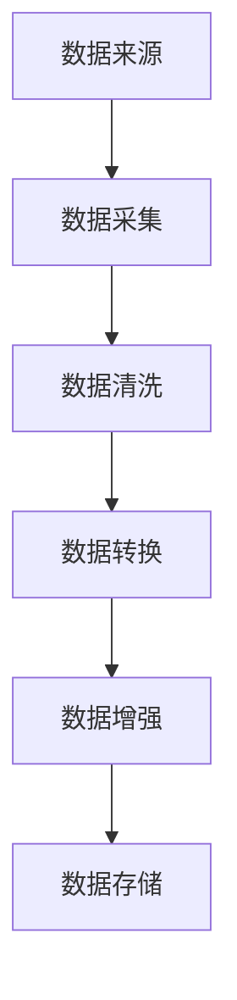
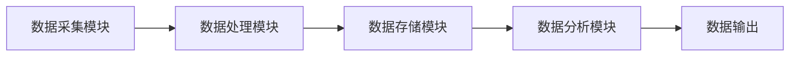
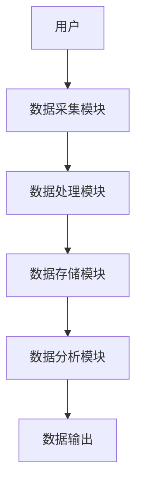

                 


# 企业数据管理：AI Agent训练数据的收集与处理

---

## 关键词：企业数据管理、AI Agent、数据收集、数据处理、算法原理

---

## 摘要：

本文将深入探讨企业数据管理中AI Agent训练数据的收集与处理的关键问题，从背景介绍、核心概念、算法原理到系统架构设计，结合实际案例，全面解析如何高效、安全地管理AI Agent所需的数据。文章通过详细分析数据流、算法流程和系统架构，为读者提供从理论到实践的完整指南。

---

# 第1章: 企业数据管理与AI Agent的背景介绍

## 1.1 数据在企业中的核心地位

企业数据是企业决策和运营的基础，贯穿企业从战略规划到日常运营的各个环节。数据的完整性和准确性直接影响企业的竞争力。

- **数据的生命周期**：数据的产生、存储、处理、分析、归档和销毁。
- **数据管理的目标**：确保数据的可用性、完整性、一致性和安全性。
- **数据管理与企业竞争力**：高质量的数据是企业AI应用的核心驱动力。

## 1.2 AI Agent的定义与发展

AI Agent（智能体）是一种能够感知环境并采取行动以实现目标的智能系统。其核心功能包括感知、决策、执行和学习。

- **AI Agent的核心功能**：
  - 感知：通过传感器或数据输入获取环境信息。
  - 决策：基于感知信息做出最优决策。
  - 执行：通过执行机构将决策转化为行动。
  - 学习：通过反馈优化自身行为。

- **AI Agent的类型**：
  - 简单反射型：基于预设规则直接响应。
  - 基于模型型：使用内部模型进行状态评估和决策。
  - 学习型：通过机器学习算法不断优化行为。

## 1.3 企业数据管理与AI Agent的结合

AI Agent需要依赖高质量的数据进行训练和推理，而企业数据管理则为AI Agent提供数据支持。

- **数据驱动AI Agent的必要性**：
  - AI Agent的学习能力依赖于数据的质量和多样性。
  - 数据管理确保AI Agent能够获取可靠的数据输入。

- **AI Agent如何优化企业数据管理**：
  - 通过自动化分析提高数据处理效率。
  - 发现数据中的潜在关联，提升数据价值。

- **未来发展趋势**：
  - 数据管理与AI Agent的协同优化将成为企业竞争力的关键。
  - 数据隐私和安全将成为AI Agent数据管理的核心挑战。

---

# 第2章: 企业数据管理的核心概念与联系

## 2.1 数据管理的核心要素

数据管理涉及多个核心要素，包括数据的生命周期、数据模型、数据安全等。

- **数据的生命周期**：
  - 数据生成：从企业运营中产生。
  - 数据存储：通过数据库或数据仓库进行存储。
  - 数据处理：清洗、转换和分析。
  - 数据归档：长期存储和管理。
  - 数据销毁：安全删除不再需要的数据。

- **数据模型**：
  - 数据模型描述数据的结构和关系。
  - 常用数据模型包括层次模型、网状模型和关系模型。

- **数据安全**：
  - 数据安全是企业数据管理的重要组成部分。
  - 数据加密、访问控制和数据备份是常见的数据安全措施。

## 2.2 AI Agent的核心原理

AI Agent的核心原理涉及感知、决策和学习，这些过程都需要数据的支持。

- **感知**：
  - 通过传感器或数据接口获取环境信息。
  - 数据预处理是关键，包括数据清洗和特征提取。

- **决策**：
  - 基于感知信息，通过算法做出决策。
  - 决策模型的性能依赖于训练数据的质量。

- **学习**：
  - 通过机器学习算法优化AI Agent的行为。
  - 数据标注和数据增强是提升模型性能的重要步骤。

## 2.3 数据管理与AI Agent的联系

- **数据管理对AI Agent的影响**：
  - 数据质量直接影响AI Agent的性能。
  - 数据完整性影响AI Agent的决策能力。

- **AI Agent对数据管理的优化**：
  - AI Agent可以通过自动化分析提高数据处理效率。
  - AI Agent可以帮助发现数据中的潜在关联，提升数据价值。

## 2.4 核心概念对比表

以下表格对比了数据管理与AI Agent的核心概念：

| **核心要素** | **数据管理** | **AI Agent** |
|--------------|--------------|--------------|
| **目标**     | 数据的完整性和可用性 | 提高智能化决策能力 |
| **输入**     | 结构化数据、非结构化数据 | 多源异构数据 |
| **输出**     | 数据报告、数据可视化 | 智能决策、自动化行动 |
| **依赖**     | 数据存储、数据处理工具 | 数据训练、算法模型 |

## 2.5 数据流的ER实体关系图

以下是一个简单的数据流ER实体关系图：

```mermaid
er
actor: 数据管理者的角色
data_source: 数据来源
data_storage: 数据存储
data_process: 数据处理
data_analysis: 数据分析
output: 数据输出
```

---

# 第3章: AI Agent训练数据的收集与处理

## 3.1 数据收集的核心流程

数据收集是AI Agent训练数据处理的第一步，主要包括数据源识别、数据采集和数据预处理。

- **数据源识别**：
  - 确定数据来源，如企业数据库、外部API、传感器等。
  - 数据源的多样性和代表性直接影响数据质量。

- **数据采集**：
  - 使用数据抓取工具从多种数据源获取数据。
  - 数据采集过程中需要注意数据的完整性和一致性。

- **数据预处理**：
  - 数据清洗：去除噪声数据和重复数据。
  - 数据转换：将数据转换为适合算法处理的格式。
  - 数据增强：通过数据扩展技术提高数据多样性。

## 3.2 数据处理的关键步骤

数据处理是AI Agent训练数据处理的核心步骤，主要包括数据清洗、特征工程和数据增强。

- **数据清洗**：
  - 去除异常值和缺失值。
  - 通过数据填充和数据插值处理缺失值。
  - 使用正则表达式去除噪声数据。

- **特征工程**：
  - 从原始数据中提取有用的特征。
  - 使用特征选择算法优化特征集合。
  - 通过特征变换提高模型性能。

- **数据增强**：
  - 通过数据扩展技术增加数据多样性。
  - 常见的数据增强方法包括数据旋转、翻转和缩放。

## 3.3 数据处理的算法原理

以下是一个数据清洗的算法流程图：



---

# 第4章: 系统架构设计与实现

## 4.1 系统架构设计

AI Agent训练数据的收集与处理系统需要一个高效的架构设计。

- **系统功能模块**：
  - 数据采集模块：负责从多种数据源采集数据。
  - 数据处理模块：负责数据清洗、转换和增强。
  - 数据存储模块：负责数据的存储和管理。
  - 数据分析模块：负责数据的分析和可视化。

- **系统架构图**：



## 4.2 系统接口设计

系统接口设计需要考虑模块之间的交互。

- **数据采集模块接口**：
  - 输入：数据源配置信息。
  - 输出：采集到的数据。

- **数据处理模块接口**：
  - 输入：原始数据。
  - 输出：处理后的数据。

## 4.3 系统交互流程

以下是一个系统交互流程图：



---

# 第5章: 项目实战与案例分析

## 5.1 项目环境安装

以下是项目实战所需的环境安装步骤：

1. **安装Python**：确保安装了最新版本的Python。
2. **安装必要的库**：使用pip安装numpy、pandas、scikit-learn等库。
3. **安装数据处理工具**：安装Jupyter Notebook或PyCharm作为开发环境。

## 5.2 数据处理代码实现

以下是数据处理的核心代码实现：

```python
import pandas as pd
import numpy as np

# 数据清洗
def data_cleaning(df):
    # 删除缺失值
    df.dropna(inplace=True)
    # 去除重复值
    df.drop_duplicates(inplace=True)
    return df

# 特征工程
def feature_engineering(df):
    # 提取特征
    features = df[['feature1', 'feature2', 'feature3']]
    # 标准化处理
    from sklearn.preprocessing import StandardScaler
    scaler = StandardScaler()
    features_standard = scaler.fit_transform(features)
    return features_standard

# 数据增强
def data_augmentation(X, y):
    from sklearn.model_selection import train_test_split
    # 分割数据集
    X_train, X_test, y_train, y_test = train_test_split(X, y, test_size=0.2)
    return X_train, X_test, y_train, y_test
```

## 5.3 案例分析

以下是一个实际案例分析：

**案例背景**：一家电商公司希望通过AI Agent分析客户评论，优化客户服务。

**数据处理流程**：
1. **数据采集**：从电商平台采集客户评论数据。
2. **数据清洗**：去除无效评论和重复评论。
3. **特征提取**：提取评论的情感倾向和关键词。
4. **数据增强**：通过数据扩展技术增加评论多样性。

**结果分析**：通过AI Agent分析评论数据，发现客户对产品质量的关注度较高，从而优化了产品推荐策略。

---

# 第6章: 总结与展望

## 6.1 核心总结

- 数据管理是企业AI Agent训练数据处理的核心。
- 数据收集与处理的流程需要高效、安全。
- 系统架构设计需要考虑模块化和可扩展性。

## 6.2 未来展望

- 数据隐私和安全将成为AI Agent数据管理的核心挑战。
- 数据自动化处理技术将更加成熟。
- 数据与AI Agent的协同优化将成为企业竞争力的关键。

---

## 参考文献

1. [书籍名1]
2. [书籍名2]
3. [书籍名3]

---

通过本文的详细分析，读者可以全面了解企业数据管理中AI Agent训练数据的收集与处理的关键问题，并能够结合实际案例，掌握从理论到实践的完整流程。

