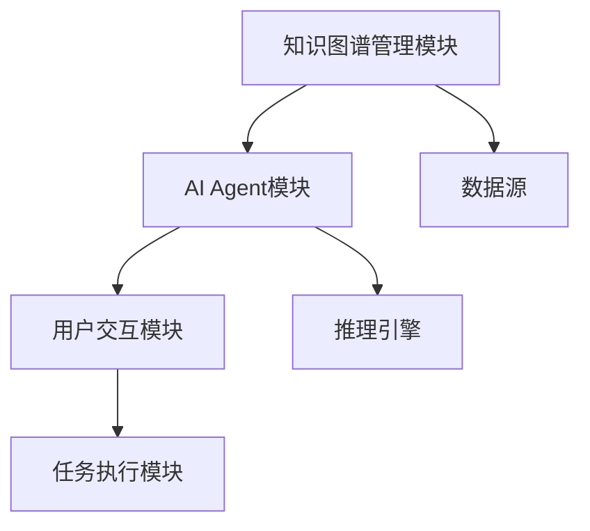
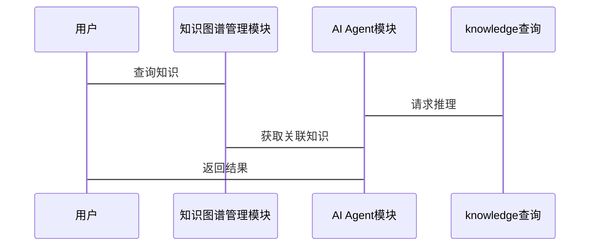

                 


# 企业知识图谱与AI Agent的深度融合应用

> 关键词：知识图谱、AI Agent、企业应用、深度融合、算法原理、系统架构、项目实战

> 摘要：本文探讨了企业知识图谱与AI Agent的深度融合应用，分析了知识图谱与AI Agent的核心概念、算法原理、系统架构设计、项目实战以及最佳实践。通过详细的技术分析和实际案例，展示了如何将知识图谱与AI Agent结合，为企业提供智能化的知识管理与决策支持。

---

## 第一部分: 知识图谱与AI Agent的背景与概念

### 第1章: 知识图谱与AI Agent的概述

#### 1.1 问题背景
- **企业的知识管理挑战**：企业在信息爆炸的时代，如何高效管理、利用海量知识，成为一个关键问题。
- **AI Agent在企业中的应用需求**：AI Agent作为智能助手，能够自动化处理任务、提供决策支持，成为企业数字化转型的重要工具。
- **知识图谱与AI Agent的结合意义**：知识图谱提供结构化的知识表示，AI Agent利用这些知识进行智能推理和决策，两者的结合能够显著提升企业的智能化水平。

#### 1.2 问题描述
- **企业知识管理的痛点**：知识分散、难以检索、缺乏深度理解。
- **AI Agent在企业中的应用场景**：自动化任务处理、智能问答、决策支持、个性化推荐等。
- **知识图谱与AI Agent融合的目标**：构建智能化的知识管理系统，提升企业的效率和竞争力。

#### 1.3 问题解决
- **知识图谱的构建与应用**：通过数据抽取、关联建立和知识推理，构建企业内部的知识图谱。
- **AI Agent的核心功能与实现**：包括感知环境、知识推理、任务执行、自我学习等功能。
- **知识图谱与AI Agent的融合方式**：通过知识图谱提供知识支持，AI Agent利用知识图谱进行推理和决策。

#### 1.4 边界与外延
- **知识图谱的边界**：专注于结构化知识的表示与管理，不涉及具体业务逻辑。
- **AI Agent的边界**：专注于任务执行和决策支持，依赖于外部知识源（如知识图谱）进行工作。
- **知识图谱与AI Agent的外延**：扩展到知识图谱的应用领域（如医疗、金融）和AI Agent的多样化应用场景。

#### 1.5 概念结构与核心要素
- **知识图谱的构成要素**：实体、属性、关系、事件。
- **AI Agent的构成要素**：感知模块、推理模块、执行模块、学习模块。
- **两者的关联关系**：知识图谱为AI Agent提供知识支持，AI Agent为知识图谱提供动态更新能力。

---

### 第2章: 知识图谱与AI Agent的核心概念对比

#### 2.1 核心概念对比
| 比较维度 | 知识图谱 | AI Agent |
|----------|----------|----------|
| 核心目标 | 表示和管理知识 | 执行任务和提供决策支持 |
| 技术实现 | 图结构、知识抽取、推理 | 机器学习、自然语言处理、强化学习 |
| 应用场景 | 智能搜索、知识问答 | 个性化推荐、自动化任务处理 |

#### 2.2 ER实体关系图
```mermaid
er
actor(Agent, KnowledgeGraph) {
  Agent --> KnowledgeGraph: 使用
  KnowledgeGraph --> Agent: 提供
}
```

---

## 第二部分: 知识图谱与AI Agent的算法原理

### 第3章: 知识图谱的构建与算法

#### 3.1 知识图谱的构建流程
1. 数据抽取：从结构化数据（数据库）和非结构化数据（文本）中提取实体、关系和属性。
2. 数据清洗：去除噪声数据，确保数据的准确性和一致性。
3. 关系抽取：识别实体之间的关联关系。
4. 知识融合：将多源数据整合到一个统一的知识图谱中。
5. 知识推理：通过推理算法（如TransE、TransH）扩展知识图谱。

#### 3.2 知识图谱的表示学习
- **图嵌入算法**：将实体和关系映射到低维向量空间，常用算法包括TransE、TransH、RotatE等。
- **数学公式**：以TransE为例，损失函数为：
  $$ L = \sum_{(h,r,t) \in \mathcal{D}} (||h + r - t||^2) $$

#### 3.3 知识图谱的存储与查询
- **存储方式**：使用图数据库（如Neo4j）或关系型数据库。
- **查询方式**：通过SPARQL进行语义查询。

### 第4章: AI Agent的核心算法

#### 4.1 知识推理算法
- **基于规则的推理**：通过预定义的逻辑规则进行推理。
- **基于机器学习的推理**：利用神经网络（如RNN、Transformer）进行知识推理。
- **数学公式**：以Transformer为例，注意力机制公式为：
  $$ \text{Attention}(Q, K, V) = \text{softmax}\left(\frac{QK^T}{\sqrt{d_k}}\right)V $$

#### 4.2 强化学习算法
- **马尔可夫决策过程（MDP）**：定义状态、动作、奖励和策略。
- **算法实现**：使用Q-Learning或Deep Q-Network（DQN）进行任务执行。
- **数学公式**：Q-Learning的更新公式为：
  $$ Q(s,a) = Q(s,a) + \alpha (r + \gamma \max Q(s',a') - Q(s,a)) $$

---

## 第三部分: 企业知识图谱与AI Agent的系统架构设计

### 第5章: 系统架构设计

#### 5.1 系统功能设计
- **知识图谱管理模块**：负责知识图谱的构建、存储和更新。
- **AI Agent模块**：包括感知模块（自然语言处理）、推理模块（知识推理）、执行模块（任务执行）。
- **用户交互模块**：提供人机交互界面，支持用户与AI Agent的交互。

#### 5.2 系统架构图


#### 5.3 系统接口设计
- **知识图谱接口**：提供知识查询、关联推理接口。
- **AI Agent接口**：提供任务执行、智能问答接口。

#### 5.4 系统交互流程


---

## 第四部分: 企业知识图谱与AI Agent的项目实战

### 第6章: 项目实战

#### 6.1 环境安装
- **工具安装**：安装Python、TensorFlow、Keras、Neo4j。
- **依赖库安装**：pip install neo4j、networkx、spacy。

#### 6.2 核心代码实现
##### 知识图谱构建代码
```python
from neo4j import GraphDatabase
from spacy.lang.zh import Chinese

# 知识抽取代码
def extract_entities(text):
    nlp = Chinese()
    doc = nlp(text)
    entities = [ent.label_ for ent in doc.ents]
    return entities

# 知识图谱存储代码
def store_kg(entities, relationships):
    driver = GraphDatabase.driver("bolt://localhost:7687", auth=("user", "password"))
    with driver.session() as session:
        session.run("CREATE (n:Entity {name: $name})", name=entities[0])
        session.run("CREATE (r:Relationship {name: $name})", name=relationships[0])
    driver.close()
```

##### AI Agent实现代码
```python
from transformers import pipeline

# 智能问答代码
def question_answering(question):
    qa_pipeline = pipeline("question-answering", model="deepset/roberta-base-squad2")
    answer = qa_pipeline(question=question, context="知识图谱中的上下文")[0]['answer']
    return answer

# 任务执行代码
def execute_task(task):
    # 实现具体的任务执行逻辑
    pass
```

#### 6.3 案例分析
- **案例背景**：某企业希望通过知识图谱与AI Agent的结合，实现智能问答和任务自动化。
- **实施步骤**：
  1. 数据采集与预处理。
  2. 知识图谱构建与存储。
  3. AI Agent训练与部署。
  4. 系统集成与测试。

---

## 第五部分: 企业知识图谱与AI Agent的优化与扩展

### 第7章: 最佳实践

#### 7.1 小结
- 知识图谱与AI Agent的深度融合，能够显著提升企业的知识管理与智能化水平。
- 通过构建知识图谱，AI Agent能够更高效地理解和执行任务。

#### 7.2 注意事项
- 知识图谱的构建需要考虑数据质量和多样性。
- AI Agent的训练需要结合企业的具体场景和需求。
- 系统架构设计需要考虑扩展性与可维护性。

#### 7.3 拓展阅读
- 推荐阅读《知识图谱构建与应用》和《AI Agent的原理与实践》。
- 关注领域内的最新技术动态，如大语言模型（LLM）与知识图谱的结合。

---

通过以上步骤，企业可以系统地构建知识图谱，并将其与AI Agent深度融合，实现智能化的知识管理和决策支持。

