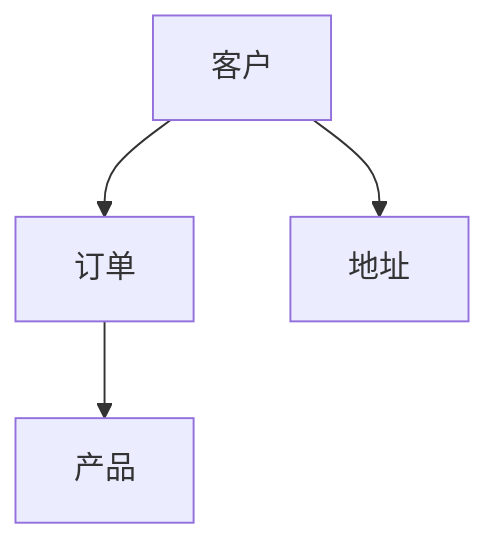
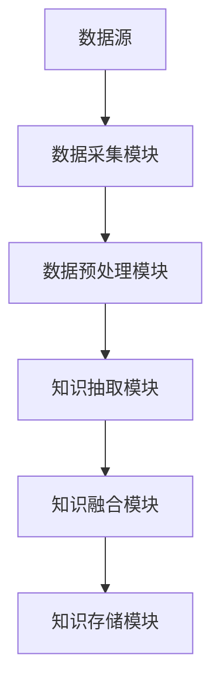

                 


# 企业知识图谱构建：增强AI Agent的领域理解

---

## 关键词：企业知识图谱、AI Agent、知识图谱构建、领域理解、知识融合、实体识别

---

## 摘要

随着人工智能技术的快速发展，知识图谱作为连接数据与智能应用的桥梁，正在成为企业智能化转型的关键技术之一。本篇文章将详细探讨企业知识图谱的构建过程，分析其在增强AI Agent领域理解中的重要作用。通过结合知识图谱的核心概念、构建算法、系统架构以及实际项目案例，本文旨在为企业技术从业者提供一套系统化的知识图谱构建方法论，帮助他们在实际应用中更好地理解和运用知识图谱技术。

---

## 第1章: 知识图谱概述

### 1.1 知识图谱的定义与背景

知识图谱是一种以结构化方式表示知识的技术，它通过实体和关系的形式，将分散的、非结构化的数据转化为可计算的、可理解的知识网络。知识图谱的核心在于将现实世界中的实体及其关系以图的形式表示出来，从而为机器提供类似人类的语义理解能力。

#### 问题背景
企业在日常运营中积累了大量的数据，包括客户信息、产品信息、供应链信息等。然而，这些数据往往分散在不同的系统中，缺乏统一的语义表示，导致企业在进行智能决策时难以充分利用这些数据的价值。

#### 问题解决
知识图谱通过将分散的数据进行结构化处理，构建出一个统一的知识网络，使得AI Agent能够更高效地理解和利用这些知识，从而提升企业的智能化水平。

#### 边界与外延
知识图谱的边界在于其构建的数据范围和应用场景，而外延则体现在其与自然语言处理、机器学习等技术的结合，以及在不同领域的应用拓展。

### 1.2 企业知识图谱的核心要素

知识图谱的核心要素包括：
- **实体**：现实世界中存在的具体事物，例如“客户”、“产品”、“订单”等。
- **关系**：实体之间的关联，例如“客户购买产品”。
- **属性**：实体的描述性特征，例如“产品的价格”、“客户的年龄”。

#### 实体与关系的联系
实体和关系是知识图谱的两大核心要素，实体通过关系连接起来，形成了知识图谱的图结构。

---

## 第2章: 知识图谱的核心概念与联系

### 2.1 知识图谱的核心概念

#### 实体与关系
- 实体是知识图谱的基本单元，表示现实世界中的具体事物。
- 关系是实体之间的联系，描述实体之间的互动或关联。

#### 属性
- 属性是对实体的描述，通常包括实体的名称、类型、数量等信息。

#### 实体关系图（Mermaid图示例）


### 2.2 实体与关系的对比

| **概念** | **实体** | **关系** |
|----------|----------|----------|
| 定义     | 表示现实世界中的具体事物 | 表示实体之间的关联 |
| 示例     | “客户”、“产品” | “购买”、“属于” |

---

## 第3章: 知识图谱的构建算法与原理

### 3.1 命名实体识别（NER）

#### 算法原理
NER的目标是将文本中的实体识别出来，并将其分类到预定义的类别中。常见的NER算法包括基于规则的方法、统计学习方法和深度学习方法。

#### 实现步骤
1. 数据预处理：对文本进行分词和标注。
2. 特征提取：提取文本的特征，如词性、位置信息等。
3. 模型训练：使用训练数据训练NER模型。
4. 实体识别：对新文本进行实体识别。

#### Python实现代码
```python
import spacy

# 加载预训练的NER模型
nlp = spacy.load("en_core_web_sm")

# 定义自定义实体类别
nlp.entity.add_label("ORG", "Organization")

# 定义自定义实体识别规则
def find_entities(doc):
    entities = []
    for ent in doc.ents:
        if ent.label_ == "ORG":
            entities.append((ent.start, ent.end, "ORG", ent.text))
    return entities

# 测试文本
text = "Apple is a company located in Cupertino."

# 文本处理
doc = nlp(text)
entities = find_entities(doc)

# 输出结果
for start, end, label, text in entities:
    print(f"Start: {start}, End: {end}, Label: {label}, Text: {text}")
```

#### 数学模型与公式
NER的训练通常基于条件随机场（CRF）模型，其概率计算公式为：
$$ P(y_i | x_i, y_{i-1}) $$

---

## 第4章: 系统架构与设计

### 4.1 知识图谱系统的模块划分

知识图谱系统通常包括以下几个模块：
- 数据采集模块：负责从各种数据源采集数据。
- 数据预处理模块：对数据进行清洗和转换。
- 知识抽取模块：从数据中提取实体、关系和属性。
- 知识融合模块：将抽取的知识进行融合和优化。
- 知识存储模块：将知识图谱存储在数据库中。

#### 系统架构设计（Mermaid图示例）


---

## 第5章: 项目实战

### 5.1 构建企业产品知识图谱

#### 环境安装
需要安装以下工具：
- Python 3.x
- spaCy
- Scikit-learn

#### 数据处理
1. 数据清洗：去除重复数据和噪声数据。
2. 数据标注：对数据进行实体标注。

#### 模型训练
1. 使用spaCy训练NER模型。
2. 使用Scikit-learn训练关系抽取模型。

#### 系统实现
1. 实体抽取模块：实现对产品实体的抽取。
2. 关系抽取模块：实现对产品关系的抽取。

---

## 第6章: 最佳实践与小结

### 6.1 小结

知识图谱的构建是一个复杂而重要的任务，它需要结合多种技术手段，包括数据处理、实体识别、关系抽取和知识融合等。通过构建知识图谱，企业可以更好地理解和利用其数据，从而提升其智能化水平。

### 6.2 注意事项

- 数据质量是知识图谱构建的关键，需要对数据进行充分的清洗和预处理。
- 在构建知识图谱时，需要考虑数据的扩展性和灵活性。
- 知识图谱的构建需要结合企业的实际需求，进行定制化设计。

### 6.3 拓展阅读

- 《知识图谱实战：从数据到语义网络》
- 《深度学习与知识图谱》

---

通过本文的介绍，读者可以系统地了解企业知识图谱的构建过程，掌握其在增强AI Agent领域理解中的重要作用。希望本文能够为企业技术从业者提供有价值的参考和启发。

