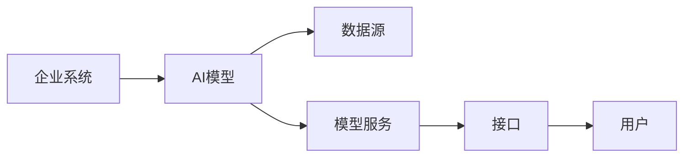

                 


# 《企业系统中AI模型的集成与部署》

## 关键词：
- 企业系统
- AI模型
- 集成与部署
- 算法原理
- 系统架构
- 项目实战

## 摘要：
本文将深入探讨企业系统中AI模型的集成与部署的关键步骤和方法。从背景介绍到核心概念，从算法原理到系统架构设计，再到项目实战，系统性地分析和解决企业系统中AI模型集成与部署的复杂问题。通过详细的技术分析和实际案例，帮助读者掌握AI模型在企业系统中的高效集成与部署方法，提升企业的智能化水平和核心竞争力。

---

# 第一部分: 企业系统中AI模型的集成与部署基础

## 第1章: 企业系统中AI模型的集成与部署概述

### 1.1 企业系统中AI模型的应用背景
- 1.1.1 AI模型在企业系统中的应用背景
  - AI技术对企业数字化转型的推动作用
  - 企业系统智能化升级的需求
  - AI模型在企业系统中的应用场景（如预测分析、自动化决策）

- 1.1.2 企业系统中AI模型的集成与部署的挑战
  - 技术复杂性：模型选择、数据准备、性能优化
  - 系统兼容性：与现有系统的接口对接
  - 资源限制：计算资源、存储资源的分配与优化

- 1.1.3 企业系统中AI模型的集成与部署的技术趋势
  - 轻量化模型：模型压缩、量化技术
  - 模型解释性：可解释AI的重要性
  - 自动化部署工具：减少人工干预，提高效率

### 1.2 企业系统中AI模型的集成与部署的核心概念
- 1.2.1 AI模型集成的定义与核心要素
  - 模型集成：将多个模型的结果进行融合，提升准确性和鲁棒性
  - 关键概念：投票法、加权平均法、堆叠模型

- 1.2.2 模型部署的定义与核心要素
  - 模型部署：将训练好的模型应用到实际业务系统中
  - 关键概念：API接口、微服务架构、容器化部署

- 1.2.3 企业系统中AI模型的集成与部署的边界与外延
  - 边界：模型的训练阶段与部署阶段的区分
  - 外延：模型的监控与维护

### 1.3 企业系统中AI模型的集成与部署的价值
- 1.3.1 提高企业系统的智能化水平
  - 实现自动化决策，提升业务效率
- 1.3.2 优化企业系统的运行效率
  - 通过模型预测减少资源浪费
- 1.3.3 提升企业的核心竞争力
  - 快速响应市场变化，提供个性化服务

### 1.4 本章小结
- 总结企业系统中AI模型的集成与部署的重要性和核心概念
- 引出后续章节的技术细节和实现方法

---

# 第二部分: 企业系统中AI模型的集成与部署的核心概念

## 第2章: 企业系统中AI模型的集成与部署的核心概念

### 2.1 企业系统中AI模型的集成与部署的核心概念
- 2.1.1 模型集成的核心概念
  - 基于概率的方法：如集成学习中的投票法和加权平均法
  - 基于模型结构的方法：如堆叠模型（Stacking、Blending）

- 2.1.2 模型部署的核心概念
  - API接口设计：定义模型输入和输出的格式
  - 微服务架构：将模型服务独立部署，便于扩展和维护
  - 容器化技术：使用Docker等技术实现模型的快速部署

- 2.1.3 企业系统中AI模型的集成与部署的核心要素
  - 数据流：数据输入、模型处理、结果输出
  - 计算资源：CPU/GPU资源分配
  - 网络通信：服务间的接口调用和数据传输

### 2.2 企业系统中AI模型的集成与部署的关键概念对比
- 2.2.1 模型集成与模型部署的对比
  | 对比维度 | 模型集成 | 模型部署 |
  |----------|----------|----------|
  | 目标     | 提高模型性能和稳定性 | 将模型应用于实际系统中 |
  | 实现方式 | 融合多个模型的结果 | 通过API或其他接口提供服务 |

- 2.2.2 企业系统中AI模型的集成与部署与其他AI技术的对比
  - 与机器学习算法的对比：集成与部署是机器学习的后续步骤
  - 与大数据处理的对比：集成与部署依赖于高效的数据处理能力

- 2.2.3 企业系统中AI模型的集成与部署的关键属性特征对比表格
  | 属性     | 集成阶段 | 部署阶段 |
  |----------|----------|----------|
  | 数据需求 | 高       | 中       |
  | 计算资源 | 高       | 高       |
  | 人员技能 | 高       | 中       |

### 2.3 企业系统中AI模型的集成与部署的ER实体关系图


### 2.4 本章小结
- 总结企业系统中AI模型的集成与部署的核心概念
- 强调关键概念对比和ER实体关系图的重要性

---

# 第三部分: 企业系统中AI模型的集成与部署的算法原理

## 第3章: 企业系统中AI模型的集成与部署的算法原理

### 3.1 企业系统中AI模型的集成与部署的算法原理
- 3.1.1 模型集成的算法原理
  - 基于概率的方法：投票法和加权平均法
  - 基于模型结构的方法：堆叠模型
  - 融合技术：如梯度提升模型（GBDT）和随机森林的集成

- 3.1.2 模型部署的算法原理
  - 模型压缩：减少模型的大小，降低计算成本
  - 模型量化：将模型中的参数从高精度转化为低精度，减少内存占用
  - 模型蒸馏：通过教师模型指导学生模型的训练，降低计算复杂度

- 3.1.3 企业系统中AI模型的集成与部署的算法原理对比
  - 比较模型集成和模型部署的算法复杂度和计算资源需求

### 3.2 企业系统中AI模型的集成与部署的算法流程图


### 3.3 企业系统中AI模型的集成与部署的算法实现
- 3.3.1 算法实现的Python代码示例
  ```python
  def model_integrate(models):
      # 简单投票法
      predictions = [model.predict(X) for model in models]
      result = majority_vote(predictions)
      return result
  ```

- 3.3.2 模型压缩与量化的技术实现
  - 使用深度压缩（Deep Compression）技术
  - 使用量化感知训练（Quantization-Aware Training）

- 3.3.3 模型蒸馏的具体实现
  - 教师模型和学生模型的定义
  - 知识蒸馏的损失函数设计

### 3.4 本章小结
- 总结企业系统中AI模型的集成与部署的算法原理
- 强调算法实现中的关键步骤和技术选型

---

# 第四部分: 企业系统中AI模型的集成与部署的系统架构

## 第4章: 企业系统中AI模型的集成与部署的系统架构

### 4.1 企业系统中AI模型的集成与部署的系统架构
- 4.1.1 系统分析与问题场景
  - 数据流分析：从数据源到模型服务再到用户反馈
  - 系统功能设计：API接口设计、模型服务管理、结果展示

- 4.1.2 系统功能设计
  - 使用Mermaid类图展示系统功能模块
  ```mermaid
  classDiagram
      class 用户 {
          id: int
          username: string
      }
      class 数据源 {
          data: list
      }
      class 模型服务 {
          model: Model
          predict(data): result
      }
      用户 --> 数据源
      数据源 --> 模型服务
      模型服务 --> 用户
  ```

- 4.1.3 系统架构设计
  - 分层架构：数据层、业务逻辑层、表示层
  - 微服务架构：模型服务独立部署
  - 使用容器化技术（如Docker）实现服务的快速部署和扩展

- 4.1.4 系统接口设计
  - RESTful API接口设计
  - 使用OpenAPI定义接口规范

- 4.1.5 系统交互流程设计
  - 使用Mermaid序列图展示用户与系统的交互流程
  ```mermaid
  sequenceDiagram
      participant 用户
      participant 模型服务
      用户->模型服务: 发送请求
      模型服务->数据源: 获取数据
      模型服务->用户: 返回结果
  ```

### 4.2 本章小结
- 总结企业系统中AI模型的集成与部署的系统架构设计
- 强调架构设计对系统性能和可扩展性的重要性

---

# 第五部分: 企业系统中AI模型的集成与部署的项目实战

## 第5章: 企业系统中AI模型的集成与部署的项目实战

### 5.1 项目背景与目标
- 项目背景：假设一个电商企业需要部署推荐系统
- 项目目标：通过集成多个推荐模型，提升用户购买率

### 5.2 项目环境搭建
- 安装必要的工具和库
  - Python环境：Python 3.8+
  - 深度学习框架：TensorFlow/PyTorch
  - 集成学习库：Scikit-learn
  - 容器化工具：Docker
  - 服务部署工具：Kubernetes

### 5.3 项目核心实现
- 5.3.1 模型集成实现
  - 使用集成学习库Scikit-learn实现投票法集成
  ```python
  from sklearn.ensemble import VotingClassifier
  clf1 = SVC()
  clf2 = RandomForestClassifier()
  clf3 = LogisticRegression()
  voting_clf = VotingClassifier(estimators=[('clf1', clf1), ('clf2', clf2), ('clf3', clf3)])
  ```

- 5.3.2 模型部署实现
  - 使用Flask构建API接口
  ```python
  from flask import Flask, request, jsonify
  app = Flask(__name__)
  @app.route('/predict', methods=['POST'])
  def predict():
      data = request.json['data']
      result = model.predict(data)
      return jsonify({'result': result})
  ```

- 5.3.3 模型监控与维护
  - 使用Prometheus监控服务状态
  - 日志收集与分析（ELK stack）

### 5.4 项目小结
- 总结项目实现的关键步骤和经验教训
- 强调模型监控与维护的重要性

---

# 第六部分: 企业系统中AI模型的集成与部署的最佳实践

## 第6章: 企业系统中AI模型的集成与部署的最佳实践

### 6.1 企业系统中AI模型的集成与部署的最佳实践
- 6.1.1 小结
  - 总结企业系统中AI模型的集成与部署的关键点
  - 强调算法选择、系统架构设计和项目管理的重要性

- 6.1.2 注意事项
  - 模型选择：根据业务需求选择合适的模型
  - 数据处理：确保数据质量和完整性
  - 系统性能优化：合理分配计算资源

- 6.1.3 拓展阅读
  - 推荐相关书籍和论文
  - 提供在线课程和培训资源

### 6.2 本章小结
- 总结企业系统中AI模型的集成与部署的最佳实践
- 强调实际应用中的注意事项和拓展学习的重要性

---

# 附录

## 附录A: 企业系统中AI模型的集成与部署的数学公式

## 附录B: 企业系统中AI模型的集成与部署的代码示例

## 附录C: 企业系统中AI模型的集成与部署的参考文献

---

# 结束语

通过本文的详细讲解，读者可以系统性地掌握企业系统中AI模型的集成与部署的关键技术与方法。从理论到实践，从概念到实现，全面解析企业系统中AI模型的集成与部署的复杂问题，为企业智能化转型提供有力支持。

