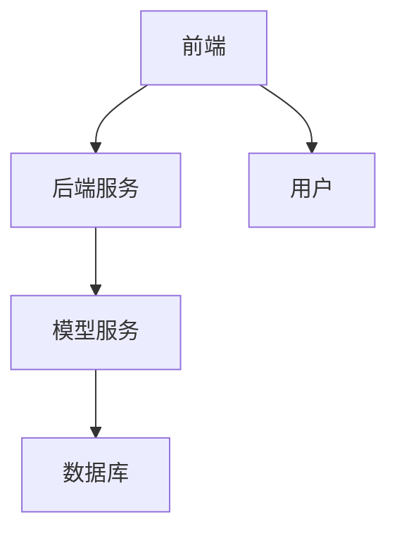
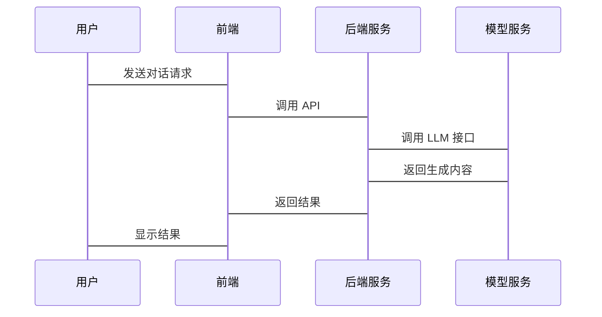

                 


# 企业级 AI Agent 开发：LLM 在商业场景中的落地

> 关键词：企业级 AI Agent、大语言模型、LLM、商业场景、AI 开发、技术落地

> 摘要：本文将深入探讨企业级 AI Agent 的开发与应用，重点分析大语言模型（LLM）在商业场景中的落地过程。通过详细的技术分析、系统架构设计和实际项目案例，阐述如何将 LLM 技术应用于企业级 AI Agent 的开发中，解决实际商业问题，提升企业效率与竞争力。

---

## 第一部分: 企业级 AI Agent 的背景与概述

### 第1章: 企业级 AI Agent 的定义与背景

#### 1.1 什么是企业级 AI Agent
- **1.1.1 AI Agent 的定义与特点**
  - AI Agent 是一种智能体，能够感知环境、自主决策并执行任务。
  - 特点：智能性、自主性、反应性、社交性。

- **1.1.2 企业级 AI Agent 的概念与特点**
  - 企业级 AI Agent 是部署在企业环境中的智能体，用于解决特定商业问题。
  - 特点：企业级、任务导向性、高效性。

- **1.1.3 企业级 AI Agent 的核心价值**
  - 提升企业效率：自动化处理复杂任务。
  - 优化决策：基于数据和模型提供决策支持。
  - 创新商业模式：为企业创造新的商业机会。

#### 1.2 企业级 AI Agent 的发展现状
- **1.2.1 AI Agent 技术的发展历程**
  - 从简单规则引擎到复杂的大语言模型。
  - 技术进步：从基于规则到基于深度学习的转变。

- **1.2.2 企业级 AI Agent 的应用现状**
  - 客户服务：智能客服机器人。
  - 业务流程自动化：自动化审批、数据分析。
  - 内部管理：智能助手、资源分配。

- **1.2.3 当前技术的瓶颈与挑战**
  - 数据隐私与安全问题。
  - 模型的可解释性。
  - 企业级应用中的性能优化。

#### 1.3 企业级 AI Agent 的商业价值
- **1.3.1 提升企业效率与决策能力**
  - 自动化处理重复性任务。
  - 提供实时数据分析与决策支持。

- **1.3.2 优化企业流程与资源配置**
  - 简化流程：减少人工干预。
  - 提高资源利用率：智能分配资源。

- **1.3.3 创新商业模式与客户体验**
  - 提供个性化服务：提升客户满意度。
  - 创新商业模式：基于 AI 的新业务模式。

### 第2章: LLM 在企业级 AI Agent 中的角色

#### 2.1 大语言模型（LLM）的概述
- **2.1.1 LLM 的定义与技术特点**
  - LLM 是一种基于深度学习的自然语言处理模型。
  - 特点：大规模训练数据、多任务学习能力。

- **2.1.2 LLM 的核心优势与局限性**
  - 优势：强大的语言理解和生成能力。
  - 局限性：数据隐私、计算资源需求大。

- **2.1.3 LLM 在 AI Agent 中的应用场景**
  - 对话交互：智能客服、用户交互。
  - 任务执行：自动化处理、数据分析。

#### 2.2 LLM 与 AI Agent 的结合
- **2.2.1 LLM 作为 AI Agent 的核心驱动力**
  - LLM 提供强大的语言理解和生成能力。
  - 支持多轮对话，提升用户体验。

- **2.2.2 LLM 在对话交互中的应用**
  - 实时对话：智能客服、用户助手。
  - 多语言支持：跨语言交流。

- **2.2.3 LLM 在任务执行中的应用**
  - 自动化处理：文档生成、数据录入。
  - 决策支持：数据分析、预测模型。

#### 2.3 企业级 AI Agent 中的 LLM 落地挑战
- **2.3.1 数据隐私与安全问题**
  - 数据泄露风险。
  - 数据加密与匿名化处理。

- **2.3.2 模型的可解释性问题**
  - 黑箱模型的决策过程难以解释。
  - 提高模型的透明度与可解释性。

- **2.3.3 企业级应用中的性能优化**
  - 高并发场景下的性能优化。
  - 模型压缩与推理优化。

---

## 第二部分: LLM 在企业级 AI Agent 中的核心技术

### 第3章: LLM 的算法原理与数学模型

#### 3.1 大语言模型的训练原理
- **3.1.1 Transformer 模型的结构与特点**
  - Transformer 的基本结构：编码器和解码器。
  - 注意力机制：关键点在于计算序列中每个词的重要性。

- **3.1.2 注意力机制的数学公式与实现**
  - 注意力机制的公式：
    $$
    \text{Attention}(Q, K, V) = \text{softmax}\left(\frac{QK^T}{\sqrt{d_k}}\right)V
    $$
  - 其中，$Q$ 是查询向量，$K$ 是键向量，$V$ 是值向量，$d_k$ 是向量维度。

- **3.1.3 梯度下降与优化算法**
  - 常用优化算法：Adam、SGD。
  - 梯度下降的基本原理：通过调整参数减少损失函数。

#### 3.2 LLM 的生成机制
- **3.2.1 解码过程与概率生成**
  - 解码过程：从输入到输出的生成过程。
  - 概率生成：基于条件概率生成文本。

- **3.2.2 采样方法与生成策略**
  - 采样方法：随机采样、贪婪采样、温度采样。
  - 生成策略：最大化似然、最小化困惑。

- **3.2.3 模型的可解释性分析**
  - 可解释性工具：attention 层解码、可视化工具。
  - 提高可解释性的方法：简化模型、引入可解释性层。

#### 3.3 LLM 的数学模型与公式
- **3.3.1 Transformer 模型的数学公式**
  - 编码器：
    $$
    \text{Encoder} = \text{LayerNorm}( \text{MultiHeadAttention}( \text{Input}) + \text{Input} )
    $$
  - 解码器：
    $$
    \text{Decoder} = \text{LayerNorm}( \text{MultiHeadAttention}( \text{Encoder}, \text{Decoder}) + \text{Decoder} )
    $$

- **3.3.2 注意力机制的详细推导**
  - 查询向量 $Q$ 和键向量 $K$ 的计算：
    $$
    Q = W_q x, \quad K = W_k x
    $$
  - 注意力权重计算：
    $$
    \text{Attention}(Q, K) = \text{softmax}\left(\frac{QK^T}{\sqrt{d_k}}\right)
    $$

- **3.3.3 梯度下降的优化过程**
  - 损失函数计算：
    $$
    \mathcal{L} = -\sum_{i=1}^n y_i \log p(y_i)
    $$
  - 参数更新：
    $$
    \theta_{t+1} = \theta_t - \eta \nabla_\theta \mathcal{L}
    $$

---

## 第三部分: 企业级 AI Agent 的系统架构设计

### 第4章: 企业级 AI Agent 的系统架构

#### 4.1 系统架构设计原则
- **模块化设计**：系统分为前端、后端和模型服务。
- **高可用性**：确保系统在高并发场景下的稳定运行。
- **可扩展性**：支持模型和功能的动态扩展。

#### 4.2 系统功能设计
- **用户交互层**：对话界面、任务提交。
- **业务逻辑层**：任务处理、数据查询。
- **模型服务层**：LLM 接口调用、结果解析。

#### 4.3 系统架构图


#### 4.4 系统接口设计
- **API 接口**：
  - POST /api/v1/chat：发送对话请求。
  - GET /api/v1/results：获取任务结果。

#### 4.5 系统交互流程


---

## 第四部分: 企业级 AI Agent 的项目实战

### 第5章: 项目实战与案例分析

#### 5.1 环境配置
- **开发环境**：Python 3.8+
- **依赖库**： transformers、numpy、flask
- **安装命令**：
  ```bash
  pip install transformers numpy flask
  ```

#### 5.2 核心代码实现
- **模型加载**：
  ```python
  from transformers import AutoTokenizer, AutoModelForCausalLM
  model_name = "gpt2"
  tokenizer = AutoTokenizer.from_pretrained(model_name)
  model = AutoModelForCausalLM.from_pretrained(model_name)
  ```

- **对话交互实现**：
  ```python
  def generate_response(prompt):
      inputs = tokenizer.encode(prompt, return_tensors="pt")
      outputs = model.generate(inputs, max_length=50, do_sample=True)
      response = tokenizer.decode(outputs[0], skip_special_tokens=True)
      return response
  ```

#### 5.3 案例分析
- **场景**：智能客服对话系统。
- **实现步骤**：
  1. 用户发送问题。
  2. 系统调用 LLM 生成回答。
  3. 返回结果给用户。

---

## 第五部分: 总结与未来展望

### 第6章: 总结与未来展望

#### 6.1 最佳实践 tips
- **数据安全**：确保数据的隐私与安全。
- **模型优化**：优化模型性能，降低资源消耗。
- **用户体验**：注重用户体验，提升交互流畅性。

#### 6.2 小结
- 企业级 AI Agent 的开发需要结合 LLM 的强大能力，同时解决实际应用中的挑战。
- 通过模块化设计和系统优化，可以实现高效、稳定的商业应用。

#### 6.3 注意事项
- **数据隐私**：严格遵守数据保护法规。
- **模型可解释性**：确保模型决策过程的透明性。
- **性能优化**：在高并发场景下优化系统性能。

#### 6.4 未来展望
- **多模态 AI Agent**：结合视觉、听觉等多模态信息。
- **更强大的 LLM**：更大规模的模型和更先进的算法。
- **行业深度应用**：在更多行业场景中落地应用。

---

以上是《企业级 AI Agent 开发：LLM 在商业场景中的落地》的技术博客文章大纲，涵盖了从理论到实践的各个方面，确保内容详实、逻辑清晰。希望对您有所帮助！

