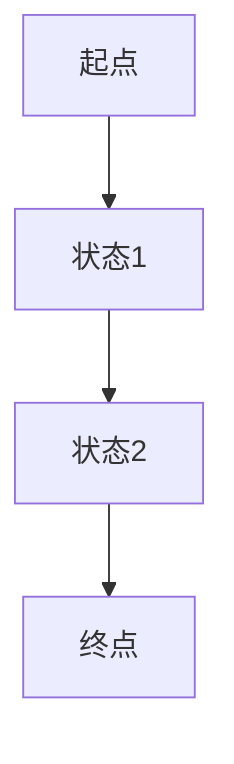
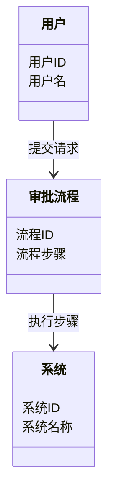
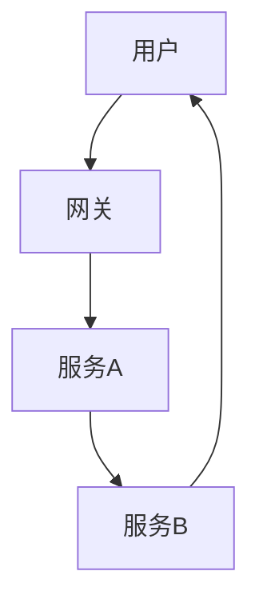
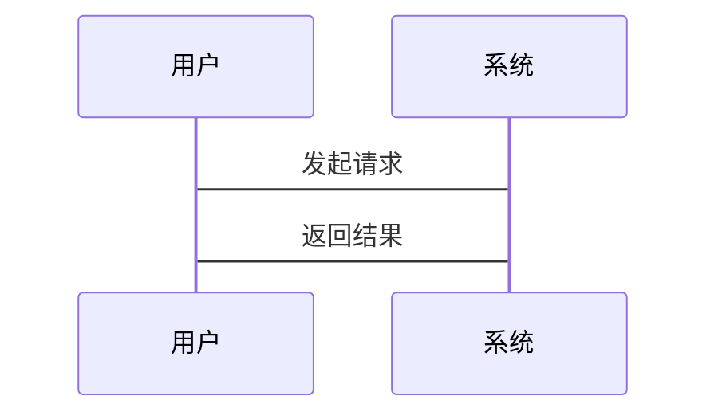

                 


# 企业级AI Agent开发：从需求分析到部署的全流程指南

## 关键词：企业级AI Agent、AI开发、系统架构、算法原理、项目实战

## 摘要：  
企业级AI Agent是人工智能技术在企业应用中的重要实现形式，本文从需求分析、算法实现到系统架构设计、项目实战等多方面，全面解析企业级AI Agent开发的全流程。通过详细讲解核心概念、算法原理和系统架构，结合实际案例，为企业开发者提供一份完整的开发指南。

---

## 第一部分: 企业级AI Agent开发概述

### 第1章: 企业级AI Agent开发背景与概念

#### 1.1 AI Agent的基本概念  
AI Agent（人工智能代理）是一种能够感知环境、自主决策并执行任务的智能体。它不同于传统程序，具有以下核心要素：  
1. **自主性**：能够在没有外部干预的情况下独立运行。  
2. **反应性**：能够实时感知环境并做出反应。  
3. **目标导向**：具有明确的目标，并通过行为实现目标。  
4. **学习能力**：能够通过经验优化自身行为。  

AI Agent与传统程序的区别可以用以下表格对比：

| 属性          | 传统程序         | AI Agent       |
|---------------|-----------------|----------------|
| 执行方式      | 被动执行         | 主动执行         |
| 决策方式      | 硬编码规则       | 自主决策         |
| 适应能力      | 固定             | 可动态调整       |
| 学习能力      | 无               | 有               |

---

#### 1.2 AI Agent的发展历程  
AI Agent的概念可以追溯到20世纪60年代的专家系统研究。随着技术的发展，AI Agent经历了以下几个阶段：  
1. **早期阶段**：基于规则的简单AI Agent，主要用于解决特定问题。  
2. **发展阶段**：引入了机器学习技术，AI Agent能够通过数据优化决策。  
3. **当前阶段**：结合大模型技术，AI Agent具备更强的自然语言处理和决策能力。  

---

#### 1.3 企业级AI Agent的应用场景  
企业级AI Agent广泛应用于以下场景：  
1. **内部流程自动化**：优化企业内部的审批、调度等流程。  
2. **客户服务与支持**：通过智能客服机器人与用户交互。  
3. **数据分析与决策支持**：基于大数据分析提供决策支持。  

---

## 第二部分: 企业级AI Agent的核心概念与原理

### 第2章: AI Agent的核心概念与联系  

#### 2.1 AI Agent的概念属性对比  
AI Agent的核心属性可以通过以下对比表理解：

| 属性          | 机器人流程自动化（RPA）   | 大模型         |
|---------------|--------------------------|---------------|
| 核心能力      | 任务自动化               | 自然语言处理   |
| 决策能力      | 基于规则                | 基于概率模型   |
| 学习能力      | 无                       | 有             |

---

#### 2.2 AI Agent的实体关系图  
AI Agent的实体关系可以通过以下Mermaid图表示：

```mermaid
erDiagram
    actor 用户 {
        string 用户ID
        string 用户名
    }
    actor 系统 {
        string 系统ID
        string 系统名称
    }
    relation 调用 {
        用户 --> 系统 : 发起请求
        系统 --> 用户 : 返回结果
    }
```

---

## 第三部分: AI Agent开发的算法原理  

### 第3章: AI Agent的核心算法原理  

#### 3.1 问题建模与状态空间表示  
问题建模是AI Agent开发的第一步。以下是一个简单的状态空间表示示例：



---

#### 3.2 AI Agent的决策算法  

##### 3.2.1 基于规则的决策算法  
规则可以简单表示为：

$$
\text{如果条件} \quad \text{满足} \quad \text{则执行操作}
$$

##### 3.2.2 基于强化学习的决策算法  
强化学习的基本公式如下：

$$
Q(s, a) = r + \gamma \cdot \max Q(s', a')
$$

其中：  
- \( s \) 表示当前状态  
- \( a \) 表示动作  
- \( r \) 表示奖励  
- \( \gamma \) 表示折扣因子  
- \( Q(s', a') \) 表示下一个状态的最大值  

---

#### 3.3 算法实现的数学模型  

##### 3.3.1 强化学习数学模型  
强化学习的数学模型可以表示为：

$$
V(s) = \max_{a} \left( r + \gamma V(s') \right)
$$

其中：  
- \( V(s) \) 表示状态 \( s \) 的价值  
- \( s' \) 表示下一个状态  

---

## 第四部分: 企业级AI Agent的系统架构设计  

### 第4章: 系统分析与架构设计方案  

#### 4.1 项目背景与目标  
项目背景：企业希望通过AI Agent优化内部流程。  
项目目标：实现一个能够自动处理审批流程的AI Agent系统。  

---

#### 4.2 系统功能设计  

##### 4.2.1 领域模型  
领域模型可以通过以下Mermaid类图表示：



---

#### 4.3 系统架构设计  

##### 4.3.1 架构图  
系统架构可以通过以下Mermaid图表示：



---

#### 4.4 系统交互设计  

##### 4.4.1 序列图  
系统交互可以通过以下Mermaid序列图表示：



---

## 第五部分: 项目实战  

### 第5章: 项目实战  

#### 5.1 环境安装  
开发环境：Python 3.8+，安装必要的库：  
```bash
pip install numpy matplotlib
```

---

#### 5.2 核心代码实现  

##### 5.2.1 强化学习代码示例  
```python
import numpy as np

class AI-Agent:
    def __init__(self, state_space, action_space):
        self.state_space = state_space
        self.action_space = action_space
        self.Q = np.zeros((state_space, action_space))

    def choose_action(self, state):
        return np.argmax(self.Q[state])

    def update_Q(self, state, action, reward, next_state):
        self.Q[state, action] = reward + 0.9 * np.max(self.Q[next_state])
```

---

#### 5.3 案例分析  
案例：自动审批流程AI Agent。  
实现步骤：  
1. 定义状态空间和动作空间。  
2. 初始化Q表。  
3. 训练AI Agent。  
4. 部署到实际系统中。  

---

## 第六部分: 总结  

### 第6章: 总结与展望  

#### 6.1 本章总结  
本文详细介绍了企业级AI Agent开发的全流程，从概念到实现，从理论到实践，为企业开发者提供了一套完整的开发指南。

#### 6.2 注意事项  
1. 确保数据安全和隐私保护。  
2. 选择合适的算法和工具。  
3. 注重系统的可扩展性和可维护性。  

#### 6.3 拓展阅读  
推荐阅读《人工智能：一种现代方法》和《深度学习》等书籍，以深入理解AI Agent的核心原理。

---

## 附录: AI Agent开发资源  

1. 开源库：  
   - OpenAI Gym  
   - TensorFlow  
   - PyTorch  

2. 在线课程：  
   - Coursera：《人工智能基础》  
   - edX：《深度学习专项》  

3. 工具：  
   - VS Code  
   - PyCharm  

---

**结束**

