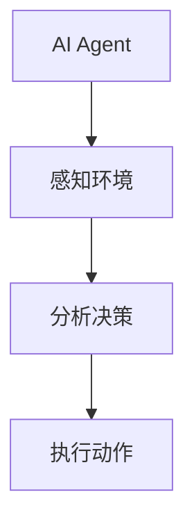
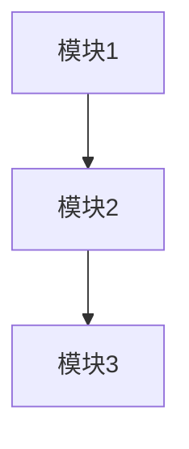
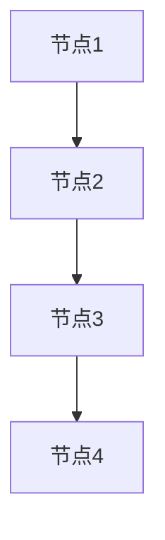
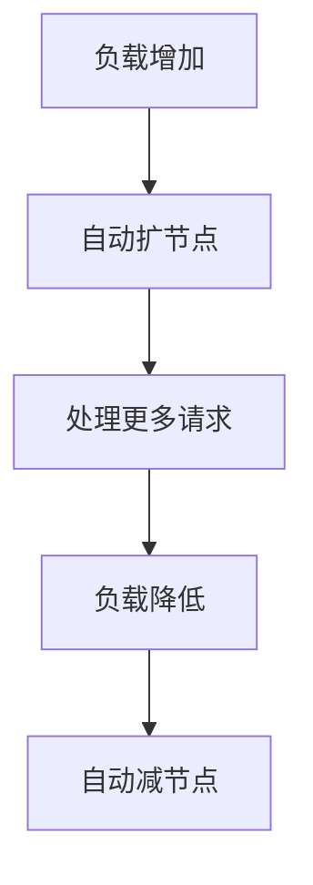
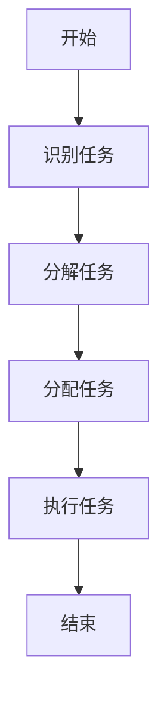
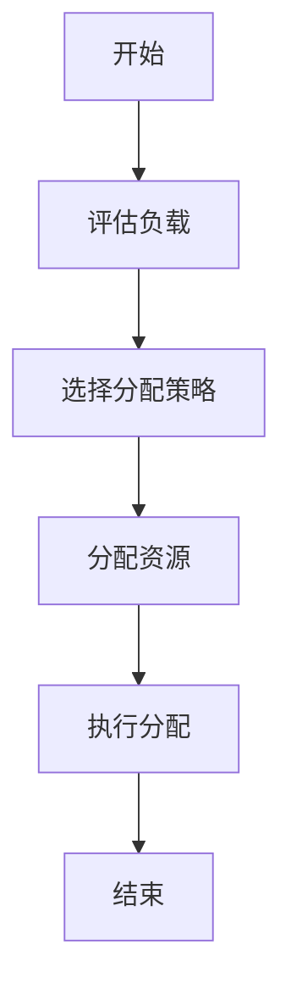
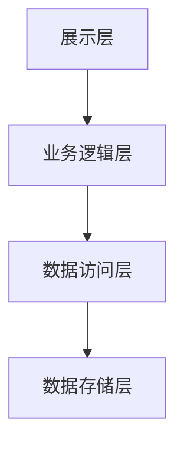
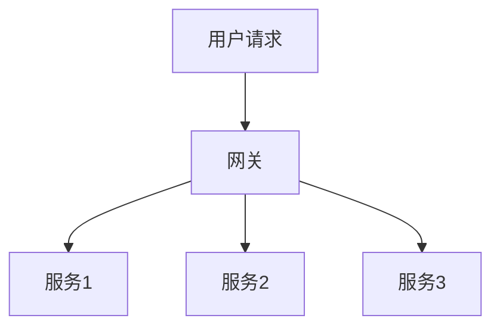

                 


# 《企业级AI Agent的可扩展性设计》

## 关键词：AI Agent, 可扩展性设计, 系统架构, 算法原理, 企业级应用

## 摘要：本文深入探讨企业级AI Agent的可扩展性设计，分析其核心概念、系统架构、算法原理及数学模型，通过实例展示其实现过程，并总结最佳实践，为企业级AI Agent的高效设计提供指导。

---

## 第1章: AI Agent的基本概念与问题背景

### 1.1 AI Agent的定义与类型

#### 1.1.1 什么是AI Agent
AI Agent（人工智能代理）是能够感知环境并采取行动以实现目标的智能实体。它通过传感器获取信息，利用推理机制分析数据，执行动作以达成目标。

**图1.1: AI Agent的基本概念**



AI Agent的类型多样，按智能水平可分为：
1. **反应式AI Agent**：实时响应环境变化，适用于需要快速反应的任务。
2. **认知式AI Agent**：具备复杂推理和规划能力，适用于复杂决策场景。
3. **协作式AI Agent**：能够与其他Agent或人类协同工作，提升整体效率。

#### 1.1.2 AI Agent的类型
- **基于规则的AI Agent**：通过预定义规则进行决策，适用于简单场景。
- **基于模型的AI Agent**：利用知识库和推理机制进行复杂决策，适用于复杂任务。
- **基于学习的AI Agent**：通过机器学习算法自我改进，适用于需要自适应的场景。

#### 1.1.3 企业级AI Agent的特点
- **高可用性**：确保系统在高负载下的稳定运行。
- **可扩展性**：支持业务需求的增长，灵活扩展资源。
- **高可靠性**：在复杂环境下仍能准确执行任务。

---

### 1.2 可扩展性设计的必要性

#### 1.2.1 企业级系统的特点
企业级AI Agent需要处理海量数据，支持高并发请求，且系统规模可能随业务增长而扩展。因此，可扩展性设计至关重要。

#### 1.2.2 可扩展性在AI Agent中的重要性
- **资源利用率**：合理分配计算资源，避免浪费。
- **性能优化**：提升系统处理能力，降低响应时间。
- **业务连续性**：确保系统在扩展过程中不中断服务。

#### 1.2.3 问题背景与目标
企业在数字化转型中，AI Agent的应用日益广泛。如何设计可扩展的AI Agent，以应对日益增长的业务需求，成为技术挑战。本文旨在探讨可扩展性设计的关键因素，为企业级AI Agent的开发提供指导。

---

## 第2章: 可扩展性设计的核心原理

### 2.1 可扩展性设计的原理

#### 2.1.1 模块化设计
模块化设计将系统分解为独立模块，每个模块负责特定功能。通过模块化，可以提高系统的可维护性和可扩展性。

**图2.1: 模块化设计示例**



模块化设计的优点：
1. **独立性**：模块之间相对独立，修改一个模块不影响其他模块。
2. **可扩展性**：新增功能只需添加新模块，不影响现有系统。
3. **可维护性**：每个模块的功能单一，便于维护和升级。

#### 2.1.2 分布式架构
分布式架构将系统功能分散到多个节点，通过通信机制协同工作。适用于处理高并发和大规模数据的场景。

**图2.2: 分布式架构示例**



分布式架构的优点：
1. **负载均衡**：通过分摊任务，减少单点负载。
2. **容错性**：某个节点故障，其余节点仍能继续工作。
3. **可扩展性**：根据需求轻松添加新节点。

#### 2.1.3 弹性设计
弹性设计允许系统根据负载动态调整资源。通过自动扩缩容，确保系统在不同负载下都能高效运行。

**图2.3: 弹性设计示例**



弹性设计的优点：
1. **成本优化**：按需使用资源，避免资源浪费。
2. **性能优化**：在高峰期自动增加资源，提升处理能力。
3. **灵活性**：根据需求快速调整系统规模。

---

### 2.2 核心概念与属性对比

#### 2.2.1 核心概念的属性对比表

| 概念         | 特性                   |
|--------------|------------------------|
| 模块化设计    | 独立性，可维护性         |
| 分布式架构    | 负载均衡，容错性         |
| 弹性设计      | 动态调整，资源优化       |

#### 2.2.2 ER实体关系图

**图2.4: 系统组件ER图**

```mermaid
erd
    actor 用户
    actor 管理员
    actor 第三方服务
    database 系统数据库
    service AI Agent服务
    component 模块1
    component 模块2
```

---

## 第3章: 算法原理与数学模型

### 3.1 任务分解算法

#### 3.1.1 任务分解流程

**图3.1: 任务分解流程图**



任务分解算法的步骤：
1. **识别任务**：分析任务目标，确定需要分解的子任务。
2. **分解任务**：将主任务分解为多个子任务，确保每个子任务独立且可执行。
3. **分配任务**：根据资源情况，将子任务分配给不同的模块或节点。
4. **执行任务**：各模块按分配的任务执行，确保整体目标的实现。

#### 3.1.2 任务优先级排序

任务优先级排序算法如下：

**代码示例：任务优先级排序**

```python
def task_priority_sort(tasks):
    # 任务结构：{'task_id': int, 'priority': int, 'deadline': datetime}
    return sorted(tasks, key=lambda x: (x['priority'], x['deadline']))
```

通过优先级排序，确保高优先级任务优先执行，提升系统效率。

---

### 3.2 资源分配算法

#### 3.2.1 资源分配策略

资源分配算法如下：

**图3.2: 资源分配流程图**



资源分配策略包括：
1. **轮询分配**：按顺序分配资源，确保公平。
2. **负载均衡**：根据当前负载动态分配资源。
3. **优先级分配**：优先分配给高优先级任务。

#### 3.2.2 负载均衡算法

负载均衡算法实现：

**代码示例：负载均衡算法**

```python
def load_balancing(nodes, tasks):
    # nodes：列表，每个节点的负载
    # tasks：待分配的任务数量
    # 返回：每个节点分配的任务数
    return [tasks // len(nodes) + (i < tasks % len(nodes)) for i in range(len(nodes))]
```

通过负载均衡算法，确保任务均匀分布，避免某些节点过载。

---

### 3.3 数学模型与公式推导

#### 3.3.1 任务分配模型

任务分配模型的数学公式如下：

$$
\text{任务分配} = \arg\min_{x} \sum_{i=1}^{n} (w_i x_i + c_i)
$$

其中，$w_i$ 是任务i的权重，$c_i$ 是任务i的成本，$x_i$ 是任务i的分配量。

---

## 第4章: 系统分析与架构设计

### 4.1 系统架构设计

#### 4.1.1 分层架构

**图4.1: 分层架构图**



分层架构将系统划分为展示层、业务逻辑层和数据访问层，每层负责不同的功能，确保系统结构清晰。

#### 4.1.2 微服务架构

**图4.2: 微服务架构图**



微服务架构将系统功能分解为多个独立的服务，每个服务负责特定功能，便于扩展和维护。

---

## 第5章: 项目实战

### 5.1 项目环境与工具安装

#### 5.1.1 环境配置

安装必要的工具和库：

```bash
pip install numpy matplotlib scikit-learn
```

---

### 5.2 核心代码实现

#### 5.2.1 任务分解与分配代码

```python
def decompose_task(main_task):
    # 分解任务为子任务
    sub_tasks = []
    for component in components:
        sub_tasks.append(component.decompose(main_task))
    return sub_tasks
```

---

## 第6章: 总结与展望

### 6.1 总结

企业级AI Agent的可扩展性设计需要综合考虑模块化、分布式架构和弹性设计。通过合理的系统架构和高效的算法设计，可以提升系统的性能和扩展性，满足企业级应用的需求。

### 6.2 展望

随着AI技术的不断发展，企业级AI Agent的可扩展性设计将更加重要。未来的研究方向包括更高效的算法、更灵活的架构设计以及更智能的资源管理策略。

---

## 参考文献

1. 《企业级系统设计》
2. 《人工智能算法原理》
3. 《分布式系统架构》

---

以上是《企业级AI Agent的可扩展性设计》的技术博客文章目录大纲和部分内容示例。希望对您有所帮助！

