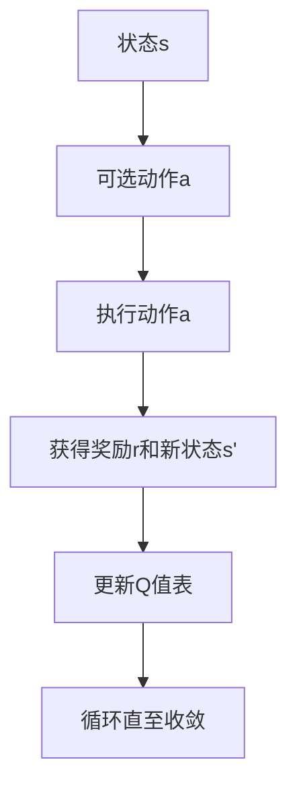
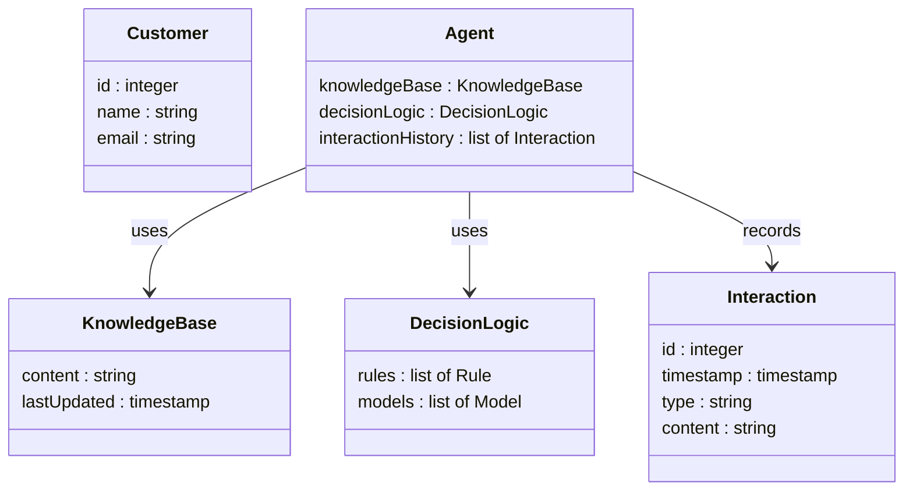
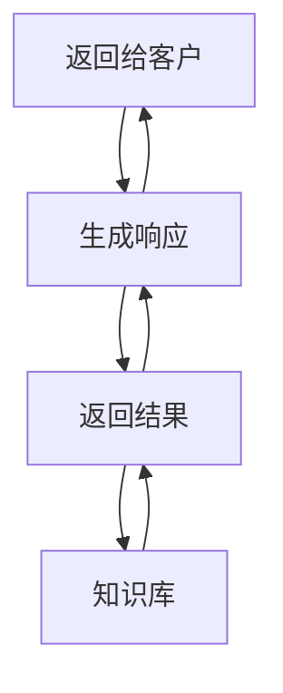

                 


# 企业级AI Agent的可扩展架构设计

> 关键词：企业级AI Agent，可扩展架构，系统设计，算法原理，项目实战

> 摘要：本文详细探讨了企业级AI Agent的可扩展架构设计，涵盖核心概念、算法原理、系统架构、项目实战及最佳实践。通过系统分析与设计，结合实际案例，为构建高效、可扩展的企业级AI Agent提供指导。

---

# 第一部分: 企业级AI Agent的可扩展架构背景

## 第1章: 企业级AI Agent的概述

### 1.1 企业级AI Agent的基本概念

#### 1.1.1 AI Agent的定义与特点
AI Agent（智能体）是能够感知环境、自主决策并采取行动的实体。企业级AI Agent具备以下特点：
- **自主性**：能在预设目标下自主运行。
- **反应性**：能根据环境反馈调整行为。
- **学习能力**：通过数据优化决策模型。
- **可扩展性**：能适应复杂环境和扩展任务范围。

#### 1.1.2 企业级AI Agent的特殊性
企业级AI Agent与个人助手不同，需处理复杂的业务逻辑，支持多团队协作，确保数据安全，并符合企业合规要求。例如，处理财务系统的AI Agent需严格遵守金融法规。

#### 1.1.3 可扩展架构的意义
可扩展架构使AI Agent能适应企业发展的需求，支持功能扩展和性能提升，避免系统瓶颈。例如，从处理简单查询扩展到复杂数据分析，需依赖高效的架构设计。

---

### 1.2 企业级AI Agent的应用场景

#### 1.2.1 企业级AI Agent的典型应用场景
- **智能客服**：提供24/7客户支持，解决常见问题，处理复杂咨询。
- **自动化运维**：监控系统状态，自动处理故障，优化资源分配。
- **数据分析师**：从大量数据中提取洞察，支持决策制定。

#### 1.2.2 不同场景下的需求差异
智能客服注重实时响应和多语言支持；自动化运维强调高可用性和安全性；数据分析师则需强大的数据处理能力和深度分析能力。

#### 1.2.3 企业级AI Agent的边界与外延
边界包括明确的功能范围和数据访问权限；外延涉及与其他系统的集成和扩展模块的开发。

---

### 1.3 本章小结
本章介绍了企业级AI Agent的基本概念、应用场景及可扩展架构的重要性。理解这些内容是后续设计的基础。

---

# 第二部分: 企业级AI Agent的核心概念与联系

## 第2章: AI Agent的核心概念与原理

### 2.1 AI Agent的构成要素

#### 2.1.1 知识库
知识库存储AI Agent运行所需的知识，包括领域知识、规则和上下文信息。知识库的结构化管理是实现智能决策的关键。

#### 2.1.2 行为决策模块
行为决策模块负责根据当前状态和目标，生成行动计划。常用的决策算法包括基于规则的决策和基于强化学习的决策。

#### 2.1.3 交互接口
交互接口是AI Agent与用户或其他系统交互的通道，支持多种交互方式，如自然语言处理和API调用。

#### 2.1.4 执行引擎
执行引擎负责将决策模块生成的计划转化为具体行动，并处理执行结果的反馈。

---

### 2.2 AI Agent的核心原理

#### 2.2.1 知识表示与推理
知识表示方法有框架表示、逻辑表示和语义网络等。推理过程基于知识库中的信息，通过逻辑推理或概率推理得出结论。

#### 2.2.2 行为决策机制
行为决策机制包括基于规则的决策和基于模型的决策。基于规则的决策适用于简单场景，而基于模型的决策适合复杂场景。

#### 2.2.3 交互与反馈循环
交互过程中，AI Agent根据用户反馈调整行为策略，形成闭环，提升智能性。

---

### 2.3 核心概念之间的关系

#### 2.3.1 概念属性特征对比表格

| 概念       | 属性           | 特征                     |
|------------|----------------|--------------------------|
| 知识库     | 数据结构       | 关系型、语义网络等        |
| 行为决策   | 决策方法       | 基于规则、强化学习等      |
| 交互接口   | 交互方式       | 自然语言、API调用等      |
| 执行引擎   | 执行机制       | 并行执行、事件驱动等      |

#### 2.3.2 ER实体关系图

```mermaid
erDiagram
    customer[客户] {
        <属性>
        id : integer
        name : string
        email : string
    }
    agent[AI Agent] {
        <属性>
        id : integer
        name : string
        knowledgeBase : reference
    }
    knowledgeBase[知识库] {
        <属性>
        id : integer
        content : string
        lastUpdated : timestamp
    }
    interaction[交互记录] {
        <属性>
        id : integer
        timestamp : timestamp
        type : string
    }
    customer --> interaction : 发起交互
    agent --> interaction : 处理交互
    agent --> knowledgeBase : 访问知识库
```

---

## 第3章: 可扩展架构的核心要素

### 3.1 可扩展架构的定义

#### 3.1.1 架构可扩展性的定义
架构可扩展性指系统在不修改现有代码的情况下，能轻松增加新功能或处理更大规模任务的能力。

#### 3.1.2 可扩展架构的特点
- **模块化**：各模块独立，便于替换或扩展。
- **插件式**：支持插件扩展，增加新功能不影响现有系统。
- **异构集成**：能与不同系统和数据源交互。

---

### 3.2 可扩展架构的关键要素

#### 3.2.1 模块化设计
将系统分解为独立模块，每个模块负责特定功能，如知识库管理、决策逻辑等。

#### 3.2.2 插件式架构
通过插件机制扩展功能，例如添加新的交互方式或决策算法。

#### 3.2.3 异构系统集成能力
支持多种数据源和系统接口，确保与其他系统的兼容性。

---

### 3.3 可扩展架构的设计原则

#### 3.3.1 分层设计
将系统分为表现层、业务逻辑层和数据访问层，每一层独立开发和扩展。

#### 3.3.2 松耦合设计
模块之间通过定义良好的接口通信，减少依赖，提高可扩展性。

#### 3.3.3 可扩展性评估指标
- **模块数量**：系统分解为多少独立模块。
- **插件数量**：支持多少种插件类型。
- **性能指标**：扩展后系统响应时间。

---

# 第三部分: 企业级AI Agent的算法原理与数学模型

## 第4章: AI Agent的核心算法原理

### 4.1 知识表示与推理算法

#### 4.1.1 知识图谱构建算法
知识图谱构建涉及实体识别、关系抽取和知识融合。使用图嵌入技术表示实体间关系。

#### 4.1.2 推理算法（如逻辑推理、概率推理）

##### 逻辑推理
基于谓词逻辑的推理方法，通过逻辑规则推导结论。例如，如果A蕴含B，且B蕴含C，则A蕴含C。

##### 概率推理
使用贝叶斯网络进行概率推理，计算在证据下的假设概率。例如，计算在观测数据X下，假设H的概率P(H|X)。

---

### 4.2 行为决策算法

#### 4.2.1 基于强化学习的决策过程

##### 强化学习简介
强化学习通过智能体与环境交互，学习最优策略。智能体通过试错，选择最优动作以最大化累积奖励。

##### Q-Learning算法
Q-Learning算法通过更新Q值表，学习状态-动作对的最优值。公式：
$$ Q(s, a) = Q(s, a) + \alpha [r + \gamma \max Q(s', a') - Q(s, a)] $$

##### 算法流程图



---

### 4.3 交互与反馈机制

#### 4.3.1 自然语言处理
使用NLP技术理解用户意图，生成自然语言响应。例如，使用BERT模型进行文本理解。

#### 4.3.2 基于反馈的自适应策略
通过用户反馈调整交互策略，优化响应质量。例如，记录用户满意度，动态调整回复模板。

---

## 第5章: 系统分析与架构设计方案

### 5.1 问题场景介绍

#### 5.1.1 需求分析
设计一个支持多语言交互的企业级AI Agent，具备知识库管理和动态扩展能力。

#### 5.1.2 项目介绍
开发一个智能客服系统，支持客户咨询、问题跟踪和满意度调查。

---

### 5.2 系统功能设计

#### 5.2.1 领域模型类图



---

### 5.3 系统架构设计

#### 5.3.1 模块划分与交互流程



---

## 第6章: 项目实战

### 6.1 环境安装

#### 6.1.1 安装Python和相关库
安装Python 3.8及以上版本，安装库：
```bash
pip install numpy pandas scikit-learn transformers
```

---

### 6.2 系统核心实现源代码

#### 6.2.1 知识库管理

```python
class KnowledgeBase:
    def __init__(self):
        self.content = {}
        self.last_updated = None

    def update(self, key, value):
        self.content[key] = value
        self.last_updated = datetime.now()
```

#### 6.2.2 行为决策模块

```python
class DecisionLogic:
    def __init__(self):
        self.rules = []
        self.models = []

    def decide(self, input):
        for rule in self.rules:
            if rule.matches(input):
                return rule.apply(input)
        return self.models[0].predict(input)
```

---

### 6.3 代码解读与分析

#### 6.3.1 知识库管理代码解读
`KnowledgeBase`类管理知识库内容和更新时间，提供更新方法。

#### 6.3.2 行为决策模块代码解读
`DecisionLogic`类包含规则和模型，根据输入选择合适的决策方法。

---

## 第7章: 最佳实践与总结

### 7.1 最佳实践

#### 7.1.1 模块化设计
确保各模块独立，便于扩展和维护。

#### 7.1.2 定期优化
根据用户反馈和系统性能，定期优化算法和架构。

#### 7.1.3 安全性考虑
确保数据安全和系统合规，避免潜在风险。

---

### 7.2 小结

企业级AI Agent的可扩展架构设计需综合考虑模块化、插件化和异构系统集成。通过合理的系统设计和算法优化，可实现高效、可靠的智能系统。

---

### 7.3 注意事项

- **数据安全**：确保数据在存储和传输中的安全性。
- **性能监控**：实时监控系统性能，及时发现和解决问题。
- **用户体验**：优化交互流程，提升用户体验。

---

### 7.4 拓展阅读

- [《企业架构设计：复杂系统的简洁之道》](#)
- [《可扩展系统设计模式》](#)
- [《深度学习实战：从算法到工程》](#)

---

# 结语

企业级AI Agent的可扩展架构设计是一个复杂但 rewarding 的过程。通过系统的分析和设计，结合实际项目经验，可以构建高效、灵活且可靠的智能系统，为企业带来显著的竞争优势。

