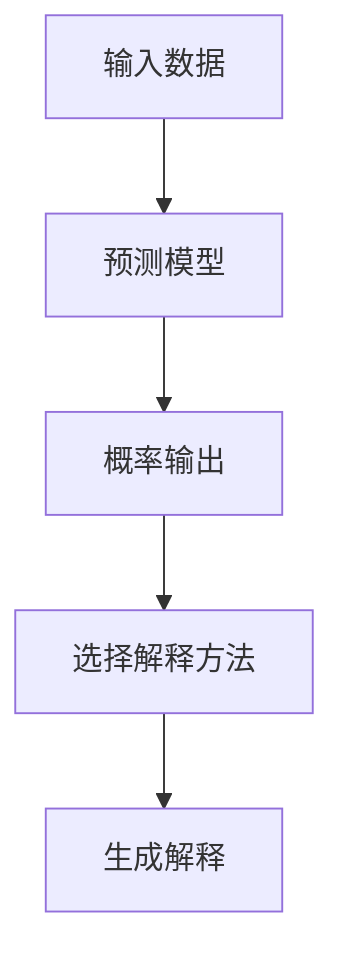
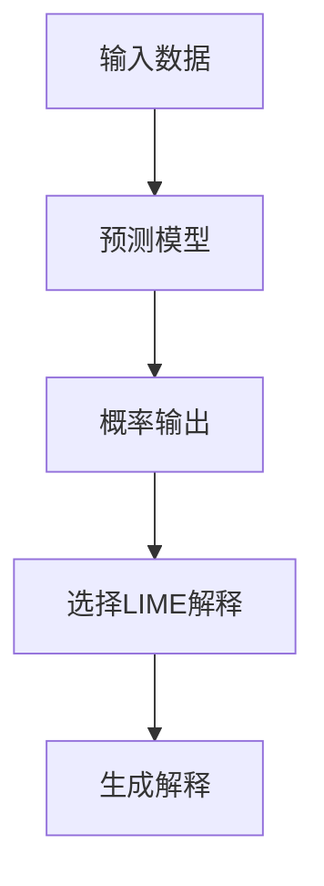
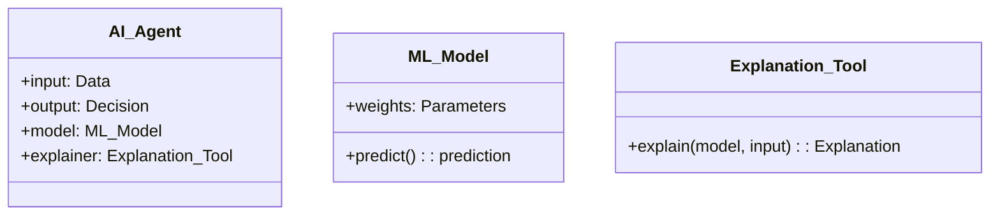
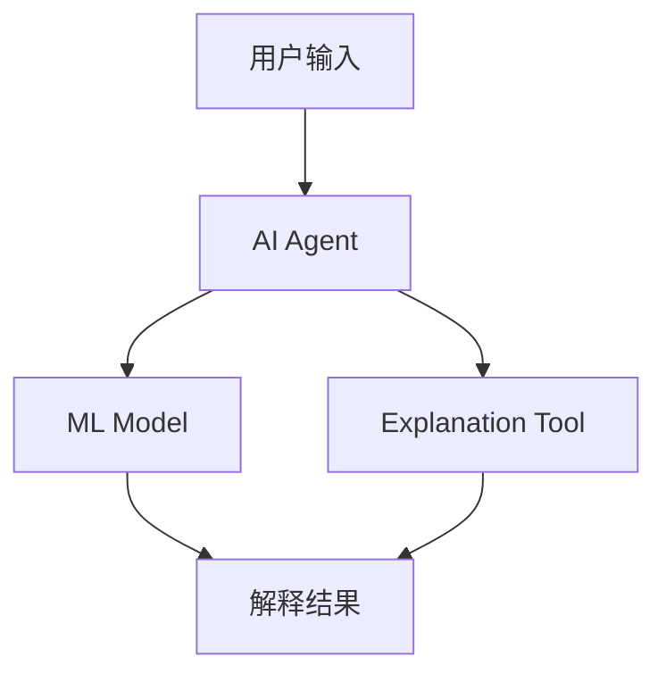
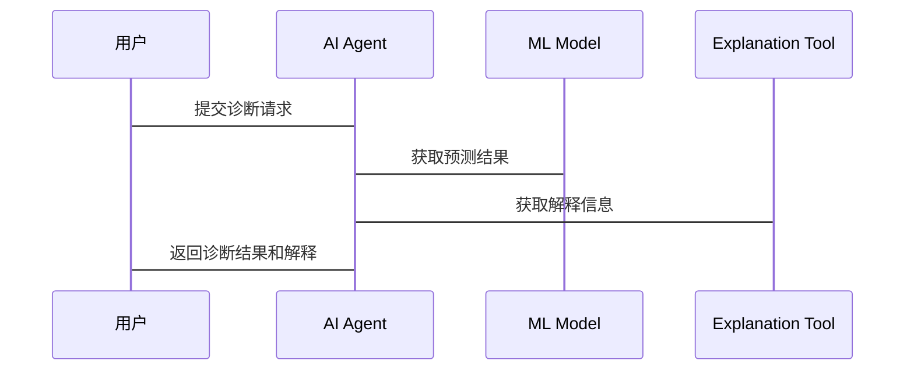

                 


# 企业级AI Agent的可解释性设计：增强决策透明度

> 关键词：企业级AI Agent，可解释性设计，决策透明度，AI解释性方法，系统架构设计

> 摘要：本文系统阐述了企业级AI Agent的可解释性设计的重要性、核心概念、算法原理、系统架构设计以及实际项目实现。通过深入分析可解释性AI的背景、核心概念、主流解释方法及其在企业级系统中的应用，本文旨在帮助企业技术决策者和开发者更好地理解和实现透明、可解释的AI系统，从而增强决策的透明度和信任度。

---

# 第1章: 企业级AI Agent概述

## 1.1 AI Agent的基本概念

### 1.1.1 AI Agent的定义与特点
AI Agent（人工智能代理）是指能够感知环境、自主决策并采取行动以实现特定目标的智能实体。企业级AI Agent通常用于企业内部的自动化决策系统，如供应链管理、风险评估、客户服务等领域。其特点包括：

- **自主性**：能够在没有人工干预的情况下独立运行。
- **反应性**：能够实时感知环境变化并做出反应。
- **目标导向**：所有行动都围绕实现特定目标展开。
- **可扩展性**：能够处理大规模数据和复杂任务。

### 1.1.2 企业级AI Agent的特殊性
与个人用途的AI Agent相比，企业级AI Agent具有以下特殊性：

- **高复杂性**：需要处理多部门、多系统的复杂交互。
- **高可靠性**：企业级系统的决策直接影响企业运营，要求极高的可靠性。
- **合规性**：必须符合企业内部的规章制度和行业监管要求。

### 1.1.3 可解释性在AI Agent中的重要性
可解释性是企业级AI Agent的核心需求之一。由于AI Agent的决策直接影响企业运营，决策过程的透明性和可解释性是确保决策合法、合规、可追溯的关键因素。

---

## 1.2 可解释性AI的背景与挑战

### 1.2.1 当前AI技术的局限性
尽管AI技术取得了显著进步，但其决策过程往往缺乏透明性，导致以下问题：

- **信任缺失**：用户无法理解AI的决策逻辑，导致信任不足。
- **责任不清**：当AI决策导致问题时，难以明确责任归属。
- **合规性挑战**：许多行业（如金融、医疗）对决策透明度有严格要求，而现有的AI技术难以满足。

### 1.2.2 可解释性AI的需求背景
随着AI技术在企业中的广泛应用，可解释性需求日益凸显。特别是在金融、医疗、司法等领域，可解释性是确保AI系统合规性和用户信任的基础。

### 1.2.3 企业级应用中可解释性的关键性
在企业级应用中，可解释性不仅是技术需求，更是业务需求。通过可解释性设计，企业可以：

- 提高决策的透明度和可信度。
- 降低法律和合规风险。
- 提升系统的可维护性和可优化性。

---

## 1.3 本章小结

本章介绍了企业级AI Agent的基本概念、特殊性和可解释性的重要性。通过分析当前AI技术的局限性和可解释性AI的需求背景，强调了在企业级应用中实现可解释性设计的必要性。

---

# 第2章: 可解释性AI的核心概念

## 2.1 可解释性与透明度

### 2.1.1 可解释性的定义
可解释性是指AI系统的行为、决策过程和结果能够被人类理解和解释的程度。一个可解释的AI系统应该能够清晰地展示其决策逻辑和推理过程。

### 2.1.2 透明度的层次划分
透明度可以分为以下几个层次：

- **数据透明度**：数据的来源、处理方式和使用方式。
- **算法透明度**：算法的原理、输入输出关系和决策逻辑。
- **结果透明度**：输出结果的解释和验证方法。

### 2.1.3 可解释性与透明度的关系
可解释性和透明度是相辅相成的。高透明度的AI系统更容易实现可解释性，而可解释性则增强了系统的透明度。

---

## 2.2 可解释性AI的属性特征对比

### 2.2.1 表格对比不同解释方法的特征

| 解释方法 | 解释类型 | 解释粒度 | 可解释性程度 | 计算复杂度 |
|----------|----------|----------|--------------|------------|
| LIME     | 局部解释 | 细粒度   | 较高          | 较高        |
| SHAP      | 全局解释 | 中粒度   | 高            | 较高        |
| 相似性解释 | 全局解释 | 粗粒度   | 较低          | 较低        |

### 2.2.2 通过Mermaid流程图展示解释性方法的实体关系



---

## 2.3 本章小结

本章详细阐述了可解释性AI的核心概念，包括可解释性与透明度的关系，以及不同解释方法的特征对比。通过Mermaid流程图，展示了解释性方法的实体关系，为后续的算法原理分析奠定了基础。

---

# 第3章: 可解释性AI的算法原理

## 3.1 常见的可解释性方法

### 3.1.1 LIME解释方法
LIME（Local Interpretable Model-agnostic Explanations）是一种通过局部拟合可解释模型来解释AI决策的方法。其核心思想是：对于一个复杂的AI模型，可以在特定数据点附近构建一个简单的线性模型来解释其预测结果。

### 3.1.2 SHAP值解释方法
SHAP（Shapley Additive exPlanations）是一种基于博弈论的解释方法，通过计算每个特征对模型预测结果的贡献度来解释AI决策。

### 3.1.3 其他解释性方法
除了LIME和SHAP，还有其他解释性方法，如特征重要性分析、决策树解释等。

---

## 3.2 LIME算法的Mermaid流程图



---

## 3.3 SHAP值的计算与解释

SHAP值的计算基于博弈论中的Shapley值，通过加权求和的方式，将每个特征的贡献度量化。公式如下：

$$
SHAP(i) = \sum_{S \subseteq features} \phi(S, i)
$$

其中，$\phi(S, i)$ 表示特征集合 $S$ 对预测结果的影响程度。

---

## 3.4 算法实现的Python代码示例

以下是一个使用LIME解释模型的Python代码示例：

```python
import lime
from lime import lime_explanations

def explain_model(model, instance):
    explainer = lime_explanations.LimeExplainer()
    explanation = explainer.explain_instance(model, instance)
    return explanation
```

---

## 3.5 本章小结

本章详细介绍了几种常见的可解释性方法，包括LIME和SHAP，并通过Mermaid流程图和Python代码示例，展示了这些方法的实现过程。通过对算法原理的分析，读者可以更好地理解可解释性AI的核心技术。

---

# 第4章: 企业级AI Agent的系统分析与架构设计

## 4.1 系统分析

### 4.1.1 问题场景介绍
以医疗诊断系统为例，AI Agent需要根据患者的症状、病史、检查结果等信息，推荐诊断方案。为了确保诊断的透明性和可追溯性，需要实现可解释性设计。

### 4.1.2 项目目标与范围
项目目标：设计一个可解释的医疗诊断AI Agent，能够清晰展示诊断过程和推理逻辑。

项目范围：包括数据采集、模型训练、解释性设计、系统集成等。

### 4.1.3 需求分析与分解
- **功能需求**：提供诊断建议、展示解释性信息。
- **性能需求**：实时响应，高准确率。
- **接口需求**：与医院信息系统（HIS）对接。

---

## 4.2 系统架构设计

### 4.2.1 领域模型Mermaid类图



### 4.2.2 系统架构设计的Mermaid架构图



### 4.2.3 系统交互的Mermaid序列图



---

## 4.3 本章小结

本章通过医疗诊断系统的案例，详细分析了企业级AI Agent的系统架构设计，包括领域模型、系统架构和系统交互设计。通过Mermaid图展示了系统的组成和工作流程，为后续的项目实现奠定了基础。

---

# 第5章: 项目实战——医疗诊断系统的可解释性设计

## 5.1 环境配置

### 5.1.1 安装必要的Python库
- `lime`：用于实现可解释性分析。
- `scikit-learn`：用于机器学习模型训练。
- `matplotlib`：用于数据可视化。

### 5.1.2 安装与配置
在终端中运行以下命令安装所需的库：

```bash
pip install lime scikit-learn matplotlib
```

---

## 5.2 系统核心实现源代码

### 5.2.1 数据预处理
```python
import pandas as pd
from sklearn.model_selection import train_test_split

# 加载数据集
data = pd.read_csv('medical_data.csv')
X = data.drop('diagnosis', axis=1)
y = data['diagnosis']

# 划分训练集和测试集
X_train, X_test, y_train, y_test = train_test_split(X, y, test_size=0.2, random_state=42)
```

### 5.2.2 训练机器学习模型
```python
from sklearn.ensemble import RandomForestClassifier

# 初始化模型
model = RandomForestClassifier(n_estimators=100, random_state=42)

# 训练模型
model.fit(X_train, y_train)
```

### 5.2.3 实现可解释性分析
```python
import lime
from lime import lime_explanations

# 初始化解释工具
explainer = lime_explanations.LimeExplainer()

# 解释单个预测
instance = X_test.iloc[0]
explanation = explainer.explain_instance(model, instance)
```

---

## 5.3 代码应用解读与分析

通过上述代码，我们实现了以下功能：

1. 数据预处理：加载数据集并将其划分为训练集和测试集。
2. 模型训练：使用随机森林算法训练分类模型。
3. 可解释性分析：利用LIME工具对模型的预测结果进行解释。

---

## 5.4 实际案例分析和详细讲解剖析

以一个具体的诊断案例为例，展示AI Agent的决策过程和解释性信息：

1. **输入数据**：患者症状、病史、检查结果等。
2. **模型预测**：模型预测患者的诊断结果。
3. **解释性分析**：通过LIME工具，展示每个症状对诊断结果的影响程度。

---

## 5.5 本章小结

本章通过一个医疗诊断系统的实际案例，详细展示了企业级AI Agent的可解释性设计的实现过程。通过代码实现和案例分析，读者可以更好地理解可解释性AI的实际应用。

---

# 第6章: 总结与展望

## 6.1 本章总结

本文系统阐述了企业级AI Agent的可解释性设计的重要性、核心概念、算法原理、系统架构设计以及实际项目实现。通过分析可解释性AI的背景、核心概念、主流解释方法及其在企业级系统中的应用，本文为技术决策者和开发者提供了理论和实践指导。

---

## 6.2 未来展望

随着AI技术的不断发展，可解释性设计将变得更加重要。未来的研究方向可能包括：

- **更高效的解释方法**：开发更简单、更高效的可解释性方法。
- **跨领域的可解释性标准**：制定统一的可解释性标准，促进不同领域的互通互用。
- **动态可解释性**：实现动态更新的解释性信息，以适应不断变化的环境。

---

## 6.3 最佳实践Tips

- **从小处着手**：在简单的项目中实现可解释性设计，积累经验。
- **选择合适的工具**：根据具体需求选择适合的解释性工具。
- **注重用户体验**：将解释性信息以用户友好的方式展示。

---

## 6.4 本章小结

本文总结了企业级AI Agent的可解释性设计的核心内容，并展望了未来的研究方向和最佳实践。通过本文的指导，读者可以更好地理解和实现透明、可解释的AI系统。

---

# 附录: 可解释性AI工具与资源

## 附录A: 常用可解释性工具

- **LIME**：适用于局部解释。
- **SHAP**：适用于全局解释。
- **ELI5**：支持多种模型的解释。

## 附录B: 进一步阅读的资源

- [《可解释的人工智能：挑战、方法和应用》](#)
- [《可解释性AI的现状与未来》](#)

---

# 结语

通过本文的系统阐述，我们相信读者已经掌握了企业级AI Agent的可解释性设计的核心内容和实现方法。希望本文能够为企业的技术决策者和开发者提供有价值的参考，推动可解释性AI技术的发展与应用。

