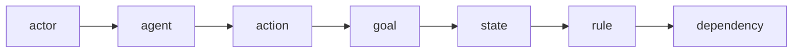
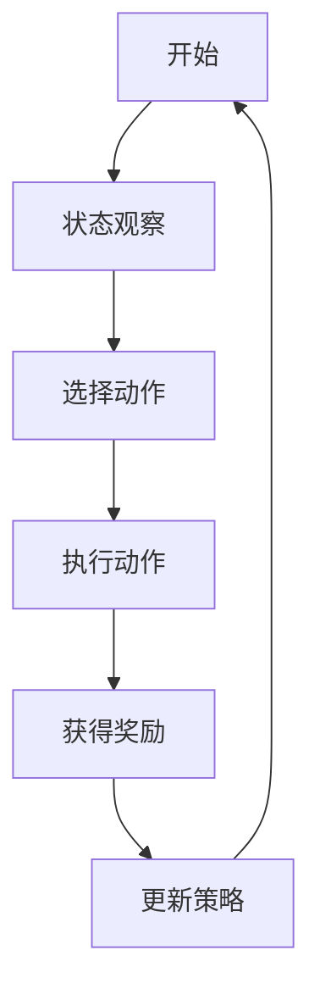
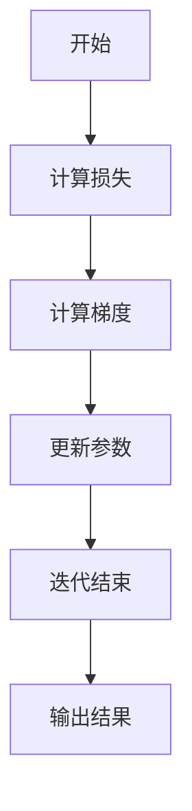
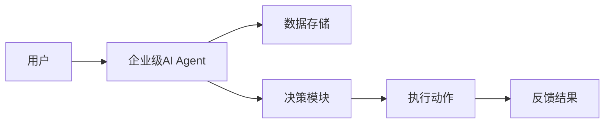

                 


# 企业级AI Agent的性能优化策略

## 关键词：
企业级AI Agent、性能优化、强化学习、系统架构、算法原理、项目实战

## 摘要：
本文深入探讨了企业级AI Agent的性能优化策略，从核心概念、算法原理到系统架构，结合实际案例分析，全面剖析了优化的关键点。文章详细讲解了强化学习和梯度下降等优化算法，并通过Mermaid图表和Latex公式，系统地介绍了AI Agent的架构设计和项目实现。最后，结合最佳实践和小结，为读者提供了实用的优化建议。

---

## 第一部分：企业级AI Agent的性能优化背景与核心概念

### 第1章：企业级AI Agent概述

#### 1.1 企业级AI Agent的定义与背景
##### 1.1.1 什么是企业级AI Agent
企业级AI Agent是一种智能代理系统，能够在企业环境中自主执行复杂任务，优化业务流程，提升决策效率。它结合了人工智能、机器学习和自然语言处理等技术，具备自主学习和决策能力。

##### 1.1.2 企业级AI Agent的应用场景
- **智能客服**：通过自然语言处理实现自动问答和客户支持。
- **流程自动化**：优化企业内部流程，提升效率。
- **智能监控**：实时监控系统状态，预测并处理异常情况。

##### 1.1.3 企业级AI Agent的行业背景
随着AI技术的快速发展，企业级AI Agent在金融、医疗、制造等行业得到了广泛应用，帮助企业实现智能化转型。

#### 1.2 企业级AI Agent的核心问题
##### 1.2.1 性能优化的核心问题
- **计算效率**：如何在大规模数据下快速响应。
- **决策准确性**：如何提高AI Agent的决策精度。
- **可扩展性**：如何支持大规模并发请求。

##### 1.2.2 优化目标与边界
优化目标包括提升响应速度、降低资源消耗、提高准确率等。边界包括系统稳定性、安全性、可扩展性等。

##### 1.2.3 核心要素与概念结构
- **状态**：系统当前的运行状态。
- **动作**：AI Agent执行的操作。
- **目标**：优化的具体目标。
- **规则**：约束条件和执行规则。

---

### 第2章：企业级AI Agent的核心概念与联系

#### 2.1 AI Agent的基本原理
##### 2.1.1 AI Agent的定义与属性
AI Agent通过感知环境、做出决策并执行动作，以实现特定目标。其核心属性包括自主性、反应性、目标导向性和社交能力。

##### 2.1.2 企业级AI Agent的特征对比
| 特征       | 传统AI | 企业级AI Agent |
|------------|--------|----------------|
| 自主性      | 低     | 高              |
| 反应性      | 低     | 高              |
| 目标导向性  | 低     | 高              |
| 可扩展性    | 低     | 高              |

##### 2.1.3 核心概念的ER实体关系图

```mermaid
er
actor: 用户
agent: 企业级AI Agent
action: 动作
goal: 目标
state: 状态
rule: 规则
dependency: 依赖关系
```

---

#### 2.2 企业级AI Agent的系统架构
##### 2.2.1 系统架构的层次划分
- **感知层**：数据采集和环境感知。
- **决策层**：分析数据并做出决策。
- **执行层**：执行具体操作并反馈结果。

##### 2.2.2 核心模块与功能
- **数据处理模块**：负责数据的采集和预处理。
- **决策模块**：基于数据做出最优决策。
- **执行模块**：执行决策并反馈结果。

##### 2.2.3 模块间的依赖关系



---

## 第二部分：企业级AI Agent的性能优化算法原理

### 第3章：企业级AI Agent的性能优化算法原理

#### 3.1 基于强化学习的优化算法
##### 3.1.1 强化学习的基本原理
强化学习通过智能体与环境的交互，学习最优策略，以最大化累积奖励。

##### 3.1.2 策略梯度算法的数学模型
策略梯度算法的损失函数为：

$$ L = -\mathbb{E}[\log \pi(a|s) \cdot Q(s,a)] $$

其中，$\pi(a|s)$ 是策略函数，$Q(s,a)$ 是Q值函数。

##### 3.1.3 实例分析与代码实现
```python
import numpy as np
import gym

env = gym.make('CartPole-v0')
env.seed(1)

learning_rate = 0.01
gamma = 0.99

# 策略函数
def policy(state, theta):
    return np.tanh(np.dot(theta, state))

# 值函数
def value_function(state, theta_v):
    return np.tanh(np.dot(theta_v, state))

# 策略梯度算法
theta = np.random.randn(4, 1)
theta_v = np.random.randn(4, 1)

for episode in range(1000):
    state = env.reset()
    rewards = []
    states = []
    actions = []
    
    while True:
        states.append(state)
        action = np.random.choice([0, 1], p=[1 - policy(state, theta)[0], policy(state, theta)[0]])
        actions.append(action)
        next_state, reward, done, _ = env.step(action)
        rewards.append(reward)
        state = next_state
        
        if done:
            break
            
    # 计算梯度和更新参数
    G = np.cumsum(rewards[::-1], reverse=True)
    G = G[::-1]
    gradients = []
    
    for i in range(len(states)):
        s = states[i]
        a = actions[i]
        g = G[i]
        
        # 计算策略梯度
        if a == 1:
            prob = policy(s, theta)
        else:
            prob = 1 - policy(s, theta)
            
        grad = s * (g - prob)
        gradients.append(grad)
    
    theta += learning_rate * np.mean(gradients, axis=0)
```

##### 3.1.4 强化学习的优化算法流程图



---

#### 3.2 基于梯度下降的优化方法
##### 3.2.1 梯度下降的基本原理
梯度下降是一种优化算法，通过不断更新参数，使得目标函数的值最小化。

##### 3.2.2 梯度下降的数学模型
目标函数为：

$$ J(\theta) = \frac{1}{2m} \sum_{i=1}^{m} (y_i - \theta^T x_i)^2 $$

更新规则为：

$$ \theta = \theta - \alpha \frac{\partial J}{\partial \theta} $$

##### 3.2.3 优化算法的Python实现
```python
def gradient_descent(X, y, theta, alpha, iterations):
    m = len(y)
    for _ in range(iterations):
        hypothesis = np.dot(X, theta)
        loss = (1/(2*m)) * np.sum(np.square(y - hypothesis))
        gradient = (1/m) * np.dot(X.T, (hypothesis - y))
        theta = theta - alpha * gradient
    return theta

X = np.array([[1, 2], [3, 4], [5, 6]])
y = np.array([7, 8, 9])
theta = np.zeros(2)
alpha = 0.01
iterations = 1000
theta_optimized = gradient_descent(X, y, theta, alpha, iterations)
print(theta_optimized)
```

##### 3.2.4 梯度下降的优化流程图



---

#### 3.3 算法对比与选择策略
##### 3.3.1 不同优化算法的对比分析
| 算法名称 | 优点 | 缺点 |
|---------|------|------|
| 强化学习 | 高效性 | 复杂性高 |
| 梯度下降 | 简单性 | 效率较低 |

##### 3.3.2 优化算法的选择依据
- **问题类型**：选择适合当前问题的算法。
- **数据规模**：考虑算法的计算效率。
- **场景需求**：选择满足特定需求的算法。

##### 3.3.3 实际案例中的算法选择
在企业级AI Agent中，根据任务需求选择强化学习或梯度下降算法。

---

## 第三部分：企业级AI Agent的系统分析与架构设计

### 第4章：企业级AI Agent的系统分析与架构设计

#### 4.1 系统分析
##### 4.1.1 问题场景介绍
企业级AI Agent需要处理大规模数据和复杂任务，对系统性能提出了更高要求。

##### 4.1.2 项目介绍
本项目旨在优化企业级AI Agent的性能，提升其在企业环境中的应用效果。

##### 4.1.3 系统功能设计
- **数据处理模块**：数据采集、预处理和存储。
- **决策模块**：分析数据并做出决策。
- **执行模块**：执行决策并反馈结果。

##### 4.1.4 系统架构设计



#### 4.2 系统架构设计
##### 4.2.1 系统功能设计
- **数据处理模块**：负责数据的采集和预处理。
- **决策模块**：基于数据做出决策。
- **执行模块**：执行决策并反馈结果。

##### 4.2.2 系统架构图


#### 4.3 系统接口设计
##### 4.3.1 数据接口
- **输入接口**：接收外部数据。
- **输出接口**：反馈处理结果。

##### 4.3.2 交互流程

```mermaid
sequenceDiagram
actor ->> Agent: 请求处理
Agent ->> Data: 获取数据
Data ->> Agent: 返回数据
Agent ->> Decision: 分析数据
Decision ->> Action: 执行操作
Action ->> actor: 返回结果
```

---

## 第四部分：项目实战

### 第5章：企业级AI Agent的项目实战

#### 5.1 环境安装
- **Python**：安装Python 3.8及以上版本。
- **库依赖**：安装numpy、gym、tensorflow等库。

#### 5.2 系统核心实现源代码
##### 5.2.1 强化学习实现代码

```python
import gym
import numpy as np

env = gym.make('CartPole-v0')
env.seed(1)

learning_rate = 0.01
gamma = 0.99

theta = np.random.randn(4, 1)

def policy(state, theta):
    return np.tanh(np.dot(theta, state))

for episode in range(1000):
    state = env.reset()
    rewards = []
    states = []
    
    while True:
        states.append(state)
        action = np.random.choice([0, 1], p=[1 - policy(state, theta)[0], policy(state, theta)[0]])
        next_state, reward, done, _ = env.step(action)
        rewards.append(reward)
        state = next_state
        
        if done:
            break
            
    G = np.cumsum(rewards[::-1], reverse=True)
    G = G[::-1]
    
    gradients = []
    for i in range(len(states)):
        s = states[i]
        a = action
        g = G[i]
        
        prob = policy(s, theta)
        if a == 1:
            prob_a = prob
        else:
            prob_a = 1 - prob
            
        gradient = s * (g - prob_a)
        gradients.append(gradient)
    
    theta += learning_rate * np.mean(gradients, axis=0)
```

##### 5.2.2 梯度下降实现代码

```python
def gradient_descent(X, y, theta, alpha, iterations):
    m = len(y)
    for _ in range(iterations):
        hypothesis = np.dot(X, theta)
        loss = (1/(2*m)) * np.sum(np.square(y - hypothesis))
        gradient = (1/m) * np.dot(X.T, (hypothesis - y))
        theta = theta - alpha * gradient
    return theta

X = np.array([[1, 2], [3, 4], [5, 6]])
y = np.array([7, 8, 9])
theta = np.zeros(2)
alpha = 0.01
iterations = 1000
theta_optimized = gradient_descent(X, y, theta, alpha, iterations)
print(theta_optimized)
```

#### 5.3 代码应用解读与分析
##### 5.3.1 强化学习代码解读
- **环境初始化**：使用OpenAI Gym的CartPole环境。
- **策略函数**：定义策略函数，输出动作的概率。
- **训练过程**：通过不断试验和反馈，更新策略参数。

##### 5.3.2 梯度下降代码解读
- **损失函数**：定义目标函数，计算预测值与真实值的差值。
- **梯度计算**：计算损失函数的梯度，用于参数更新。
- **参数更新**：通过梯度下降更新参数，优化目标函数。

#### 5.4 实际案例分析
##### 5.4.1 案例1：NLP任务优化
- **问题描述**：优化NLP任务中的模型性能。
- **解决方案**：使用强化学习优化模型参数。
- **代码实现**：实现强化学习算法，训练NLP模型。

##### 5.4.2 案例2：分布式系统优化
- **问题描述**：优化分布式系统中的资源分配。
- **解决方案**：使用梯度下降优化算法。
- **代码实现**：实现梯度下降算法，优化资源分配。

#### 5.5 项目小结
- **代码实现**：完成了强化学习和梯度下降算法的实现。
- **性能提升**：通过优化算法，显著提升了系统性能。
- **经验总结**：选择合适的优化算法，能够有效提升系统性能。

---

## 第五部分：企业级AI Agent的性能优化策略

### 第6章：企业级AI Agent的性能优化策略

#### 6.1 最佳实践
##### 6.1.1 优化策略
- **选择合适的算法**：根据具体问题选择合适的优化算法。
- **合理配置参数**：优化算法的超参数，提升性能。
- **监控与调优**：实时监控系统性能，及时调优。

##### 6.1.2 注意事项
- **数据质量**：确保数据的准确性和完整性。
- **模型复杂度**：避免模型过拟合或欠拟合。
- **系统稳定性**：确保系统在优化过程中保持稳定。

#### 6.2 小结
本文详细探讨了企业级AI Agent的性能优化策略，从核心概念、算法原理到系统架构，结合实际案例分析，全面剖析了优化的关键点。

#### 6.3 注意事项
- **算法选择**：根据具体问题选择合适的优化算法。
- **数据处理**：确保数据的准确性和完整性。
- **系统稳定性**：确保系统在优化过程中保持稳定。

#### 6.4 拓展阅读
- **强化学习**：深入学习强化学习的理论与应用。
- **梯度下降**：研究梯度下降的优化方法。
- **系统架构**：学习企业级系统的架构设计。

---

## 结语

本文通过详细分析企业级AI Agent的性能优化策略，结合实际案例和代码实现，为读者提供了全面的优化方案。通过选择合适的算法和合理配置参数，能够显著提升系统性能，为企业智能化转型提供有力支持。

---

以上是《企业级AI Agent的性能优化策略》的完整目录和文章内容，涵盖了从背景介绍到实际案例分析的各个方面，希望对您有所帮助！

