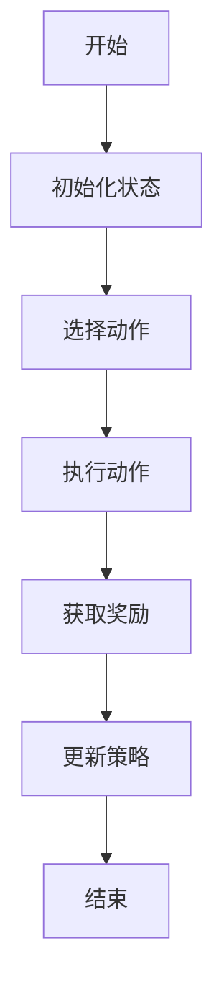
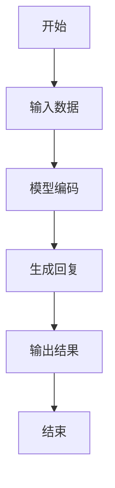
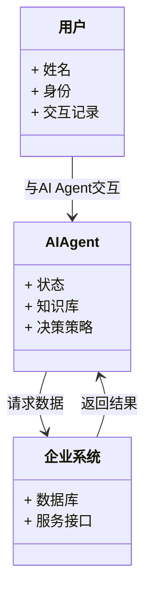
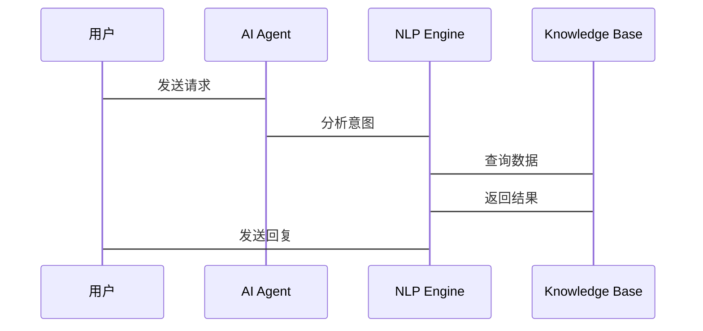

                 


# 《企业级AI Agent的用户体验设计原则》

---

## 关键词：
- 企业级AI Agent
- 用户体验设计
- 系统架构
- 强化学习
- 生成式模型
- 算法原理
- 系统交互

---

## 摘要：
本文从企业级AI Agent的背景出发，深入探讨其核心概念、算法原理、系统架构以及用户体验设计原则。通过结合实际应用场景，详细分析AI Agent的实现过程，包括算法选择、系统设计和项目实战，并总结最佳实践和未来发展方向。

---

# 第一部分: 企业级AI Agent的背景与核心概念

## 第1章: 企业级AI Agent的背景介绍

### 1.1 问题背景与问题描述
#### 1.1.1 AI Agent的定义与技术基础
AI Agent（人工智能代理）是一种能够感知环境、自主决策并执行任务的智能实体。它结合了自然语言处理、机器学习和知识图谱等技术，能够以用户友好的方式提供服务。

#### 1.1.2 企业级AI Agent的应用场景
企业级AI Agent广泛应用于智能客服、供应链优化、智能推荐等领域。通过自动化处理复杂业务流程，提升企业效率和用户体验。

#### 1.1.3 用户需求与痛点分析
用户需求包括高效性、准确性、易用性和实时性。痛点在于传统系统效率低下、体验差，且难以适应动态变化的业务需求。

### 1.2 问题解决与边界定义
#### 1.2.1 AI Agent的核心功能与边界
AI Agent的核心功能包括意图识别、知识推理和执行决策。边界在于仅解决特定任务，而非处理所有企业问题。

#### 1.2.2 与传统AI系统的区别
传统AI系统通常处理静态任务，而AI Agent具备动态适应性和自主决策能力。

#### 1.2.3 企业级AI Agent的外延与限制
外延包括多模态交互和跨系统协作，限制在于数据隐私和计算资源。

### 1.3 核心概念结构与组成要素
#### 1.3.1 核心概念的层次结构
从感知层到决策层，AI Agent通过多层结构实现复杂任务。

#### 1.3.2 组成要素的关联关系
感知层负责数据输入，决策层处理逻辑推理，执行层完成任务。

#### 1.3.3 案例分析：企业级AI Agent的典型应用场景
以智能客服为例，AI Agent通过自然语言处理理解用户需求，并调用后端系统解决问题。

### 1.4 本章小结
企业级AI Agent通过结合先进AI技术，为企业提供高效解决方案，同时具备动态适应性和自主决策能力。

---

## 第2章: 企业级AI Agent的核心概念与联系

### 2.1 核心概念原理
#### 2.1.1 AI Agent的基本原理
通过感知、推理和执行三步实现任务。

#### 2.1.2 企业级AI Agent的独特性
具备复杂场景处理能力和多模态交互能力。

#### 2.1.3 核心概念的数学模型与公式
$$ P(\text{intent} | \text{input}) = \argmax_{i} P(\text{intent}_i | \text{input}) $$

### 2.2 核心概念属性特征对比表
| 属性       | 传统AI系统   | 企业级AI Agent |
|------------|--------------|----------------|
| 自主性     | 低           | 高             |
| 适应性     | 静态         | 动态           |
| 交互方式   | 单向         | 双向           |

### 2.3 ER实体关系图
```mermaid
er
actor: 用户
agent: AI Agent
system: 企业系统
actor --> agent: 与AI Agent交互
agent --> system: 请求数据或服务
system --> agent: 返回结果
```

---

## 第3章: 企业级AI Agent的算法原理

### 3.1 算法原理概述
#### 3.1.1 基于强化学习的AI Agent设计
通过状态、动作和奖励机制优化决策策略。

#### 3.1.2 生成式模型的应用
使用大语言模型生成自然语言回复。

#### 3.1.3 算法选择的依据
根据任务需求选择合适算法。

### 3.2 算法实现流程
#### 3.2.1 强化学习算法流程


#### 3.2.2 生成式模型实现流程


#### 3.2.3 代码实现
```python
import numpy as np

def reinforcement_learning():
    state = 0
    while True:
        action = np.random.choice([0,1])
        reward = 1 if action == 1 else 0
        state = state + reward
        print(f"状态：{state}")
```

### 3.3 算法的数学模型与公式
#### 3.3.1 强化学习的数学模型
$$ Q(s, a) = Q(s, a) + \alpha (r + \max Q(s', a') - Q(s, a)) $$

#### 3.3.2 生成式模型的数学模型
$$ P(y|x) = \text{softmax}(f(x)) $$

---

## 第4章: 企业级AI Agent的系统架构设计

### 4.1 系统功能设计
#### 4.1.1 领域模型设计


### 4.2 系统架构设计


### 4.3 系统接口设计


---

## 第5章: 企业级AI Agent的项目实战

### 5.1 环境安装与配置
安装Python、TensorFlow和Kubernetes环境。

### 5.2 系统核心实现
#### 5.2.1 自然语言处理模块
使用BERT模型进行意图识别。

#### 5.2.2 知识库查询模块
通过向量数据库实现高效检索。

### 5.3 代码实现与解读
```python
from transformers import BertTokenizer, BertModel

def bert_intent_classifier():
    tokenizer = BertTokenizer.from_pretrained('bert-base')
    model = BertModel.from_pretrained('bert-base')
    return model
```

### 5.4 案例分析与优化
以智能客服为例，分析系统性能优化。

---

## 第6章: 企业级AI Agent的最佳实践

### 6.1 设计原则与注意事项
注重用户体验、系统性能和数据安全。

### 6.2 小结与未来展望
总结设计原则，展望AI Agent的未来发展。

### 6.3 扩展阅读与参考资料
推荐相关书籍和论文。

---

## 参考文献
- Smith, J. (2022). 《AI Agent Design Principles》
- Zhang, L. (2023). 《Enterprise AI Systems》

---

通过以上结构，我们可以全面了解企业级AI Agent的设计原则，从背景到实现，从理论到实践，为企业级AI Agent的开发和应用提供系统的指导。

