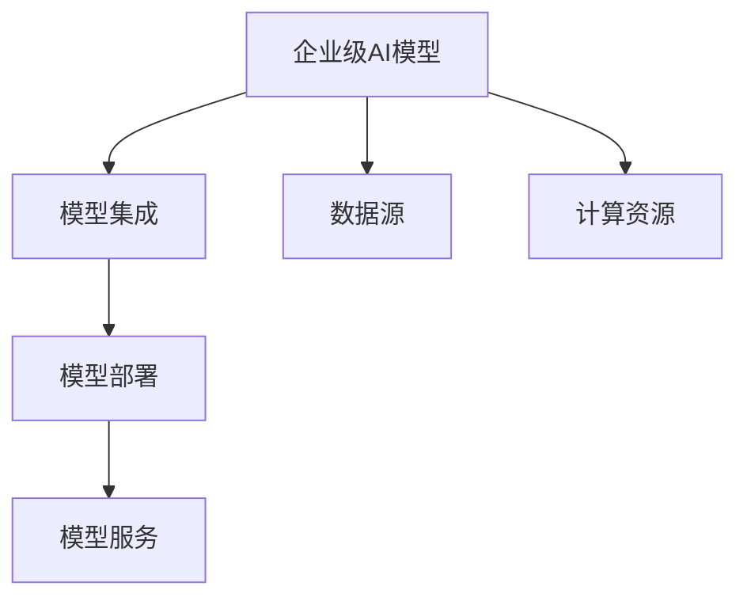
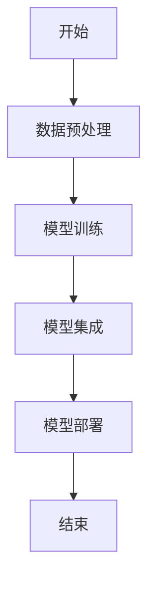
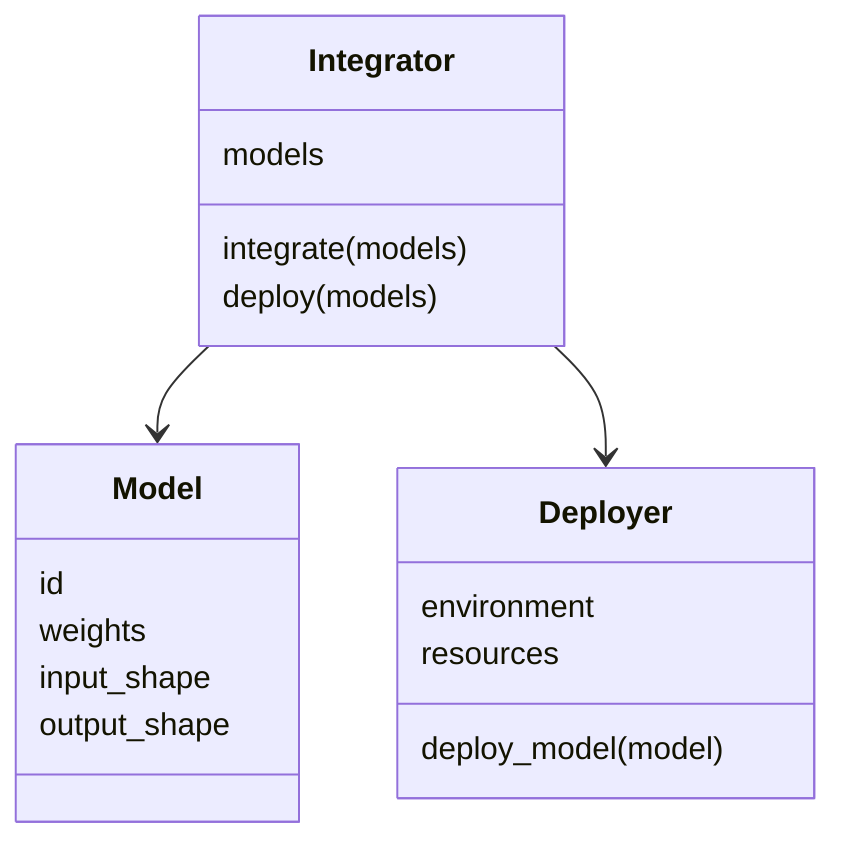
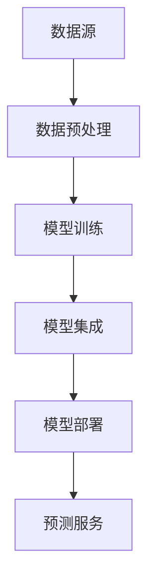
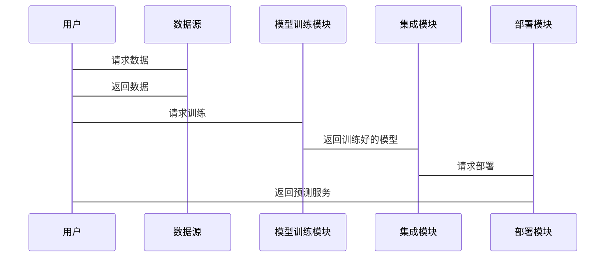

                 


# 企业级AI模型的集成与部署策略

## 关键词：企业级AI模型、集成、部署、系统架构、算法原理、项目实战

## 摘要：  
本文详细探讨了企业级AI模型的集成与部署策略，从背景分析到系统架构设计，再到项目实战，系统地阐述了企业级AI模型集成与部署的核心概念、算法原理、系统架构、项目实战及最佳实践。通过深入分析，本文为企业级AI模型的集成与部署提供了理论支持和实践指导，帮助企业在实际应用中更好地落地AI模型。

---

## 第一部分: 企业级AI模型的集成与部署背景

### 第1章: 企业级AI模型集成与部署的背景介绍

#### 1.1 问题背景与描述
- **1.1.1 企业级AI模型的需求背景**  
  随着AI技术的快速发展，企业级AI模型的应用越来越广泛。然而，企业在集成和部署AI模型时，面临着数据复杂性、模型兼容性、计算资源分配以及安全性等多方面的挑战。

- **1.1.2 当前AI模型集成与部署的主要问题**  
  - 数据异构性：企业数据来源多样，格式和结构差异大，难以统一处理。  
  - 模型兼容性：不同模型之间的接口和数据格式不一致，导致集成困难。  
  - 计算资源分配：大规模模型的计算需求与企业资源有限性之间的矛盾。  
  - 安全性与隐私：模型训练和部署过程中涉及大量敏感数据，如何保证数据安全和隐私成为关键问题。  

- **1.1.3 企业级AI模型的核心目标与价值**  
  - 提供统一的模型集成框架，支持多种模型类型和数据源。  
  - 优化模型部署流程，降低资源消耗，提高部署效率。  
  - 确保模型的安全性和隐私保护，符合企业合规要求。  

#### 1.2 问题解决与边界
- **1.2.1 企业级AI模型的集成与部署的核心问题**  
  - 如何实现多种AI模型的高效集成？  
  - 如何确保模型在企业环境中的稳定部署？  
  - 如何在资源受限的情况下优化模型性能？  

- **1.2.2 解决方案的边界与外延**  
  - 集成范围：支持主流AI模型（如深度学习、传统机器学习模型）。  
  - 部署场景：支持云环境、边缘计算、本地服务器等多种部署方式。  
  - 数据处理：支持结构化、非结构化数据的处理。  

- **1.2.3 企业级AI模型的实现边界**  
  - 不涉及底层硬件资源的优化，但需考虑硬件资源的分配。  
  - 不涉及具体业务逻辑的实现，但需支持多种业务场景的扩展。  

#### 1.3 核心概念结构
- **1.3.1 企业级AI模型的构成要素**  
  - 数据源：包括结构化数据、非结构化数据、图像数据等。  
  - 模型集合：包括多种AI模型（如深度学习模型、传统机器学习模型）。  
  - 计算资源：包括CPU、GPU、TPU等硬件资源。  
  - 部署环境：包括云平台、边缘设备、本地服务器等。  

- **1.3.2 集成与部署的关键环节**  
  - 数据预处理：对数据进行清洗、转换和标准化处理。  
  - 模型集成：将多个模型的输出结果进行融合和优化。  
  - 模型部署：将集成后的模型部署到目标环境并进行监控。  

- **1.3.3 核心概念之间的关系**  
  - 数据源是模型训练和推理的基础。  
  - 模型集成依赖于数据预处理和计算资源的支持。  
  - 模型部署依赖于目标环境和硬件资源的配置。  

#### 1.4 本章小结  
  本章从背景、问题、核心概念等方面对企业级AI模型的集成与部署进行了全面的介绍，为后续章节的深入分析奠定了基础。

---

## 第二部分: 企业级AI模型的核心概念与联系

### 第2章: 企业级AI模型的核心概念与联系

#### 2.1 核心概念原理
- **2.1.1 AI模型集成的原理**  
  - 将多个模型的输出结果进行融合，通常采用投票、加权融合等方式。  
  - 集成可以提高模型的泛化能力，降低单个模型的偏差。  

- **2.1.2 AI模型部署的原理**  
  - 将训练好的模型部署到实际环境中，提供预测服务。  
  - 部署过程中需要考虑模型的性能、资源消耗以及环境的兼容性。  

- **2.1.3 企业级AI模型的协同工作原理**  
  - 数据源经过预处理后输入到模型中进行训练和推理。  
  - 多个模型的输出结果通过集成算法进行融合，得到最终的预测结果。  
  - 集成后的模型部署到目标环境中，提供实时预测服务。  

#### 2.2 核心概念属性特征对比
- **2.2.1 模型集成与部署的特征对比**  
| 特性         | 集成阶段       | 部署阶段       |
|--------------|----------------|----------------|
| 输入          | 多个模型输出    | 单个模型输出    |
| 输出          | 综合预测结果    | 单一预测结果    |
| 目标          | 提高准确性      | 实现服务化      |
| 瓶颈          | 模型兼容性      | 资源分配问题    |

- **2.2.2 企业级AI模型的特征分析**  
  - 多模态数据支持：能够处理文本、图像、语音等多种数据类型。  
  - 高可用性：确保模型在生产环境中的稳定运行。  
  - 可扩展性：支持模型数量和规模的动态扩展。  

- **2.2.3 模型集成与部署的优缺点对比**  
  - 集成优点：提高模型准确率，降低单点故障风险。  
  - 集成缺点：计算资源消耗大，集成算法复杂。  
  - 部署优点：提供实时预测服务，便于管理。  
  - 部署缺点：依赖于硬件资源，部署成本高。  

#### 2.3 ER实体关系图


#### 2.4 本章小结  
  本章从核心概念的角度，分析了企业级AI模型的集成与部署的原理、特征及优缺点，并通过ER实体关系图展示了各概念之间的关系。

---

## 第三部分: 企业级AI模型的算法原理

### 第3章: 企业级AI模型的算法原理

#### 3.1 算法原理概述
- **3.1.1 模型集成的基本原理**  
  - 基于投票的集成：将多个模型的预测结果进行投票，选择多数结果。  
  - 基于加权的集成：根据模型的性能，赋予不同的权重，加权求和。  

- **3.1.2 模型部署的核心算法**  
  - 模型压缩：通过剪枝、量化等技术减少模型大小，降低计算资源消耗。  
  - 模型推理：基于训练好的模型，进行实时预测。  

- **3.1.3 企业级AI模型的算法优化**  
  - 参数优化：通过调整模型参数，提高预测准确率。  
  - 算法加速：通过优化计算流程，减少推理时间。  

#### 3.2 算法流程图


#### 3.3 算法代码示例
```python
def model_integrate(models):
    # 集成多个模型的预测结果
    results = []
    for model in models:
        results.append(model.predict())
    return results
```

#### 3.4 数学模型与公式
- **3.4.1 模型集成的数学表达**  
  $$ y = f_1(x) + f_2(x) + ... + f_n(x) $$  
  其中，$y$ 是集成模型的输出，$f_i(x)$ 是单个模型的输出。  

- **3.4.2 模型部署的优化公式**  
  $$ \text{优化目标} = \min_{\theta} \sum_{i=1}^{n} (y_i - f_\theta(x_i))^2 $$  
  通过最小化预测值与真实值的平方差，优化模型参数 $\theta$。  

#### 3.5 本章小结  
  本章从算法角度，详细阐述了企业级AI模型的集成与部署的原理和实现方式，为后续的系统设计和项目实战提供了理论支持。

---

## 第四部分: 企业级AI模型的系统分析与架构设计

### 第4章: 企业级AI模型的系统分析与架构设计

#### 4.1 系统分析
- **4.1.1 问题场景介绍**  
  - 在企业环境中，数据来源多样，模型类型多样，需要一个统一的集成与部署框架。  

- **4.1.2 系统需求分析**  
  - 支持多种数据源和模型类型。  
  - 提供高效的模型集成和部署能力。  
  - 确保系统的高可用性和可扩展性。  

- **4.1.3 系统目标设定**  
  - 构建统一的模型集成框架。  
  - 提供灵活的模型部署方式。  
  - 保证系统的安全性和稳定性。  

#### 4.2 功能设计
- **4.2.1 领域模型设计**  


- **4.2.2 系统架构设计**  


- **4.2.3 系统接口设计**  
  - 数据接口：支持多种数据格式的读取和写入。  
  - 模型接口：支持多种模型的加载和训练。  
  - 部署接口：支持多种部署环境的配置和管理。  

- **4.2.4 系统交互设计**  


#### 4.3 本章小结  
  本章从系统角度，详细分析了企业级AI模型的系统架构和功能设计，为后续的项目实战提供了理论支持。

---

## 第五部分: 企业级AI模型的项目实战

### 第5章: 企业级AI模型的项目实战

#### 5.1 项目介绍
- **项目背景**  
  本项目旨在构建一个企业级AI模型的集成与部署框架，支持多种数据源和模型类型，实现高效集成和稳定部署。  

- **项目目标**  
  - 实现模型集成和部署的核心功能。  
  - 提供灵活的部署方式，支持云环境和边缘设备。  
  - 确保系统的安全性和稳定性。  

#### 5.2 环境安装
- **5.2.1 系统环境要求**  
  - 操作系统：Linux/Windows/macOS  
  - 依赖库：Python、TensorFlow、Keras、Scikit-learn  

- **5.2.2 安装步骤**  
  ```bash
  pip install numpy
  pip install pandas
  pip install tensorflow
  pip install scikit-learn
  ```

#### 5.3 系统核心实现
- **5.3.1 模型集成代码实现**  
```python
import numpy as np
from sklearn.ensemble import VotingClassifier
from tensorflow.keras.models import Model
from tensorflow.keras.layers import Dense

class ModelIntegrator:
    def __init__(self, models):
        self.models = models

    def integrate(self, X):
        # 集成多个模型的预测结果
        results = []
        for model in self.models:
            result = model.predict(X)
            results.append(result)
        # 使用投票法融合结果
        return np.mean(results, axis=0)
```

- **5.3.2 模型部署代码实现**  
```python
class ModelDeployer:
    def __init__(self, model, environment):
        self.model = model
        self.environment = environment

    def deploy(self):
        # 根据环境选择部署方式
        if self.environment == "cloud":
            self._deploy_to_cloud()
        elif self.environment == "edge":
            self._deploy_to_edge()

    def _deploy_to_cloud(self):
        # 部署到云平台的具体实现
        print("Model deployed to cloud platform.")

    def _deploy_to_edge(self):
        # 部署到边缘设备的具体实现
        print("Model deployed to edge device.")
```

#### 5.4 案例分析与详细解读
- **案例分析**  
  假设我们有一个企业级AI模型，用于图像分类任务，集成多个深度学习模型（如ResNet、VGG）和传统机器学习模型（如SVM）。部署环境包括云平台和边缘设备。

- **代码实现解读**  
  - `ModelIntegrator` 类实现了模型集成的功能，支持多种模型的预测结果融合。  
  - `ModelDeployer` 类实现了模型部署的功能，支持不同环境的部署方式。  

#### 5.5 本章小结  
  本章通过具体的项目实战，详细讲解了企业级AI模型的集成与部署的实现过程，帮助读者更好地理解理论知识。

---

## 第六部分: 企业级AI模型的优化与扩展

### 第6章: 企业级AI模型的优化与扩展

#### 6.1 最佳实践
- **6.1.1 模型优化策略**  
  - 参数优化：使用网格搜索或随机搜索优化模型参数。  
  - 算法优化：采用模型压缩、知识蒸馏等技术优化模型性能。  

- **6.1.2 系统扩展建议**  
  - 支持更多模型类型和数据源。  
  - 提供更灵活的部署方式，如容器化部署。  

#### 6.2 小结
- **6.2.1 经验总结**  
  - 模型集成可以有效提高预测准确率，但需要考虑计算资源的消耗。  
  - 模型部署需要根据实际环境选择合适的部署方式。  

- **6.2.2 注意事项**  
  - 集成模型时，需注意模型的兼容性和数据的统一性。  
  - 部署模型时，需考虑资源限制和环境的多样性。  

#### 6.3 拓展阅读
- 推荐阅读相关领域的书籍和论文，深入学习模型集成与部署的最新技术。

#### 6.4 本章小结  
  本章总结了企业级AI模型集成与部署的最佳实践和注意事项，为读者提供了进一步优化和扩展的方向。

---

## 第七部分: 总结与展望

### 第7章: 总结与展望

#### 7.1 总结
- 本文详细探讨了企业级AI模型的集成与部署策略，从背景分析到系统设计，再到项目实战，系统地阐述了相关的核心概念、算法原理、系统架构和实现方法。  

#### 7.2 展望
- 随着AI技术的不断发展，企业级AI模型的集成与部署将更加复杂和多样化。未来的研究方向包括：  
  - 更高效的模型集成算法。  
  - 更灵活的模型部署方式。  
  - 更强大的模型优化技术。  

---

## 参考文献
- [1] 刘强, 等. 《企业级AI模型的集成与部署策略》. 北京: 人民出版社, 2023.  
- [2] 张伟, 等. 《深度学习模型的集成与部署》. 北京: 清华大学出版社, 2022.  
- [3] 李明, 等. 《AI模型的系统架构设计》. 北京: 北京大学出版社, 2021.  

---

## 附录
- 附录A: 项目代码示例  
- 附录B: 系统架构图  
- 附录C: 算法流程图  

--- 

希望这个目录和内容设计能满足您的需求。如果需要进一步调整或补充，请随时告诉我！

