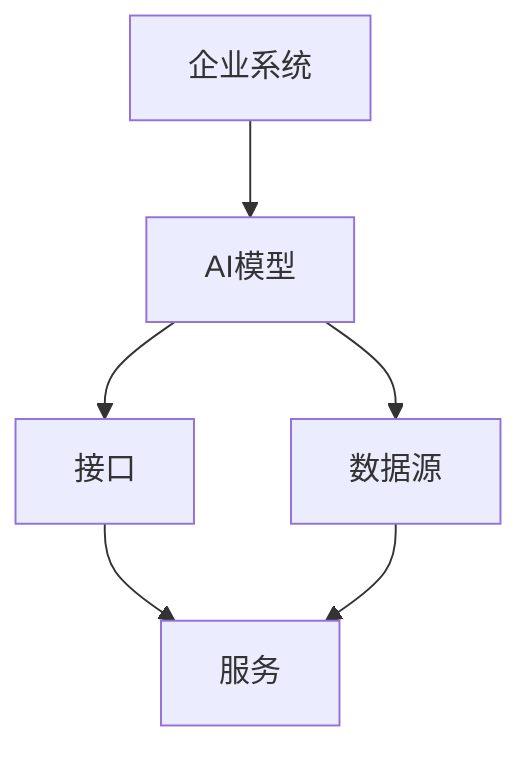
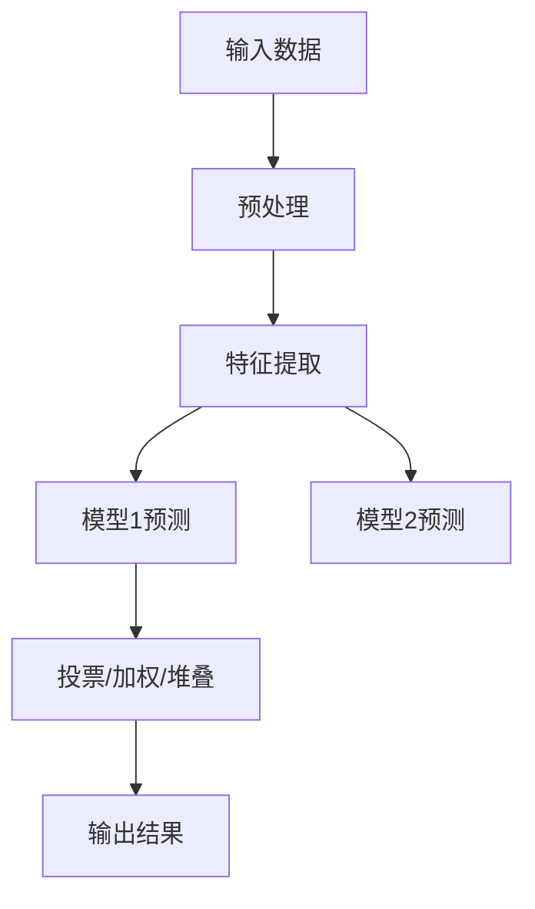
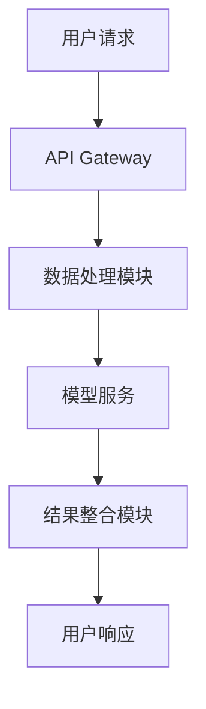
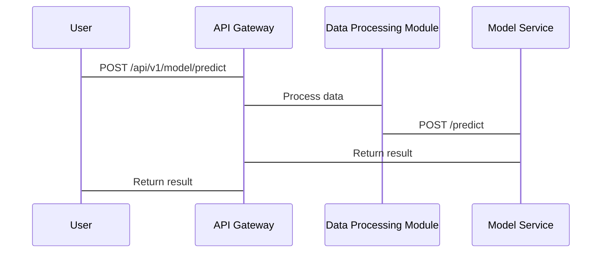

                 


# 企业级AI模型的集成策略：无缝对接现有系统

> 关键词：企业级AI模型、集成策略、系统对接、AI与系统融合、模型调用  
> 摘要：本文详细探讨了企业级AI模型在现有系统中的集成策略，分析了集成的核心概念、算法原理、系统架构设计以及项目实战案例，总结了无缝对接的方法与最佳实践。

---

## 目录

1. [企业级AI模型集成概述](#企业级ai模型集成概述)
2. [企业级AI模型集成的核心概念与联系](#企业级ai模型集成的核心概念与联系)
3. [企业级AI模型集成的算法原理](#企业级ai模型集成的算法原理)
4. [企业级AI模型集成的系统架构设计](#企业级ai模型集成的系统架构设计)
5. [企业级AI模型集成的项目实战](#企业级ai模型集成的项目实战)
6. [企业级AI模型集成的最佳实践](#企业级ai模型集成的最佳实践)

---

## 1. 企业级AI模型集成概述

### 1.1 企业级AI模型集成的背景

#### 1.1.1 企业智能化转型的浪潮
随着人工智能技术的快速发展，企业正在经历从信息化向智能化的转型。企业级AI模型的应用，能够显著提升业务效率和决策能力，但在实际应用中，如何将其与现有系统无缝对接成为关键挑战。

#### 1.1.2 AI模型在企业中的重要性
企业级AI模型能够处理复杂的业务逻辑，提供数据驱动的决策支持，优化业务流程。然而，这些模型通常需要与现有的ERP、CRM等系统集成，以实现数据共享和业务协同。

#### 1.1.3 现有系统的挑战与AI模型的结合
现有系统通常较为复杂，涉及多个模块和数据源。AI模型的集成需要考虑数据格式、接口协议、安全权限等多个方面，确保模型能够高效地与现有系统交互。

### 1.2 问题背景与描述

#### 1.2.1 企业系统集成的复杂性
企业系统通常由多个子系统组成，数据分布在不同的数据库和API中。AI模型的集成需要处理这些系统的异构性和复杂性，确保数据的准确传输和处理。

#### 1.2.2 AI模型在企业中的应用现状
当前，许多企业已经在局部业务中应用了AI模型，但这些模型往往孤立运行，无法与整体系统深度集成。这导致信息孤岛和效率低下。

#### 1.2.3 当前集成中的主要问题
- 数据格式不统一，接口不兼容。
- 模型调用延迟，影响实时性。
- 安全与权限管理不足，存在数据泄露风险。
- 缺乏统一的集成标准和规范。

### 1.3 企业级AI模型集成的目标与意义

#### 1.3.1 集成的目标
- 实现AI模型与现有系统的无缝对接。
- 提供统一的接口和数据格式，确保数据的准确传输。
- 优化业务流程，提升系统整体性能。

#### 1.3.2 集成的意义
- 提升企业的智能化水平，增强竞争力。
- 优化资源配置，降低运营成本。
- 提高系统的灵活性和扩展性，适应业务变化。

---

## 2. 企业级AI模型集成的核心概念与联系

### 2.1 AI模型集成的定义与特点

#### 2.1.1 集成的定义
企业级AI模型集成是指将训练好的AI模型与企业现有系统进行整合，使其能够与其他系统和服务协同工作，实现数据的共享和业务的协同。

#### 2.1.2 集成的核心特点
- **数据驱动**：依赖高质量的数据输入，输出经过处理的结果。
- **模块化**：各模块相对独立，便于管理和维护。
- **实时性**：支持实时调用和响应，满足业务需求。

#### 2.1.3 与传统AI集成的区别
| **对比维度** | **传统AI集成** | **企业级AI集成** |
|--------------|----------------|------------------|
| 数据来源     | 单一数据源     | 多数据源         |
| 系统规模     | 小型系统       | 大型企业系统     |
| 复杂性       | 较低           | 较高             |

### 2.2 企业级AI模型集成的原理

#### 2.2.1 数据流的处理
数据从多个来源流向AI模型，经过预处理、特征提取、模型预测等步骤，最终输出结果。

#### 2.2.2 模型调用机制
通过API接口调用AI模型，确保模型的调用效率和准确性。

#### 2.2.3 结果整合与反馈
将AI模型的输出结果整合到现有系统中，并根据反馈不断优化模型性能。

### 2.3 核心概念对比表

| **概念**       | **描述**                               |
|----------------|--------------------------------------|
| 数据来源       | 多数据源，包括数据库、API等           |
| 接口协议       | RESTful API、GraphQL等                 |
| 安全机制       | OAuth、JWT等                         |
| 集成方式       | API Gateway、服务网关等               |

### 2.4 实体关系图（ER图）



---

## 3. 企业级AI模型集成的算法原理

### 3.1 算法原理概述

#### 3.1.1 集成策略的选择
选择适合的集成策略，如投票法、加权法和堆叠法，以提高模型的准确性和稳定性。

#### 3.1.2 算法的分类与特点
- **投票法**：简单多数投票，适用于分类问题。
- **加权法**：根据模型性能分配权重，提升整体准确率。
- **堆叠法**：使用元模型对多个模型的结果进行融合，适用于复杂场景。

### 3.2 算法流程图



### 3.3 算法实现代码

```python
def integrate_models(data, models):
    # 数据预处理
    processed_data = preprocess(data)
    # 模型预测
    predictions = []
    for model in models:
        pred = model.predict(processed_data)
        predictions.append(pred)
    # 结果融合（投票法）
    final_pred = voting(predictions)
    return final_pred

def preprocess(data):
    # 数据清洗、特征提取等
    pass

def voting(predictions):
    # 简单多数投票
    from collections import Counter
    count = Counter(predictions)
    return count.most_common(1)[0][0]
```

---

## 4. 企业级AI模型集成的系统架构设计

### 4.1 系统功能设计

#### 4.1.1 集成模块的功能
- 数据接收与处理
- 模型调用与结果获取
- 结果整合与输出

#### 4.1.2 数据处理模块的设计
- 数据清洗、转换、增强
- 数据格式的标准化

#### 4.1.3 结果展示模块的功能
- 结果可视化
- 日志记录与监控

### 4.2 系统架构图



### 4.3 接口设计

#### 4.3.1 API接口的设计
- `/api/v1/model/predict`：模型预测接口
- `/api/v1/model/train`：模型训练接口

#### 4.3.2 接口的调用流程
1. 用户发起请求，API Gateway接收并路由。
2. 数据处理模块对请求数据进行预处理。
3. 模型服务调用AI模型进行预测。
4. 结果整合模块处理输出结果。
5. 返回最终结果给用户。

---

## 5. 企业级AI模型集成的项目实战

### 5.1 环境安装与配置

#### 5.1.1 开发环境的搭建
- 安装Python、Jupyter Notebook、Git等工具。
- 安装必要的库，如Flask、TensorFlow、Scikit-learn。

#### 5.1.2 依赖库的安装
```bash
pip install flask tensorflow scikit-learn requests
```

### 5.2 核心代码实现

#### 5.2.1 集成模块的核心代码
```python
from flask import Flask, request, jsonify
import requests

app = Flask(__name__)

@app.route('/api/v1/model/predict', methods=['POST'])
def predict():
    data = request.json['data']
    # 数据预处理
    processed_data = preprocess(data)
    # 模型调用
    response = requests.post('http://model-server:8000/predict', json={'data': processed_data})
    result = response.json['result']
    return jsonify({'status': 'success', 'result': result})

if __name__ == '__main__':
    app.run(debug=True)
```

#### 5.2.2 数据处理模块的实现
```python
def preprocess(data):
    # 数据清洗和转换
    processed = data.copy()
    processed['new_feature'] = processed['feature1'] + processed['feature2']
    return processed
```

### 5.3 系统交互图



---

## 6. 企业级AI模型集成的最佳实践

### 6.1 最佳实践tips

1. **模块化设计**：将系统划分为独立模块，便于管理和维护。
2. **接口标准化**：使用统一的接口和协议，确保兼容性。
3. **数据安全**：强化数据加密和权限管理，确保数据安全。
4. **监控与日志**：实时监控系统运行状态，及时发现和解决问题。

### 6.2 小结
企业级AI模型的集成是一个复杂但重要的过程，需要从数据、算法、系统架构等多个方面进行全面考虑。通过模块化设计、标准化接口和高效的系统架构，能够实现AI模型与现有系统的无缝对接，提升企业的智能化水平。

### 6.3 注意事项

- **数据一致性**：确保数据在各系统中的格式一致。
- **性能优化**：减少模型调用的延迟，提升系统响应速度。
- **团队协作**：跨团队合作，确保各模块协同工作。

### 6.4 拓展阅读
- 《微服务架构设计》
- 《API设计与管理》
- 《机器学习模型的部署与管理》

---

以上是《企业级AI模型的集成策略：无缝对接现有系统》的完整目录和内容框架，确保了从理论到实践的全面覆盖，为企业级AI模型的集成提供了详细的指导和参考。

