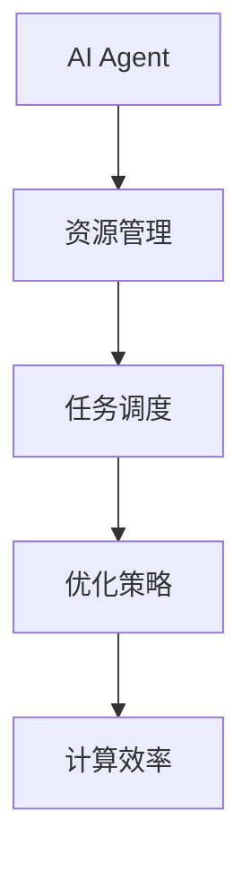
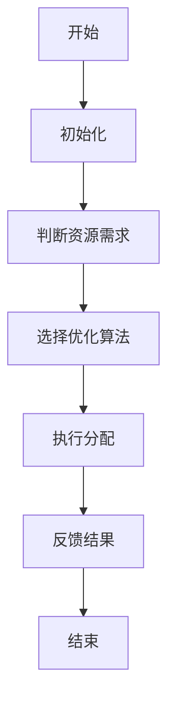
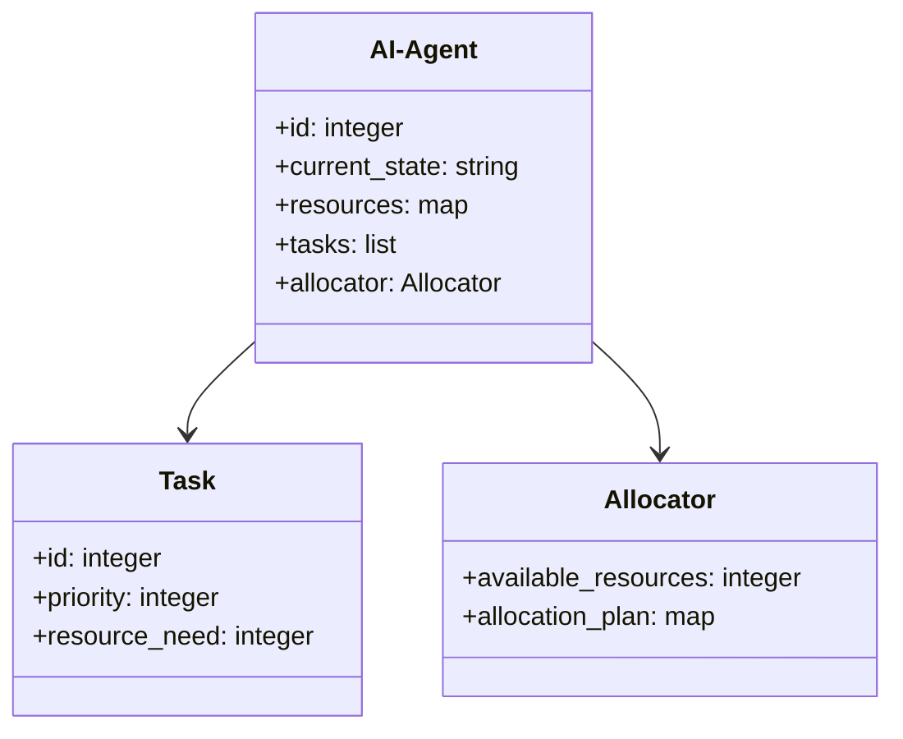
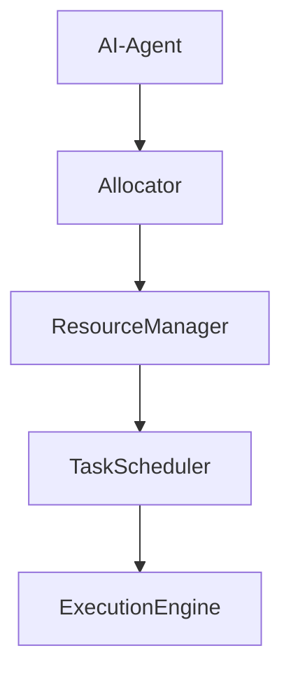

                 


# 优化AI Agent的资源利用：计算效率提升策略

## 关键词：AI Agent，资源利用，计算效率，优化策略，算法优化，系统架构

## 摘要：  
在AI Agent开发中，资源利用效率直接影响其性能和响应速度。本文将探讨如何优化AI Agent的资源利用，通过分析计算效率提升策略，结合实际案例，详细阐述算法优化、系统架构设计等关键点，帮助开发者提升AI Agent的资源管理能力。

---

## 第一部分：背景介绍

### 第1章：AI Agent与资源利用概述

#### 1.1 AI Agent的基本概念
- **1.1.1 AI Agent的定义与特点**  
  AI Agent（人工智能代理）是能够感知环境、自主决策并执行任务的智能实体。其特点包括自主性、反应性、目标导向和学习能力。

- **1.1.2 AI Agent的资源利用问题背景**  
  AI Agent在运行过程中需要依赖计算资源（如CPU、内存）和数据资源。资源分配不当可能导致任务执行效率低下，甚至失败。

- **1.1.3 资源利用对AI Agent性能的影响**  
  资源利用效率直接影响AI Agent的响应速度和处理能力。优化资源利用是提升性能的关键。

#### 1.2 资源利用的核心问题
- **1.2.1 计算资源分配的挑战**  
  在多任务环境中，资源分配需要动态调整以满足不同任务的需求。

- **1.2.2 资源利用率与计算效率的关系**  
  高利用率意味着资源被充分利用，从而提高计算效率。

- **1.2.3 资源分配对任务完成的影响**  
  合理分配资源可以避免资源瓶颈，确保任务高效完成。

#### 1.3 优化资源利用的重要性
- **1.3.1 提高计算效率的意义**  
  资源优化可以减少计算时间，降低成本。

- **1.3.2 资源优化对性能的提升**  
  优化资源分配可以提升AI Agent的响应速度和准确性。

- **1.3.3 资源利用与成本控制的关系**  
  合理利用资源可以降低运营成本。

---

## 第二部分：核心概念与联系

### 第2章：AI Agent资源利用模型

#### 2.1 AI Agent资源利用模型的构建
- **2.1.1 模型的核心要素**  
  包括资源类型、任务需求、分配策略和反馈机制。

- **2.1.2 模型的输入与输出**  
  输入：任务需求和可用资源；输出：资源分配方案和优化结果。

- **2.1.3 模型的边界与外延**  
  模型适用于多种AI Agent场景，但需根据具体环境调整参数。

#### 2.2 资源分配与任务调度的关系
- **2.2.1 资源分配的基本原理**  
  根据任务需求分配资源，确保任务顺利执行。

- **2.2.2 任务调度的核心机制**  
  使用优先级队列和负载均衡技术优化任务调度。

- **2.2.3 协同优化的意义**  
  资源分配与任务调度的协同优化可以提升整体效率。

#### 2.3 资源利用的优化目标
- **2.3.1 最大化资源利用率**  
  确保资源被充分利用，减少浪费。

- **2.3.2 最小化资源浪费**  
  通过动态调整资源分配，避免资源闲置。

- **2.3.3 平衡资源分配与任务优先级**  
  根据任务的重要性和紧急性动态调整资源分配。

---

### 2.4 核心概念关系图（Mermaid）


---

## 第三部分：算法原理讲解

### 第3章：资源分配优化算法

#### 3.1 贪心算法
- **3.1.1 基本原理**  
  贪心算法通过局部最优选择构建全局最优解。

- **3.1.2 应用场景**  
  适用于任务优先级明确、资源需求简单的场景。

- **3.1.3 优缺点分析**  
  优点：简单高效；缺点：可能无法处理复杂场景。

#### 3.2 动态规划算法
- **3.2.1 基本原理**  
  动态规划通过分解问题，逐步构建最优解。

- **3.2.2 应用场景**  
  适用于资源需求动态变化的复杂场景。

- **3.2.3 优缺点分析**  
  优点：全局优化能力强；缺点：计算复杂度高。

---

### 3.3 算法流程图（Mermaid）


---

#### 3.4 算法实现代码
```python
def greedy_algorithm(tasks, resources):
    # 按任务优先级排序
    sorted_tasks = sorted(tasks, key=lambda x: x['priority'])
    # 分配资源
    allocation = {}
    for task in sorted_tasks:
        if task['resources'] <= resources:
            allocation[task['id']] = task['resources']
            resources -= task['resources']
        else:
            allocation[task['id']] = resources
            resources = 0
            break
    return allocation
```

---

### 3.5 算法数学模型
优化问题的数学表达式为：
$$
\text{最大化 } \sum_{i=1}^{n} \frac{x_i}{y_i} 
$$
其中，$x_i$ 是任务i分配的资源量，$y_i$ 是任务i的处理时间。

---

## 第四部分：数学模型与公式

### 第4章：优化问题的数学表达

#### 4.1 线性规划模型
目标函数：
$$
\text{最大化 } \sum_{i=1}^{n} u_i 
$$
约束条件：
$$
\sum_{i=1}^{n} r_i \leq R 
$$
其中，$u_i$ 是资源利用率，$r_i$ 是任务i分配的资源量，$R$ 是总资源量。

---

## 第五部分：系统分析与架构设计方案

### 第5章：系统架构设计

#### 5.1 系统功能设计（领域模型）


---

#### 5.2 系统架构设计（架构图）


---

## 第六部分：项目实战

### 第6章：优化资源分配的项目实现

#### 6.1 环境安装
- 安装Python和相关库：
  ```bash
  pip install numpy matplotlib
  ```

---

#### 6.2 核心实现代码
```python
import numpy as np

def allocate_resources(tasks, resources):
    # 按优先级排序
    tasks.sort(key=lambda x: x['priority'])
    allocation = {}
    for task in tasks:
        req = task['resource_need']
        if req <= resources:
            allocation[task['id']] = req
            resources -= req
        else:
            allocation[task['id']] = resources
            resources = 0
            break
    return allocation

# 示例任务
tasks = [
    {'id': 1, 'priority': 3, 'resource_need': 5},
    {'id': 2, 'priority': 2, 'resource_need': 4},
    {'id': 3, 'priority': 1, 'resource_need': 3}
]
total_resources = 10

# 调用分配函数
allocation = allocate_resources(tasks, total_resources)
print(allocation)
```

---

#### 6.3 案例分析
通过上述代码，AI Agent能够根据任务优先级动态分配资源，确保高优先级任务优先获得资源，从而提高整体效率。

---

## 第七部分：最佳实践

### 第7章：优化策略与注意事项

#### 7.1 小结
- 优化资源利用需要结合算法和系统架构设计。
- 动态调整资源分配以适应任务需求变化。

#### 7.2 注意事项
- 考虑任务的动态需求和优先级变化。
- 避免过度优化导致的计算开销。

#### 7.3 拓展阅读
- 推荐阅读《算法导论》和《分布式系统：概念与设计》。

---

通过以上步骤，我们系统地探讨了优化AI Agent资源利用的策略和方法，从理论分析到实际实现，帮助开发者提升AI Agent的计算效率和性能。

