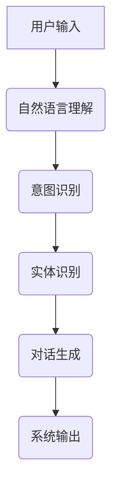
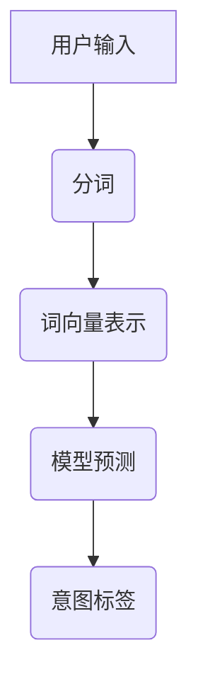
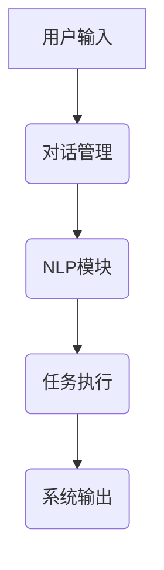
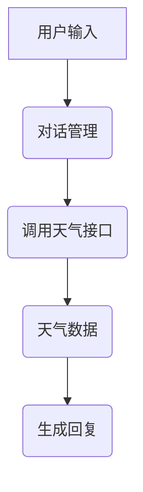

                 


# 优化用户体验：智能助手设计的关键点

---

## 关键词：智能助手，用户体验优化，对话系统，自然语言处理，意图识别，系统架构

---

## 摘要：  
智能助手作为人工智能领域的重要应用，其设计与用户体验密切相关。本文从智能助手的核心概念、算法原理、系统架构、项目实战等多个角度，详细分析了优化用户体验的关键点。通过深入探讨对话系统、自然语言处理、意图识别等技术，结合实际案例，为读者提供了一套系统化的设计思路与实践指南。

---

## 目录

1. [引言](#引言)
2. [智能助手的核心概念](#智能助手的核心概念)
3. [对话系统设计](#对话系统设计)
4. [自然语言处理与智能助手](#自然语言处理与智能助手)
5. [系统架构与设计](#系统架构与设计)
6. [项目实战：智能助手开发](#项目实战智能助手开发)
7. [总结与展望](#总结与展望)

---

## 1. 引言

随着人工智能技术的快速发展，智能助手已经成为我们生活中不可或缺的一部分。从智能手机的语音助手到智能家居的控制中心，智能助手的应用场景越来越广泛。然而，智能助手的设计不仅仅是技术实现的问题，更关乎用户体验的优化。本文将从技术与设计的双重角度，深入探讨智能助手设计的关键点。

---

## 2. 智能助手的核心概念

### 2.1 智能助手的定义

智能助手是一种基于人工智能技术的交互系统，能够通过自然语言处理（NLP）技术理解用户的意图，并通过对话或命令执行相应的操作。智能助手的核心目标是为用户提供高效、便捷、个性化的服务。

### 2.2 智能助手的核心功能

- **对话交互**：通过自然语言理解用户的需求，并以自然语言进行反馈。
- **任务执行**：根据用户指令完成特定任务，例如查询信息、控制设备等。
- **学习与优化**：通过用户反馈不断优化自身的响应策略和行为模式。

### 2.3 智能助手的特点

- **智能化**：基于AI技术，能够理解上下文和用户意图。
- **交互性**：支持多轮对话，提供流畅的用户体验。
- **可扩展性**：能够快速接入新的功能模块和服务。

---

## 3. 对话系统设计

### 3.1 对话系统的分类

对话系统主要分为两类：
1. **基于规则的对话系统**：通过预定义的规则和模板进行对话，适用于简单的任务场景。
2. **基于深度学习的对话系统**：利用神经网络模型（如Transformer）进行对话生成，能够处理复杂场景。

### 3.2 对话系统的流程

以下是基于深度学习的对话系统流程图：



### 3.3 对话系统的关键技术

1. **自然语言理解（NLU）**：将用户的输入转化为结构化的信息。
2. **意图识别**：确定用户的意图，例如“查询天气”或“设置提醒”。
3. **对话生成**：根据意图生成自然语言的回复。

---

## 4. 自然语言处理与智能助手

### 4.1 自然语言处理基础

自然语言处理（NLP）是智能助手的核心技术之一。NLP的目标是让计算机能够理解、处理和生成人类语言。常见的NLP任务包括分词、句法分析、语义理解等。

### 4.2 智能助手中常用的NLP算法

1. **分词**：将连续的文本分割成词语或短语。常用的算法有jieba（中文）和spaCy（英文）。
2. **句法分析**：分析句子的语法结构，确定词语的词性和依存关系。
3. **语义理解**：通过上下文理解文本的含义，常用模型有BERT和GPT。

### 4.3 实体识别与意图识别

实体识别（NER）：从文本中提取出命名实体，例如人名、地名、时间等。  
意图识别：通过用户的输入确定其意图，例如“我想查询明天北京的天气”。

以下是一个简单的意图识别流程图：



---

## 5. 系统架构与设计

### 5.1 系统架构设计

智能助手的系统架构通常包括以下几个模块：
1. **用户界面（UI/UX）**：与用户交互的界面，可以是语音或文本形式。
2. **对话管理模块**：负责处理用户的输入并生成响应。
3. **自然语言处理模块**：对用户的输入进行理解和分析。
4. **任务执行模块**：根据用户的指令执行相应的任务。

以下是一个简单的系统架构图：



### 5.2 系统接口设计

智能助手通常需要与其他服务进行交互，例如天气查询接口、数据库查询接口等。以下是一个接口交互流程图：



---

## 6. 项目实战：智能助手开发

### 6.1 环境安装

开发智能助手需要以下环境：
- Python 3.8+
- 基础Python库（如numpy、pandas）
- NLP库（如spaCy、jieba）
- 深度学习框架（如TensorFlow、PyTorch）

### 6.2 核心代码实现

以下是一个简单的智能助手代码示例：

```python
import spacy

# 加载模型
nlp = spacy.load("zh_core_web_sm")

# 对话管理模块
def get_response(user_input):
    doc = nlp(user_input)
    # 实体识别
    entities = [(ent.text, ent.label_) for ent in doc.ents]
    # 意图识别
    intent = "unknown"
    for token in doc:
        if token.pos_ == "VERB":
            intent = token.lemma_
            break
    return f"您输入的内容是：{user_input}\n识别到的实体是：{entities}\n意图是：{intent}"

# 主程序
if __name__ == "__main__":
    print("智能助手已启动，请输入您的问题：")
    while True:
        user_input = input()
        print(get_response(user_input))
```

### 6.3 案例分析

假设用户输入“明天北京天气怎么样？”，系统会进行以下处理：
1. **分词**：将输入分割为“明天”、“北京”、“天气怎么样”。
2. **实体识别**：识别出“北京”为地名。
3. **意图识别**：识别出“查询天气”为意图。
4. **任务执行**：调用天气API查询北京天气。
5. **生成回复**：返回天气信息。

---

## 7. 总结与展望

### 7.1 本章小结

智能助手的设计需要综合考虑技术与用户体验。通过优化对话系统、自然语言处理和系统架构，可以显著提升用户体验。本文从理论到实践，详细介绍了智能助手设计的关键点。

### 7.2 未来展望

随着人工智能技术的不断进步，智能助手将更加智能化和个性化。未来的研究方向包括：
1. 更加精准的意图识别算法。
2. 多语言支持与跨文化适应。
3. 更加自然的对话生成技术。

---

## 参考文献

1. 周俊杰. 《深度学习入门：基于Python的CNN、RNN、GAN等算法原理与实现》
2. 王海峰. 《自然语言处理实战：基于Python的算法实现》
3. TensorFlow官方文档

---

## 至读者

希望本文能够为智能助手的设计者和开发者提供有价值的参考。如果您有任何问题或建议，欢迎留言讨论！

