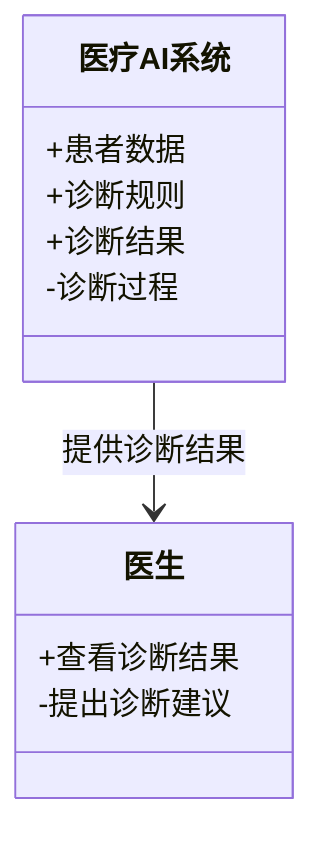

                 


# 伦理AI：设计符合道德标准的AI Agent

> 关键词：伦理AI，AI代理，道德框架，决策算法，系统架构，利益相关者分析

> 摘要：本文探讨了如何设计符合道德标准的AI Agent，从伦理AI的背景、核心概念、算法原理到系统架构和项目实战，详细分析了伦理AI的重要性和实现方法。通过构建道德框架、设计伦理决策算法、优化系统架构，结合实际案例，展示了如何在AI开发中融入伦理考量，确保AI Agent的行为符合社会道德标准。

---

# 第一部分: 伦理AI的背景与核心概念

## 第1章: 人工智能的现状与伦理挑战

### 1.1 人工智能的发展历程

人工智能（AI）技术近年来取得了突飞猛进的发展，从最初的学术研究到如今的广泛应用，AI已经渗透到我们生活的方方面面。以下是AI发展的关键阶段：

- **阶段一：概念提出（1950s）**：图灵提出著名的“图灵测试”，为AI研究奠定了基础。
- **阶段二：专家系统发展（1980s）：AI开始应用于医疗、金融等领域，专家系统成为主流。
- **阶段三：机器学习兴起（2000s）：深度学习和神经网络的发展推动了AI的普及。
- **阶段四：AI的全面应用（2010s至今）：AI技术广泛应用于自动驾驶、医疗诊断、金融分析等领域。

### 1.2 伦理问题在AI发展中的重要性

随着AI技术的广泛应用，伦理问题日益凸显。以下是AI发展中的主要伦理挑战：

- **隐私问题**：AI系统需要大量数据，可能导致个人隐私泄露。
- **偏见与歧视**：训练数据中的偏见可能导致AI做出不公平的决策。
- **责任归属**：当AI系统出现问题时，责任归属不明确，影响法律和道德责任的承担。

### 1.3 伦理AI的基本概念

伦理AI是指在AI开发和应用过程中，遵循伦理原则和道德规范，确保AI系统的决策和行为符合社会价值观。

---

## 第2章: 伦理AI的核心概念与联系

### 2.1 伦理AI的定义与内涵

伦理AI不仅仅是技术问题，更是一个涉及社会、法律、伦理等多方面的综合问题。伦理AI的核心内涵包括：

- **目的性**：AI系统的目标应符合人类价值观。
- **可解释性**：AI的决策过程必须透明，便于人类理解和监督。
- **公平性**：AI系统不应歧视或偏袒特定群体。

### 2.2 伦理AI与传统AI的区别

传统AI注重功能实现和性能优化，而伦理AI则在传统AI的基础上，增加了伦理约束和道德考量。

| 特性 | 传统AI | 伦理AI |
|------|--------|--------|
| 目标 | 功能实现 | 道德约束 |
| 决策 | 基于数据 | 基于伦理 |
| 可解释性 | 低 | 高 |

---

# 第二部分: 伦理AI的算法原理

## 第4章: 伦理决策的算法设计

### 4.1 伦理决策的基本原理

伦理决策算法的核心是将伦理原则转化为可计算的形式，以下是三种主要的决策算法：

- **基于规则的决策系统**：通过预定义的伦理规则进行决策。
- **基于效用的决策系统**：通过最大化效用来选择最优决策。
- **基于学习的决策系统**：通过机器学习模型学习伦理原则。

### 4.2 伦理决策的数学模型

以下是多目标优化模型的数学表达：

$$ \text{目标函数：} \quad f(x) = \sum_{i=1}^{n} w_i x_i $$

其中，$w_i$是伦理原则的权重，$x_i$是决策变量。

---

## 第5章: 伦理AI的数学模型与公式

### 5.1 伦理决策的数学模型

以下是基于权重的决策模型：

$$ \text{权重分配：} \quad w_i \in [0,1] \quad \text{且} \quad \sum_{i=1}^{n} w_i = 1 $$

---

# 第三部分: 伦理AI的系统架构与实现

## 第6章: 系统分析与架构设计

### 6.1 问题场景介绍

以医疗诊断AI系统为例，系统需要在诊断过程中考虑患者的隐私、治疗效果、医疗资源分配等伦理因素。

### 6.2 系统功能设计

以下是系统功能设计的领域模型：



---

## 第7章: 项目实战

### 7.1 环境安装

安装Python和必要的库，例如：

- `pip install numpy`
- `pip install scikit-learn`

### 7.2 核心代码实现

以下是基于规则的伦理决策系统代码：

```python
def ethical_decision(rules, weights):
    decision = 0
    for i in range(len(rules)):
        decision += rules[i] * weights[i]
    return decision
```

---

## 第8章: 总结与展望

### 8.1 最佳实践

- 在AI开发中，始终将伦理原则放在首位。
- 定期审查和更新伦理框架，以适应社会变化。

### 8.2 小结

通过构建道德框架、设计伦理决策算法、优化系统架构，我们可以开发出符合道德标准的AI Agent，确保技术服务于人类社会的福祉。

### 8.3 注意事项

- 在设计AI系统时，必须考虑潜在的伦理风险。
- 确保AI系统的决策过程透明可解释。

### 8.4 拓展阅读

- 《Ethics in AI: A Comprehensive Guide》
- 《Designing Ethical AI Systems》

---

# 结语

伦理AI是人工智能技术发展的重要方向，通过本文的分析，我们可以更好地理解如何在AI开发中融入伦理考量，确保技术的发展符合人类社会的道德标准。未来，随着技术的进步，伦理AI将更加智能化和人性化，为人类社会带来更多的福祉。

