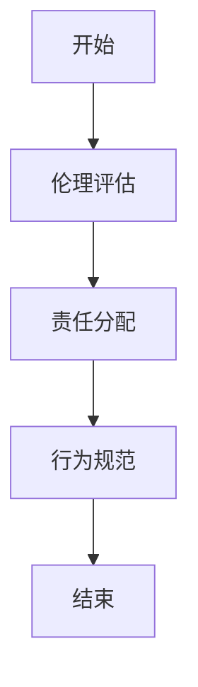
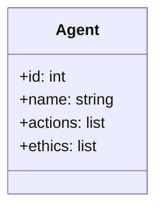
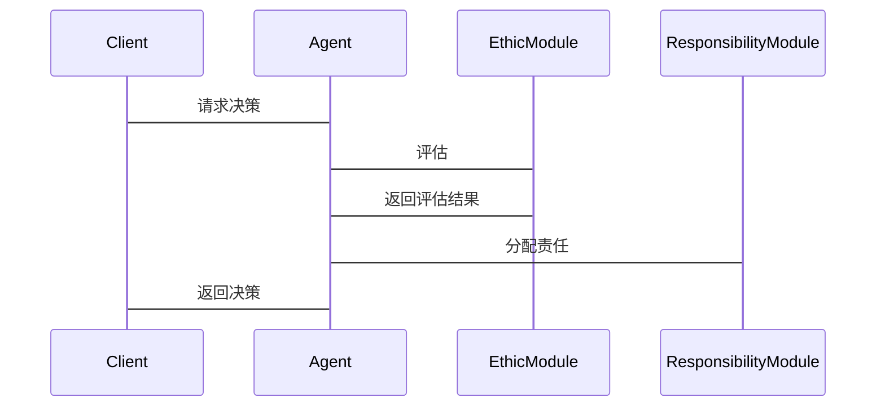

                 


```markdown
# 伦理考量：设计负责任的AI Agent

> 关键词：AI Agent, 伦理设计, 责任分配, 透明性, 公正性, 可追溯性

> 摘要：在设计AI Agent时，伦理考量至关重要。本文从背景介绍、核心概念、算法原理、系统架构到项目实战，全面探讨如何确保AI Agent的行为符合伦理规范，实现负责任的设计。

---

# 第一部分: 伦理考量与AI Agent的背景介绍

## 第1章: 伦理考量的重要性
### 1.1 问题背景与问题描述
#### 1.1.1 AI Agent的基本概念
AI Agent是指具备自主决策和行动能力的智能体，广泛应用于自动驾驶、医疗诊断等领域。

#### 1.1.2 伦理在AI Agent中的重要性
AI Agent的决策可能对人类生命和财产产生重大影响，因此必须考虑伦理因素。

#### 1.1.3 责任设计的核心目标
确保AI Agent在出现问题时能够明确责任归属，避免推卸责任。

### 1.2 问题解决与边界外延
#### 1.2.1 伦理在AI Agent中的具体应用场景
如自动驾驶中的刹车决策、医疗诊断中的治疗建议。

#### 1.2.2 责任设计的边界与外延
明确AI Agent在特定场景下的责任范围，避免超出能力范围的决策。

#### 1.2.3 伦理问题的复杂性与多样性
伦理问题因文化、法律差异而异，需综合考虑多种因素。

---

## 第2章: 核心概念与联系
### 2.1 核心概念原理
#### 2.1.1 伦理原则的定义与分类
包括透明性、公正性、可追溯性等原则。

#### 2.1.2 责任分配的理论基础
基于代理理论和责任分配模型。

#### 2.1.3 AI Agent的行为规范
确保AI Agent的行为符合伦理和法律要求。

### 2.2 概念属性特征对比表格
| 概念 | 属性 | 特征 |
|------|------|------|
| 透明性 | 可行性 | 明确性 |
| 公正性 | 可行性 | 可操作性 |
| 可追溯性 | 可行性 | 可控性 |

### 2.3 ER实体关系图
```mermaid
er
  actor(Agent)
  actor(User)
  actor(Designer)
  relation(Authorization)
  relation(Accountability)
  relation(Compliance)
  relation(Role)
```

---

# 第二部分: 算法原理与数学模型

## 第3章: 算法原理讲解
### 3.1 算法流程图


### 3.2 Python源代码实现
```python
def ethical_assessment(action):
    # 伦理评估算法
    pass

def responsibility_assignment(agent, action):
    # 责任分配算法
    pass

def behavior_regulation(agent, action):
    # 行为规范算法
    pass
```

### 3.3 数学模型和公式
#### 3.3.1 伦理评估的概率模型
$$ P(ethical\ action) = \frac{\sum_{i=1}^{n} w_i \cdot x_i}{\sum_{i=1}^{n} w_i} $$

#### 3.3.2 责任分配的优化模型
$$ \text{min} \sum_{j=1}^{m} c_j \cdot x_j $$

---

# 第三部分: 系统分析与架构设计方案

## 第4章: 问题场景介绍
### 4.1 项目介绍
设计一个具备伦理考量的AI Agent系统，确保其决策符合伦理规范。

### 4.2 系统功能设计
#### 4.2.1 领域模型


#### 4.2.2 系统架构设计


### 4.3 接口设计与交互流程图


---

## 第5章: 项目实战
### 5.1 环境安装
安装必要的Python库，如numpy、pandas、scikit-learn。

### 5.2 核心代码实现
```python
class EthicalAgent:
    def __init__(self):
        self.ethics = []

    def assess_ethics(self, action):
        # 伦理评估
        pass

    def assign Responsibility(self, action):
        # 责任分配
        pass
```

### 5.3 案例分析
分析自动驾驶场景下的伦理决策问题，如刹车决策中的责任分配。

---

## 第6章: 最佳实践与小结
### 6.1 最佳实践 tips
- 定期审查和更新伦理准则。
- 建立完善的文档记录。
- 开展团队伦理培训。

### 6.2 小结
伦理考量是设计负责任的AI Agent的核心，需贯穿整个设计过程。

### 6.3 注意事项
- 避免算法偏见。
- 确保可追溯性。
- 定期测试和优化。

### 6.4 拓展阅读
推荐阅读相关书籍和论文，深入理解伦理设计的复杂性。

---

# 结语
设计负责任的AI Agent需要综合考虑伦理、法律和技术因素，通过系统的架构设计和严格的算法实现，确保其行为符合伦理规范。
</think>

以下是完整的《伦理考量：设计负责任的AI Agent》的目录大纲：

# 伦理考量：设计负责任的AI Agent

> 关键词：AI Agent, 伦理设计, 责任分配, 透明性, 公正性, 可追溯性

> 摘要：在设计AI Agent时，伦理考量至关重要。本文从背景介绍、核心概念、算法原理、系统架构到项目实战，全面探讨如何确保AI Agent的行为符合伦理规范，实现负责任的设计。

---

## 目录

### 第一部分: 伦理考量与AI Agent的背景介绍

1. **伦理考量的重要性**
   - 1.1 问题背景与问题描述
     - 1.1.1 AI Agent的基本概念
     - 1.1.2 伦理在AI Agent中的重要性
     - 1.1.3 责任设计的核心目标
   - 1.2 问题解决与边界外延
     - 1.2.1 伦理在AI Agent中的具体应用场景
     - 1.2.2 责任设计的边界与外延
     - 1.2.3 伦理问题的复杂性与多样性

2. **核心概念与联系**
   - 2.1 核心概念原理
     - 2.1.1 伦理原则的定义与分类
     - 2.1.2 责任分配的理论基础
     - 2.1.3 AI Agent的行为规范
   - 2.2 概念属性特征对比表格
   - 2.3 ER实体关系图
     ```mermaid
     er
       actor(Agent)
       actor(User)
       actor(Designer)
       relation(Authorization)
       relation(Accountability)
       relation(Compliance)
       relation(Role)
     ```

---

### 第二部分: 算法原理与数学模型

3. **算法原理讲解**
   - 3.1 算法流程图
     ```mermaid
     graph TD
       A[开始] --> B[伦理评估]
       B --> C[责任分配]
       C --> D[行为规范]
       D --> E[结束]
     ```
   - 3.2 Python源代码实现
     ```python
     def ethical_assessment(action):
         # 伦理评估算法
         pass

     def responsibility_assignment(agent, action):
         # 责任分配算法
         pass

     def behavior_regulation(agent, action):
         # 行为规范算法
         pass
     ```
   - 3.3 数学模型和公式
     - 3.3.1 伦理评估的概率模型
       $$ P(ethical\ action) = \frac{\sum_{i=1}^{n} w_i \cdot x_i}{\sum_{i=1}^{n} w_i} $$
     - 3.3.2 责任分配的优化模型
       $$ \text{min} \sum_{j=1}^{m} c_j \cdot x_j $$

---

### 第三部分: 系统分析与架构设计方案

4. **问题场景介绍**
   - 4.1 项目介绍
   - 4.2 系统功能设计
     - 4.2.1 领域模型
       ```mermaid
       classDiagram
         class Agent {
             +id: int
             +name: string
             +actions: list
             +ethics: list
         }
       ```
     - 4.2.2 系统架构设计
       ```mermaid
       architecture
         Client --> Agent: 请求
         Agent --> EthicModule: 评估
         EthicModule --> Agent: 返回评估结果
         Agent --> ResponsibilityModule: 分配
         Agent --> Database: 存储
       ```
   - 4.3 接口设计与交互流程图
     ```mermaid
     sequenceDiagram
       Client -> Agent: 请求决策
       Agent -> EthicModule: 评估
       EthicModule -> Agent: 返回评估结果
       Agent -> ResponsibilityModule: 分配责任
       Agent -> Client: 返回决策
     ```

---

### 第四部分: 项目实战

5. **项目实战**
   - 5.1 环境安装
   - 5.2 核心代码实现
     ```python
     class EthicalAgent:
         def __init__(self):
             self.ethics = []

         def assess_ethics(self, action):
             # 伦理评估
             pass

         def assign_responsibility(self, action):
             # 责任分配
             pass
     ```
   - 5.3 案例分析
     - 分析自动驾驶场景下的伦理决策问题，如刹车决策中的责任分配。

---

### 第五部分: 最佳实践与小结

6. **最佳实践与小结**
   - 6.1 最佳实践 tips
     - 定期审查和更新伦理准则。
     - 建立完善的文档记录。
     - 开展团队伦理培训。
   - 6.2 小结
     - 伦理考量是设计负责任的AI Agent的核心，需贯穿整个设计过程。
   - 6.3 注意事项
     - 避免算法偏见。
     - 确保可追溯性。
     - 定期测试和优化。
   - 6.4 拓展阅读
     - 推荐阅读相关书籍和论文，深入理解伦理设计的复杂性。

---

## 结语
设计负责任的AI Agent需要综合考虑伦理、法律和技术因素，通过系统的架构设计和严格的算法实现，确保其行为符合伦理规范。

--- 

# END

