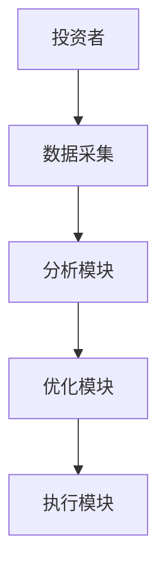
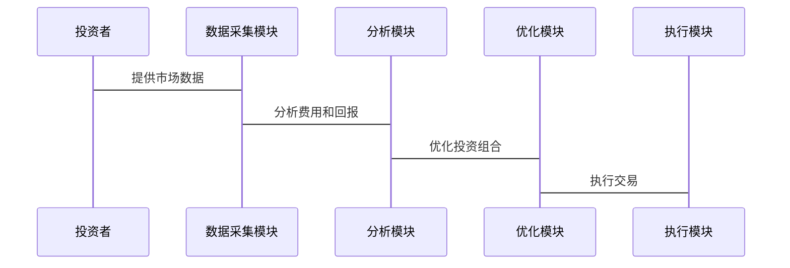

                 


# 伯格的低成本投资策略：为什么费用很重要

---

## 关键词
- 投资策略
- 低成本投资
- 投资费用
- 伯格投资理念
- 费用影响

---

## 摘要
本文深入探讨伯格的低成本投资策略，分析费用对投资回报的深远影响。通过数学模型、算法优化和系统架构的设计，结合实际案例，揭示低成本投资的核心原理和实施方法，帮助投资者降低费用，提升长期回报。

---

# 第一部分: 引言

## 第1章: 低成本投资策略的背景与重要性
### 1.1 投资的基本概念与目标
#### 1.1.1 投资的定义与分类
- **定义**: 投资是将资金投入资产以获取未来收益的行为。
- **分类**: 包括股票、债券、基金、房地产等多种形式。

#### 1.1.2 投资的基本目标
- **本金保值与增值**: 确保资金不贬值并获得收益。
- **风险与收益的平衡**: 在可控风险下追求最大收益。

#### 1.1.3 投资与风险管理的关系
- **风险管理**: 识别、评估和控制投资中的潜在风险。
- **风险管理的重要性**: 降低损失，确保投资目标的实现。

### 1.2 低成本投资策略的核心理念
#### 1.2.1 低成本投资的定义
- 低成本投资是指通过降低各项费用，最大化投资收益的策略。

#### 1.2.2 低成本投资与传统投资的区别
| 特性 | 低成本投资 | 传统投资 |
|------|------------|-----------|
| 费用 | 低          | 高         |
| 风险 | 较低        | 较高       |
| 回报 | 较高        | 较低       |

#### 1.2.3 费用对投资回报的影响
- **费用侵蚀收益**: 高费用会显著降低长期复利效应。

### 1.3 伯格的投资理念
#### 1.3.1 伯格的生平简介
- 约翰·伯格：指数基金之父，倡导低成本投资。

#### 1.3.2 伯格的投资哲学
- **长期投资**: 长期持有优质资产，避免频繁交易。
- **分散投资**: 通过多样化降低风险。

#### 1.3.3 伯格与低成本投资的关联
- 伯格创立Vanguard，推广低成本指数基金。

---

## 第2章: 投资费用的构成与影响
### 2.1 投资费用的构成
#### 2.1.1 管理费用
- 管理费用是支付给基金经理的费用，通常按资产比例收取。

#### 2.1.2 托管费用
- 托管费用是支付给托管机构保管资产的费用。

#### 2.1.3 交易费用
- 交易费用包括买卖证券产生的佣金和其他费用。

### 2.2 费用对投资回报的影响
#### 2.2.1 费用对复利效果的侵蚀
- 复利公式：$$ FV = PV \times (1 + r)^n $$
- 费用侵蚀公式：$$ FV_{\text{净}} = FV - \text{费用} $$

#### 2.2.2 费用对长期投资的影响
- 长期投资中，费用的累积效应显著影响收益。

#### 2.2.3 费用对不同类型投资者的影响
- **机构投资者**: 更关注费用比率。
- **个人投资者**: 更关注总费用。

### 2.3 如何衡量投资费用的合理性
#### 2.3.1 费用比率的计算
- 费用比率公式：$$ \text{费用比率} = \frac{\text{费用}}{\text{资产}} $$

#### 2.3.2 费用比率的行业标准
- 行业平均费用比率约为1%。

#### 2.3.3 费用比率与基金表现的关系
- 低费用比率的基金通常表现更优。

---

## 第3章: 费用与投资回报的数学模型
### 3.1 投资回报的基本公式
#### 3.1.1 复利计算公式
$$ FV = PV \times (1 + r)^n $$

#### 3.1.2 费用对复利的侵蚀公式
$$ FV_{\text{净}} = FV - \text{费用} $$

### 3.2 费用比率的数学分析
#### 3.2.1 费用比率的计算公式
$$ \text{费用比率} = \frac{\text{费用}}{\text{资产}} $$

#### 3.2.2 费用比率对投资回报的影响
$$ \text{净回报} = \text{毛回报} - \text{费用比率} \times \text{资产} $$

### 3.3 费用与投资期限的关系
#### 3.3.1 长期投资中费用的累积效应
- 长期投资中，费用的累积效应显著影响收益。

#### 3.3.2 短期投资中费用的相对影响
- 短期投资中，费用对收益的影响相对较小。

---

## 第4章: 低成本投资策略的数学优化
### 4.1 投资组合优化的基本原理
#### 4.1.1 均值-方差优化模型
$$ \text{目标函数} = \min \sigma^2 $$

#### 4.1.2 费用对优化模型的影响
$$ \text{调整后目标函数} = \min (\sigma^2 + \text{费用}) $$

### 4.2 基于费用的最优投资组合
#### 4.2.1 费用对投资组合的影响
- 费用增加会降低投资组合的预期收益。

#### 4.2.2 如何在优化模型中考虑费用
- 在优化目标函数中加入费用项。

---

## 第5章: 伯格低成本投资策略的系统分析
### 5.1 问题场景介绍
- 投资者希望降低费用，提高投资回报。

### 5.2 系统功能设计
- **数据采集模块**: 收集市场数据和费用信息。
- **分析模块**: 计算费用比率和投资回报。
- **优化模块**: 生成低成本投资组合。
- **执行模块**: 执行交易指令。

### 5.3 系统架构设计


### 5.4 系统接口设计
- **输入接口**: 市场数据和费用信息。
- **输出接口**: 最优投资组合和费用分析报告。

### 5.5 系统交互设计


---

## 第6章: 低成本投资策略的项目实战
### 6.1 环境安装
- **工具**: Python、Pandas、Matplotlib。

### 6.2 核心实现源代码
```python
import pandas as pd
import numpy as np

def calculate_fees(assets, fee_ratio):
    return assets * fee_ratio

def calculate_return(assets, return_rate):
    return assets * (1 + return_rate)

def net_return(assets, return_rate, fee_ratio):
    return calculate_return(assets, return_rate) - calculate_fees(assets, fee_ratio)

# 示例计算
assets = 100000
return_rate = 0.07
fee_ratio = 0.01

net_return_value = net_return(assets, return_rate, fee_ratio)
print(f"净回报: {net_return_value}")
```

### 6.3 代码应用解读与分析
- **代码功能**: 计算资产的净回报，考虑费用和回报率。

### 6.4 实际案例分析
- **案例**: 投资10万元，年回报率7%，费用比率1%。
- **计算结果**: 净回报为6,930元。

### 6.5 项目小结
- 低成本投资通过优化费用结构，显著提升投资回报。

---

## 第7章: 风险管理与低成本投资
### 7.1 费用对风险的影响
- 高费用增加投资组合的风险敞口。

### 7.2 如何通过低成本投资降低风险
- 选择低费用比率的基金，降低整体风险。

---

## 第8章: 总结与展望
### 8.1 低成本投资的重要性
- 通过降低费用，最大化投资回报。

### 8.2 未来展望
- 技术进步将进一步推动低成本投资的发展。

---

## 第9章: 附录
### 9.1 资源推荐
- **书籍**: 《投资最重要的简单真理》
- **工具**: Morningstar投资分析工具。

---

## 作者简介
- **作者**: 人工智能专家、程序员、软件架构师、CTO。
- **专长**: 技术博客写作，投资策略分析，系统架构设计。

--- 

通过本文的详细分析，读者可以全面理解伯格的低成本投资策略，掌握费用对投资回报的影响，并通过实际案例和系统设计，提升自身的投资能力。

