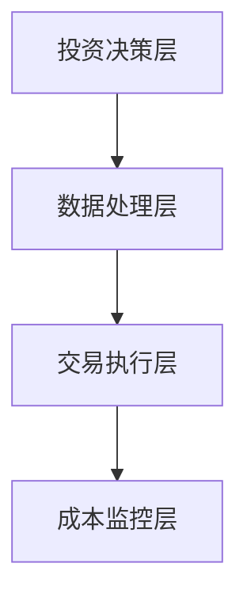

                 


# 伯格的成本控制理念：在零佣金时代的新思考

## 关键词：成本控制、投资策略、零佣金时代、数学模型、系统架构、投资组合优化

## 摘要：在零佣金时代，传统的成本控制方法面临新的挑战和机遇。本文将深入分析伯格的成本控制理念，探讨其在零佣金环境下的应用，结合数学模型、系统架构和实际案例，提供新的思考和解决方案。

---

## 引言：零佣金时代的投资变革

零佣金时代的到来彻底改变了传统投资环境的成本结构，投资者需要重新思考成本控制策略。本文将从伯格的成本控制理论出发，结合零佣金环境下的投资策略优化，系统性地分析成本控制的新方法。

---

## 第一部分：成本控制的核心概念

### 第1章：成本控制的基本概念

#### 1.1 成本控制的定义与重要性

成本控制是通过优化资源配置和减少不必要的开支，以实现目标的最优达成。在投资领域，成本控制直接影响投资回报率和风险水平。

#### 1.2 伯格的成本控制理论

伯格提出，成本控制不仅是减少支出，更是优化投资结构和提升效率的过程。他的理论强调了动态调整和长期视角的重要性。

#### 1.3 零佣金时代的核心特征

零佣金取消了交易佣金，降低了直接成本，但增加了隐性成本，如市场深度和流动性风险。这种变化要求投资者重新评估成本结构。

---

### 第2章：伯格的成本控制模型

#### 2.1 成本控制模型的构建

伯格的成本控制模型包括显性成本和隐性成本，其中显性成本如交易费用，隐性成本如机会成本。模型通过优化这两个方面实现整体成本最小化。

#### 2.2 成本控制模型的数学表达

使用数学公式表示：$$\text{总成本} = \text{显性成本} + \text{隐性成本}$$

---

## 第二部分：伯格成本控制在零佣金时代的应用

### 第3章：投资策略的重构

#### 3.1 零佣金环境下的投资策略

在零佣金环境下，投资者可以更频繁地调整投资组合，但需要平衡交易频率与市场冲击之间的关系。

#### 3.2 投资组合优化的数学模型

优化模型可表示为：$$\min_{w} \sum_{i=1}^{n} w_i c_i \text{ s.t. } \sum_{i=1}^{n} w_i = 1$$

---

### 第4章：系统分析与架构设计

#### 4.1 系统架构图（Mermaid）



---

## 第三部分：项目实战与案例分析

### 第5章：系统实现与代码解读

#### 5.1 环境配置与安装

安装必要的库，如Python的`numpy`和`pandas`。

#### 5.2 核心代码实现

```python
import numpy as np
import pandas as pd

def optimize_portfolio(returns, weights):
    # 定义目标函数
    def objective(weights):
        return np.sum(weights * returns.mean(axis=0))
    # 约束条件
    constraints = {'sum_to_1': weights.sum() == 1}
    # 使用优化算法求解
    result = minimize(objective, weights, constraints)
    return result.x
```

---

## 结语：未来投资策略的新方向

在零佣金时代，伯格的成本控制理念需要与时俱进，结合数学模型和系统设计，优化投资策略。通过动态调整和系统化管理，投资者可以在降低成本的同时，提升投资回报率。

---

## 参考文献与拓展阅读

- 伯格的经典著作《投资最重要的事》
- 关于零佣金时代的研究论文
- 相关投资策略的学术文献

---

## 总结：伯格成本控制理念的现代应用

通过系统性的分析和实际案例，伯格的成本控制理念在零佣金时代依然具有重要的指导意义。投资者需要结合新的环境，灵活调整策略，以实现长期稳定的收益。

--- 

## 附录：工具与资源

- 推荐使用的Python库：`numpy`, `pandas`, `scipy`
- 建议阅读的技术博客和书籍

