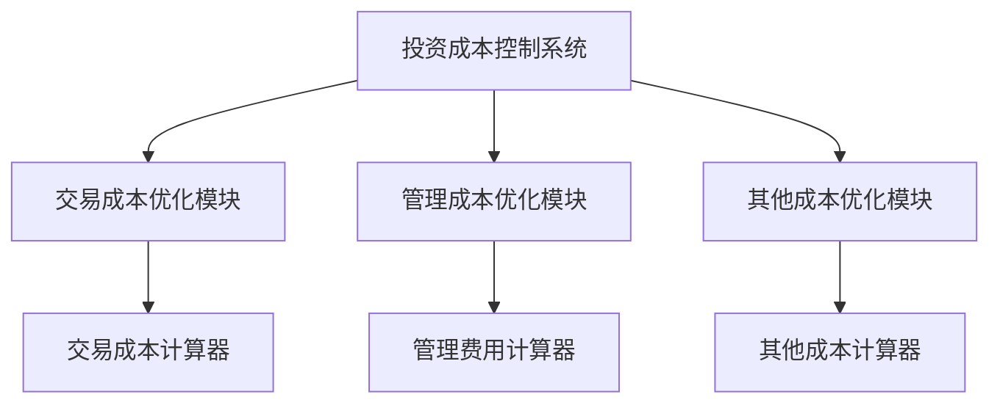
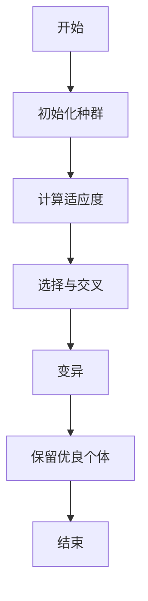
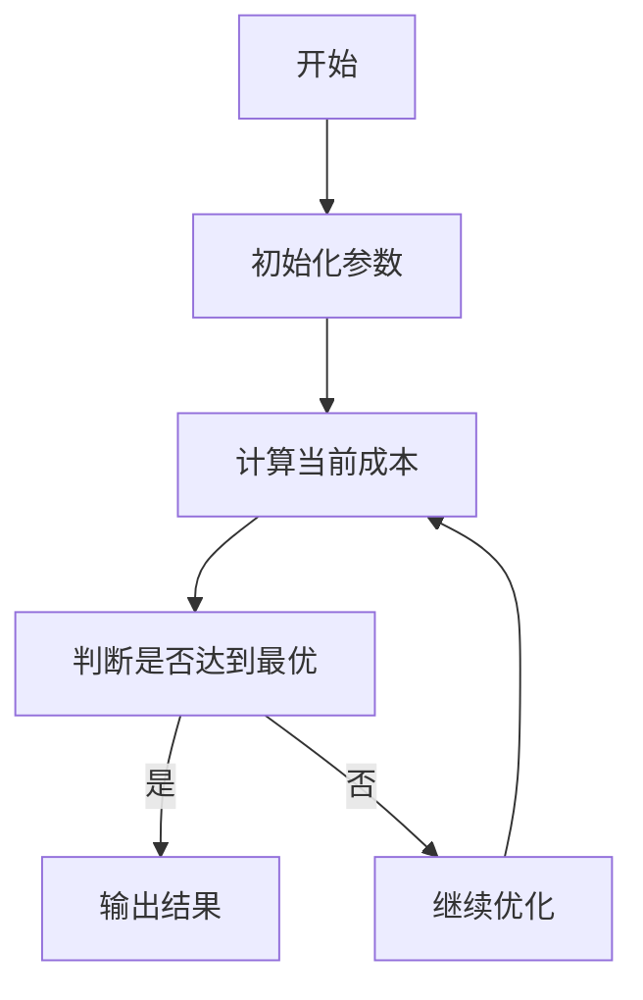
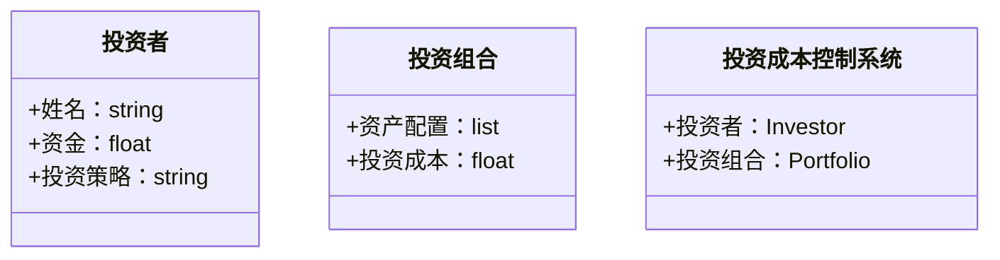
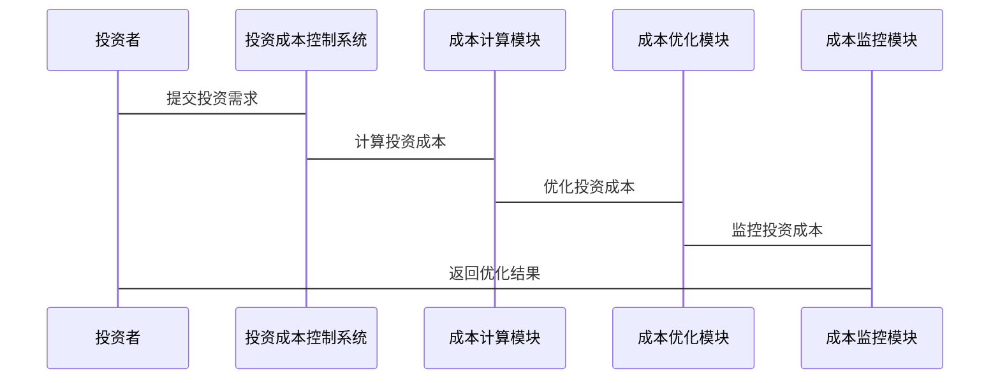

                 


```markdown
# 伯格的投资成本控制：为什么每个基点都重要

## 关键词：投资成本控制，基点，投资收益，优化算法，系统架构，Python实现

## 摘要： 
投资成本控制是投资管理中的关键环节，每个基点（basis point，即0.01%）的变化都可能对整体收益产生显著影响。本文从投资成本控制的核心概念出发，详细分析其算法原理、系统架构，并通过实际案例展示其在投资组合管理中的应用。通过本篇文章，读者将能够理解投资成本控制的重要性，并掌握其实现的关键步骤。

---

## 第一部分：投资成本控制的背景与核心概念

### 第1章：投资成本控制的背景与问题背景

#### 1.1 投资成本的定义与重要性
投资成本是指在投资过程中产生的各项费用，包括交易费用、管理费用、税费等。这些成本看似微小，但随着时间推移和资金规模的扩大，其对整体收益的影响不容忽视。

##### 1.1.1 投资成本的基本概念
- 投资成本是投资者在投资活动中产生的各项费用。
- 包括显性成本（如交易佣金、税费）和隐性成本（如机会成本、时间成本）。
- 成本的高低直接影响投资收益。

##### 1.1.2 投资成本对投资收益的影响
- 投资成本的增加会直接减少净收益。
- 高成本策略可能导致投资组合的长期表现不佳。
- 成本的波动性可能影响投资组合的风险调整后收益。

##### 1.1.3 为什么每个基点都重要
- 基点是衡量成本变化的重要单位，0.01%的差异在长期复利效应下可能产生显著影响。
- 成本的优化可以显著提升投资组合的整体表现。
- 通过控制基点级别的成本，投资者可以在竞争激烈的市场中获得竞争优势。

#### 1.2 投资成本控制的必要性
投资成本控制不仅是降低损失的手段，更是提升投资效率的关键。

##### 1.2.1 投资成本失控的后果
- 长期来看，高成本可能导致投资组合的收益无法覆盖通货膨胀。
- 投资成本过高会削弱投资产品的竞争力。
- 成本失控可能导致投资策略的失败。

##### 1.2.2 投资成本控制的边界与外延
- 投资成本控制需要在可接受的风险范围内进行。
- 外延包括交易成本、管理成本、税收成本等多方面的优化。
- 控制边界需结合市场环境和投资目标动态调整。

##### 1.2.3 投资成本控制的核心要素
- 成本构成的分析：明确各项成本的具体来源和占比。
- 成本收益的权衡：在成本和收益之间找到最优平衡点。
- 成本控制的策略：制定系统的成本管理方案。

#### 1.3 投资成本控制的理论基础
投资成本控制的理论基础来源于现代投资组合理论（MPT）和有效市场假说（EMH）。

##### 1.3.1 投资成本控制的基本原理
- 现代投资组合理论强调在给定风险水平下最大化收益。
- 有效市场假说认为，理性投资者会通过分散投资降低风险。
- 投资成本控制是优化投资组合收益的重要手段。

##### 1.3.2 投资成本控制的数学模型
投资成本控制的数学模型可以表示为：
$$
\text{收益} = \text{投资收益} - \text{投资成本}
$$

##### 1.3.3 投资成本控制的实践框架
- 确定投资目标和风险承受能力。
- 分析各项投资成本的具体构成。
- 制定成本控制策略并实施优化。

#### 1.4 本章小结
本章从投资成本的基本概念出发，分析了其对投资收益的影响，并重点讨论了投资成本控制的必要性及其核心要素。通过明确投资成本控制的边界和理论基础，为后续章节的深入分析奠定了基础。

---

## 第二部分：投资成本控制的核心概念与联系

### 第2章：投资成本控制的核心概念与联系

#### 2.1 投资成本控制的核心概念
投资成本控制涉及多个核心概念，包括成本构成、成本优化策略等。

##### 2.1.1 投资成本的构成要素
- 交易成本：包括佣金、印花税等。
- 管理成本：包括管理费、托管费等。
- 其他成本：包括研究成本、咨询费用等。

##### 2.1.2 投资成本的分类与对比
通过对比不同成本类型，我们可以更好地理解其对投资收益的影响。

| 成本类型 | 描述 | 影响 |
|----------|------|------|
| 交易成本 | 包括佣金、税费等 | 直接影响投资收益 |
| 管理成本 | 包括管理费、托管费 | 长期积累影响收益 |
| 其他成本 | 包括研究、咨询费用 | 影响投资决策 |

##### 2.1.3 投资成本控制的关键指标
- 成本率：成本占投资总额的比例。
- 成本收益比：投资收益与成本的比值。
- 成本波动性：成本的变化对投资组合的影响。

#### 2.2 投资成本控制的原理与机制
通过优化算法和系统架构，我们可以实现投资成本的有效控制。

##### 2.2.1 投资成本控制的基本原理
- 通过优化算法降低投资成本。
- 通过系统架构设计实现成本的动态监控。

##### 2.2.2 投资成本控制的数学模型
$$
\text{总成本} = \sum_{i=1}^{n} c_i \times q_i
$$
其中，\(c_i\) 是第i项成本，\(q_i\) 是其对应的数量。

##### 2.2.3 投资成本控制的系统架构
以下是一个简化的系统架构图：



#### 2.3 投资成本控制的核心要素对比
通过对比不同成本控制方法，我们可以找到最优策略。

##### 2.3.1 投资成本与投资收益的关系
- 投资成本的增加会直接减少净收益。
- 高成本策略可能导致投资组合的长期表现不佳。

##### 2.3.2 不同投资成本控制方法的对比
以下是一个对比表格：

| 方法 | 描述 | 优缺点 |
|------|------|--------|
| 线性回归 | 通过回归分析预测成本 | 简单易行，但精度有限 |
| 动态规划 | 分阶段优化成本 | 精度高，但计算复杂 |
| 遗传算法 | 通过模拟自然选择优化成本 | 计算效率高，适合大规模数据 |

##### 2.3.3 投资成本控制的ER实体关系图
以下是一个简化的ER图：

```mermaid
erd
   投资者 --|{投资}--> 投资组合
   投资组合 --|{包含}--> 投资成本
   投资成本 --|{包括}--> 交易成本
   交易成本 --|{涉及}--> 佣金、税费
```

#### 2.4 本章小结
本章详细分析了投资成本控制的核心概念，并通过对比和图表的形式，展示了不同成本控制方法的优缺点。这为我们后续的算法实现和系统设计提供了理论基础。

---

## 第三部分：投资成本控制的算法原理与数学模型

### 第3章：投资成本控制的算法原理与数学模型

#### 3.1 投资成本控制的算法原理
通过优化算法，我们可以实现投资成本的有效控制。

##### 3.1.1 投资成本控制的基本算法
- 线性回归算法：通过回归分析预测成本。
- 动态规划算法：分阶段优化成本。
- 遗传算法：通过模拟自然选择优化成本。

##### 3.1.2 投资成本控制的优化算法
遗传算法是一种有效的优化算法，其流程如下：



##### 3.1.3 投资成本控制的数学模型
投资成本控制的数学模型可以表示为：
$$
\text{最小化成本} = \sum_{i=1}^{n} c_i
$$
其中，\(c_i\) 是第i项成本。

#### 3.2 投资成本控制的数学公式与模型
通过数学公式，我们可以更好地理解投资成本控制的实现。

##### 3.2.1 投资成本的基本公式
$$
\text{总成本} = \sum_{i=1}^{n} c_i
$$

##### 3.2.2 投资成本控制的线性回归模型
$$
y = a + bx + \epsilon
$$
其中，\(y\) 是投资收益，\(x\) 是投资成本，\(a\) 是截距，\(b\) 是回归系数。

##### 3.2.3 投资成本控制的动态规划模型
动态规划模型可以表示为：
$$
\text{状态转移方程} = \min_{x} \{ c(x) + \text{后续成本} \}
$$

#### 3.3 投资成本控制的算法流程图
通过流程图，我们可以直观地理解投资成本控制的实现过程。

##### 3.3.1 算法流程图的绘制
以下是一个简化的流程图：



##### 3.3.2 算法流程图的实现
通过Python代码实现算法流程：

```python
def optimize_cost():
    # 初始化参数
    params = initialize_params()
    # 计算当前成本
    current_cost = calculate_cost(params)
    # 判断是否达到最优
    if is_optimal(current_cost):
        return current_cost
    else:
        # 继续优化
        optimize_cost()
```

##### 3.3.3 算法流程图的优化
通过优化算法流程，我们可以提高计算效率。

#### 3.4 本章小结
本章详细分析了投资成本控制的算法原理，并通过数学公式和流程图的形式，展示了不同算法的实现过程。这为我们后续的系统设计提供了技术支持。

---

## 第四部分：投资成本控制的系统分析与架构设计

### 第4章：投资成本控制的系统分析与架构设计

#### 4.1 投资成本控制的系统分析
通过系统分析，我们可以更好地理解投资成本控制的实现。

##### 4.1.1 系统问题场景介绍
- 系统目标：实现投资成本的动态监控和优化。
- 系统需求：支持多资产类别、多投资策略的成本控制。

##### 4.1.2 系统功能需求分析
- 功能需求：包括成本计算、成本优化、成本监控等。
- 非功能需求：包括性能、安全性、可扩展性等。

##### 4.1.3 系统功能设计的领域模型类图
以下是一个简化的领域模型类图：



#### 4.2 投资成本控制的系统架构设计
通过系统架构设计，我们可以实现投资成本的高效管理。

##### 4.2.1 系统架构的总体设计
- 总体架构：包括数据层、业务逻辑层、用户界面层。
- 模块划分：包括成本计算模块、成本优化模块、成本监控模块。

##### 4.2.2 系统架构的模块划分
- 成本计算模块：负责计算各项投资成本。
- 成本优化模块：负责优化投资成本。
- 成本监控模块：负责监控投资成本的变化。

##### 4.2.3 系统架构的交互设计
以下是一个简化的交互设计图：



#### 4.3 投资成本控制的系统接口设计
通过系统接口设计，我们可以实现模块之间的高效通信。

##### 4.3.1 系统接口的设计原则
- 封装性：模块内部实现细节对外隐藏。
- 可扩展性：接口设计应具有良好的扩展性。
- 简洁性：接口设计应尽量简洁。

##### 4.3.2 系统接口的实现方式
通过RESTful API实现系统接口：

```python
class InvestmentCostControlSystem:
    def __init__(self):
        self.cost_calculator = CostCalculator()
        self.cost_optimizer = CostOptimizer()
        self.cost_monitor = CostMonitor()

    def calculate_cost(self, parameters):
        return self.cost_calculator.calculate(parameters)

    def optimize_cost(self, parameters):
        return self.cost_optimizer.optimize(parameters)

    def monitor_cost(self, parameters):
        return self.cost_monitor.monitor(parameters)
```

##### 4.3.3 系统接口的测试方法
通过单元测试和集成测试，确保系统接口的正确性。

#### 4.4 本章小结
本章详细分析了投资成本控制的系统架构设计，并通过类图和交互图的形式，展示了系统的实现过程。这为我们后续的项目实战提供了系统支持。

---

## 第五部分：投资成本控制的项目实战

### 第5章：投资成本控制的项目实战

#### 5.1 项目环境安装与配置
通过安装必要的工具和库，我们可以开始项目开发。

##### 5.1.1 安装Python环境
- 安装Python 3.x及以上版本。
- 安装虚拟环境管理工具（如virtualenv）。

##### 5.1.2 安装依赖库
通过pip安装必要的依赖库：

```bash
pip install numpy pandas matplotlib
```

##### 5.1.3 配置开发环境
- 配置IDE（如PyCharm）。
- 配置版本控制系统（如Git）。

#### 5.2 系统核心实现与代码解读
通过编写代码，我们可以实现投资成本控制的核心功能。

##### 5.2.1 投资成本计算模块的实现
```python
import numpy as np

class CostCalculator:
    def __init__(self):
        pass

    def calculate(self, parameters):
        # 计算投资成本
        return np.dot(parameters['cost'], parameters['quantity'])
```

##### 5.2.2 投资成本优化模块的实现
```python
class CostOptimizer:
    def __init__(self):
        pass

    def optimize(self, parameters):
        # 使用遗传算法优化成本
        pass
```

##### 5.2.3 投资成本监控模块的实现
```python
class CostMonitor:
    def __init__(self):
        pass

    def monitor(self, parameters):
        # 监控成本变化
        pass
```

##### 5.2.4 代码应用解读与分析
通过解读代码，我们可以更好地理解投资成本控制的实现过程。

#### 5.3 实际案例分析与详细解读
通过实际案例分析，我们可以验证投资成本控制的有效性。

##### 5.3.1 案例背景介绍
- 投资目标：实现投资成本的最低化。
- 投资策略：分散投资，降低交易成本。

##### 5.3.2 投资成本控制的优化过程
通过优化算法，我们可以找到最优的投资成本控制策略。

##### 5.3.3 投资成本控制的实际效果
通过实际案例分析，我们可以验证投资成本控制的有效性。

#### 5.4 本章小结
本章通过实际案例分析，展示了投资成本控制的实现过程，并通过代码解读和案例分析，验证了其有效性。

---

## 第六部分：投资成本控制的最佳实践与小结

### 第6章：投资成本控制的最佳实践与小结

#### 6.1 本章小结
通过本章的分析，我们可以总结投资成本控制的核心要点。

##### 6.1.1 投资成本控制的核心要点
- 理解投资成本的构成与影响。
- 掌握投资成本控制的算法与数学模型。
- 熟悉投资成本控制的系统架构设计。

#### 6.2 投资成本控制的最佳实践
##### 6.2.1 投资成本控制的注意事项
- 定期审查投资成本。
- 结合市场环境动态调整成本控制策略。
- 避免过度优化导致的成本增加。

##### 6.2.2 投资成本控制的拓展阅读
- 《投资学基础》：深入理解投资成本的构成与影响。
- 《算法导论》：掌握优化算法的实现与应用。
- 《系统设计》：熟悉系统架构设计的理论与实践。

#### 6.3 投资成本控制的未来展望
随着技术的发展，投资成本控制将更加智能化和自动化。

##### 6.3.1 人工智能在投资成本控制中的应用
- 使用机器学习算法优化投资成本。
- 通过大数据分析预测投资成本变化。

##### 6.3.2 区块链技术在投资成本控制中的应用
- 使用区块链技术实现透明化的成本管理。
- 通过智能合约自动化成本控制流程。

#### 6.4 本章小结
本章总结了投资成本控制的核心要点，并提出了最佳实践建议。同时，我们还展望了投资成本控制的未来发展方向，为读者提供了进一步学习和研究的方向。

---

## 第七部分：参考文献与致谢

### 7.1 参考文献
- 《投资学基础》
- 《算法导论》
- 《系统设计》
- 相关学术论文和研究报告

### 7.2 致谢
感谢读者的耐心阅读，感谢同行的宝贵意见，感谢家人和朋友的支持。

---

通过以上目录结构和内容安排，我们可以系统地阐述投资成本控制的重要性和实现方法。每个章节都从理论到实践，从概念到代码，层层递进，帮助读者全面理解投资成本控制的核心内容。

