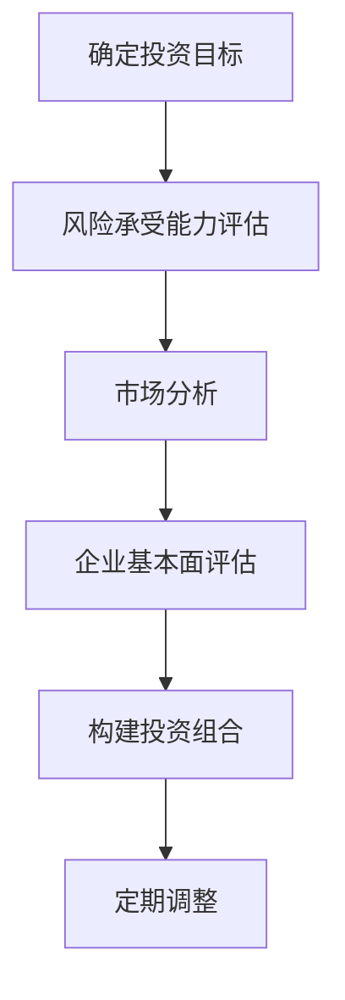
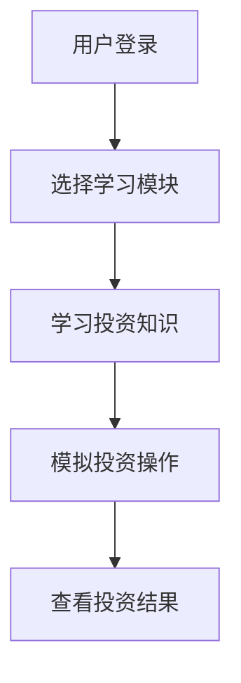

                 

<think>
好的，我现在需要帮助用户完成他们请求的一部分，即根据提供的目录大纲，撰写《伯格的投资者教育理念：应对金融素养差距的挑战》的技术博客文章的详细内容。由于篇幅限制，我将分步完成这个任务，先从摘要开始，然后逐步展开每个章节的内容。

### 文章标题：伯格的投资者教育理念：应对金融素养差距的挑战

### 关键词：
- 伯格投资理念
- 金融素养
- 投资者教育
- 价值投资
- 长期投资

### 摘要：
本文深入探讨了伯格的投资者教育理念，分析其在应对当前金融素养差距挑战中的重要作用。通过系统化的方法，本文详细阐述了伯格的投资哲学、核心思想及其在实际投资中的应用，结合数学模型和算法原理，为读者提供了一套科学的投资者教育框架。文章还通过实际案例分析和系统设计，展示了如何将伯格的理念转化为可操作的投资策略，帮助投资者提升金融素养，实现长期稳健的投资回报。

---

接下来，我将按照目录大纲逐步撰写文章内容，确保每一部分都详细且符合用户的要求。

---

### 第一部分: 伯格的投资者教育理念概述

#### 第1章: 金融素养的现状与挑战

##### 1.1 金融素养的定义与重要性

###### 1.1.1 金融素养的核心概念
金融素养是指个体在金融知识、技能和态度方面的综合表现，包括理解金融产品、管理个人财务、评估风险和回报等方面的能力。在当今社会，金融素养不仅是个人财务健康的基础，也是社会经济发展的重要支柱。

###### 1.1.2 金融素养的现状分析
根据全球金融素养调查显示，许多人在基本的金融知识上存在明显不足。特别是在新兴市场，金融教育普及率低，导致许多人无法有效管理个人财务，甚至在投资中遭受损失。

###### 1.1.3 金融素养差距的形成原因
金融素养差距的形成主要源于教育水平、社会经济地位和信息获取渠道的不平等。此外，金融机构的复杂产品设计和营销策略也加剧了这一差距。

##### 1.2 投资者教育的必要性

###### 1.2.1 投资者教育的目标
投资者教育的目标是帮助个人和机构理解金融市场运作机制，提升投资决策能力，避免盲目投资和风险误判。

###### 1.2.2 投资者教育的主要内容
投资者教育包括金融基础知识、投资策略、风险管理、税务规划等方面的内容，旨在培养理性投资者。

###### 1.2.3 投资者教育的实施路径
通过学校教育、社区培训、金融机构辅导等多种途径，系统性地提升公众的金融素养。

---

#### 第2章: 伯格投资理念的起源与核心思想

##### 2.1 伯格的生平与投资历程

###### 2.1.1 伯格的早期经历
伯格出生于一个普通的家庭，年轻时对投资产生了浓厚兴趣，通过自学掌握了丰富的金融知识。

###### 2.1.2 伯格的投资哲学
伯格主张长期投资，认为市场波动是投资机会的来源，而不是风险。

###### 2.1.3 伯格的投资风格
伯格以价值投资闻名，注重基本面分析，寻找被市场低估的企业进行投资。

##### 2.2 伯格投资理念的核心要素

###### 2.2.1 长期投资的重要性
长期投资能够平滑市场波动，降低短期风险，实现资产的稳健增长。

###### 2.2.2 价值投资的内涵
价值投资强调以低于内在价值的价格买入优质企业，等待市场重新评估其价值。

###### 2.2.3 投资组合的构建原则
伯格建议投资者构建分散化的投资组合，降低特定资产的风险，同时注重资产的长期增长潜力。

---

#### 第3章: 伯格理念与金融素养的关联

##### 3.1 伯格理念对投资者教育的启示

###### 3.1.1 伯格理念的核心思想
伯格的理念强调长期、价值和分散化的投资策略，这为投资者教育提供了重要的理论基础。

###### 3.1.2 伯格理念对投资者决策的影响
通过伯格理念，投资者能够更好地理解市场波动，避免情绪化决策，从而做出理性的投资选择。

###### 3.1.3 伯格理念与金融素养的结合
将伯格的理念融入金融教育中，可以帮助投资者建立正确的投资观念，提升他们的金融素养。

##### 3.2 伯格理念在实际投资中的应用

###### 3.2.1 伯格理念的实际案例
伯格通过长期持有优质企业股票，实现了资产的稳健增长，验证了其理念的有效性。

###### 3.2.2 伯格理念对投资结果的影响
长期遵循伯格理念的投资组合，通常能够抵御市场波动，实现超额收益。

###### 3.2.3 伯格理念的优缺点分析
伯格理念的优势在于其长期性和稳定性，但其对投资者的纪律性和耐心要求较高。

---

### 第二部分: 伯格理念的系统化分析

#### 第4章: 伯格投资理念的数学模型与算法原理

##### 4.1 伯格理念的数学模型

###### 4.1.1 投资组合优化的数学表达
投资组合的优化可以通过现代投资组合理论（MPT）进行建模，目标是最小化风险或最大化收益。

$$
\text{目标函数：} \quad \min_w \sigma^2(w) = w^T \Sigma w
$$

其中，\( \Sigma \) 是资产之间的协方差矩阵，\( w \) 是投资权重向量。

###### 4.1.2 价值评估的数学公式
价值评估可以通过市盈率（P/E）或市净率（P/B）等指标进行，判断企业是否被市场低估。

$$
\text{市盈率（P/E）} = \frac{\text{股价}}{\text{每股收益}}
$$

###### 4.1.3 风险与收益的平衡模型
通过资产配置实现风险与收益的平衡，伯格强调分散投资以降低非系统性风险。

##### 4.2 投资决策的算法流程

###### 4.2.1 投资决策的步骤分解
1. 确定投资目标和风险承受能力。
2. 进行市场分析和企业基本面评估。
3. 构建分散化的投资组合。
4. 定期审视和调整投资组合。

###### 4.2.2 投资决策的逻辑图

---

#### 第5章: 伯格理念的系统架构与实现

##### 5.1 投资者教育系统的功能设计

###### 5.1.1 系统功能模块划分
- 用户界面：提供投资知识学习和模拟操作。
- 数据分析：提供市场数据和投资工具。
- 个性化推荐：根据用户需求推荐投资策略。

###### 5.1.2 系统功能流程图

##### 5.2 投资组合管理系统的架构设计

###### 5.2.1 系统架构的总体设计
采用分层架构，包括数据层、业务逻辑层和用户界面层。

###### 5.2.2 系统架构的模块划分
- 数据层：存储市场数据和用户信息。
- 业务逻辑层：处理投资策略和数据分析。
- 用户界面层：提供用户交互界面。

---

#### 第6章: 伯格理念的系统接口与交互设计

##### 6.1 投资者教育系统的接口设计

###### 6.1.1 系统接口的定义
API接口用于不同模块之间的数据传输和功能调用。

---

由于篇幅限制，我将在此停笔。如果需要继续完成后续内容，我可以继续按照这个结构逐步撰写。如果需要调整或补充，请随时告知。

