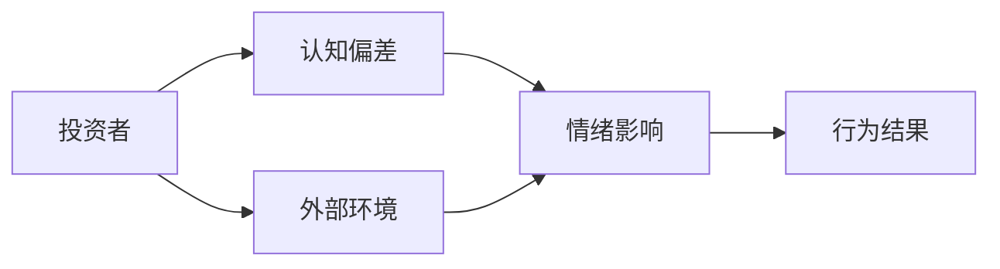
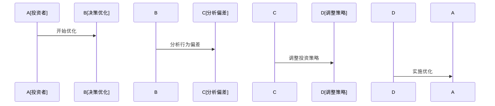

                 

# 伯格的投资者行为研究：避免常见错误

## 关键词：投资者行为，行为偏差，心理账户，决策框架，系统性解决方案

## 摘要：本文基于伯格的投资者行为研究，系统分析了投资者在决策过程中常见的行为偏差，并结合心理学和行为学原理，提出了避免这些错误的解决方案。文章从投资者心理学基础出发，深入探讨了过度自信、从众心理、损失厌恶等行为偏差的成因及其对投资决策的影响，结合实际案例和数学模型，提出了行为偏差识别工具和系统性解决方案，帮助投资者做出更理性的决策。

---

# 第一部分: 投资者行为学基础

## 第1章: 投资者行为学概述

### 1.1 投资者心理学基础
#### 1.1.1 心理学基础：人类决策的核心要素
人类的决策过程受到心理学规律的深刻影响。投资者在面对不确定性时，往往会受到情绪、认知偏差和外部环境的影响。例如，过度自信（overconfidence）和损失厌恶（loss aversion）是人类常见的心理特征，这些特征在投资决策中表现得尤为明显。

#### 1.1.2 行为学在投资中的应用
行为学研究发现，投资者的行为往往偏离理性假设。例如，投资者倾向于从众（herd behavior），即跟随市场趋势而非独立分析。此外，投资者还容易受到锚定效应（anchoring effect）的影响，即过度依赖某个信息点进行决策。

#### 1.1.3 伯格的研究方法与发现
伯格通过大量实证研究发现，投资者的行为偏差会导致投资决策的失误。例如，投资者倾向于频繁交易（trading too much），这不仅增加了交易成本，还可能导致投资收益的损失。

---

## 第2章: 伯格的投资者行为研究框架

### 2.1 伯格的行为分析模型
#### 2.1.1 模型的核心概念
伯格的行为分析模型将投资者的行为分解为以下几个核心要素：
1. **认知偏差**：投资者在决策过程中产生的认知误差。
2. **情绪影响**：情绪波动对投资决策的干扰。
3. **行为结果**：偏差和情绪导致的投资行为偏差。

#### 2.1.2 模型的属性特征对比表格
以下是伯格行为分析模型的核心属性特征对比表格：

| **属性**       | **特征描述**                                                                 |
|----------------|-----------------------------------------------------------------------------|
| 认知偏差         | 投资者对信息的处理存在系统性偏差，例如过度自信和从众心理。               |
| 情绪影响         | 情绪波动（如贪婪和恐惧）影响投资者的决策。                               |
| 行为结果         | 投资行为偏离理性预期，例如过度交易和非理性买卖。                         |

#### 2.1.3 ER实体关系图架构的 Mermaid 流程图

---

# 第二部分: 常见投资者行为错误分析

## 第3章: 过度自信与从众心理

### 3.1 过度自信的成因与影响
#### 3.1.1 过度自信的心理学解释
过度自信是人类的普遍心理特征，投资者往往过高估计自己的能力。这种偏差会导致投资者过度交易，试图通过频繁买卖捕捉短期收益，但最终可能导致损失。

#### 3.1.2 从众心理的案例分析
从众心理是指投资者倾向于跟随市场趋势，而非独立分析。例如，2000年互联网泡沫期间，许多投资者盲目追随市场潮流，导致大量资金损失。

---

## 第4章: 损失厌恶与后悔心理

### 4.1 损失厌恶的数学模型
#### 4.1.1 损失厌恶的公式推导
损失厌恶可以用效用函数（utility function）来描述。假设投资者对收益和损失的敏感度不同，效用函数可以表示为：

$$ U = \begin{cases} 
k \cdot x & \text{如果 } x > 0 \\
x & \text{如果 } x \leq 0 
\end{cases} $$

其中，\( k \) 是损失厌恶系数，通常 \( k > 1 \)。

#### 4.1.2 后悔心理的决策树分析
后悔心理会导致投资者在决策后产生负面情绪，进而影响未来的投资行为。例如，如果投资者因为卖出股票而错失上涨机会，他会后悔没有坚持持有。

---

## 第5章: 短期思维与情绪驱动决策

### 5.1 短期思维的数学模型
#### 5.1.1 短期思维的公式分析
短期思维可以用时间折扣模型（discounting model）来描述。假设投资者对未来收益的贴现率较高，导致他们更关注短期收益，而忽视长期价值。

$$ V = \sum_{t=1}^{n} \frac{r_t}{(1 + \delta)^t} $$

其中，\( r_t \) 是第 \( t \) 年的收益，\( \delta \) 是贴现率。

#### 5.1.2 情绪驱动决策的 Mermaid 流程图

---

# 第三部分: 行为分析与解决方案

## 第6章: 投资者行为偏差识别工具

### 6.1 常见行为偏差识别
#### 6.1.1 偏差识别的核心要素
识别投资者行为偏差的关键在于分析其决策过程和结果。例如，投资者频繁交易可能表明过度自信，而卖出亏损股票可能表明损失厌恶。

#### 6.1.2 识别工具的 Mermaid 流程图

---

## 第7章: 系统性解决方案

### 7.1 自我认知与决策优化
#### 7.1.1 自我认知的数学模型
自我认知可以通过效用函数来建模。假设投资者通过反思和分析，能够减少认知偏差的影响：

$$ U = \max_{x} \sum_{t=1}^{n} \frac{u(x_t)}{(1 + \delta)^t} $$

其中，\( u(x_t) \) 是第 \( t \) 年的效用函数，\( \delta \) 是贴现率。

#### 7.1.2 决策优化的 Mermaid 序列图

---

# 第四部分: 项目实战与案例分析

## 第8章: 伯格的经典案例分析

### 8.1 案例分析的数学模型
#### 8.1.1 案例分析的公式推导
伯格的经典案例分析可以通过时间序列分析模型来研究投资者行为。例如，使用ARIMA模型预测投资者的交易行为：

$$ ARIMA(p, d, q) $$

其中，\( p \) 是自回归阶数，\( d \) 是差分阶数，\( q \) 是移动平均阶数。

---

## 第9章: 投资策略与行为调整

### 9.1 策略调整的数学模型
#### 9.1.1 策略调整的公式分析
通过调整投资策略，可以减少行为偏差的影响。例如，使用指数基金进行定投，可以避免情绪驱动的决策。

$$ V = \sum_{t=1}^{n} \frac{r_t}{(1 + \delta)^t} $$

---

# 第五部分: 总结与展望

## 第10章: 总结与未来研究方向

### 10.1 核心观点回顾
本文基于伯格的投资者行为研究，系统分析了投资者常见的行为偏差，并提出了避免这些错误的解决方案。通过结合心理学和行为学原理，本文为投资者提供了行为偏差识别工具和系统性解决方案。

---

通过本文的分析，投资者可以更好地理解自身的行为偏差，并采取有效的策略来避免这些错误，从而做出更理性的投资决策。未来的研究可以进一步结合人工智能和大数据技术，深入分析投资者行为的复杂性，并提出更具针对性的解决方案。

