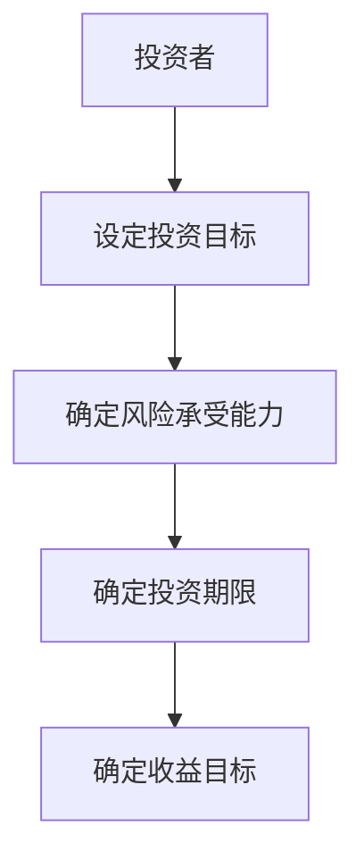
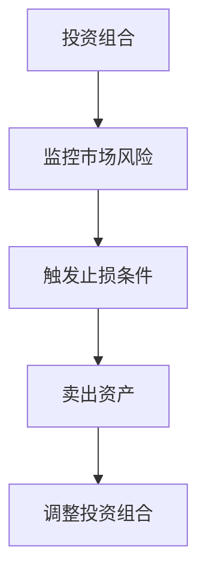

                 

# 伯格的指数化投资：应对主动管理基金表现不佳的解决方案

## 关键词：指数化投资，伯格，主动管理基金，市场有效性，投资策略

## 摘要：
本文详细探讨了伯格提出的指数化投资策略，作为一种应对主动管理基金表现不佳的解决方案。文章从市场有效性的理论出发，分析了指数化投资的核心原理、策略与实践，结合实际案例，展示了指数化投资在长期收益和风险管理方面的优势，为投资者提供了科学的投资决策依据。

---

# 第1章: 传统主动管理基金的局限性

## 1.1 主动管理基金的表现问题

### 1.1.1 主动管理基金的定义与特点

主动管理基金是一种依赖基金经理主动选股和市场 timing 的投资方式。其特点包括：

1. **高度依赖基金经理能力**：基金经理需要具备出色的市场分析能力和选股能力。
2. **高费用**：由于需要专业的团队和复杂的交易策略，主动管理基金的管理费用较高。
3. **高风险**：基金经理的决策失误可能导致基金表现不佳，甚至出现亏损。

### 1.1.2 主动管理基金的费用问题

主动管理基金的费用通常包括管理费、托管费和交易费用。以美国为例，主动管理基金的平均管理费率为1-2%，而指数基金的管理费率通常在0.1-0.5%之间。长期来看，高费用会显著侵蚀投资者的收益。

### 1.1.3 主动管理基金的业绩波动性

根据晨星（Morningstar）的统计，大多数主动管理基金的表现难以持续跑赢市场指数。例如，标普500指数在过去30年中年化收益为9.8%，而主动管理基金的平均年化收益仅为7.4%，且波动性更大。

---

## 1.2 主动管理基金表现不佳的原因

### 1.2.1 市场效率与羊群效应

现代金融理论指出，市场通常是有效的，即价格已经反映了所有公开信息。因此，通过基本分析或技术分析找到被低估的股票变得越来越困难。

### 1.2.2 信息不对称与交易成本

主动管理基金需要依赖内部信息和市场预测，但由于信息不对称和交易成本的存在，基金经理很难持续获得超额收益。

### 1.2.3 管理者的决策偏差

基金经理容易受到情绪影响，出现过度交易、追涨杀跌等行为偏差，进一步降低了基金的长期表现。

---

# 第2章: 指数化投资的定义与特点

## 2.1 指数化投资的定义

指数化投资是一种通过复制市场指数（如标普500指数、沪深300指数等）来实现投资收益的投资方式。其核心理念是“不要尝试战胜市场，而是接受市场的回报”。

## 2.2 指数化投资的特点

### 2.2.1 分散化投资

指数基金通过分散投资于多个资产，降低了单一资产的特有风险。

### 2.2.2 低成本运作

由于指数基金采用被动投资策略，管理费用远低于主动管理基金。

### 2.2.3 长期稳定收益

指数基金通过长期持有和再平衡策略，能够获得市场的平均收益，避免了主动管理基金的高波动性。

---

# 第3章: 指数化投资的核心原理

## 3.1 市场有效性理论

### 3.1.1 弱有效市场假说

弱有效市场假说认为，市场价格已经反映了所有公开信息，因此通过公开信息进行选股难以获得超额收益。

### 3.1.2 强有效市场假说

强有效市场假说认为，市场价格反映了所有信息（包括内部信息），因此任何投资者都无法通过分析获得超额收益。

### 3.1.3 半强有效市场假说

半强有效市场假说认为，市场价格反映了所有公开信息，但未考虑内部信息。因此，普通投资者难以通过公开信息获得超额收益。

## 3.2 指数化投资的数学模型

### 3.2.1 指数基金的收益计算公式

指数基金的收益可以用以下公式表示：

$$ R_p = \sum_{i=1}^n w_i R_i $$

其中：
- \( R_p \) 是组合的收益
- \( w_i \) 是第 \( i \) 只股票的权重
- \( R_i \) 是第 \( i \) 只股票的收益

### 3.2.2 指数基金的风险衡量方法

风险可以用波动率来衡量，公式为：

$$ \sigma_p = \sqrt{\sum_{i=1}^n \sum_{j=1}^n w_i w_j \sigma_{ij}} $$

其中：
- \( \sigma_p \) 是组合的波动率
- \( \sigma_{ij} \) 是第 \( i \) 和 \( j \) 只股票的相关性

### 3.2.3 指数基金与市场基准的相关性分析

指数基金与市场基准的相关性可以用相关系数 \( r \) 表示：

$$ r = \frac{\text{cov}(R_p, R_m)}{\sigma_p \sigma_m} $$

其中：
- \( R_p \) 是指数基金的收益
- \( R_m \) 是市场基准的收益

---

# 第4章: 指数化投资的策略与实践

## 4.1 指数化投资的主要策略

### 4.1.1 宽基指数投资

宽基指数投资是指投资于涵盖整个市场的指数基金，如标普500指数基金。这种策略具有高度分散化的特点，适合长期投资。

### 4.1.2 行业指数投资

行业指数投资是指投资于特定行业的指数基金，如科技行业指数基金。这种策略适合具有行业判断能力的投资者。

### 4.1.3 市场因子投资

市场因子投资是指通过投资于具有特定因子（如市值、价值、动量等）表现优异的股票，来获得超额收益。

## 4.2 指数化投资的构建方法

### 4.2.1 指数基金的选择标准

选择指数基金时，需要考虑以下因素：
1. 指数的代表性
2. 基金的费用率
3. 基金的历史表现

### 4.2.2 指数基金的权重分配

权重分配可以通过市值加权、等权重分配等方式实现。以下是市值加权的示例：

$$ w_i = \frac{P_i}{\sum_{j=1}^n P_j} $$

其中：
- \( w_i \) 是第 \( i \) 只股票的权重
- \( P_i \) 是第 \( i \) 只股票的市值

### 4.2.3 指数基金的定期再平衡

再平衡是指定期调整投资组合以维持初始权重。例如，假设每年进行一次再平衡：

$$ w_i^{new} = \frac{P_i^{new}}{\sum_{j=1}^n P_j^{new}} $$

---

# 第5章: 指数化投资的实际操作

## 5.1 指数化投资的环境分析

### 5.1.1 市场环境分析

市场环境分析包括宏观经济分析、行业分析和市场情绪分析。例如，可以通过分析GDP增长率和CPI来判断市场的整体走势。

### 5.1.2 经济周期分析

经济周期分析包括衰退期、复苏期、增长期和成熟期四个阶段。在不同阶段，指数基金的表现可能有所不同。

### 5.1.3 政策环境分析

政策环境分析包括货币政策、财政政策和监管政策。例如，美联储的利率政策会影响市场的整体走势。

## 5.2 指数化投资的系统架构

### 5.2.1 投资目标设定

投资目标设定包括风险承受能力、投资期限和收益目标。例如，以下是一个简单的投资目标设定流程图：

### 5.2.2 投资组合构建

投资组合构建包括资产配置、证券选择和权重分配。以下是资产配置的示例：

### 5.2.3 风险管理策略

风险管理策略包括止损策略、风险分散和定期再平衡。例如，以下是一个风险管理策略的流程图：

---

# 第6章: 指数化投资的案例分析

## 6.1 案例一: 美国市场的指数化投资

### 6.1.1 美国市场的指数基金发展

标普500指数基金是美国市场最著名的指数基金之一。以下是标普500指数的历史表现：

$$ R_{\text{标普500}} = \sum_{i=1}^{500} w_i R_i $$

### 6.1.2 典型指数基金的分析

以下是一个典型指数基金的分析：

### 6.1.3 案例的启示与总结

通过案例分析可以看出，指数基金在长期表现上优于大多数主动管理基金。

## 6.2 案例二: 国际市场的指数化投资

### 6.2.1 国际市场的指数基金特点

国际市场指数基金的特点包括多样化、全球化和低费用。以下是MSCI全球指数基金的示例：

$$ R_{\text{MSCI全球}} = \sum_{i=1}^{N} w_i R_i $$

### 6.2.2 案例分析与比较

以下是标普500指数基金与主动管理基金的长期表现对比：

$$ R_{\text{指数基金}} > R_{\text{主动管理基金}} $$

### 6.2.3 案例的启示与总结

国际市场指数基金的长期表现优于主动管理基金，且具有较低的费用和较高的分散化。

---

# 第7章: 指数化投资的未来展望

## 7.1 指数化投资的未来趋势

### 7.1.1 新兴市场的指数化投资机会

随着新兴市场的崛起，新兴市场指数基金的投资机会逐渐增加。

### 7.1.2 技术进步对指数化投资的影响

技术进步（如人工智能和大数据分析）将有助于提高指数基金的效率和准确性。

### 7.1.3 全球化背景下的指数化投资发展

全球化将推动指数化投资的进一步发展，投资者可以通过投资全球指数基金实现资产配置。

## 7.2 指数化投资的挑战与应对

### 7.2.1 市场波动性的挑战

市场波动性可能影响指数基金的短期表现，但长期来看，波动性是可管理的。

### 7.2.2 技术风险的应对

技术风险可以通过多元化和定期再平衡来应对。

### 7.2.3 制度性障碍的突破

制度性障碍（如税收政策和监管政策）可能影响指数化投资的发展，但可以通过政策倡导和技术创新来克服。

---

# 第8章: 指数化投资的总结与建议

## 8.1 本书的核心观点总结

### 8.1.1 指数化投资的优势

指数化投资具有分散化、低成本和长期稳定收益的优势。

### 8.1.2 指数化投资的风险管理

通过定期再平衡和多元化投资，可以有效管理指数化投资的风险。

### 8.1.3 指数化投资的长期收益

指数化投资能够实现市场的平均收益，适合长期投资者。

## 8.2 对投资者的建议

### 8.2.1 投资者如何选择指数基金

选择指数基金时，应关注指数的代表性、基金的费用率和历史表现。

### 8.2.2 投资者如何进行资产配置

投资者可以通过资产配置（如股票、债券和现金）来实现风险分散。

### 8.2.3 投资者如何应对市场波动

投资者应保持长期投资心态，避免短期波动的干扰。

## 8.3 未来研究方向

### 8.3.1 新兴市场的指数化投资

未来可以进一步研究新兴市场的指数化投资机会。

### 8.3.2 技术进步对指数化投资的影响

技术进步将推动指数化投资的进一步发展。

### 8.3.3 全球化背景下的指数化投资

全球化将为指数化投资提供更多的机会和挑战。

---

# 小结

伯格的指数化投资是一种科学的投资方式，通过分散化和低成本实现市场的平均收益。对于大多数投资者来说，指数化投资是一种可靠的投资策略。未来，随着技术进步和市场的发展，指数化投资将发挥更大的作用。

---

* * * 

本文通过详细分析指数化投资的核心原理、策略与实践，结合实际案例，展示了指数化投资在长期收益和风险管理方面的优势。对于投资者来说，指数化投资是一种值得信赖的投资方式。

