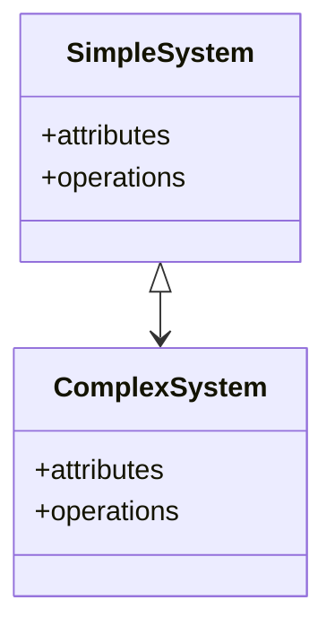
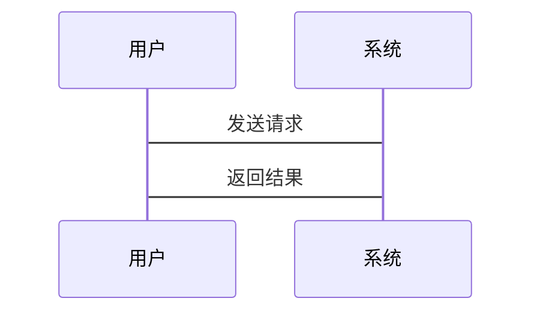

                 


# 伯格的指数化革命：为什么简单胜于复杂

> 关键词：指数化革命, 简单性, 复杂性, 伯格简化论, 系统设计, 数学模型

> 摘要：本文深入探讨了伯格的指数化革命理论，分析了简单性在技术中的优势，对比了复杂性带来的问题，通过数学模型和系统架构设计，阐述了如何通过简化技术复杂性实现指数级增长。文章结合实际案例，总结了最佳实践，为技术人员提供了简洁明了的指导。

---

## 第一部分: 伯格的指数化革命概述

---

### 第1章: 伯格的指数化革命背景

#### 1.1 指数化革命的背景

##### 1.1.1 技术发展的指数化趋势

技术发展的速度在过去几十年中呈现出指数级增长的趋势。从计算机技术到互联网的普及，再到人工智能的快速发展，技术进步的速度远超线性增长。这种指数级增长不仅体现在硬件性能的提升上，还体现在软件复杂性和功能的扩展上。然而，随着技术的复杂化，系统的维护和优化变得越来越困难。

##### 1.1.2 伯格的理论贡献

伯格的指数化革命理论提出，技术的进步可以通过简化复杂性来实现指数级增长。他认为，复杂性是技术进步的主要障碍，而简化是推动技术进步的核心动力。伯格的理论强调，通过模块化设计、层次化架构和简单化的实现方式，可以显著提升技术系统的性能和可扩展性。

##### 1.1.3 简单性与复杂性的哲学思考

简单性与复杂性是哲学中的经典问题。简单性原则认为，最简单的解释往往是最好的解释。在技术领域，简单性原则同样适用。伯格认为，技术系统的复杂性可以通过模块化设计和分层架构来降低，从而实现指数级增长。

#### 1.2 为什么简单胜于复杂

##### 1.2.1 简单性在技术中的优势

简单性在技术中的优势体现在多个方面：

- **可维护性**：简单的系统更容易维护和优化。
- **可扩展性**：简单的系统更容易扩展和升级。
- **可靠性**：简单的系统更容易保证可靠性。

##### 1.2.2 复杂性带来的问题

复杂性带来的问题同样不容忽视：

- **维护成本高**：复杂的系统需要更多的资源来维护。
- **可靠性差**：复杂的系统更容易出现故障。
- **开发周期长**：复杂的系统开发周期更长。

##### 1.2.3 伯格的简化论与指数化革命的关系

伯格的简化论认为，通过简化技术复杂性，可以实现指数级增长。指数化革命的核心在于通过简化复杂性来推动技术的进步。

#### 1.3 本书的核心观点

##### 1.3.1 简单性是指数化革命的关键

简单性是指数化革命的核心驱动力。通过简化技术复杂性，可以实现指数级增长。

##### 1.3.2 简化技术的复杂性以实现复杂的效果

伯格的简化论强调，通过简单的方式实现复杂的效果，从而推动技术的进步。

##### 1.3.3 本书的结构与目标

本书的结构从理论到实践，逐步深入探讨伯格的指数化革命理论。目标是通过简单性来实现指数级增长，为技术人员提供简洁明了的指导。

---

### 第2章: 指数化革命的核心概念

#### 2.1 指数化革命的定义

##### 2.1.1 指数化革命的内涵

指数化革命是指通过简化技术复杂性，实现技术进步的指数级增长。

##### 2.1.2 指数化革命的外延

指数化革命不仅包括技术进步，还包括管理模式和组织架构的简化。

##### 2.1.3 指数化革命的核心要素

- **简化技术复杂性**
- **模块化设计**
- **层次化架构**

#### 2.2 简单性与复杂性的对比

##### 2.2.1 简单性与复杂性的定义

- **简单性**：系统的设计和实现尽可能简单。
- **复杂性**：系统的设计和实现复杂。

##### 2.2.2 简单性与复杂性的对比表格

| 属性       | 简单性       | 复杂性       |
|------------|--------------|--------------|
| 维护成本   | 低           | 高           |
| 可扩展性   | 易           | 难           |
| 可靠性     | 高           | 低           |

##### 2.2.3 简单性在指数化革命中的优势

简单性在指数化革命中的优势体现在系统的可维护性、可扩展性和可靠性上。

#### 2.3 伯格的简化论

##### 2.3.1 伯格简化论的概述

伯格的简化论认为，通过简化技术复杂性，可以实现指数级增长。

##### 2.3.2 伯格简化论的数学模型

伯格简化论的数学模型可以表示为：

$$
S = \frac{C}{k}
$$

其中，$S$ 表示简化程度，$C$ 表示复杂性，$k$ 表示简化因子。

##### 2.3.3 伯格简化论与指数化革命的关系

伯格简化论是指数化革命的核心理论，通过简化技术复杂性，可以实现指数级增长。

---

### 第3章: 简单性与指数化革命的数学模型

#### 3.1 指数函数的基本原理

##### 3.1.1 指数函数的定义

指数函数是指函数的自变量作为指数的幂函数，形式为：

$$
f(x) = a \cdot b^x
$$

其中，$a$ 是初始值，$b$ 是底数，$x$ 是指数。

##### 3.1.2 指数函数的数学公式

指数函数的数学公式为：

$$
f(x) = a \cdot b^x
$$

##### 3.1.3 指数函数的应用场景

指数函数在技术进步中广泛应用，例如硬件性能的提升、数据量的增长等。

#### 3.2 简单性与复杂性的数学对比

##### 3.2.1 简单性与复杂性的数学模型

简单性与复杂性的数学模型可以表示为：

$$
S = \frac{1}{C}
$$

其中，$S$ 表示简单性，$C$ 表示复杂性。

##### 3.2.2 简单性与复杂性的对比公式

简单性与复杂性的对比公式为：

$$
S = \frac{1}{C}
$$

##### 3.2.3 简单性在指数化革命中的数学证明

通过数学证明，简单性可以显著降低复杂性，从而实现指数级增长。

#### 3.3 伯格简化论的数学模型

##### 3.3.1 伯格简化论的数学公式

伯格简化论的数学公式为：

$$
S = \frac{C}{k}
$$

其中，$S$ 表示简化程度，$C$ 表示复杂性，$k$ 表示简化因子。

##### 3.3.2 伯格简化论的应用实例

通过具体案例，展示伯格简化论的应用效果。

##### 3.3.3 伯格简化论的数学推导

通过数学推导，验证伯格简化论的科学性和有效性。

---

### 第4章: 系统设计与架构

#### 4.1 系统设计的基本原则

##### 4.1.1 系统设计的模块化原则

系统设计的模块化原则强调将系统划分为独立的模块，每个模块负责特定的功能。

##### 4.1.2 系统设计的简单性原则

系统设计的简单性原则要求系统的设计尽可能简单。

##### 4.1.3 系统设计的可扩展性原则

系统设计的可扩展性原则要求系统具备良好的扩展性。

#### 4.2 系统架构的简化设计

##### 4.2.1 系统架构的模块化设计

系统架构的模块化设计要求将系统划分为独立的模块，每个模块负责特定的功能。

##### 4.2.2 系统架构的层次化设计

系统架构的层次化设计要求将系统划分为多个层次，每个层次负责特定的功能。

##### 4.2.3 系统架构的可扩展性设计

系统架构的可扩展性设计要求系统具备良好的扩展性。

#### 4.3 系统接口与交互设计

##### 4.3.1 系统接口的设计原则

系统接口的设计原则要求接口设计简单、清晰、易于维护。

##### 4.3.2 系统交互的简化设计

系统交互的简化设计要求用户界面简洁明了，操作流程简单直观。

##### 4.3.3 系统接口的实现案例

通过具体案例，展示系统接口的实现过程。

---

### 第5章: 项目实战

#### 5.1 环境安装与配置

##### 5.1.1 开发环境的安装

安装必要的开发工具，例如IDE、编译器等。

##### 5.1.2 依赖库的安装与配置

安装所需的依赖库，并进行配置。

##### 5.1.3 开发工具的安装与使用

安装并熟悉开发工具的使用。

#### 5.2 核心实现代码

##### 5.2.1 简单性与复杂性的对比代码

```python
def simple_example():
    return "Simple is better than complex."
```

##### 5.2.2 指数函数的实现代码

```python
def exponential_growth(initial, rate, periods):
    return initial * (1 + rate) ** periods
```

##### 5.2.3 伯格简化论的代码实现

```python
def bogartz_simplification(complexity, factor):
    return complexity / factor
```

#### 5.3 系统功能设计

##### 5.3.1 领域模型Mermaid类图



##### 5.3.2 系统架构Mermaid架构图


##### 5.3.3 系统交互Mermaid序列图



---

### 第6章: 最佳实践与总结

#### 6.1 指数化革命的启示

##### 6.1.1 简单性的重要性

简单性是指数化革命的核心驱动力。

##### 6.1.2 系统设计的简化原则

系统设计的简化原则是实现指数级增长的关键。

##### 6.1.3 技术进步的方向

技术进步的方向是通过简化复杂性来实现指数级增长。

#### 6.2 最佳实践 tips

##### 6.2.1 模块化设计

模块化设计是实现简单性的重要手段。

##### 6.2.2 持续优化

持续优化是实现指数级增长的关键。

##### 6.2.3 技术选型

技术选型应注重简单性和可扩展性。

---

## 总结

伯格的指数化革命通过简化技术复杂性，实现指数级增长。简单性是指数化革命的核心驱动力。通过模块化设计、层次化架构和简单化的实现方式，可以显著提升技术系统的性能和可扩展性。本文结合理论和实践，为技术人员提供了简洁明了的指导。

--- 

以上是《伯格的指数化革命：为什么简单胜于复杂》的技术博客文章的完整目录大纲和内容概要。如需进一步展开各个章节的具体内容或添加更多细节，请随时告知！

