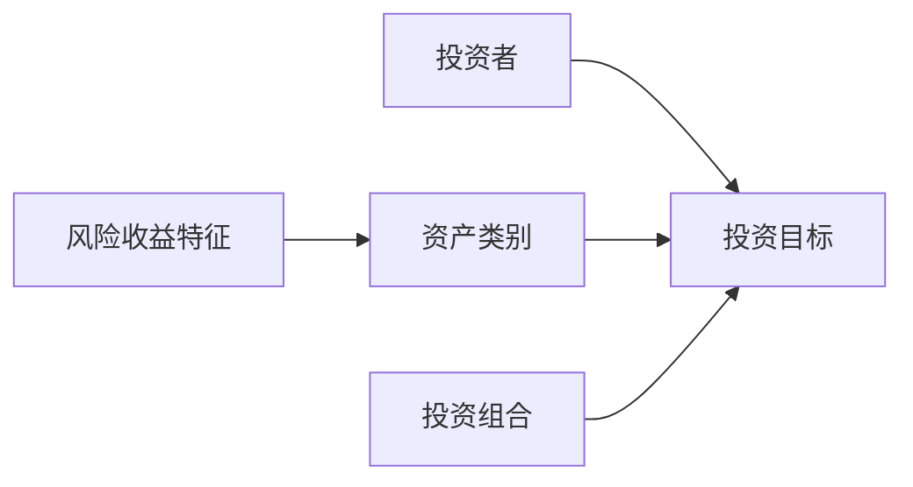

                 


```markdown
# 伯格的资产配置理论：应对极端市场波动的策略

## 关键词：
- 资产配置，伯格理论，极端市场波动，投资组合优化，风险管理

## 摘要：
伯格的资产配置理论是一种基于现代投资组合理论的方法，通过分散化投资来最大化风险调整后的收益。本文详细探讨了伯格理论的核心思想，分析了其在应对极端市场波动中的应用策略，并通过实际案例展示了如何通过系统化的方法构建稳健的投资组合。

---

## 第一部分：资产配置理论的背景与基础

### 第1章：资产配置的基本概念与重要性

#### 1.1 资产配置的定义与核心要素
- **资产配置的定义**：资产配置是指根据投资目标和风险承受能力，将资金分配到不同资产类别（如股票、债券、现金等）中的过程。
- **核心要素**：
  - **资产类别**：股票、债券、现金等。
  - **权重分配**：每种资产在投资组合中的比例。
  - **风险调整后的收益**：在考虑风险的前提下，追求最大化的收益。
- **资产配置与投资收益的关系**：资产配置决定了投资组合的风险和收益特征，是投资成功的关键。

#### 1.2 资产配置的分类与应用场景
- **按资产类别划分**：股票、债券、房地产等。
- **按时间跨度划分**：短期、中期、长期。
- **应用场景**：
  - **机构投资**：养老金、保险公司等。
  - **个人投资**：基于个人风险偏好和财务目标。

#### 1.3 资产配置的重要性与挑战
- **重要性**：
  - **分散风险**：避免过度依赖单一资产。
  - **提高收益稳定性**：通过不同资产的组合优化收益。
- **挑战**：
  - **市场波动**：极端市场环境下，资产配置需要动态调整。
  - **数据依赖**：依赖历史数据和市场假设。

### 第2章：伯格的资产配置理论概述

#### 2.1 伯格的生平与学术贡献
- **伯格的学术背景**：伯格是现代投资组合理论的重要贡献者，其研究为资产配置奠定了基础。
- **贡献**：
  - 提出有效前沿的概念，即在给定风险下最大化收益的投资组合。

#### 2.2 伯格资产配置理论的核心思想
- **长期投资**：强调长期持有优质资产。
- **分散化原则**：通过多样化投资降低风险。
- **市场有效性**：假设市场是有效的，避免频繁交易。

#### 2.3 伯格理论的数学模型与公式
- **现代投资组合理论的数学模型**：
  $$\text{最大化收益：} \max \sum_{i=1}^n w_i r_i$$
  $$\text{最小化风险：} \min \sum_{i=1}^n \sum_{j=1}^n w_i w_j \sigma_{ij}$$
- **伯格资产配置的优化公式**：
  $$\text{最优权重：} w_i = \frac{\sigma^2_i}{\sum_{j=1}^n \sigma^2_j}$$

#### 2.4 伯格理论的实践意义
- **理论在实际投资中的应用**：用于构造最优投资组合。
- **局限性**：假设市场有效性和资产回报的正态分布可能不成立。

---

## 第二部分：应对极端市场波动的策略

### 第3章：伯格资产配置理论的核心概念与联系

#### 3.1 核心概念与属性对比
- **资产类别与风险收益特征对比表**：
| 资产类别 | 风险 | 收益 |
|---------|------|------|
| 股票    | 高   | 高   |
| 债券    | 中   | 中   |
| 现金    | 低   | 低   |

- **ER实体关系图**：


#### 3.2 资产配置的系统分析与架构设计
- **系统功能设计**：
  ```mermaid
  classDiagram
  class 投资者 {
      投资目标
      风险承受能力
  }
  class 资产类别 {
      股票
      债券
      现金
  }
  class 投资组合 {
      资产权重分配
      风险调整后的收益
  }
  ```
- **系统架构设计**：
  ```mermaid
  graph LR
  A[投资者] --> B[资产配置系统]
  C[市场数据] --> B
  D[投资组合] --> B
  E[风险控制模块] --> B
  ```

### 第4章：应对极端市场波动的策略

#### 4.1 极端市场波动的定义与特征
- **定义**：市场波动率显著高于正常水平，通常伴随着剧烈的价格波动和投资者情绪的极端化。
- **特征**：
  - 市场流动性下降。
  - 资产价格的大幅波动。
  - 投资者的恐慌情绪。

#### 4.2 应对极端波动的策略
- **动态调整资产配置**：根据市场情况调整资产权重。
- **风险对冲**：使用衍生工具（如期权）对冲部分风险。
- **保持流动性**：确保在极端情况下能够及时调整投资组合。

#### 4.3 伯格理论在极端市场中的应用
- **理论优势**：
  - 强调分散化，降低单一资产的风险。
  - 通过长期投资避免短期波动的冲击。
- **实际操作**：
  - 定期再平衡投资组合。
  - 评估市场波动对资产权重的影响。

#### 4.4 项目实战：极端市场中的资产配置优化
- **环境安装**：使用Python和相关库（如Pandas、NumPy）进行数据分析。
- **核心实现代码**：
  ```python
  import pandas as pd
  import numpy as np

  # 示例数据：不同资产的历史回报和波动率
  assets = ['股票', '债券', '现金']
  returns = pd.DataFrame({
      '股票': [0.1, 0.05, -0.02],
      '债券': [0.03, 0.02, 0.01],
      '现金': [0.01, 0.005, 0.0]
  })
  
  # 计算最优权重
  sigma_squared = returns.std().values ** 2
  total_sigma = np.sum(sigma_squared)
  weights = sigma_squared / total_sigma
  
  print("最优权重：", weights)
  ```
- **代码解读**：
  - 导入必要的库。
  - 创建资产回报数据。
  - 计算每种资产的波动率平方。
  - 计算总波动率平方和。
  - 计算最优权重。
- **实际案例分析**：假设在极端市场中，股票波动率显著增加，调整权重以降低风险。

#### 4.5 总结与小结
- **小结**：伯格理论在极端市场中的应用需要动态调整资产配置，并结合对冲工具降低风险。
- **注意事项**：市场波动无法完全预测，资产配置需根据实际情况灵活调整。
- **拓展阅读**：建议阅读伯格的原始论文，了解更详细的理论模型和实证分析。

---

## 第三部分：系统分析与架构设计

### 第5章：系统功能设计与实现

#### 5.1 功能需求分析
- **用户输入**：投资者的风险承受能力和投资目标。
- **数据处理**：分析市场数据，计算资产回报和波动率。
- **算法实现**：根据伯格理论计算最优资产配置。
- **结果输出**：显示投资组合的权重和风险调整后的收益。

#### 5.2 系统架构设计
- **模块划分**：
  - 数据采集模块：获取市场数据。
  - 数据分析模块：计算资产回报和波动率。
  - 算法模块：计算最优权重。
  - 用户界面模块：显示结果。
- **交互流程**：
  ```mermaid
  graph LR
  A[用户输入] --> B[数据采集模块]
  B --> C[数据分析模块]
  C --> D[算法模块]
  D --> E[结果输出]
  ```

### 第6章：项目实战与代码实现

#### 6.1 环境安装
- **安装Python和相关库**：
  ```bash
  pip install pandas numpy matplotlib
  ```

#### 6.2 核心代码实现
- **数据处理代码**：
  ```python
  import pandas as pd
  import numpy as np

  # 示例数据：不同资产的历史回报和波动率
  assets = ['股票', '债券', '现金']
  returns = pd.DataFrame({
      '股票': [0.1, 0.05, -0.02],
      '债券': [0.03, 0.02, 0.01],
      '现金': [0.01, 0.005, 0.0]
  })
  
  # 计算最优权重
  sigma_squared = returns.std().values ** 2
  total_sigma = np.sum(sigma_squared)
  weights = sigma_squared / total_sigma
  
  print("最优权重：", weights)
  ```

#### 6.3 代码解读与分析
- **数据处理**：读取资产回报数据，计算每种资产的波动率。
- **权重计算**：根据伯格理论计算最优权重。
- **结果输出**：显示计算得到的权重。

#### 6.4 实际案例分析
- **案例背景**：假设市场出现极端波动，股票价格大幅下跌。
- **调整策略**：增加债券和现金的权重，减少股票的权重。
- **结果分析**：比较调整前后的投资组合收益和风险。

#### 6.5 总结与小结
- **小结**：通过代码实现伯格理论，能够有效优化资产配置。
- **注意事项**：实际应用中需考虑更多因素，如交易成本和税收。
- **拓展阅读**：建议深入研究现代投资组合理论的数学模型。

---

## 第四部分：总结与展望

### 第7章：总结与展望

#### 7.1 最佳实践 tips
- **定期再平衡**：定期检查投资组合，调整权重以保持目标配置。
- **结合定性分析**：资产配置需结合市场环境和宏观经济因素。
- **风险管理**：使用对冲工具和分散化策略降低风险。

#### 7.2 本章小结
- **小结**：伯格理论是一种有效的资产配置方法，但在极端市场中需要灵活调整。
- **总结**：通过系统化的方法和动态调整，能够应对市场波动带来的挑战。

#### 7.3 展望
- **未来研究方向**：探索更多资产类别和非传统投资工具的应用。
- **技术进步**：利用人工智能和大数据技术优化资产配置模型。

---

## 附录：伯格理论的数学公式与系统架构图

### 附录1：数学公式汇总
- **现代投资组合理论的数学模型**：
  $$\text{最大化收益：} \max \sum_{i=1}^n w_i r_i$$
  $$\text{最小化风险：} \min \sum_{i=1}^n \sum_{j=1}^n w_i w_j \sigma_{ij}$$
- **伯格资产配置的优化公式**：
  $$\text{最优权重：} w_i = \frac{\sigma^2_i}{\sum_{j=1}^n \sigma^2_j}$$

### 附录2：系统架构图


---

通过以上详细的内容，我们全面探讨了伯格的资产配置理论，并展示了如何在极端市场波动中应用这一理论。希望这篇文章能够为投资者和研究人员提供有价值的参考和启示。
</think>

```markdown
# 伯格的资产配置理论：应对极端市场波动的策略

## 关键词：
- 资产配置，伯格理论，极端市场波动，投资组合优化，风险管理

## 摘要：
伯格的资产配置理论是一种基于现代投资组合理论的方法，通过分散化投资来最大化风险调整后的收益。本文详细探讨了伯格理论的核心思想，分析了其在应对极端市场波动中的应用策略，并通过实际案例展示了如何通过系统化的方法构建稳健的投资组合。

---

## 第一部分：资产配置理论的背景与基础

### 第1章：资产配置的基本概念与重要性

#### 1.1 资产配置的定义与核心要素
- **资产配置的定义**：资产配置是指根据投资目标和风险承受能力，将资金分配到不同资产类别（如股票、债券、现金等）中的过程。
- **核心要素**：
  - **资产类别**：股票、债券、现金等。
  - **权重分配**：每种资产在投资组合中的比例。
  - **风险调整后的收益**：在考虑风险的前提下，追求最大化的收益。
- **资产配置与投资收益的关系**：资产配置决定了投资组合的风险和收益特征，是投资成功的关键。

#### 1.2 资产配置的分类与应用场景
- **按资产类别划分**：股票、债券、房地产等。
- **按时间跨度划分**：短期、中期、长期。
- **应用场景**：
  - **机构投资**：养老金、保险公司等。
  - **个人投资**：基于个人风险偏好和财务目标。

#### 1.3 资产配置的重要性与挑战
- **重要性**：
  - **分散风险**：避免过度依赖单一资产。
  - **提高收益稳定性**：通过不同资产的组合优化收益。
- **挑战**：
  - **市场波动**：极端市场环境下，资产配置需要动态调整。
  - **数据依赖**：依赖历史数据和市场假设。

### 第2章：伯格的资产配置理论概述

#### 2.1 伯格的生平与学术贡献
- **伯格的学术背景**：伯格是现代投资组合理论的重要贡献者，其研究为资产配置奠定了基础。
- **贡献**：
  - 提出有效前沿的概念，即在给定风险下最大化收益的投资组合。

#### 2.2 伯格资产配置理论的核心思想
- **长期投资**：强调长期持有优质资产。
- **分散化原则**：通过多样化投资降低风险。
- **市场有效性**：假设市场是有效的，避免频繁交易。

#### 2.3 伯格理论的数学模型与公式
- **现代投资组合理论的数学模型**：
  $$\text{最大化收益：} \max \sum_{i=1}^n w_i r_i$$
  $$\text{最小化风险：} \min \sum_{i=1}^n \sum_{j=1}^n w_i w_j \sigma_{ij}$$
- **伯格资产配置的优化公式**：
  $$\text{最优权重：} w_i = \frac{\sigma^2_i}{\sum_{j=1}^n \sigma^2_j}$$

#### 2.4 伯格理论的实践意义
- **理论在实际投资中的应用**：用于构造最优投资组合。
- **局限性**：假设市场有效性和资产回报的正态分布可能不成立。

---

## 第二部分：应对极端市场波动的策略

### 第3章：伯格资产配置理论的核心概念与联系

#### 3.1 核心概念与属性对比
- **资产类别与风险收益特征对比表**：
| 资产类别 | 风险 | 收益 |
|---------|------|------|
| 股票    | 高   | 高   |
| 债券    | 中   | 中   |
| 现金    | 低   | 低   |

- **ER实体关系图**：


#### 3.2 资产配置的系统分析与架构设计
- **系统功能设计**：
  ```mermaid
  classDiagram
  class 投资者 {
      投资目标
      风险承受能力
  }
  class 资产类别 {
      股票
      债券
      现金
  }
  class 投资组合 {
      资产权重分配
      风险调整后的收益
  }
  ```
- **系统架构设计**：
  ```mermaid
  graph LR
  A[投资者] --> B[资产配置系统]
  C[市场数据] --> B
  D[投资组合] --> B
  E[风险控制模块] --> B
  ```

### 第4章：应对极端市场波动的策略

#### 4.1 极端市场波动的定义与特征
- **定义**：市场波动率显著高于正常水平，通常伴随着剧烈的价格波动和投资者情绪的极端化。
- **特征**：
  - 市场流动性下降。
  - 资产价格的大幅波动。
  - 投资者的恐慌情绪。

#### 4.2 应对极端波动的策略
- **动态调整资产配置**：根据市场情况调整资产权重。
- **风险对冲**：使用衍生工具（如期权）对冲部分风险。
- **保持流动性**：确保在极端情况下能够及时调整投资组合。

#### 4.3 伯格理论在极端市场中的应用
- **理论优势**：
  - 强调分散化，降低单一资产的风险。
  - 通过长期投资避免短期波动的冲击。
- **实际操作**：
  - 定期再平衡投资组合。
  - 评估市场波动对资产权重的影响。

#### 4.4 项目实战：极端市场中的资产配置优化
- **环境安装**：使用Python和相关库（如Pandas、NumPy）进行数据分析。
- **核心实现代码**：
  ```python
  import pandas as pd
  import numpy as np

  # 示例数据：不同资产的历史回报和波动率
  assets = ['股票', '债券', '现金']
  returns = pd.DataFrame({
      '股票': [0.1, 0.05, -0.02],
      '债券': [0.03, 0.02, 0.01],
      '现金': [0.01, 0.005, 0.0]
  })
  
  # 计算最优权重
  sigma_squared = returns.std().values ** 2
  total_sigma = np.sum(sigma_squared)
  weights = sigma_squared / total_sigma
  
  print("最优权重：", weights)
  ```
- **代码解读**：
  - 导入必要的库。
  - 创建资产回报数据。
  - 计算每种资产的波动率平方。
  - 计算总波动率平方和。
  - 计算最优权重。
- **实际案例分析**：假设在极端市场中，股票波动率显著增加，调整权重以降低风险。

#### 4.5 总结与小结
- **小结**：伯格理论在极端市场中的应用需要动态调整资产配置，并结合对冲工具降低风险。
- **注意事项**：市场波动无法完全预测，资产配置需根据实际情况灵活调整。
- **拓展阅读**：建议阅读伯格的原始论文，了解更详细的理论模型和实证分析。

---

## 第三部分：系统分析与架构设计

### 第5章：系统功能设计与实现

#### 5.1 功能需求分析
- **用户输入**：投资者的风险承受能力和投资目标。
- **数据处理**：分析市场数据，计算资产回报和波动率。
- **算法实现**：根据伯格理论计算最优资产配置。
- **结果输出**：显示投资组合的权重和风险调整后的收益。

#### 5.2 系统架构设计
- **模块划分**：
  - 数据采集模块：获取市场数据。
  - 数据分析模块：计算资产回报和波动率。
  - 算法模块：计算最优权重。
  - 用户界面模块：显示结果。
- **交互流程**：
  ```mermaid
  graph LR
  A[用户输入] --> B[数据采集模块]
  B --> C[数据分析模块]
  C --> D[算法模块]
  D --> E[结果输出]
  ```

### 第6章：项目实战与代码实现

#### 6.1 环境安装
- **安装Python和相关库**：
  ```bash
  pip install pandas numpy matplotlib
  ```

#### 6.2 核心代码实现
- **数据处理代码**：
  ```python
  import pandas as pd
  import numpy as np

  # 示例数据：不同资产的历史回报和波动率
  assets = ['股票', '债券', '现金']
  returns = pd.DataFrame({
      '股票': [0.1, 0.05, -0.02],
      '债券': [0.03, 0.02, 0.01],
      '现金': [0.01, 0.005, 0.0]
  })
  
  # 计算最优权重
  sigma_squared = returns.std().values ** 2
  total_sigma = np.sum(sigma_squared)
  weights = sigma_squared / total_sigma
  
  print("最优权重：", weights)
  ```

#### 6.3 代码解读与分析
- **数据处理**：读取资产回报数据，计算每种资产的波动率。
- **权重计算**：根据伯格理论计算最优权重。
- **结果输出**：显示计算得到的权重。

#### 6.4 实际案例分析
- **案例背景**：假设市场出现极端波动，股票价格大幅下跌。
- **调整策略**：增加债券和现金的权重，减少股票的权重。
- **结果分析**：比较调整前后的投资组合收益和风险。

#### 6.5 总结与小结
- **小结**：通过代码实现伯格理论，能够有效优化资产配置。
- **注意事项**：实际应用中需考虑更多因素，如交易成本和税收。
- **拓展阅读**：建议深入研究现代投资组合理论的数学模型。

---

## 第四部分：总结与展望

### 第7章：总结与展望

#### 7.1 最佳实践 tips
- **定期再平衡**：定期检查投资组合，调整权重以保持目标配置。
- **结合定性分析**：资产配置需结合市场环境和宏观经济因素。
- **风险管理**：使用对冲工具和分散化策略降低风险。

#### 7.2 本章小结
- **小结**：伯格理论是一种有效的资产配置方法，但在极端市场中需要灵活调整。
- **总结**：通过系统化的方法和动态调整，能够应对市场波动带来的挑战。

#### 7.3 展望
- **未来研究方向**：探索更多资产类别和非传统投资工具的应用。
- **技术进步**：利用人工智能和大数据技术优化资产配置模型。

---

## 附录：伯格理论的数学公式与系统架构图

### 附录1：数学公式汇总
- **现代投资组合理论的数学模型**：
  $$\text{最大化收益：} \max \sum_{i=1}^n w_i r_i$$
  $$\text{最小化风险：} \min \sum_{i=1}^n \sum_{j=1}^n w_i w_j \sigma_{ij}$$
- **伯格资产配置的优化公式**：
  $$\text{最优权重：} w_i = \frac{\sigma^2_i}{\sum_{j=1}^n \sigma^2_j}$$

### 附录2：系统架构图


---

通过以上详细的内容，我们全面探讨了伯格的资产配置理论，并展示了如何在极端市场波动中应用这一理论。希望这篇文章能够为投资者和研究人员提供有价值的参考和启示。
```

