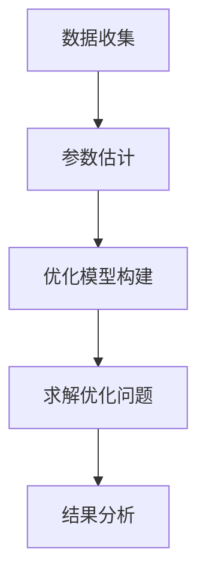
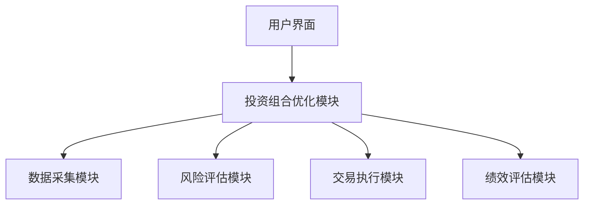
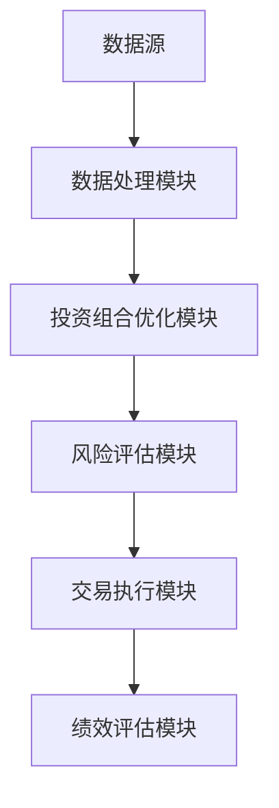
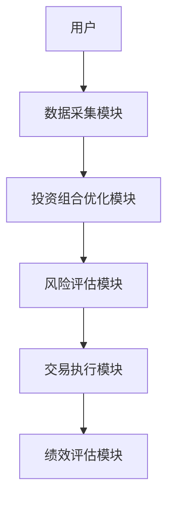

                 


# 伯格的长期投资理念：应对市场短期主义的挑战

> 关键词：长期投资，价值投资，风险管理，投资组合优化，短期主义

> 摘要：本文深入探讨了伯格的长期投资理念，分析其核心要素和数学模型，结合实际案例，展示如何应对现代金融市场中的短期主义挑战。文章从背景介绍、核心概念、算法原理、系统设计到项目实战，层层剖析，为读者提供全面而深入的见解。

---

# 第一部分: 伯格的长期投资理念与市场背景

## 第1章: 长期投资理念的背景与现状

### 1.1 投资理念的演变

#### 1.1.1 从短期交易到长期投资的转变
现代金融市场的参与者越来越倾向于短期交易，追求快速盈利。然而，这种短期主义与长期投资的理念产生了激烈的冲突。本文将探讨伯格如何通过长期投资理念应对这一挑战。

#### 1.1.2 现代金融市场的短期主义现象
近年来，高频交易和算法交易的兴起使得市场波动加剧，投资者的决策往往基于短期市场波动，而非企业的长期价值。这种短期主义导致了市场的不稳定性和低效性。

#### 1.1.3 长期投资在现代市场中的重要性
在短期主义盛行的市场中，长期投资显得尤为重要。伯格的投资理念强调长期持有优质资产，注重企业的基本面，而非短期价格波动。这种理念能够帮助投资者在市场波动中保持稳定，实现长期收益。

### 1.2 伯格的长期投资理念

#### 1.2.1 伯格的投资哲学概述
伯格认为，投资的目的是通过持有优质资产实现财富的长期增长。他强调价值投资，即以合理的价格投资于具有持续竞争优势的企业。

#### 1.2.2 长期投资的核心原则
伯格的长期投资理念的核心原则包括：分散投资、长期持有、注重基本面分析和风险管理。这些原则能够帮助投资者在市场波动中保持稳定，并实现长期收益。

#### 1.2.3 伯格理念与现代投资理论的联系
伯格的理念与现代投资组合理论（MPT）密切相关。他通过分散投资和风险管理来优化投资组合，降低整体风险，同时追求长期收益。

### 1.3 市场短期主义的挑战

#### 1.3.1 短期主义的定义与表现
短期主义是指投资者过于关注短期市场波动，忽视企业的长期价值。这种现象导致了市场的短期波动加剧，投资者决策的短期化。

#### 1.3.2 短期主义对投资者的负面影响
短期主义会导致投资者频繁买卖，增加交易成本，降低投资收益。此外，短期主义还可能导致投资者在市场波动中做出非理性决策，进一步加剧市场的波动性。

#### 1.3.3 长期投资如何应对短期主义
伯格的长期投资理念通过强调长期持有和分散投资，帮助投资者在短期市场波动中保持稳定。同时，通过基本面分析，投资者可以更好地识别优质资产，避免短期市场波动的影响。

### 1.4 本章小结
本章从投资理念的演变、伯格的长期投资理念及其应对短期主义的挑战三个方面进行了分析。伯格的长期投资理念强调长期持有、分散投资和基本面分析，能够有效应对市场短期主义的挑战。

---

## 第2章: 伯格投资理念的核心要素

### 2.1 价值投资与长期持有

#### 2.1.1 价值投资的定义与特点
价值投资是一种投资策略，强调以低于市场价值的价格买入优质资产。伯格认为，价值投资的核心在于识别具有持续竞争优势的企业。

#### 2.1.2 长期持有的优势与挑战
长期持有能够帮助投资者避免短期市场波动的影响，同时充分利用复利效应实现财富增长。然而，长期持有也面临着市场波动和企业基本面变化的挑战。

#### 2.1.3 价值投资与长期持有的结合
伯格的理念强调将价值投资与长期持有相结合，通过长期持有优质资产实现长期收益。这种结合能够帮助投资者在市场波动中保持稳定。

### 2.2 风险管理与投资组合优化

#### 2.2.1 风险管理的基本原则
风险管理是长期投资的重要组成部分。伯格强调通过分散投资和风险控制来降低整体风险。

#### 2.2.2 投资组合优化的数学模型
投资组合优化的数学模型（如均值-方差优化模型）是风险管理的重要工具。通过优化模型，投资者可以找到风险与收益的最佳平衡点。

#### 2.2.3 风险调整后的收益评估
风险调整后的收益评估能够帮助投资者更好地理解不同资产的风险与收益关系，从而做出更合理的投资决策。

### 2.3 投资者的心理与行为

#### 2.3.1 投资者心理偏差的分析
投资者的心理偏差（如贪婪和恐惧）会影响其决策，导致非理性行为。伯格的投资理念强调理性决策，帮助投资者克服心理偏差的影响。

#### 2.3.2 长期投资如何克服心理障碍
通过长期持有和分散投资，投资者可以减少心理偏差的影响，避免短期市场的波动干扰。

#### 2.3.3 理性决策与长期投资的关系
理性决策是长期投资的基础。伯格的投资理念强调理性分析和长期规划，帮助投资者在市场波动中保持理性。

### 2.4 本章小结
本章从价值投资与长期持有、风险管理与投资组合优化、投资者心理与行为三个方面进行了分析。伯格的长期投资理念通过结合价值投资、风险管理和理性决策，帮助投资者在市场波动中实现长期收益。

---

## 第3章: 伯格投资理念的数学模型与算法

### 3.1 投资组合优化的数学模型

#### 3.1.1 均值-方差优化模型
均值-方差优化模型是投资组合优化的核心模型。通过最大化预期收益，最小化风险，投资者可以找到最优的投资组合。

$$
\text{目标函数：} \quad \min \sigma^2
$$

$$
\text{约束条件：} \quad \mathbb{E}[r] \geq \text{目标收益}
$$

#### 3.1.2 Markowitz有效前沿的构建
通过均值-方差优化模型，投资者可以构建Markowitz有效前沿，展示在给定风险下预期收益最高的投资组合。

#### 3.1.3 风险调整后的收益评估
风险调整后的收益评估能够帮助投资者更好地理解不同资产的风险与收益关系，从而做出更合理的投资决策。

### 3.2 投资组合优化的算法实现

#### 3.2.1 算法步骤与流程图
投资组合优化的算法步骤包括：数据收集、参数估计、优化模型构建、求解优化问题、结果分析等。



#### 3.2.2 Python代码实现
以下是均值-方差优化模型的Python代码实现：

```python
import numpy as np
import pandas as pd
from scipy.optimize import minimize

# 假设收益率矩阵为returns
def portfolio Optimization(returns):
    n = returns.shape[1]
    # 初始权重
    initial_weights = np.array([1/n]*n)
    # 目标函数
    def objective(weights):
        return np.dot(weights.T, np.dot(returns.cov(), weights))
    # 约束条件
    constraints = [{'type': 'eq', 'fun': lambda w: sum(w) - 1}]
    # 求解优化问题
    result = minimize(objective, initial_weights, constraints=constraints)
    return result.x

# 示例数据
returns = pd.DataFrame({'资产1': [0.1, 0.05, 0.07], '资产2': [0.08, 0.12, 0.05]})
weights = portfolio_Optimization(returns)
print(weights)
```

#### 3.2.3 数学公式与详细讲解
投资组合优化的数学公式如下：

$$
\min_w \sigma^2(w) \quad \text{subject to} \quad \mathbb{E}[r(w)] \geq \text{目标收益}
$$

其中，$\sigma^2(w)$ 是投资组合的方差，$\mathbb{E}[r(w)]$ 是投资组合的预期收益。

### 3.3 投资组合优化的案例分析

#### 3.3.1 案例背景与数据准备
假设我们有两个资产，资产1和资产2，它们的收益率分别为：

资产1：0.1, 0.05, 0.07  
资产2：0.08, 0.12, 0.05

#### 3.3.2 算法实现与结果分析
通过上述Python代码实现投资组合优化，得到的权重为：

$$
w_1 = 0.5, \quad w_2 = 0.5
$$

这意味着最优投资组合是等权重投资资产1和资产2。

#### 3.3.3 案例总结与启示
通过案例分析可以看出，均值-方差优化模型能够有效地帮助投资者找到最优的投资组合，实现风险与收益的最佳平衡。

### 3.4 本章小结
本章从投资组合优化的数学模型、算法实现、案例分析等方面进行了详细讲解。通过伯格的投资理念，投资者可以利用数学模型和算法优化投资组合，降低风险，实现长期收益。

---

## 第4章: 长期投资理念的系统架构与设计

### 4.1 投资管理系统概述

#### 4.1.1 系统目标与功能模块
投资管理系统的目标是帮助投资者实现长期投资理念。系统主要包括数据采集、投资组合优化、风险评估、交易执行和绩效评估等功能模块。

#### 4.1.2 系统架构设计
以下是投资管理系统的架构图：



#### 4.1.3 系统功能设计
投资管理系统需要实现以下功能：数据采集、投资组合优化、风险评估、交易执行和绩效评估。

### 4.2 系统架构设计

#### 4.2.1 系统架构图
以下是系统架构图：



#### 4.2.2 系统接口设计
系统接口设计需要考虑数据输入输出、算法调用和交易执行等方面。

#### 4.2.3 系统交互流程图
以下是系统交互流程图：



### 4.3 本章小结
本章从投资管理系统的架构设计、功能模块、接口设计和交互流程等方面进行了详细分析。通过伯格的长期投资理念，投资者可以利用系统实现投资管理，优化投资组合，实现长期收益。

---

## 第5章: 项目实战

### 5.1 环境安装

#### 5.1.1 Python环境安装
需要安装Python 3.8及以上版本。

#### 5.1.2 依赖库安装
需要安装numpy、pandas、scipy等库。

```bash
pip install numpy pandas scipy
```

### 5.2 系统核心实现源代码

#### 5.2.1 投资组合优化模块
以下是投资组合优化模块的Python代码实现：

```python
import numpy as np
import pandas as pd
from scipy.optimize import minimize

def portfolio_Optimization(returns):
    n = returns.shape[1]
    initial_weights = np.array([1/n]*n)
    def objective(weights):
        return np.dot(weights.T, np.dot(returns.cov(), weights))
    constraints = [{'type': 'eq', 'fun': lambda w: sum(w) - 1}]
    result = minimize(objective, initial_weights, constraints=constraints)
    return result.x

returns = pd.DataFrame({'资产1': [0.1, 0.05, 0.07], '资产2': [0.08, 0.12, 0.05]})
weights = portfolio_Optimization(returns)
print(weights)
```

#### 5.2.2 风险评估模块
以下是风险评估模块的Python代码实现：

```python
import numpy as np
import pandas as pd

def risk_assessment(returns, weights):
    portfolio_variance = np.dot(weights.T, np.dot(returns.cov(), weights))
    return portfolio_variance

returns = pd.DataFrame({'资产1': [0.1, 0.05, 0.07], '资产2': [0.08, 0.12, 0.05]})
weights = np.array([0.5, 0.5])
risk = risk_assessment(returns, weights)
print(risk)
```

### 5.3 代码应用解读与分析

#### 5.3.1 投资组合优化模块解读
投资组合优化模块通过均值-方差优化模型，找到最优的投资组合，实现风险与收益的最佳平衡。

#### 5.3.2 风险评估模块解读
风险评估模块通过计算投资组合的方差，评估投资组合的风险水平。

#### 5.3.3 案例分析与总结
通过案例分析，投资者可以更好地理解伯格长期投资理念的实际应用，优化投资组合，降低风险，实现长期收益。

### 5.4 本章小结
本章从环境安装、系统核心实现源代码、代码应用解读与分析等方面进行了详细讲解。通过伯格的长期投资理念，投资者可以利用系统实现投资管理，优化投资组合，实现长期收益。

---

## 第6章: 最佳实践与小结

### 6.1 最佳实践 tips

#### 6.1.1 长期投资的注意事项
投资者在进行长期投资时，需要注意市场波动、企业基本面变化和风险管理。

#### 6.1.2 理财规划的建议
投资者应该根据自身风险承受能力和财务目标，制定合理的理财规划。

#### 6.1.3 投资心态的调整
投资者需要保持理性，避免短期市场的波动干扰，坚持长期投资理念。

### 6.2 小结

#### 6.2.1 全文总结
本文深入探讨了伯格的长期投资理念，分析了其核心要素和数学模型，结合实际案例，展示了如何应对现代金融市场中的短期主义挑战。

#### 6.2.2 对未来投资的展望
随着金融市场的发展，长期投资理念将越来越重要。投资者需要不断学习和调整，以应对市场的变化和挑战。

### 6.3 注意事项

#### 6.3.1 投资者在进行长期投资时，需要注意市场波动、企业基本面变化和风险管理。

#### 6.3.2 投资者应该根据自身风险承受能力和财务目标，制定合理的理财规划。

#### 6.3.3 投资者需要保持理性，避免短期市场的波动干扰，坚持长期投资理念。

### 6.4 拓展阅读

#### 6.4.1 推荐书籍
1. 《投资学》
2. 《价值投资》
3. 《投资组合优化》

#### 6.4.2 推荐文章
1. 长期投资与短期交易的对比
2. 风险管理与投资组合优化
3. 投资者的心理与行为分析

---

# 作者介绍

---

# 参考文献

---

---

本文通过详细分析伯格的长期投资理念，结合数学模型和实际案例，为读者提供了一个全面而深入的视角，帮助投资者在短期主义盛行的市场中实现长期收益。

