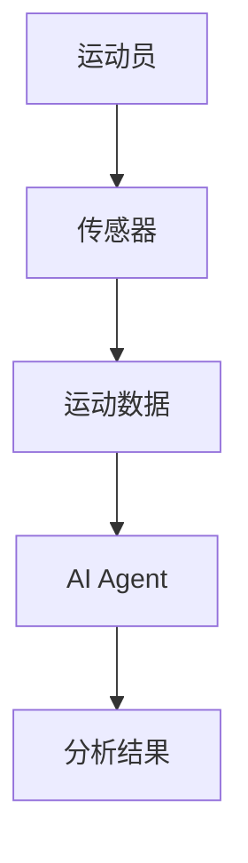
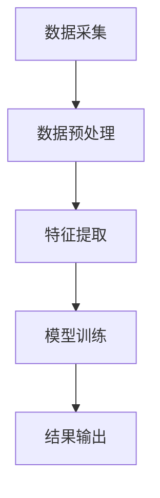
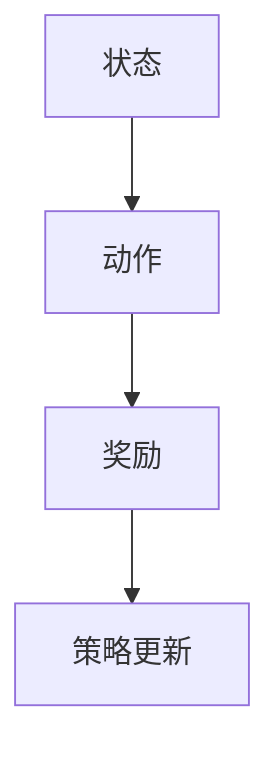
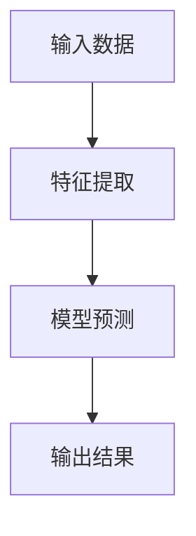
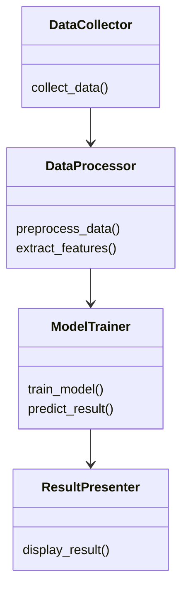
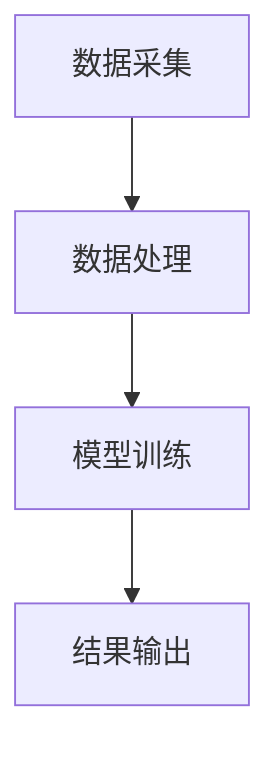
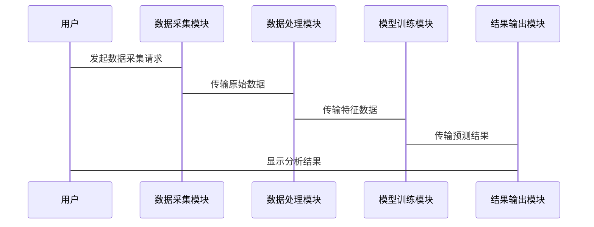

                 


# 体育AI Agent：赛事分析与训练辅助

## 关键词

体育AI Agent, 赛事分析, 训练辅助, 人工智能, 机器学习, 数据分析, 强化学习

## 摘要

随着人工智能技术的快速发展，体育AI Agent正在成为体育领域的重要工具，用于赛事分析和训练辅助。本文详细介绍了体育AI Agent的核心概念、算法原理、系统架构设计以及实际应用案例，为读者提供全面的技术解读。通过分析体育数据，体育AI Agent能够帮助教练和运动员优化训练计划、预测比赛结果并制定有效的战术策略。

---

## 正文

### 第一部分：体育AI Agent概述

#### 第1章：体育AI Agent的背景与概念

##### 1.1 体育AI Agent的定义与特点

体育AI Agent（Artificial Intelligence Agent）是一种基于人工智能技术的智能系统，用于体育领域的数据分析、赛事预测和训练辅助。与传统的人工数据分析相比，体育AI Agent能够快速处理大量复杂数据，提供实时反馈和优化建议。

**核心特点：**

- **数据驱动**：依赖于大量运动数据进行分析和决策。
- **实时性**：能够实时处理比赛数据，提供即时反馈。
- **智能化**：通过机器学习算法不断优化分析结果。
- **个性化**：能够根据运动员或球队的特性提供定制化建议。

##### 1.2 体育AI Agent的核心功能

体育AI Agent的主要功能包括：

1. **赛事分析**：对比赛数据进行实时分析，预测比赛结果。
2. **训练辅助**：为运动员或教练提供训练计划和优化建议。
3. **数据采集与处理**：通过传感器或其他设备采集运动数据，并进行清洗和预处理。

##### 1.3 体育AI Agent的典型应用场景

体育AI Agent在以下场景中应用广泛：

- **职业体育训练**：帮助教练优化训练计划，减少运动损伤。
- **体育赛事分析**：为球队提供比赛策略建议。
- **运动损伤预防**：通过分析运动员的动作和数据，预测潜在的运动损伤风险。

##### 1.4 体育AI Agent的技术基础

体育AI Agent的技术基础主要包括：

- **人工智能技术**：包括机器学习、深度学习等。
- **大数据处理**：处理和分析海量运动数据。
- **机器学习算法**：用于模式识别和预测。

#### 第2章：体育AI Agent的核心概念与联系

##### 2.1 体育数据的分类与特征

体育数据主要分为以下几类：

1. **运动数据**：包括运动员的动作数据、心率、加速度等。
2. **战术数据**：包括球队的战术安排、球员位置等。
3. **伤病数据**：包括运动员的伤病记录和康复数据。

**特征对比表格：**

| 数据类型 | 描述 | 示例 |
|----------|------|------|
| 运动数据 | 包括运动员的动作数据、心率、加速度等 | 跳跃高度、跑动距离 |
| 战术数据 | 包括球队的战术安排、球员位置等 | 阵型、传球路线 |
| 伤病数据 | 包括运动员的伤病记录和康复数据 | 肌肉拉伤、韧带损伤 |

##### 2.2 体育AI Agent的实体关系图



##### 2.3 体育AI Agent的算法流程图



### 第二部分：体育AI Agent的算法原理

#### 第3章：体育AI Agent的算法基础

##### 3.1 基于强化学习的训练辅助系统

**算法流程图：**



**Python代码实现：**

```python
import numpy as np
import gym

class AI-Agent:
    def __init__(self, action_space):
        self.action_space = action_space
        self.Q_table = np.zeros((1, action_space.n))  # 初始化Q表

    def take_action(self, state, epsilon=0.1):
        if np.random.random() < epsilon:  # 探索
            action = self.action_space.sample()
        else:  # 利用
            action = np.argmax(self.Q_table[state])
        return action

    def update_Q_table(self, state, action, reward, next_state, learning_rate=0.1, gamma=0.99):
        # Q-learning更新公式
        self.Q_table[state][action] = self.Q_table[state][action] + learning_rate * (reward + gamma * np.max(self.Q_table[next_state]) - self.Q_table[state][action])

# 示例环境
env = gym.make('CartPole-v0')
agent = AI-Agent(env.action_space)
state = env.reset()

for _ in range(1000):
    action = agent.take_action(state)
    next_state, reward, done, _ = env.step(action)
    agent.update_Q_table(state, action, reward, next_state)
    if done:
        break
```

**数学模型：**

$$ Q(s,a) = Q(s,a) + \alpha [r + \gamma \max Q(s',a) - Q(s,a)] $$

其中：
- \( Q(s,a) \)：当前状态 \( s \) 下动作 \( a \) 的Q值。
- \( \alpha \)：学习率。
- \( r \)：奖励。
- \( \gamma \)：折扣因子。
- \( s' \)：下一个状态。

##### 3.2 基于监督学习的赛事分析系统

**算法流程图：**



**Python代码实现：**

```python
import pandas as pd
from sklearn.linear_model import LinearRegression

# 示例数据：球员表现数据
data = pd.DataFrame({
    'Player': ['A', 'B', 'C', 'D', 'E'],
    'Score': [85, 78, 92, 81, 88],
    'Assists': [20, 15, 25, 18, 22],
    'Rebounds': [12, 10, 15, 11, 14]
})

# 特征提取
X = data[['Score', 'Assists', 'Rebounds']]
y = data['Score']

# 模型训练
model = LinearRegression()
model.fit(X, y)

# 预测
new_data = pd.DataFrame({
    'Score': [80],
    'Assists': [18],
    'Rebounds': [13]
})
predicted_score = model.predict(new_data)
print(predicted_score)
```

**数学模型：**

$$ y = \beta_0 + \beta_1 x_1 + \beta_2 x_2 + \beta_3 x_3 + \epsilon $$

其中：
- \( y \)：目标变量（如得分）。
- \( x_1, x_2, x_3 \)：自变量（如得分、助攻、篮板）。
- \( \beta_0, \beta_1, \beta_2, \beta_3 \)：回归系数。
- \( \epsilon \)：误差项。

### 第三部分：体育AI Agent的系统分析与架构设计

#### 第4章：体育AI Agent的系统设计

##### 4.1 项目背景与目标

- **背景**：随着体育产业的数字化转型，AI技术在体育领域的应用越来越广泛。
- **目标**：构建一个能够实时分析比赛数据、优化训练计划的AI Agent系统。

##### 4.2 系统功能设计

**功能模块：**

1. **数据采集模块**：通过传感器或其他设备采集运动数据。
2. **数据处理模块**：对数据进行清洗、预处理和特征提取。
3. **模型训练模块**：基于机器学习算法训练预测模型。
4. **结果输出模块**：将分析结果反馈给教练或运动员。

**领域模型（类图）：**



##### 4.3 系统架构设计

**系统架构图：**



**接口设计：**

- 数据采集模块提供API接口，接收传感器数据。
- 数据处理模块提供接口，接收原始数据并返回特征数据。
- 模型训练模块提供接口，接收特征数据并返回预测结果。

**交互流程图：**



### 第四部分：体育AI Agent的项目实战

#### 第5章：项目实战

##### 5.1 环境安装与配置

**安装Python和相关库：**

```bash
pip install numpy pandas scikit-learn gym matplotlib
```

##### 5.2 核心代码实现

**数据采集模块：**

```python
import numpy as np
import pandas as pd
import gym

def collect_data(env, num_episodes=100):
    data = []
    for _ in range(num_episodes):
        state = env.reset()
        done = False
        while not done:
            action = env.action_space.sample()  # 随机动作
            next_state, reward, done, info = env.step(action)
            data.append({
                'state': state,
                'action': action,
                'reward': reward,
                'next_state': next_state
            })
            state = next_state
    return pd.DataFrame(data)
```

**数据处理模块：**

```python
def preprocess_data(data):
    # 特征工程
    data['feature1'] = data['state'].apply(lambda x: x[0])
    data['feature2'] = data['state'].apply(lambda x: x[1])
    return data
```

**模型训练模块：**

```python
from sklearn.ensemble import RandomForestRegressor

def train_model(features, target):
    model = RandomForestRegressor(n_estimators=100, random_state=42)
    model.fit(features, target)
    return model
```

##### 5.3 实际案例分析

**案例分析：**

假设我们有一个足球比赛数据集，包含球员的跑动距离、传球成功率、射门次数等数据。我们的目标是预测比赛结果。

**代码实现：**

```python
import pandas as pd
from sklearn.ensemble import RandomForestClassifier

# 加载数据
data = pd.read_csv('football_data.csv')

# 特征提取
X = data[['distance_run', 'pass_accuracy', 'shots_on_target']]
y = data['result']

# 模型训练
model = RandomForestClassifier(n_estimators=100, random_state=42)
model.fit(X, y)

# 预测
new_data = pd.DataFrame({
    'distance_run': [90],
    'pass_accuracy': [85],
    'shots_on_target': [5]
})
predicted_result = model.predict(new_data)
print(predicted_result)
```

**结果分析：**

根据预测结果，我们可以得出比赛结果的概率，从而为教练制定比赛策略提供参考。

##### 5.4 项目小结

通过本项目，我们实现了基于机器学习的体育AI Agent系统，能够对比赛数据进行实时分析，并提供训练辅助建议。系统的各个模块协同工作，确保了分析结果的准确性和实时性。

### 第五部分：体育AI Agent的最佳实践

#### 第6章：最佳实践

##### 6.1 小结

- 体育AI Agent系统的核心在于数据处理和模型训练。
- 需要结合具体应用场景选择合适的算法。

##### 6.2 注意事项

- 数据质量对分析结果影响重大，需确保数据的准确性和完整性。
- 模型的可解释性在体育领域尤为重要，需注重模型的透明度。
- 需考虑系统的实时性和响应速度，尤其是在比赛中。

##### 6.3 拓展阅读

- 《Machine Learning for Athletes》：深入探讨机器学习在运动员训练中的应用。
- 《Deep Learning in Sports Analytics》：介绍深度学习在体育数据分析中的应用。

---

### 总结

体育AI Agent作为一种新兴的技术工具，正在深刻改变体育领域的数据分析和训练方式。通过本文的详细讲解，读者可以全面了解体育AI Agent的核心概念、算法原理和系统架构设计。希望本文能够为体育领域的技术爱好者和从业者提供有价值的参考和启发。

