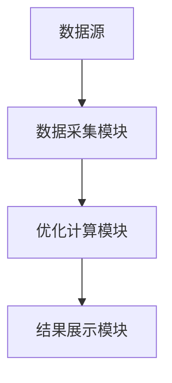
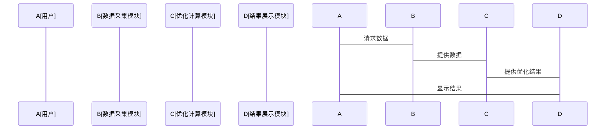

                 


# 使用多智能体系统优化投资组合配置

> 关键词：多智能体系统、投资组合优化、粒子群优化、遗传算法、分布式计算

> 摘要：本文系统地探讨了多智能体系统在投资组合优化中的应用，从基本概念到算法实现，再到实际案例，全面解析了如何利用多智能体系统的优势来提升投资组合的优化效果。通过详细分析多智能体系统的理论基础、优化算法、数学模型、系统架构以及项目实战，本文为读者提供了从理论到实践的完整指南，帮助读者理解并应用多智能体系统优化投资组合配置。

---

# 第1章: 多智能体系统的背景与应用

## 1.1 多智能体系统的定义与特点

### 1.1.1 多智能体系统的定义
多智能体系统（Multi-Agent System, MAS）是由多个智能体（Agent）组成的分布式系统，这些智能体通过协作和通信共同完成特定任务。智能体是具有感知、决策和执行能力的实体，能够独立运作并与其他智能体或环境交互。

### 1.1.2 多智能体系统的特征
1. **分布式性**：智能体分布在网络中，各自负责一部分任务。
2. **协作性**：智能体之间通过通信和协作完成全局目标。
3. **自治性**：每个智能体都有自己的决策机制，能够自主运作。
4. **动态性**：系统能够适应环境的变化，实时调整策略。

### 1.1.3 多智能体系统的优势
- **并行计算**：多个智能体同时处理任务，提高效率。
- **容错性**：单个智能体的故障不会导致整个系统崩溃。
- **灵活性**：系统可以根据环境变化动态调整。

## 1.2 投资组合优化的基本概念

### 1.2.1 投资组合的定义
投资组合是指将一定资金分配到不同资产（如股票、债券、基金等）上的配置方式。投资组合的目标是在风险与收益之间找到最佳平衡点。

### 1.2.2 投资组合优化的目标
1. **最大化收益**：在给定风险下，追求最大收益。
2. **最小化风险**：在给定收益下，降低风险。

### 1.2.3 传统投资组合优化方法的局限性
传统方法（如均值-方差优化）假设资产价格服从正态分布，但在实际中，资产价格波动、市场风险等复杂因素使得传统方法难以应对。

## 1.3 多智能体系统在投资组合优化中的应用

### 1.3.1 多智能体系统在金融领域的潜力
- 金融市场具有高度复杂性和不确定性，多智能体系统能够模拟市场参与者的决策行为，捕捉市场动态。

### 1.3.2 多智能体系统优化投资组合的优势
- **分布式计算**：多个智能体可以同时处理不同资产的数据，提高计算效率。
- **实时反馈**：智能体能够实时调整策略，适应市场变化。

### 1.3.3 应用场景与实际案例
- **资产分配**：智能体负责不同资产的优化配置。
- **风险管理**：通过协作，智能体能够识别并规避投资风险。

## 1.4 本章小结
本章介绍了多智能体系统的基本概念和特点，分析了投资组合优化的目标和传统方法的局限性，并探讨了多智能体系统在金融领域的应用潜力。

---

# 第2章: 多智能体系统的理论基础

## 2.1 多智能体系统的核心概念

### 2.1.1 智能体的定义与分类
- **定义**：智能体是具有感知、决策和执行能力的实体。
- **分类**：
  - **反应式智能体**：基于当前感知做出反应。
  - **认知式智能体**：具备推理、规划能力。

### 2.1.2 多智能体系统的结构与层次
- **物理层**：智能体与环境交互的物理实体。
- **逻辑层**：智能体的逻辑结构和功能。
- **通信层**：智能体之间的通信机制。

### 2.1.3 智能体之间的协作与通信
- **协作**：通过任务分配和协同完成目标。
- **通信**：使用消息传递机制进行信息交换。

## 2.2 投资组合优化的数学模型

### 2.2.1 投资组合优化的目标函数
最大化收益：$$\max \sum_{i=1}^n w_i r_i$$
最小化风险：$$\min \sum_{i=1}^n \sum_{j=1}^n w_i w_j \sigma_{ij}$$

其中，$$w_i$$ 是资产i的权重，$$r_i$$ 是资产i的期望收益，$$\sigma_{ij}$$ 是资产i和j的协方差。

### 2.2.2 约束条件与风险评估
- **权重约束**：$$\sum_{i=1}^n w_i = 1$$
- **风险约束**：$$\sum_{i=1}^n \sum_{j=1}^n w_i w_j \sigma_{ij} \leq \text{风险阈值}$$

### 2.2.3 优化模型的构建与求解
构建一个多目标优化模型，考虑收益和风险的平衡，使用拉格朗日乘数法求解。

## 2.3 多智能体系统与投资组合优化的结合

### 2.3.1 多智能体系统在优化中的角色
- **数据采集**：智能体负责收集各资产的历史数据。
- **优化计算**：智能体负责计算最优权重。

### 2.3.2 多智能体系统的分布式计算优势
- **并行处理**：多个智能体同时处理不同资产的数据，提高计算效率。

### 2.3.3 多智能体系统与投资组合优化的协同机制
- **任务分配**：智能体根据任务优先级分配优化任务。
- **结果汇总**：智能体将优化结果汇总，得到全局最优解。

## 2.4 本章小结
本章详细讲解了多智能体系统的核心概念，并构建了投资组合优化的数学模型，分析了多智能体系统在优化中的角色和优势。

---

# 第3章: 多智能体系统的算法原理

## 3.1 多智能体优化算法概述

### 3.1.1 集群智能算法
- **定义**：模拟生物群集的行为，如鸟群觅食、鱼群洄游。

### 3.1.2 分布式优化算法
- **定义**：在分布式系统中，多个智能体协同完成优化任务。

### 3.1.3 协作式搜索算法
- **定义**：智能体协作搜索全局最优解。

## 3.2 粒子群优化算法（PSO）

### 3.2.1 粒子群优化的基本原理
粒子群优化算法是一种基于群体智能的优化算法，模拟鸟群觅食的行为。

- **初始化**：随机初始化一群粒子的位置和速度。
- **更新**：粒子根据个体极值和全局极值更新速度和位置。

### 3.2.2 粒子群优化的实现步骤

1. 初始化粒子群。
2. 计算每个粒子的适应度值。
3. 更新每个粒子的个体极值和全局极值。
4. 根据极值更新粒子的速度和位置。
5. 重复步骤2-4，直到满足终止条件。

### 3.2.3 粒子群优化在投资组合优化中的应用

- **权重优化**：通过粒子群优化算法找到最优资产权重。

### 3.2.4 粒子群优化的数学模型

适应度函数：$$f(x) = \text{收益} - \lambda \times \text{风险}$$

其中，$$\lambda$$ 是惩罚系数。

### 3.2.5 粒子群优化的Python代码实现

```python
import numpy as np

def fitness(x, returns, covariance):
    # 计算收益
    portfolio_return = np.dot(x, returns)
    # 计算风险
    portfolio_variance = np.dot(x, np.dot(covariance, x))
    # 适应度函数
    return -portfolio_return + 0.01 * portfolio_variance

# 初始化粒子群
n_assets = len(returns)
n_particles = 20
w = 0.8
c1 = 1
c2 = 1

# 随机初始化位置和速度
positions = np.random.random((n_assets, n_particles))
velocities = np.zeros((n_assets, n_particles))

# 迭代优化
for _ in range(100):
    # 计算适应度
    fitnesses = np.apply_along_axis(fitness, 0, positions, returns, covariance)
    # 找到全局最优
    global_best = np.argmin(fitnesses)
    # 更新速度和位置
    velocities = w * velocities + c1 * np.random.rand(n_assets, n_particles) * (positions[:, global_best] - positions) + c2 * np.random.rand(n_assets, n_particles) * (positions[:, global_best] - positions)
    positions += velocities
```

## 3.3 遗传算法（GA）

### 3.3.1 遗传算法的基本原理
遗传算法是一种基于生物进化原理的优化算法，模拟自然选择和遗传机制。

### 3.3.2 遗传算法的实现步骤

1. 初始化种群。
2. 计算适应度值。
3. 选择优秀个体进行交配。
4. 通过交叉和变异操作生成新种群。
5. 重复步骤2-4，直到满足终止条件。

### 3.3.3 遗传算法在投资组合优化中的应用

- **权重优化**：通过遗传算法找到最优资产权重。

### 3.3.4 遗传算法的数学模型

适应度函数：$$f(x) = \text{收益} - \lambda \times \text{风险}$$

### 3.3.5 遗传算法的Python代码实现

```python
import numpy as np

def fitness(x, returns, covariance):
    # 计算收益
    portfolio_return = np.dot(x, returns)
    # 计算风险
    portfolio_variance = np.dot(x, np.dot(covariance, x))
    # 适应度函数
    return -portfolio_return + 0.01 * portfolio_variance

n_assets = len(returns)
n_pop = 20
n_generations = 100

# 初始化种群
population = np.random.random((n_assets, n_pop))

for _ in range(n_generations):
    # 计算适应度
    fitnesses = np.apply_along_axis(fitness, 0, population, returns, covariance)
    # 选择优秀个体
    selected = np.argsort(fitnesses)[:10]
    # 交配
    offspring = np.zeros((n_assets, n_pop))
    for i in range(5):
        parent1 = selected[i]
        parent2 = selected[-i-1]
        # 单点交叉
        crossover_point = np.random.randint(1, n_assets)
        offspring[:crossover_point, 2*i] = population[:, parent1]
        offspring[crossover_point:, 2*i] = population[:, parent2]
        offspring[:crossover_point, 2*i+1] = population[:, parent2]
        offspring[crossover_point:, 2*i+1] = population[:, parent1]
    # 变异
    mutation_rate = 0.1
    for i in range(n_pop):
        if np.random.random() < mutation_rate:
            mutation_point = np.random.randint(n_assets)
            offspring[mutation_point, i] = 1 - offspring[mutation_point, i]
    population = offspring
```

## 3.4 本章小结
本章详细讲解了粒子群优化算法和遗传算法的基本原理，并给出了它们在投资组合优化中的应用实例和代码实现。

---

# 第4章: 多智能体系统的数学模型与系统架构

## 4.1 投资组合优化的数学模型

### 4.1.1 目标函数与约束条件
- **目标函数**：最大化收益，最小化风险。
- **约束条件**：权重之和为1，风险不超过阈值。

### 4.1.2 数学模型
$$\max \sum_{i=1}^n w_i r_i$$
$$\sum_{i=1}^n w_i = 1$$
$$\sum_{i=1}^n \sum_{j=1}^n w_i w_j \sigma_{ij} \leq \text{风险阈值}$$

## 4.2 系统架构设计

### 4.2.1 系统功能模块
- **数据采集模块**：收集各资产的历史数据。
- **优化计算模块**：使用多智能体算法进行优化计算。
- **结果展示模块**：展示优化结果。

### 4.2.2 系统架构图


### 4.2.3 系统交互图


## 4.3 本章小结
本章分析了投资组合优化的数学模型，并设计了系统的功能模块和架构。

---

# 第5章: 项目实战

## 5.1 项目环境安装

### 5.1.1 安装必要的库
- **numpy**：用于数值计算。
- **pandas**：用于数据处理。
- **matplotlib**：用于数据可视化。

```bash
pip install numpy pandas matplotlib
```

## 5.2 核心代码实现

### 5.2.1 数据预处理
```python
import pandas as pd
import numpy as np

# 加载数据
data = pd.read_csv('assets.csv')
returns = data.pct_change().dropna().values.T
```

### 5.2.2 粒子群优化实现
```python
def fitness(x, returns):
    portfolio_return = np.dot(x, returns)
    return -portfolio_return

n_assets = len(returns)
n_particles = 20
w = 0.8
c1 = 1
c2 = 1

positions = np.random.random((n_assets, n_particles))
velocities = np.zeros((n_assets, n_particles))

for _ in range(100):
    fitnesses = np.apply_along_axis(fitness, 0, positions, returns)
    global_best = np.argmin(fitnesses)
    velocities = w * velocities + c1 * np.random.rand(n_assets, n_particles) * (positions[:, global_best] - positions) + c2 * np.random.rand(n_assets, n_particles) * (positions[:, global_best] - positions)
    positions += velocities
```

### 5.2.3 遗传算法实现
```python
def fitness(x, returns):
    portfolio_return = np.dot(x, returns)
    return -portfolio_return

n_assets = len(returns)
n_pop = 20
n_generations = 100

population = np.random.random((n_assets, n_pop))

for _ in range(n_generations):
    fitnesses = np.apply_along_axis(fitness, 0, population, returns)
    selected = np.argsort(fitnesses)[:10]
    offspring = np.zeros((n_assets, n_pop))
    for i in range(5):
        parent1 = selected[i]
        parent2 = selected[-i-1]
        crossover_point = np.random.randint(1, n_assets)
        offspring[:crossover_point, 2*i] = population[:, parent1]
        offspring[crossover_point:, 2*i] = population[:, parent2]
        offspring[:crossover_point, 2*i+1] = population[:, parent2]
        offspring[crossover_point:, 2*i+1] = population[:, parent1]
    mutation_rate = 0.1
    for i in range(n_pop):
        if np.random.random() < mutation_rate:
            mutation_point = np.random.randint(n_assets)
            offspring[mutation_point, i] = 1 - offspring[mutation_point, i]
    population = offspring
```

## 5.3 项目小结
本章通过实际案例展示了多智能体系统在投资组合优化中的应用，并提供了完整的代码实现。

---

# 第6章: 总结与展望

## 6.1 本章总结
本文系统地探讨了多智能体系统在投资组合优化中的应用，从理论到实践，详细分析了多智能体系统的优化算法和系统架构，并通过实际案例展示了其应用效果。

## 6.2 研究前沿与未来展望
- **强化学习**：结合强化学习算法，进一步提升优化效果。
- **分布式计算**：利用分布式计算技术，提高系统的计算效率。

## 6.3 最佳实践 Tips
- **数据质量**：确保数据的准确性和完整性。
- **算法选择**：根据具体问题选择合适的优化算法。
- **系统优化**：通过并行计算和分布式架构提高系统性能。

## 6.4 本章小结
本文总结了多智能体系统在投资组合优化中的应用，并展望了未来的研究方向。

---

# 结语
通过本文的系统讲解，读者可以全面了解多智能体系统在投资组合优化中的应用，并能够将相关理论和方法应用到实际投资中，提升投资组合的优化效果。

