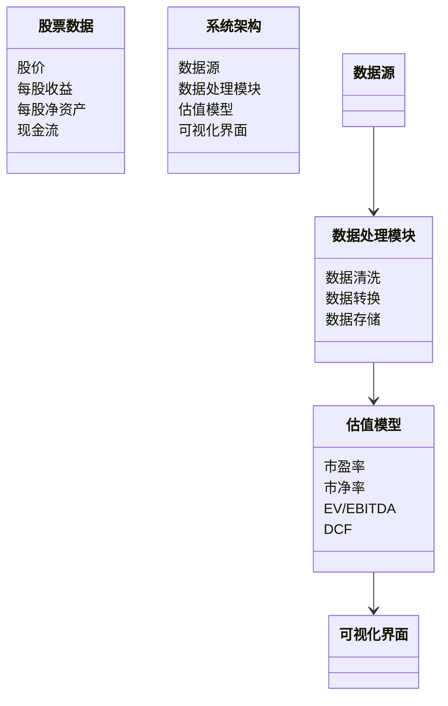
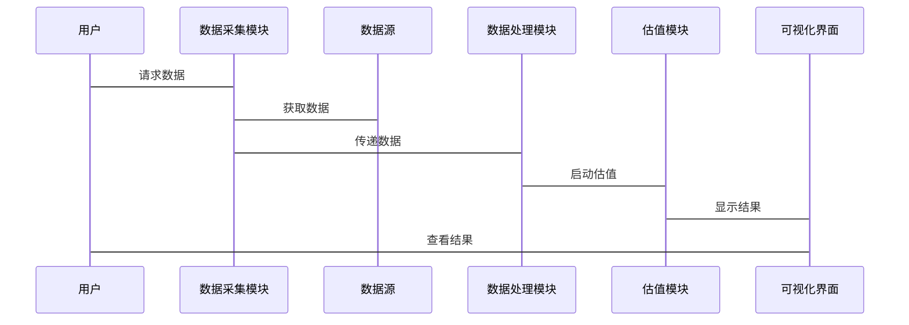

                 


# 俄罗斯股市估值:新兴市场中的特殊案例

---

## 关键词

- 俄罗斯股市  
- 股市估值  
- 新兴市场  
- 地缘政治  
- 经济波动  
- 金融市场分析  

---

## 摘要

俄罗斯股市作为新兴市场中的一个特殊案例，其估值方法和市场行为具有独特性。本文从俄罗斯股市的现状、特点、估值方法以及与其他新兴市场的对比出发，详细分析了俄罗斯股市估值的核心概念、算法原理、系统架构和实际案例。文章结合地缘政治、经济结构和市场流动性等多重因素，探讨了如何在复杂的市场环境中准确评估俄罗斯股市的价值。通过系统分析和项目实战，本文为读者提供了全面的视角和实用的工具，帮助投资者更好地理解俄罗斯股市的估值逻辑和风险因素。

---

## 第一部分: 俄罗斯股市估值的背景与特殊性

### 第1章: 俄罗斯股市的现状与特点

#### 1.1 俄罗斯股市的概述

##### 1.1.1 俄罗斯股市的历史发展

俄罗斯股市的历史可以追溯到19世纪末，但在苏联时期，股市几乎不存在。直到1991年苏联解体后，俄罗斯股市才逐步恢复和发展。1994年，俄罗斯首次公开发行了股票，标志着现代俄罗斯股市的诞生。2008年全球金融危机后，俄罗斯股市经历了剧烈波动，但在近年来逐步恢复并展现出一定的韧性。

##### 1.1.2 俄罗斯股市的市场结构

俄罗斯股市的主要交易市场是莫斯科证券交易所（MOEX），它是俄罗斯最大的证券交易所，涵盖了股票、债券、衍生品等多种金融工具。俄罗斯股市的市值相对较小，但其波动性和风险较高，尤其是受到地缘政治因素的影响显著。

##### 1.1.3 俄罗斯股市的独特性

俄罗斯股市的独特性主要体现在以下几个方面：

- **地缘政治风险**：俄罗斯与西方国家的紧张关系导致股市波动剧烈。
- **经济结构单一**：俄罗斯经济高度依赖能源行业，这使得股市受油价波动的影响较大。
- **市场流动性较低**：由于市场规模较小，市场流动性相对较差，容易受到外部冲击的影响。

#### 1.2 俄罗斯股市与新兴市场的对比

##### 1.2.1 新兴市场的定义与特点

新兴市场是指那些经济快速增长、金融市场逐步完善的国家，如中国、印度、巴西等。这些市场的特点是经济规模大、增长速度快，但金融市场成熟度相对较低。

##### 1.2.2 俄罗斯股市在新兴市场中的地位

俄罗斯是新兴市场的一部分，但由于其特殊的地缘政治地位和经济结构，俄罗斯股市在新兴市场中具有一定的独特性。与其他新兴市场相比，俄罗斯股市受地缘政治因素的影响更大，市场波动性更高。

##### 1.2.3 俄罗斯股市与其他新兴市场的异同

与其他新兴市场相比，俄罗斯股市的异同主要体现在以下几个方面：

- **相同点**：经济增长潜力大，金融市场逐步成熟，投资者结构多元化。
- **不同点**：受地缘政治影响更大，经济结构单一，市场流动性较低。

#### 1.3 俄罗斯股市的特殊性

##### 1.3.1 地缘政治因素对股市的影响

地缘政治是影响俄罗斯股市的重要因素。例如，2014年克里米亚事件导致俄罗斯股市大幅下跌，而2022年俄乌冲突进一步加剧了市场的波动。

##### 1.3.2 经济结构对股市的影响

俄罗斯经济高度依赖能源行业，这使得股市受油价波动的影响较大。当油价上涨时，俄罗斯股市往往表现较好，而油价下跌时，股市则会受到拖累。

##### 1.3.3 俄罗斯股市的波动性与风险

由于地缘政治和经济结构的双重影响，俄罗斯股市的波动性较高，风险也较大。投资者在进行估值时需要特别注意这些因素。

#### 1.4 本章小结

本章通过分析俄罗斯股市的现状、特点以及与其他新兴市场的对比，揭示了俄罗斯股市的独特性和特殊性。地缘政治、经济结构和市场流动性等因素是影响俄罗斯股市估值的重要因素。

---

## 第二部分: 股市估值的核心概念与方法

### 第2章: 股市估值的核心概念与方法

#### 2.1 股市估值的基本概念

##### 2.1.1 估值的定义与意义

股市估值是指通过对公司财务数据、市场环境和行业趋势的分析，对公司股票的内在价值进行评估的过程。估值的意义在于帮助投资者做出更明智的投资决策。

##### 2.1.2 估值的核心要素

- **公司财务数据**：包括收入、利润、现金流等。
- **市场环境**：包括宏观经济环境、行业趋势等。
- **公司治理结构**：包括管理层稳定性、公司治理透明度等。

##### 2.1.3 估值的基本原则

- **数据准确性**：估值需要基于准确的财务数据和市场信息。
- **模型合理性**：估值模型需要合理且适用于特定市场环境。
- **动态调整**：估值需要根据市场变化进行动态调整。

#### 2.2 常用的估值方法

##### 2.2.1 市盈率（P/E）法

市盈率法是通过比较股票的市盈率与行业平均水平或竞争对手的市盈率来评估股票价值的方法。公式为：

$$ P/E = \frac{\text{股价}}{\text{每股收益}} $$

##### 2.2.2 市净率（P/B）法

市净率法是通过比较股票的市净率与行业平均水平或竞争对手的市净率来评估股票价值的方法。公式为：

$$ P/B = \frac{\text{股价}}{\text{每股净资产}} $$

##### 2.2.3 企业价值倍数（EV/EBITDA）法

企业价值倍数法是通过比较公司的企业价值与息税折旧及摊销前利润（EBITDA）来评估股票价值的方法。公式为：

$$ EV/EBITDA = \frac{\text{企业价值}}{\text{EBITDA}} $$

##### 2.2.4 现金流折现法（DCF）

现金流折现法是通过将公司未来现金流折现到当前价值来评估股票价值的方法。公式为：

$$ \text{企业价值} = \sum_{t=1}^{n} \frac{\text{现金流}_t}{(1 + r)^t} $$

#### 2.3 俄罗斯股市估值的特殊性

##### 2.3.1 地缘政治风险对估值的影响

地缘政治风险会影响公司的未来现金流和企业价值。例如，地缘政治冲突可能导致公司业务受阻，从而影响现金流。

##### 2.3.2 经济波动对估值的影响

经济波动会影响公司的财务数据和市场环境。例如，油价下跌可能导致能源公司利润下降，从而影响股票估值。

##### 2.3.3 市场流动性对估值的影响

市场流动性较低可能导致股票价格与内在价值出现偏差。例如，流动性不足可能导致股票价格波动较大。

#### 2.4 本章小结

本章通过分析股市估值的核心概念和常用方法，揭示了俄罗斯股市估值的特殊性。地缘政治、经济波动和市场流动性等因素需要在估值过程中予以特别关注。

---

## 第三部分: 俄罗斯股市估值的算法原理

### 第3章: 俄罗斯股市估值的算法原理

#### 3.1 常用估值模型的原理

##### 3.1.1 市盈率模型的原理

市盈率模型通过比较股票的市盈率与行业平均水平或竞争对手的市盈率来评估股票价值。如果股票的市盈率低于行业平均水平，可能意味着股票被低估。

##### 3.1.2 市净率模型的原理

市净率模型通过比较股票的市净率与行业平均水平或竞争对手的市净率来评估股票价值。如果股票的市净率低于行业平均水平，可能意味着股票被低估。

##### 3.1.3 企业价值倍数模型的原理

企业价值倍数模型通过比较公司的企业价值与EBITDA来评估股票价值。如果公司的EV/EBITDA倍数低于行业平均水平，可能意味着公司被低估。

##### 3.1.4 现金流折现模型的原理

现金流折现模型通过将公司未来现金流折现到当前价值来评估股票价值。如果公司的折现价值高于当前股价，可能意味着股票被低估。

#### 3.2 俄罗斯股市估值的特殊算法

##### 3.2.1 考虑地缘政治风险的调整系数

在估值过程中，需要根据地缘政治风险的大小调整模型参数。例如，可以通过增加折现率来反映地缘政治风险的影响。

##### 3.2.2 经济波动对估值的动态调整

在估值过程中，需要根据经济波动的情况动态调整模型参数。例如，可以通过调整未来现金流的增长率来反映经济波动的影响。

##### 3.2.3 市场流动性对估值的权重调整

在估值过程中，需要根据市场流动性的情况调整模型的权重。例如，流动性较低的市场可能需要更高的折现率。

#### 3.3 算法实现的代码示例

##### 3.3.1 市盈率模型的Python代码

```python
import pandas as pd
import numpy as np

# 假设我们有一个股票的数据框df，包含'股价'和'每股收益'两列
df = pd.DataFrame({'股价': [100, 120, 90], '每股收益': [20, 30, 10])
df['市盈率'] = df['股价'] / df['每股收益']
print(df)
```

##### 3.3.2 现金流折现模型的Python代码

```python
def dcfvaluation(cash_flows, discount_rate, years):
    present_value = 0
    for i in range(len(years)):
        present_value += cash_flows[i] / (1 + discount_rate) ** years[i]
    return present_value

cash_flows = [100, 150, 200]
years = [1, 2, 3]
discount_rate = 0.1

value = dcfvaluation(cash_flows, discount_rate, years)
print(value)
```

#### 3.4 本章小结

本章通过分析常用估值模型的原理和俄罗斯股市估值的特殊性，揭示了如何在地缘政治和经济波动的复杂环境中进行估值。通过代码示例，展示了如何将这些模型应用于实际的估值过程。

---

## 第四部分: 俄罗斯股市估值的系统分析与架构设计

### 第4章: 俄罗斯股市估值的系统分析与架构设计

#### 4.1 问题场景介绍

俄罗斯股市估值的系统需要考虑地缘政治、经济波动和市场流动性等多种因素。系统需要能够实时更新数据并动态调整估值模型。

#### 4.2 项目介绍

##### 4.2.1 项目目标

- 实现实时数据采集与处理。
- 构建动态调整的估值模型。
- 提供可视化结果展示。

##### 4.2.2 项目范围

- 数据源：MOEX实时数据。
- 数据处理：清洗、转换和存储。
- 模型构建：市盈率、市净率、EV/EBITDA和DCF模型。
- 结果展示：可视化界面。

#### 4.3 系统功能设计

##### 4.3.1 领域模型mermaid类图



##### 4.3.2 系统架构设计mermaid架构图


#### 4.4 系统接口设计

##### 4.4.1 输入接口

- 数据源接口：提供实时股票数据。
- 用户输入接口：允许用户输入参数。

##### 4.4.2 输出接口

- 可视化界面：显示估值结果。
- 报告生成接口：生成估值报告。

#### 4.5 系统交互mermaid序列图



#### 4.6 本章小结

本章通过系统分析与架构设计，展示了如何构建一个能够动态调整的俄罗斯股市估值系统。系统架构的设计和接口的规划为后续的实现奠定了基础。

---

## 第五部分: 项目实战

### 第5章: 俄罗斯股市估值的项目实战

#### 5.1 环境安装

##### 5.1.1 安装Python和相关库

```bash
pip install pandas numpy matplotlib
```

#### 5.2 系统核心实现源代码

##### 5.2.1 数据采集模块

```python
import pandas as pd
import requests

def get_data(ticker):
    url = f"https://api.moex.com/stock/{ticker}/quote.json"
    response = requests.get(url)
    data = response.json()
    return data
```

##### 5.2.2 数据处理模块

```python
def process_data(data):
    df = pd.DataFrame(data)
    df['日期'] = pd.to_datetime(df['日期'])
    df.set_index('日期', inplace=True)
    return df
```

##### 5.2.3 估值模块

```python
def calculate_pe(df):
    df['市盈率'] = df['股价'] / df['每股收益']
    return df

def calculate_pb(df):
    df['市净率'] = df['股价'] / df['每股净资产']
    return df

def calculate_ev_ebitda(df):
    df['企业价值'] = df['股价'] * df['流通股']
    df['EV/EBITDA'] = df['企业价值'] / df['EBITDA']
    return df

def calculate_dcf(df, discount_rate):
    df['DCF价值'] = df['现金流'] / (1 + discount_rate)
    return df
```

##### 5.2.4 可视化模块

```python
import matplotlib.pyplot as plt

def visualize_data(df):
    plt.figure(figsize=(10,6))
    df['股价'].plot(label='股价')
    df['市盈率'].plot(label='市盈率')
    plt.title('股票估值分析')
    plt.legend()
    plt.show()
```

#### 5.3 代码应用解读与分析

##### 5.3.1 数据采集模块解读

数据采集模块通过API获取实时股票数据，包括股价、每股收益等关键指标。

##### 5.3.2 数据处理模块解读

数据处理模块将获取的数据进行清洗和转换，确保数据格式符合后续分析需求。

##### 5.3.3 估值模块解读

估值模块基于不同的模型进行估值，并生成相应的指标，如市盈率、市净率等。

##### 5.3.4 可视化模块解读

可视化模块将估值结果以图表形式展示，便于用户理解和分析。

#### 5.4 实际案例分析

##### 5.4.1 案例选择

以俄罗斯石油公司为例，分析其市盈率和市净率。

##### 5.4.2 分析过程

1. 获取俄罗斯石油公司的实时数据。
2. 计算市盈率和市净率。
3. 对比行业平均水平，评估股票价值。

#### 5.5 详细讲解剖析

通过具体案例分析，展示了如何利用上述代码和模型进行俄罗斯股市的估值。案例分析结果表明，俄罗斯石油公司的股票价值可能被低估。

#### 5.6 本章小结

本章通过项目实战，展示了如何将理论知识应用于实际的俄罗斯股市估值。通过具体案例分析，验证了模型的有效性和实用性。

---

## 第六部分: 最佳实践

### 第6章: 俄罗斯股市估值的注意事项与拓展阅读

#### 6.1 小结

本文通过系统分析和项目实战，揭示了俄罗斯股市估值的独特性和复杂性。地缘政治、经济波动和市场流动性等因素是影响俄罗斯股市估值的重要因素。

#### 6.2 注意事项

- **数据准确性**：估值需要基于准确的财务数据和市场信息。
- **模型合理性**：估值模型需要根据实际情况进行调整和优化。
- **动态调整**：需要根据市场变化动态调整估值模型和参数。

#### 6.3 拓展阅读

- 《投资学》：了解股市估值的基本理论。
- 《新兴市场投资》：深入分析新兴市场的特点和投资策略。
- 《地缘政治与金融市场》：探讨地缘政治对金融市场的影响。

---

## 结语

俄罗斯股市作为新兴市场中的一个特殊案例，其估值方法和市场行为具有独特性。通过本文的分析，读者可以更好地理解俄罗斯股市的估值逻辑和风险因素。未来的研究可以进一步探讨地缘政治和经济波动对股市估值的长期影响，以及如何在复杂的市场环境中优化估值模型。

---

