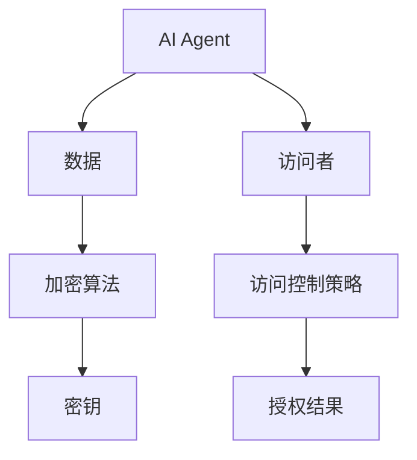
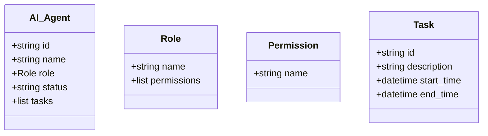
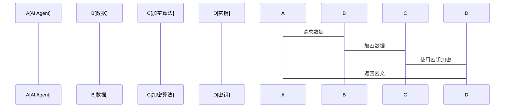

                 


# 保障AI Agent安全：数据加密与访问控制实践

> 关键词：AI Agent，数据加密，访问控制，安全机制，系统架构，安全实践

> 摘要：随着AI Agent在企业中的广泛应用，其安全性问题日益受到关注。本文深入探讨了AI Agent安全的核心问题，重点分析了数据加密和访问控制的实现方法，并通过系统架构设计和项目实战，展示了如何在实际应用中保障AI Agent的安全性。文章内容涵盖了加密算法的原理与实现、访问控制策略的设计与优化、系统架构的规划与实现等方面，为读者提供了一套全面的AI Agent安全解决方案。

---

## 第1章: AI Agent安全概述

### 1.1 AI Agent的基本概念

#### 1.1.1 AI Agent的定义与特点
AI Agent（人工智能代理）是一种能够感知环境、自主决策并执行任务的智能实体。它具备以下特点：
- **自主性**：能够在没有外部干预的情况下独立运作。
- **反应性**：能够实时感知环境变化并做出相应反应。
- **目标导向性**：以特定目标为导向，执行任务并优化行为。
- **学习能力**：通过数据和经验不断优化自身性能。

#### 1.1.2 AI Agent在企业中的应用场景
AI Agent在企业中的应用非常广泛，主要包括：
- **智能客服**：通过自然语言处理技术为用户提供服务。
- **自动化运维**：自动监控和管理IT系统。
- **智能推荐系统**：基于用户行为推荐相关内容。
- **智能监控系统**：实时监控安全状况并发出警报。

#### 1.1.3 AI Agent安全的重要性
AI Agent的安全性直接关系到企业的核心利益。一旦AI Agent的安全性受到威胁，可能导致以下问题：
- **数据泄露**：敏感信息被未经授权的第三方获取。
- **服务中断**：恶意攻击可能导致AI Agent无法正常运行。
- **决策错误**：攻击者通过操控AI Agent的决策过程，导致错误的商业决策。

### 1.2 数据加密与访问控制的核心概念

#### 1.2.1 数据加密的基本原理
数据加密是通过将明文转换为密文来保护数据的一种技术。加密过程通常包括以下步骤：
1. **选择加密算法**：根据需求选择合适的加密算法（如AES、RSA等）。
2. **生成密钥**：加密算法需要密钥来进行加密和解密操作。
3. **加密过程**：将明文通过加密算法和密钥生成密文。
4. **解密过程**：通过密钥将密文还原为明文。

#### 1.2.2 访问控制的实现机制
访问控制是指通过权限管理来限制用户或系统对资源的访问。常见的访问控制机制包括：
- **基于角色的访问控制（RBAC）**：根据用户角色分配权限。
- **基于属性的访问控制（ABAC）**：根据用户属性和资源属性动态分配权限。
- **基于规则的访问控制（RBAC）**：通过预定义的规则控制访问权限。

#### 1.2.3 AI Agent安全的边界与外延
AI Agent的安全性不仅涉及数据本身，还包括其运行环境、决策过程和通信通道。安全的边界包括：
- **数据完整性**：确保数据在传输过程中未被篡改。
- **数据机密性**：确保数据仅被授权方访问。
- **数据可用性**：确保数据在需要时可被访问。

---

## 第2章: 数据加密与访问控制的核心概念

### 2.1 数据加密原理

#### 2.1.1 对称加密与非对称加密的对比
- **对称加密**：加密和解密使用相同的密钥，速度快，适用于大量数据加密。
- **非对称加密**：加密和解密使用不同的密钥（公钥和私钥），适用于身份验证和数字签名。

#### 2.1.2 加密算法的数学模型
对称加密算法（如AES）的数学模型如下：
$$ y = (x + k) \mod 256 $$
其中，$x$ 是明文，$k$ 是密钥，$y$ 是密文。

非对称加密算法（如RSA）的数学模型如下：
$$ C = (P \mod N) $$
$$ D = (C^d \mod N) $$
其中，$P$ 是明文，$N$ 是模数，$d$ 是私钥，$C$ 是密文，$D$ 是解密后的明文。

#### 2.1.3 加密强度与安全性分析
加密强度取决于密钥的长度和算法的复杂度。例如，AES-256加密算法的密钥长度为256位，安全性高于AES-128。

### 2.2 访问控制机制

#### 2.2.1 基于角色的访问控制（RBAC）模型
RBAC模型通过角色分配权限，适用于企业环境中的权限管理。例如，企业中的员工角色可以是“普通员工”、“经理”、“高管”，每个角色对应的权限不同。

#### 2.2.2 基于属性的访问控制（ABAC）模型
ABAC模型根据用户属性（如部门、职位）和资源属性（如敏感级别）动态分配权限。例如，部门A的员工可以访问部门A的资源，但无法访问部门B的资源。

#### 2.2.3 访问控制策略的制定与优化
制定访问控制策略时，需要考虑以下因素：
- **最小权限原则**：用户应获得完成任务所需的最小权限。
- **权限审计**：定期审查权限分配，发现冗余或过时的权限。

### 2.3 核心概念与联系

#### 2.3.1 数据加密与访问控制的实体关系图


---

## 第3章: 加密算法原理与实现

### 3.1 常见加密算法分析

#### 3.1.1 AES加密算法的工作流程
1. **初始轮**：将明文划分为多个块，每个块的大小为128位。
2. **加密轮**：对每个块进行多次加密操作，每次操作包括替换、移位和混合加法。
3. **最终轮**：去掉最后的移位操作，进行替换和混合加法。

#### 3.1.2 RSA加密算法的数学基础
RSA算法基于大整数分解的困难性，其核心步骤包括：
1. **生成密钥**：随机选择两个大质数$p$和$q$，计算$n = p \times q$，选择公钥指数$e$，计算私钥指数$d$。
2. **加密**：$C = P^e \mod n$。
3. **解密**：$P = C^d \mod n$。

#### 3.1.3 椭圆曲线加密的原理
椭圆曲线加密通过在椭圆曲线上定义点的加法操作来实现加密。加密和解密过程涉及椭圆曲线上的点操作。

### 3.2 加密算法的数学模型

#### 3.2.1 AES算法的数学公式
$$ y = (x + k) \mod 256 $$

#### 3.2.2 RSA算法的公钥与私钥生成
$$ C = (P \mod N) $$
$$ D = (C^d \mod N) $$

### 3.3 加密算法的Python实现

#### 3.3.1 对称加密的代码示例
```python
import hashlib

def encrypt_data(data, key):
    cipher = hashlib.new('aes', key=key)
    ciphertext = cipher.encrypt(data)
    return ciphertext

def decrypt_data(ciphertext, key):
    cipher = hashlib.new('aes', key=key)
    plaintext = cipher.decrypt(ciphertext)
    return plaintext
```

---

## 第4章: 访问控制机制的实现

### 4.1 基于角色的访问控制（RBAC）模型

#### 4.1.1 RBAC模型的实现步骤
1. **定义角色**：根据企业组织结构定义角色，如“普通员工”、“经理”、“高管”。
2. **分配权限**：为每个角色分配相应的权限，例如“普通员工”可以访问特定的数据。
3. **权限检查**：在访问资源时，检查用户的角色和权限是否匹配。

#### 4.1.2 RBAC模型的Python实现
```python
class Role:
    def __init__(self, name, permissions):
        self.name = name
        self.permissions = permissions

class User:
    def __init__(self, username, role):
        self.username = username
        self.role = role

class Permission:
    def __init__(self, name):
        self.name = name

# 示例角色和权限
role_admin = Role("admin", [Permission("administrate"), Permission("edit")])
role_user = Role("user", [Permission("view"), Permission("edit")])

# 用户分配角色
user1 = User("user1", role_admin)
user2 = User("user2", role_user)
```

### 4.2 基于属性的访问控制（ABAC）模型

#### 4.2.1 ABAC模型的实现步骤
1. **定义属性**：例如，用户属性包括部门、职位，资源属性包括访问权限。
2. **动态分配权限**：根据用户属性和资源属性动态分配权限。
3. **权限检查**：在访问资源时，检查用户属性和资源属性是否满足权限条件。

#### 4.2.2 ABAC模型的Python实现
```python
class Attribute:
    def __init__(self, name, value):
        self.name = name
        self.value = value

class UserAttribute:
    def __init__(self, user, attributes):
        self.user = user
        self.attributes = attributes

class ResourceAttribute:
    def __init__(self, resource, attributes):
        self.resource = resource
        self.attributes = attributes

# 示例用户和资源属性
user_attr = UserAttribute("user1", [Attribute("department", "sales"), Attribute("position", "manager")])
resource_attr = ResourceAttribute("resource1", [Attribute("classification", "confidential"), Attribute("owner", "sales-team")])
```

---

## 第5章: 系统架构设计与实现

### 5.1 系统功能设计

#### 5.1.1 领域模型设计


#### 5.1.2 功能模块设计
- **用户管理模块**：管理用户的注册、登录和权限分配。
- **任务管理模块**：管理AI Agent的任务分配和执行。
- **安全控制模块**：负责数据加密和访问控制。

### 5.2 系统架构设计

#### 5.2.1 系统架构图


#### 5.2.2 接口设计
- **加密接口**：提供加密和解密的API。
- **访问控制接口**：提供权限检查和授权的API。

### 5.3 系统交互流程

#### 5.3.1 系统交互流程图


---

## 第6章: 项目实战

### 6.1 环境安装

#### 6.1.1 安装Python环境
```bash
python --version
pip install --upgrade pip
```

#### 6.1.2 安装加密库
```bash
pip install cryptography
```

### 6.2 系统核心实现

#### 6.2.1 加密函数实现
```python
from cryptography.hazmat.primitives.asymmetric import rsa

def generate_keys():
    private_key = rsa.generate_private_key(
        public_exponent=65537,
        key_size=2048
    )
    public_key = private_key.public_key()
    return private_key, public_key

def encrypt_data(data, public_key):
    ciphertext = public_key.encrypt(data, padding)
    return ciphertext

def decrypt_data(ciphertext, private_key):
    plaintext = private_key.decrypt(ciphertext, padding)
    return plaintext
```

#### 6.2.2 访问控制实现
```python
from flask import Flask
from flask_restful import Resource, Api

app = Flask(__name__)
api = Api(app)

class ProtectedResource(Resource):
    def get(self):
        # 权限检查
        if current_user.role.name == 'admin':
            return {'message': 'Access granted'}
        else:
            return {'message': 'Access denied'}, 403

api.add_resource(ProtectedResource, '/protected')

if __name__ == '__main__':
    app.run(debug=True)
```

### 6.3 案例分析与代码解读

#### 6.3.1 加密案例
- **明文**：Hello World
- **密钥**：密钥长度为256位
- **加密过程**：使用AES算法将明文加密为密文。
- **解密过程**：使用密钥将密文解密为明文。

#### 6.3.2 访问控制案例
- **用户角色**：普通用户和管理员。
- **权限分配**：普通用户只能访问特定资源，管理员可以访问所有资源。
- **访问控制流程**：用户请求资源，系统检查用户角色和权限，决定是否授权。

---

## 第7章: 总结与展望

### 7.1 总结
本文详细探讨了AI Agent安全的核心问题，重点分析了数据加密和访问控制的实现方法，并通过系统架构设计和项目实战，展示了如何在实际应用中保障AI Agent的安全性。

### 7.2 注意事项
- **密钥管理**：密钥是加密的核心，必须妥善保存，避免泄露。
- **权限管理**：权限分配应遵循最小权限原则，避免权限过大导致的安全风险。
- **定期审计**：定期审查权限分配和加密策略，确保安全措施的有效性。

### 7.3 拓展阅读
- **《加密算法基础》**：深入理解加密算法的原理和实现。
- **《访问控制技术与实践》**：学习访问控制的实现方法和最佳实践。
- **《AI安全与风险管理》**：探讨AI Agent安全的前沿技术和风险管理策略。

---

通过本文的讲解，读者可以全面了解AI Agent安全的核心问题，并掌握数据加密与访问控制的实现方法。希望本文对读者在实际应用中保障AI Agent的安全有所帮助。

