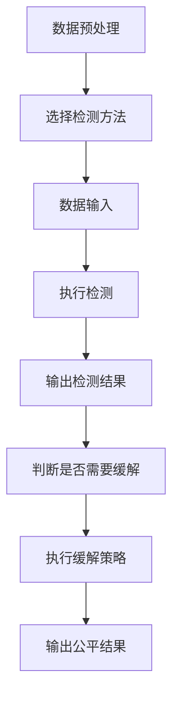
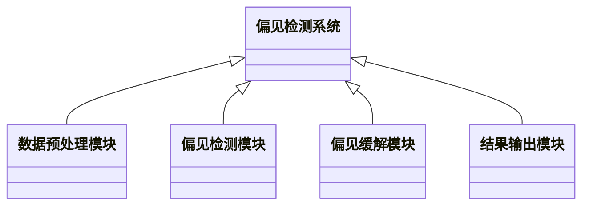

                 


# 偏见检测与缓解：提高AI Agent的公平性

## 关键词：偏见检测，AI Agent，公平性，算法公平，数据平衡

## 摘要：  
在人工智能迅速发展的今天，AI Agent的应用越来越广泛，但其决策的公平性问题也随之凸显。偏见检测与缓解是确保AI Agent公平性的重要环节，涉及数据、模型和算法等多个层面。本文从偏见检测的核心概念、算法原理、系统设计到项目实战，全面解析如何提高AI Agent的公平性。通过详细分析偏见的类型、检测方法和缓解策略，结合实际案例，提供切实可行的解决方案，帮助读者理解和应对AI Agent中的偏见问题。

---

# 第1章: 偏见检测与缓解的背景介绍

## 1.1 偏见检测的基本概念  
### 1.1.1 什么是偏见  
偏见是指在数据或模型中存在不公平或不公正的倾向，可能导致AI Agent在决策或输出时对某些群体或特征产生不公平的影响。例如，在招聘推荐系统中，如果数据集中女性的比例较低，AI可能倾向于推荐更少的女性候选人。  

### 1.1.2 偏见的类型与表现  
- **样本偏见（Sample Bias）**：由于训练数据中某些群体的样本数量较少，导致模型对这些群体的预测存在偏差。  
- **确认偏误（Confirmation Bias）**：模型在训练过程中不断强化已有的偏见，导致预测结果更加不公平。  
- **分类偏见（Classification Bias）**：模型在某些分类任务中对特定群体的分类准确性较差。  

### 1.1.3 偏见检测的必要性  
偏见检测是确保AI Agent公平性的基础。如果不检测和缓解偏见，AI系统可能在实际应用中导致不公平的结果，损害用户信任并引发法律和伦理问题。

---

## 1.2 AI Agent的公平性问题  
### 1.2.1 AI Agent的定义与应用  
AI Agent是一种能够感知环境、自主决策并执行任务的智能体。其应用涵盖自动驾驶、智能客服、推荐系统等领域。  

### 1.2.2 公平性在AI Agent中的重要性  
AI Agent的公平性是指其决策过程和结果对所有用户或群体一视同仁，避免因偏见导致的不公平对待。  

### 1.2.3 偏见对AI Agent的影响  
偏见可能导致AI Agent在决策中对某些群体产生不公平的结果，例如招聘系统中对女性候选人的推荐比例较低。  

---

## 1.3 偏见检测的社会与伦理影响  
### 1.3.1 偏见检测的社会意义  
偏见检测是实现社会公平的重要手段，能够减少AI系统对某些群体的不公平对待。  

### 1.3.2 偏见检测的伦理挑战  
如何在检测偏见的同时保护数据隐私，是一个重要的伦理问题。  

### 1.3.3 偏见检测的法律与政策框架  
许多国家和地区已经开始制定相关政策，要求AI系统必须符合公平性标准。  

---

## 1.4 本章小结  
本章介绍了偏见的基本概念、类型和对AI Agent的影响，强调了偏见检测的必要性和社会意义。

---

# 第2章: 偏见检测的核心概念与联系

## 2.1 偏见检测的核心原理  
### 2.1.1 数据偏见的来源  
数据偏见可能来源于数据收集过程中的不均衡样本、数据标注的主观性等。  

### 2.1.2 模型偏见的形成机制  
模型偏见是由于训练数据的偏见或算法设计的缺陷导致的。  

### 2.1.3 偏见检测的数学模型  
偏见检测的数学模型通常基于统计学和机器学习方法，例如使用概率分布来分析数据的不平衡性。

---

## 2.2 偏见检测的关键属性对比  
### 2.2.1 数据偏见与模型偏见的对比  
- 数据偏见：由于训练数据的分布不均导致的偏见。  
- 模型偏见：由于算法设计或训练过程中的缺陷导致的偏见。  

### 2.2.2 统计偏见与算法偏见的对比  
- 统计偏见：数据中本身存在的偏见。  
- 算法偏见：算法在处理数据时引入的偏见。  

### 2.2.3 偏见检测的指标与度量  
常用的指标包括公平性指标（如FPR（False Positive Rate）差距、TPR（True Positive Rate）差距）。

---

## 2.3 偏见检测的ER实体关系图  
```mermaid
er
    entity 偏见检测系统 {
        key: ID
        属性: 数据源、检测方法、检测结果
    }
    entity 数据 {
        key: 数据ID
        属性: 数据特征、样本数量、分布情况
    }
    entity 检测方法 {
        key: 方法ID
        属性: 统计测试方法、机器学习方法、对抗训练方法
    }
    偏见检测系统 --> 数据: 数据输入
    偏见检测系统 --> 检测方法: 方法选择
    偏见检测系统 <-- 检测结果: 检测结果输出
```

---

## 2.4 本章小结  
本章分析了偏见检测的核心原理和关键属性，通过实体关系图展示了偏见检测系统的构成。

---

# 第3章: 偏见检测的算法原理

## 3.1 偏见检测的算法概述  
### 3.1.1 统计测试方法  
统计测试方法通过分析数据分布的差异性来检测偏见。例如，使用卡方检验来判断两个群体的分布是否显著不同。  

### 3.1.2 基于机器学习的检测方法  
基于机器学习的检测方法通过训练模型来识别数据或模型中的偏见。例如，使用分类模型检测数据中的样本偏见。  

### 3.1.3 基于对抗训练的检测方法  
对抗训练方法通过设计两个对抗网络来检测和缓解偏见。例如，使用生成对抗网络（GAN）来识别和减少数据中的偏见。

---

## 3.2 偏见检测的流程图  


---

## 3.3 偏见检测的Python代码实现  
### 3.3.1 数据加载与预处理  
```python
import pandas as pd
data = pd.read_csv('data.csv')
```

### 3.3.2 偏见检测算法实现  
```python
from sklearn.metrics import confusion_matrix
from sklearn.metrics import accuracy_score

def detect_bias(data, target):
    # 统计每个群体的样本数量
    group_counts = data.groupby(target).size()
    # 计算每个群体的准确率
    accuracy_per_group = {}
    for group in group_counts.index:
        group_data = data[data[target] == group]
        X = group_data.drop(target, axis=1)
        y = group_data[target]
        # 训练模型并计算准确率
        from sklearn.tree import DecisionTreeClassifier
        model = DecisionTreeClassifier()
        model.fit(X, y)
        y_pred = model.predict(X)
        accuracy = accuracy_score(y, y_pred)
        accuracy_per_group[group] = accuracy
    # 检查准确率是否在合理范围内
    for group, accuracy in accuracy_per_group.items():
        if accuracy < 0.6:
            print(f"检测到偏见：{group}的准确率为{accuracy}")
```

---

## 3.4 本章小结  
本章介绍了偏见检测的主要算法，包括统计测试方法、机器学习方法和对抗训练方法，并通过流程图和代码示例展示了如何实现偏见检测。

---

# 第4章: 偏见检测的数学模型与公式

## 4.1 偏见检测的数学基础  
### 4.1.1 概率论基础  
概率论是偏见检测的基础，例如计算条件概率来分析数据分布的差异性。  

### 4.1.2 统计学基础  
统计学方法如卡方检验、t检验等用于分析数据的分布差异。  

### 4.1.3 机器学习基础  
机器学习模型如决策树、随机森林等用于检测数据或模型中的偏见。  

---

## 4.2 偏见检测的关键公式  
### 4.2.1 数据分布公式  
$$ P(y|x) = \frac{P(x|y)P(y)}{P(x)} $$  

### 4.2.2 偏见度量公式  
$$ \text{FPR差距} = |FPR_1 - FPR_2| $$  

### 4.2.3 偏见缓解公式  
$$ \text{公平性损失} = \max(0, FPR_1 - FPR_2) $$  

---

## 4.3 本章小结  
本章通过数学公式和模型分析了偏见检测的核心原理。

---

# 第5章: 偏见检测的系统设计与实现

## 5.1 系统功能设计  
### 5.1.1 问题场景介绍  
以招聘推荐系统为例，设计一个AI Agent来推荐候选人，确保推荐结果的公平性。  

### 5.1.2 系统功能模块  
- 数据预处理模块  
- 偏见检测模块  
- 偏见缓解模块  
- 结果输出模块  

---

## 5.2 系统架构设计  
### 5.2.1 领域模型  


### 5.2.2 系统架构图  


---

## 5.3 本章小结  
本章通过系统设计和架构图展示了如何在实际系统中实现偏见检测和缓解。

---

# 第6章: 偏见检测的项目实战

## 6.1 项目环境安装  
### 6.1.1 安装依赖  
```bash
pip install numpy pandas scikit-learn
```

### 6.1.2 数据集准备  
下载并准备招聘推荐数据集，确保包含性别、年龄、学历等特征。

---

## 6.2 系统核心实现  
### 6.2.1 数据预处理  
```python
import pandas as pd
data = pd.read_csv('recruitment_data.csv')
```

### 6.2.2 偏见检测与缓解  
```python
from sklearn.tree import DecisionTreeClassifier
from sklearn.metrics import accuracy_score

def detect_and缓解():
    # 数据预处理
    X = data.drop('gender', axis=1)
    y = data['gender']
    # 训练模型
    model = DecisionTreeClassifier()
    model.fit(X, y)
    y_pred = model.predict(X)
    accuracy = accuracy_score(y, y_pred)
    # 检查偏见
    if accuracy < 0.6:
        # 使用重新采样方法缓解偏见
        from imblearn.over_sampling import SMOTE
        smote = SMOTE(random_state=42)
        X_res, y_res = smote.fit_resample(X, y)
        model.fit(X_res, y_res)
        y_pred_res = model.predict(X_res)
        accuracy_res = accuracy_score(y_res, y_pred_res)
        print(f"缓解后准确率为{accuracy_res}")
```

---

## 6.3 项目小结  
本章通过一个招聘推荐系统的案例，详细展示了偏见检测与缓解的实现过程。

---

# 第7章: 偏见检测的最佳实践与总结

## 7.1 最佳实践  
### 7.1.1 数据质量  
确保数据的多样性和代表性，避免样本偏见。  

### 7.1.2 算法选择  
选择适合的算法，并结合对抗训练等方法来缓解偏见。  

### 7.1.3 结果验证  
通过公平性指标验证偏见检测和缓解的效果。  

---

## 7.2 小结  
偏见检测与缓解是确保AI Agent公平性的关键步骤。通过本文的分析和实战案例，读者可以掌握偏见检测的核心概念和实现方法。

---

## 7.3 注意事项  
- 数据隐私保护是偏见检测中的重要问题。  
- 偏见检测和缓解需要结合具体场景进行定制化设计。  

---

## 7.4 拓展阅读  
推荐阅读相关论文和书籍，深入了解偏见检测和缓解的最新研究成果。

---

# 附录: 偏见检测与缓解的工具与资源

## 附录A: 偏见检测工具  
- AI Fairness 360（IBM）  
- AIF360：公平机器学习库  

## 附录B: 偏见缓解库  
- imblearn：用于数据平衡的Python库  

## 附录C: 偏见检测的论文推荐  
- "Equality of Opportunity in Machine Learning"  
- "A survey on bias and fairness in machine learning"

---

# 结语  
偏见检测与缓解是AI Agent设计中的重要环节，通过本文的学习，读者可以掌握偏见检测的核心概念和实现方法，并将其应用到实际项目中，从而提高AI Agent的公平性和可信度。

