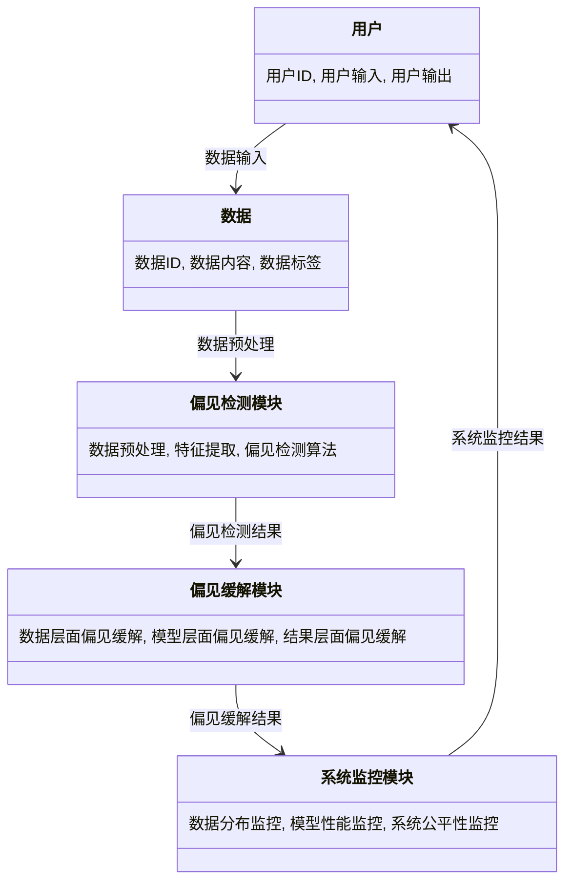
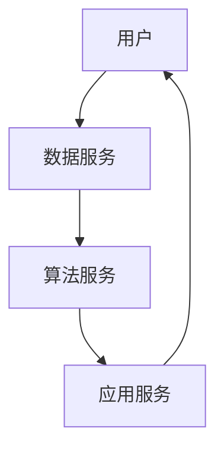
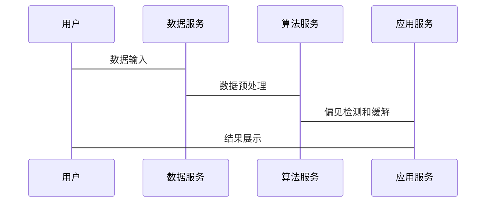

                 


# 偏见检测与缓解：确保AI Agent的公平性

## 关键词：偏见检测，AI公平性，偏见缓解，机器学习，自然语言处理

## 摘要：AI Agent的公平性是人工智能领域的重要挑战，偏见检测与缓解技术在确保AI系统公平性中起着关键作用。本文系统地介绍了偏见的来源、检测方法及缓解策略，探讨了机器学习和自然语言处理中的偏见问题，分析了偏见检测与缓解的算法原理和系统架构设计，并通过具体案例展示了偏见检测与缓解的实现过程。文章最后总结了偏见检测与缓解的重要性和未来研究方向。

---

# 第1章: 偏见检测与缓解的背景介绍

## 1.1 偏见的定义与问题背景

### 1.1.1 偏见的定义与核心要素

偏见是指在数据或模型中存在不公平或不准确的倾向，通常表现为某些群体在AI系统中的不公平对待。偏见的核心要素包括：

- **目标群体**：特定的群体或类别，如性别、种族、职业等。
- **不公平的预测或决策**：AI系统对某些群体的预测或决策结果存在偏差。
- **数据或模型的偏差**：偏见来源于数据或模型的设计。

### 1.1.2 偏见在AI Agent中的问题背景

AI Agent的决策依赖于训练数据和算法，如果数据或算法存在偏见，AI Agent可能会做出不公平的决策。例如，在招聘系统中，如果数据集中女性候选人的比例较低，AI可能会偏向于选择男性候选人。

### 1.1.3 偏见对AI Agent公平性的影响

偏见会影响AI Agent的公平性，导致以下问题：

- **不公平的决策**：AI Agent对某些群体的决策存在不公平性。
- **用户信任度下降**：用户发现AI系统不公平后，信任度会下降。
- **法律和道德风险**：不公平的决策可能导致法律纠纷或道德争议。

## 1.2 偏见的来源与表现形式

### 1.2.1 数据偏见的来源

数据偏见主要来源于以下方面：

- **数据收集偏差**：数据收集过程中，某些群体的数据不足或不 representative。
- **数据标注偏差**：标注人员的主观判断可能引入偏见。
- **历史偏见**：数据反映的历史偏见，如某些职业的性别比例失衡。

### 1.2.2 模型偏见的形成机制

模型偏见的形成机制包括：

- **数据偏见的传递**：模型从偏见数据中学习，导致预测结果偏见。
- **算法设计偏差**：算法的设计目标可能导致模型对某些群体的偏好。
- **模型复杂度**：复杂模型可能捕捉到数据中的偏见。

### 1.2.3 偏见在不同应用场景中的表现

偏见在不同应用场景中的表现形式：

- **招聘系统**：对某些性别或种族的候选人不公平。
- **推荐系统**：推荐内容偏向某些群体。
- **司法系统**：对某些群体的判决不公平。

## 1.3 AI Agent公平性的重要性

### 1.3.1 公平性在AI系统中的核心地位

公平性是AI系统设计中的核心目标之一，确保AI系统对所有群体公平对待。

### 1.3.2 偏见对社会公平性的影响

偏见会导致社会不公平现象，加剧社会矛盾。

### 1.3.3 公平性与AI伦理的关系

公平性是AI伦理的重要组成部分，确保AI技术的使用符合伦理规范。

---

# 第2章: 偏见检测与缓解的核心概念

## 2.1 偏见检测的基本原理

### 2.1.1 偏见检测的定义

偏见检测是指识别数据或模型中存在的偏见。

### 2.1.2 偏见检测的关键技术

- **统计测试**：通过统计方法检测数据或模型中的偏见。
- **对抗学习**：通过对抗网络检测模型中的偏见。
- **可视化分析**：通过可视化工具分析数据或模型中的偏见。

### 2.1.3 偏见检测的实现步骤

1. **数据预处理**：清洗数据，处理缺失值和异常值。
2. **特征提取**：提取与偏见相关的特征。
3. **模型训练**：训练偏见检测模型。
4. **偏见评估**：评估模型中的偏见。

## 2.2 偏见缓解的策略与方法

### 2.2.1 数据层面的偏见缓解

- **数据平衡**：通过过采样或欠采样平衡数据分布。
- **数据增强**：通过数据增强技术减少数据偏见。
- **数据重新采样**：重新采样数据以减少偏见。

### 2.2.2 模型层面的偏见缓解

- **对抗训练**：通过对抗训练消除模型中的偏见。
- **正则化方法**：通过正则化方法减少模型偏见。
- **模型解释性增强**：通过解释性增强技术识别和消除模型偏见。

### 2.2.3 结果层面的偏见缓解

- **结果校正**：对模型输出结果进行校正，消除偏见。
- **结果解释性增强**：通过结果解释性增强技术识别和消除偏见。

## 2.3 偏见检测与缓解的对比分析

### 2.3.1 偏见检测与偏见缓解的联系

- 偏见检测是偏见缓解的前提。
- 偏见缓解可以减少偏见检测的难度。

### 2.3.2 偏见检测与偏见缓解的区别

- 偏见检测是识别偏见，偏见缓解是消除偏见。
- 偏见检测侧重于发现问题，偏见缓解侧重于解决问题。

### 2.3.3 偏见检测与偏见缓解的协同作用

- 偏见检测为偏见缓解提供依据。
- 偏见缓解可以减少偏见检测的难度。

---

# 第3章: 偏见检测与缓解的技术基础

## 3.1 机器学习中的偏见与公平性

### 3.1.1 机器学习中的偏见来源

- **数据偏见**：数据集中某些群体的数据不足或不 representative。
- **算法偏见**：算法设计目标可能导致模型对某些群体的偏好。
- **模型复杂度**：复杂模型可能捕捉到数据中的偏见。

### 3.1.2 机器学习中的公平性定义

- **公平性定义**：确保AI系统对所有群体公平对待。
- **公平性指标**：如公平性差距、机会均等差距等。

### 3.1.3 机器学习中的公平性评估方法

- **统计测试**：通过统计方法评估模型公平性。
- **对抗网络**：通过对抗网络评估模型公平性。
- **可视化分析**：通过可视化工具评估模型公平性。

## 3.2 自然语言处理中的偏见问题

### 3.2.1 NLP任务中的偏见来源

- **数据偏见**：数据集中某些群体的样本数量不足。
- **模型偏见**：模型在某些任务中对某些群体的偏好。
- **算法设计偏差**：算法设计目标可能导致模型对某些群体的偏好。

### 3.2.2 偏见对NLP模型性能的影响

- **分类任务**：模型在某些分类任务中对某些群体的偏好。
- **生成任务**：模型在生成文本时对某些群体的偏好。

### 3.2.3 偏见对NLP应用的影响

- **招聘系统**：对某些性别或种族的候选人不公平。
- **推荐系统**：推荐内容偏向某些群体。

## 3.3 数据与模型的关系

### 3.3.1 数据对模型偏见的影响

- **数据分布**：数据分布影响模型预测结果。
- **数据规模**：数据规模影响模型对偏见的敏感性。

### 3.3.2 模型对数据偏见的放大效应

- **模型复杂度**：复杂模型可能捕捉到数据中的偏见。
- **模型训练目标**：模型训练目标可能导致对某些群体的偏好。

### 3.3.3 数据与模型的协同优化

- **数据增强**：通过数据增强技术减少数据偏见。
- **模型正则化**：通过正则化方法减少模型偏见。

---

# 第4章: 偏见检测与缓解的算法原理

## 4.1 偏见检测的算法原理

### 4.1.1 统计学方法在偏见检测中的应用

- **卡方检验**：用于检测数据分布的差异。
- **t检验**：用于检测两组数据均值的差异。

### 4.1.2 机器学习方法在偏见检测中的应用

- **线性回归**：用于检测数据中的线性关系。
- **逻辑回归**：用于检测数据中的分类关系。

### 4.1.3 深度学习方法在偏见检测中的应用

- **深度学习模型**：通过深度学习模型学习数据中的复杂关系。

## 4.2 偏见缓解的算法原理

### 4.2.1 数据层面的偏见缓解

- **过采样**：通过过采样增加少数群体样本数量。
- **欠采样**：通过欠采样减少多数群体样本数量。

### 4.2.2 模型层面的偏见缓解

- **对抗训练**：通过对抗训练消除模型中的偏见。
- **正则化方法**：通过正则化方法减少模型偏见。

### 4.2.3 结果层面的偏见缓解

- **结果校正**：对模型输出结果进行校正，消除偏见。
- **结果解释性增强**：通过结果解释性增强技术识别和消除偏见。

## 4.3 偏见检测与缓解的对比分析

### 4.3.1 偏见检测算法的优缺点

- **统计测试**：简单易懂，但可能不够准确。
- **机器学习方法**：准确率高，但实现复杂。
- **深度学习方法**：准确率高，但计算资源消耗大。

### 4.3.2 偏见缓解算法的优缺点

- **数据层面的偏见缓解**：简单易实现，但可能无法完全消除偏见。
- **模型层面的偏见缓解**：效果显著，但实现复杂。
- **结果层面的偏见缓解**：简单易实现，但可能无法完全消除偏见。

### 4.3.3 偏见检测与缓解算法的协同优化

- **协同优化**：通过协同优化算法实现偏见检测与缓解的结合。

---

# 第5章: 偏见检测与缓解的系统架构设计

## 5.1 系统功能设计

### 5.1.1 偏见检测模块

- **数据预处理**：清洗数据，处理缺失值和异常值。
- **特征提取**：提取与偏见相关的特征。
- **模型训练**：训练偏见检测模型。
- **偏见评估**：评估模型中的偏见。

### 5.1.2 偏见缓解模块

- **数据层面的偏见缓解**：通过数据平衡、数据增强等技术减少数据偏见。
- **模型层面的偏见缓解**：通过对抗训练、正则化等技术减少模型偏见。
- **结果层面的偏见缓解**：通过对模型输出结果进行校正减少偏见。

### 5.1.3 系统监控模块

- **监控数据分布**：实时监控数据分布的变化。
- **监控模型性能**：实时监控模型性能的变化。
- **监控系统公平性**：实时监控系统公平性。

## 5.2 系统架构设计

### 5.2.1 分层架构设计

- **数据层**：数据存储和数据预处理。
- **算法层**：偏见检测和偏见缓解算法实现。
- **应用层**：系统功能实现和用户交互。

### 5.2.2 微服务架构设计

- **数据服务**：提供数据预处理和特征提取服务。
- **算法服务**：提供偏见检测和偏见缓解服务。
- **应用服务**：提供用户交互和结果展示服务。

### 5.2.3 组件化架构设计

- **数据组件**：数据存储和数据预处理组件。
- **算法组件**：偏见检测和偏见缓解算法组件。
- **应用组件**：用户交互和结果展示组件。

## 5.3 系统接口设计

### 5.3.1 API接口设计

- **数据接口**：数据上传、下载和查询接口。
- **算法接口**：偏见检测和偏见缓解算法调用接口。
- **结果接口**：结果查询和展示接口。

### 5.3.2 数据接口设计

- **数据输入接口**：数据输入格式和接口设计。
- **数据输出接口**：数据输出格式和接口设计。

### 5.3.3 系统交互设计

- **用户交互流程**：用户如何与系统交互。
- **系统响应流程**：系统如何响应用户请求。

---

# 第6章: 偏见检测与缓解的项目实战

## 6.1 项目介绍

### 6.1.1 项目背景

- **项目目标**：开发一个偏见检测与缓解系统。
- **项目需求**：实现数据预处理、偏见检测和偏见缓解功能。

### 6.1.2 项目目标

- **数据预处理**：清洗数据，处理缺失值和异常值。
- **偏见检测**：识别数据或模型中的偏见。
- **偏见缓解**：消除数据或模型中的偏见。

## 6.2 系统功能设计

### 6.2.1 领域模型设计



### 6.2.2 系统架构设计



### 6.2.3 系统接口设计



## 6.3 系统核心实现

### 6.3.1 环境安装

```bash
pip install -r requirements.txt
```

### 6.3.2 核心代码实现

```python
def detect_bias(data):
    # 数据预处理
    preprocessed_data = preprocess(data)
    # 特征提取
    features = extract_features(preprocessed_data)
    # 偏见检测
    bias_score = detect(features)
    return bias_score

def mitigate_bias(data, bias_score):
    # 数据层面的偏见缓解
    if bias_score > threshold:
        return balance_data(data)
    else:
        return data
```

### 6.3.3 代码应用解读与分析

- **数据预处理**：对数据进行清洗和特征提取。
- **偏见检测**：通过算法检测数据或模型中的偏见。
- **偏见缓解**：根据偏见检测结果，对数据或模型进行调整，减少偏见。

## 6.4 实际案例分析

### 6.4.1 案例背景

- **案例目标**：开发一个公平的招聘系统。
- **案例需求**：识别和消除招聘系统中的性别偏见。

### 6.4.2 数据分析与建模

- **数据来源**：招聘数据集。
- **数据预处理**：清洗数据，处理缺失值和异常值。
- **模型训练**：训练一个公平的招聘模型。

### 6.4.3 结果分析

- **偏见检测结果**：识别出性别偏见。
- **偏见缓解结果**：通过数据平衡和对抗训练，消除性别偏见。

## 6.5 项目小结

- **项目成果**：开发了一个公平的招聘系统。
- **项目经验**：偏见检测与缓解技术在实际应用中的重要性。

---

# 第7章: 总结与展望

## 7.1 本章小结

- **偏见检测与缓解的重要性**：确保AI Agent的公平性。
- **偏见检测与缓解的技术挑战**：数据和模型的复杂性。
- **偏见检测与缓解的未来方向**：结合领域知识的自适应方法。

## 7.2 未来研究方向

- **结合领域知识的自适应方法**：根据具体应用场景调整偏见检测与缓解策略。
- **多模态数据的偏见检测与缓解**：结合文本、图像等多种数据类型检测和缓解偏见。
- **实时偏见检测与缓解**：实现实时偏见检测与缓解系统。

---

## 关键词：偏见检测，AI公平性，偏见缓解，机器学习，自然语言处理

---

## 总结

本文系统地介绍了偏见检测与缓解的背景、核心概念、算法原理、系统架构设计、项目实战及总结与展望。通过本文的讲解，读者可以全面了解偏见检测与缓解的技术细节，并能够在实际应用中有效识别和消除偏见，确保AI Agent的公平性。

