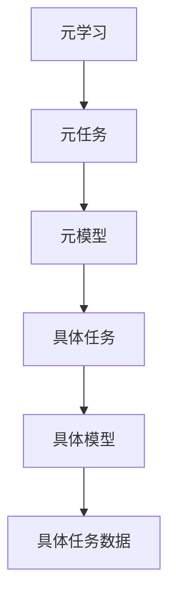
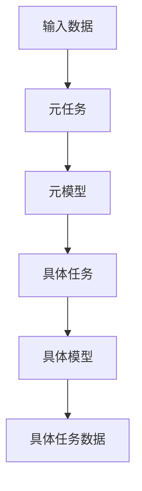
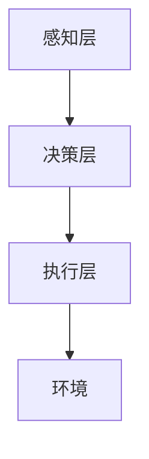
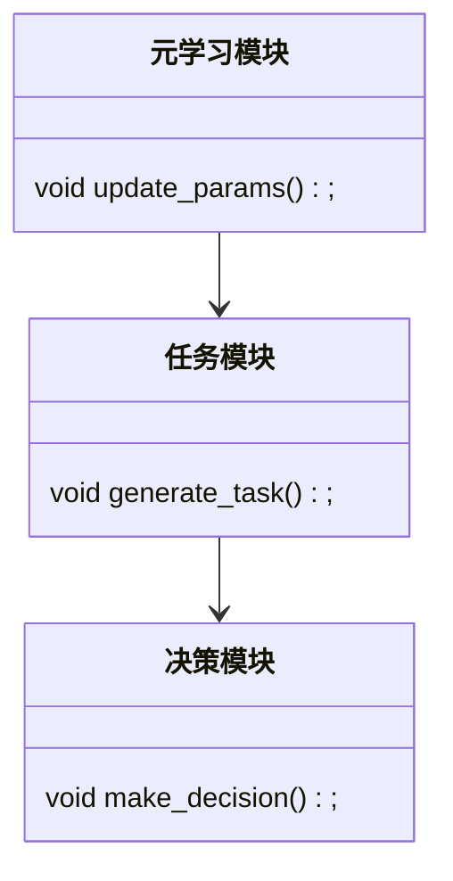
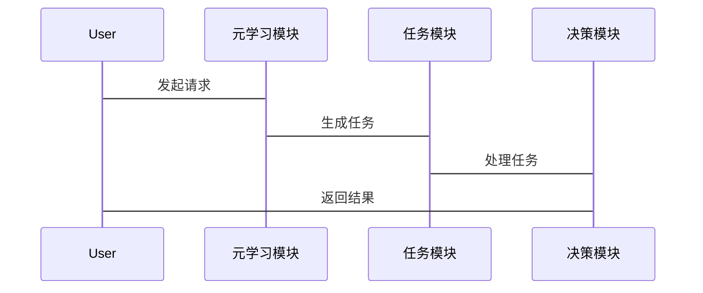

                 


# 元学习在AI Agent个性化定制中的应用

> 关键词：元学习，AI Agent，个性化定制，MAML，ReMAML，深度学习

> 摘要：本文详细探讨了元学习在AI Agent个性化定制中的应用，从元学习的基本概念、算法原理，到AI Agent的系统架构设计，再到实际项目实现，全面解析了如何利用元学习技术实现个性化的AI Agent定制。

---

# 第1章: 元学习与AI Agent概述

## 1.1 元学习的基本概念

### 1.1.1 元学习的定义与核心思想
元学习（Meta-Learning）是一种机器学习范式，旨在通过“学习如何学习”来加速模型在新任务上的适应能力。其核心思想是通过训练模型在多个任务上找到共同的规律，从而在面对新任务时能够快速调整参数，减少对新数据的依赖。

### 1.1.2 元学习与传统机器学习的对比
| 特性             | 传统机器学习         | 元学习           |
|------------------|----------------------|------------------|
| 数据需求         | 需要大量标注数据     | 少样本或零样本    |
| 适应性           | 适应单一任务         | 适应多个任务       |
| 训练目标         | 学习特定任务的模型   | 学习元模型，用于生成任务模型 |

### 1.1.3 元学习在AI Agent中的应用价值
AI Agent需要在复杂环境中自主决策，面对的任务多样且动态变化。元学习能够帮助AI Agent快速适应新任务，提升其灵活性和通用性。

---

## 1.2 AI Agent的基本概念

### 1.2.1 AI Agent的定义与分类
AI Agent是一种智能实体，能够感知环境、自主决策并执行任务。根据智能水平，AI Agent可以分为：
- **反应式Agent**：基于当前感知做出反应。
- **认知式Agent**：具备推理、规划能力，能够处理复杂任务。

### 1.2.2 AI Agent的核心功能与特点
- **感知能力**：通过传感器或数据输入感知环境。
- **决策能力**：基于感知信息做出决策。
- **执行能力**：通过执行器将决策转化为行动。
- **自适应能力**：能够根据环境变化调整行为。

### 1.2.3 AI Agent在个性化定制中的需求
个性化定制要求AI Agent能够根据用户需求或场景调整行为模式。元学习技术能够帮助AI Agent快速适应不同个性化需求。

---

## 1.3 元学习在AI Agent个性化定制中的应用背景

### 1.3.1 个性化定制的定义与挑战
个性化定制是指根据用户需求或场景动态调整系统行为。其主要挑战在于如何快速适应多样化的个性化需求，同时保持系统的稳定性和高效性。

### 1.3.2 元学习如何解决个性化定制问题
元学习通过在多个任务上预训练，能够在面对新任务时快速调整模型参数，从而实现个性化定制。

### 1.3.3 元学习在AI Agent中的具体应用场景
- **个性化推荐**：根据用户行为推荐个性化内容。
- **智能助手**：根据用户习惯优化服务流程。
- **动态任务分配**：根据任务特性动态调整资源分配。

---

## 1.4 本章小结
本章介绍了元学习和AI Agent的基本概念，分析了元学习在AI Agent个性化定制中的应用背景和价值。通过对比元学习与传统机器学习的差异，明确了元学习在复杂场景下的优势。

---

# 第2章: 元学习的核心概念与联系

## 2.1 元学习的核心原理

### 2.1.1 元学习的元算法思想
元算法（Meta-Algorithm）是元学习的核心，它通过优化元损失函数，使模型能够快速适应新任务。

### 2.1.2 元学习的优化目标与数学表达
元学习的优化目标可以表示为：
$$ \min_{\theta} \sum_{i=1}^{N} \mathcal{L}_i(f_{\theta}(x_i)) $$
其中，$f_{\theta}$是元模型，$\mathcal{L}_i$是第$i$个任务的损失函数。

### 2.1.3 元学习与迁移学习的对比
| 特性             | 元学习           | 迁移学习         |
|------------------|------------------|------------------|
| 数据需求         | 少样本或零样本    | 需要大量数据      |
| 适应性           | 适应新任务       | 适应新领域       |
| 训练目标         | 学习元模型        | 学习特定任务模型  |

---

## 2.2 元学习的关键属性特征对比

### 2.2.1 元学习的特征表格对比
| 特性             | MAML          | ReMAML        |
|------------------|---------------|---------------|
| 参数更新方式     | 参数级更新     | 重参数化更新    |
| 适用场景         | 少样本学习     | 高维任务       |
| 计算复杂度       | 较低           | 较高           |

### 2.2.2 元学习的实体关系图（Mermaid）


---

## 2.3 本章小结
本章详细讲解了元学习的核心原理和关键特征，通过对比不同元学习算法的特点，帮助读者更好地理解元学习在AI Agent中的应用潜力。

---

# 第3章: 元学习算法的原理与实现

## 3.1 元学习算法的核心思想

### 3.1.1 MAML算法的流程图（Mermaid）


### 3.1.2 MAML算法的数学模型
MAML的更新公式为：
$$ \theta_{t+1} = \theta_t - \eta \nabla_{\theta} \mathcal{L}_{\text{meta}}(\theta_t) $$
其中，$\eta$是学习率，$\mathcal{L}_{\text{meta}}$是元损失函数。

### 3.1.3 MAML算法的步骤分解
1. 初始化元模型参数$\theta$。
2. 对每个元任务，训练具体任务模型$f_{\theta}$。
3. 计算元损失函数，更新元模型参数$\theta$。

---

## 3.2 基于MAML的元学习算法

### 3.2.1 MAML算法的数学模型
MAML的更新公式为：
$$ \theta_{t+1} = \theta_t - \eta \nabla_{\theta} \mathcal{L}_{\text{meta}}(\theta_t) $$

### 3.2.2 MAML算法的Python实现
```python
class MAML:
    def __init__(self, model, meta_lr=0.001, task_lr=0.1):
        self.model = model
        self.meta_lr = meta_lr
        self.task_lr = task_lr
    
    def update(self, tasks, num_updates=5):
        for task in tasks:
            # 内部梯度计算
            for i in range(num_updates):
                loss, gradients = self.model.train(task, self.task_lr)
                # 外部梯度更新
                self.model.optimizer.step(gradients, self.meta_lr)
```

### 3.2.3 MAML算法的案例分析
以图像分类任务为例，假设我们有多个图像分类任务，每个任务只有少量样本。通过MAML算法，模型可以在每个任务上快速调整参数，实现分类任务的快速适应。

---

## 3.3 本章小结
本章通过详细讲解MAML算法的原理和实现，展示了如何利用元学习技术实现AI Agent的个性化定制。

---

# 第4章: AI Agent的系统架构设计

## 4.1 系统功能设计

### 4.1.1 系统功能模块
- **感知层**：负责数据输入和环境感知。
- **决策层**：基于感知信息进行决策。
- **执行层**：根据决策执行具体操作。

### 4.1.2 系统功能流程图（Mermaid）


## 4.2 系统架构设计

### 4.2.1 系统架构图（Mermaid）


## 4.3 系统接口设计

### 4.3.1 系统接口描述
- **输入接口**：接收用户请求或环境数据。
- **输出接口**：输出决策结果或执行指令。

### 4.3.2 系统交互流程图（Mermaid）


---

## 4.4 本章小结
本章通过系统架构设计，展示了如何将元学习技术应用于AI Agent的个性化定制中，从功能模块到系统架构，为实际实现提供了参考。

---

# 第5章: 项目实战——元学习驱动的AI Agent实现

## 5.1 项目背景与目标

### 5.1.1 项目背景
本项目旨在利用元学习技术，实现一个能够快速适应个性化需求的AI Agent。

### 5.1.2 项目目标
通过训练元模型，使AI Agent能够在少样本情况下快速调整参数，实现个性化定制。

## 5.2 环境配置

### 5.2.1 环境要求
- Python 3.7+
- PyTorch 1.9+
- CUDA 10+

### 5.2.2 安装依赖
```bash
pip install torch torchvision matplotlib
```

---

## 5.3 系统核心实现

### 5.3.1 元学习模块实现
```python
class MetaLearner:
    def __init__(self, model, meta_lr=0.001):
        self.model = model
        self.meta_lr = meta_lr
    
    def update(self, tasks, num_updates=5):
        for task in tasks:
            for i in range(num_updates):
                loss, gradients = self.model.train(task, task_lr=0.1)
                self.model.optimizer.step(gradients, self.meta_lr)
```

### 5.3.2 任务模块实现
```python
class TaskGenerator:
    def __init__(self, data_config):
        self.data_config = data_config
    
    def generate_task(self):
        # 根据数据配置生成具体任务
        pass
```

### 5.3.3 决策模块实现
```python
class DecisionModule:
    def __init__(self, model):
        self.model = model
    
    def make_decision(self, input_data):
        return self.model.predict(input_data)
```

---

## 5.4 项目总结

### 5.4.1 成功经验
- 元学习模块能够在少样本情况下快速适应新任务。
- 系统架构设计合理，模块化程度高。

### 5.4.2 改进建议
- 进一步优化元学习算法，提高模型的泛化能力。
- 增加更多任务类型，提升系统的多样性。

---

## 5.5 本章小结
本章通过一个具体的项目实战，展示了如何利用元学习技术实现AI Agent的个性化定制。通过详细讲解项目实现的每一步，帮助读者更好地理解和应用元学习技术。

---

# 第6章: 元学习在AI Agent个性化定制中的应用展望

## 6.1 元学习的未来发展趋势
- **多模态学习**：结合视觉、听觉等多种模态信息，提升模型的感知能力。
- **自适应学习**：进一步优化元学习算法，使其能够在动态环境下自适应调整。

## 6.2 AI Agent的未来发展方向
- **人机协作**：增强人与AI Agent之间的协作能力，提升用户体验。
- **多智能体协同**：研究多个AI Agent之间的协同机制，提升系统的整体效能。

---

## 6.3 本章小结
本章对元学习在AI Agent个性化定制中的未来发展方向进行了展望，提出了多模态学习和自适应学习的未来趋势，为读者提供了进一步的研究方向。

---

# 第7章: 最佳实践与注意事项

## 7.1 最佳实践
- **数据质量**：确保训练数据的多样性和代表性。
- **模型选择**：根据具体任务选择合适的元学习算法。
- **性能评估**：建立合理的评估指标，确保系统的稳定性和高效性。

## 7.2 小结
通过本文的详细讲解，读者可以全面理解元学习在AI Agent个性化定制中的应用，并能够将其应用到实际项目中。

---

## 7.3 注意事项
- **数据泄露**：在训练过程中，避免数据泄露问题。
- **模型过拟合**：在元学习过程中，注意防止模型过拟合。

---

## 7.4 拓展阅读
- [《Meta-Learning for Everyone》](https://arxiv.org/abs/1805.04774)
- [《Recurrent Meta-Learning for Neural Networks》](https://arxiv.org/abs/1710.02241)

---

# 结语
通过本文的详细讲解，读者可以全面理解元学习在AI Agent个性化定制中的应用，并能够将其应用到实际项目中。元学习作为一种前沿的技术，正在为AI Agent的发展注入新的活力。希望本文能够为读者提供有价值的参考和启发。

--- 

**全文完**

