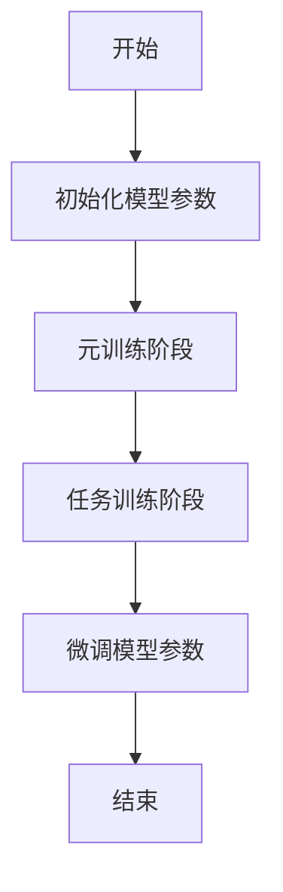
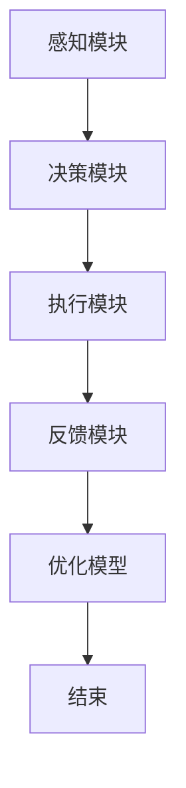
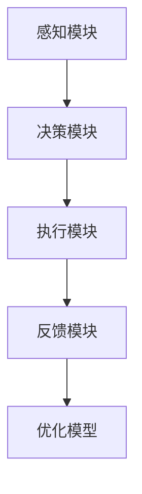

                 


# 元学习在AI Agent中的应用：快速适应新任务

## 关键词：元学习, AI Agent, 快速适应, 新任务, 迁移学习, 任务归纳, 实战案例

## 摘要：  
元学习是一种新兴的机器学习范式，旨在通过学习如何学习，使得模型能够快速适应新任务。AI Agent作为具备自主决策和问题解决能力的智能体，需要在复杂多变的环境中快速适应新任务。本文探讨了元学习在AI Agent中的应用，详细分析了元学习的核心原理、算法、系统架构设计以及实际应用场景，通过具体案例展示了如何利用元学习提升AI Agent的任务适应能力。

---

## 第一章：元学习与AI Agent概述

### 1.1 元学习的基本概念  
元学习（Meta-Learning）是一种机器学习范式，旨在通过学习多个任务的共同特征，使得模型能够快速适应新任务。与传统机器学习不同，元学习关注的是“如何学习”，而非具体任务的学习。  

#### 1.1.1 元学习的定义与背景  
- **定义**：元学习是指在元学习算法的指导下，模型通过学习多个任务的共同特征，快速适应新任务。  
- **背景**：传统机器学习方法在面对新任务时，通常需要大量数据和训练时间。而元学习的目标是通过少量数据快速适应新任务，这在实际应用中具有重要意义。  

#### 1.1.2 元学习的核心思想  
- **核心思想**：通过学习如何学习，使得模型能够快速调整参数以适应新任务。  
- **关键点**：元学习模型在训练阶段学习任务之间的关系，以便在测试阶段快速适应新任务。  

#### 1.1.3 元学习与传统机器学习的对比  
| 特性               | 传统机器学习         | 元学习             |
|--------------------|----------------------|--------------------|
| 数据需求           | 需要大量数据         | 数据需求较少       |
| 适应新任务时间     | 需要重新训练         | 可快速适应新任务     |
| 学习目标           | 学习具体任务         | 学习如何学习         |

### 1.2 AI Agent的基本概念  
AI Agent（人工智能代理）是一种能够感知环境、自主决策并执行任务的智能体。  

#### 1.2.1 AI Agent的定义  
- **定义**：AI Agent是指在环境中能够感知、推理、规划和执行任务的智能体。  
- **特点**：具备自主性、反应性、目标导向性和社会性。  

#### 1.2.2 AI Agent的分类与特点  
1. **简单反射型Agent**：基于当前感知做出反应，无内部状态。  
2. **基于模型的反射型Agent**：维护环境模型，用于推理和决策。  
3. **目标驱动型Agent**：以目标为导向，采取行动以实现目标。  
4. **效用驱动型Agent**：通过最大化效用函数来优化决策。  

#### 1.2.3 AI Agent的任务模型与决策机制  
- **任务模型**：AI Agent的任务模型描述了任务的输入、输出和决策过程。  
- **决策机制**：基于感知信息和任务模型，AI Agent通过推理和规划生成决策。  

### 1.3 元学习在AI Agent中的应用价值  
元学习能够显著提升AI Agent的适应性和任务执行效率，特别是在处理新任务时。  

#### 1.3.1 元学习如何提升AI Agent的适应性  
- 通过元学习，AI Agent能够在新任务上快速调整参数，减少对新数据的依赖。  

#### 1.3.2 元学习在AI Agent任务中的优势  
- **快速适应**：元学习使得AI Agent能够在新任务上快速收敛，减少训练时间。  
- **通用性**：元学习模型能够处理多种任务，具备较强的泛化能力。  

#### 1.3.3 元学习与AI Agent结合的创新点  
- 结合元学习和强化学习，提升AI Agent的自主决策能力。  

### 1.4 本章小结  
本章介绍了元学习和AI Agent的基本概念，并分析了元学习在AI Agent中的应用价值。接下来的章节将深入探讨元学习的原理、算法以及在AI Agent中的具体应用。

---

## 第二章：元学习的原理与算法  

### 2.1 元学习的基本原理  
元学习的核心是通过学习任务之间的关系，快速适应新任务。  

#### 2.1.1 元学习的目标函数  
元学习的目标函数通常包含两个部分：任务损失和元损失。  

- **任务损失**：衡量模型在特定任务上的表现。  
- **元损失**：衡量模型对新任务的适应能力。  

#### 2.1.2 元学习的优化过程  
元学习的优化过程包括两个阶段：  
1. **元训练阶段**：在多个任务上训练元学习模型，使其能够快速适应新任务。  
2. **任务训练阶段**：在新任务上微调元学习模型，以适应特定任务。  

#### 2.1.3 元学习的数学模型  
元学习的数学模型可以用以下公式表示：  
$$ L_{meta} = \sum_{i=1}^{N} L_{task}(f_{\theta}(x_i), y_i) $$  
其中，$L_{meta}$ 是元损失，$L_{task}$ 是任务损失，$f_{\theta}$ 是元学习模型，$x_i$ 和 $y_i$ 是输入和标签。  

### 2.2 元学习的主流算法  
元学习的主流算法包括MAML、Reptile和ReMAML等。  

#### 2.2.1 Meta-Learning Algorithm (MAML)  
MAML是一种基于梯度的元学习算法，通过在多个任务上优化模型参数，使得模型能够在新任务上快速收敛。  

- **算法流程**：  
  1. 初始化模型参数$\theta$。  
  2. 对每个任务进行训练，计算梯度并更新参数。  
  3. 微调模型以适应新任务。  

- **数学公式**：  
  $$ \theta = \theta - \eta \nabla_{\theta} L_{meta} $$  

#### 2.2.2 Reptile Method  
Reptile是一种简单高效的元学习算法，通过在多个任务上交替优化共享参数和任务特定参数。  

- **算法流程**：  
  1. 初始化共享参数$\theta$和任务特定参数$\phi_i$。  
  2. 在每个任务上优化$\phi_i$。  
  3. 更新共享参数$\theta$。  

- **数学公式**：  
  $$ \theta = \theta - \alpha (\theta - \phi_i) $$  

#### 2.2.3 Relation Network-based Meta-Learning (ReMAML)  
ReMAML通过构建关系网络来捕捉任务之间的关系，从而提升元学习的性能。  

- **算法流程**：  
  1. 初始化关系网络参数$\omega$。  
  2. 在每个任务上生成关系向量。  
  3. 使用关系向量优化模型参数。  

### 2.3 元学习算法的流程图  


### 2.4 本章小结  
本章详细介绍了元学习的基本原理和主流算法，为后续章节的应用奠定了基础。

---

## 第三章：AI Agent的结构与任务模型  

### 3.1 AI Agent的感知模块  
AI Agent的感知模块负责获取环境信息并进行初步处理。  

#### 3.1.1 感知模块的作用  
- **输入处理**：将输入数据转换为模型可处理的形式。  
- **特征提取**：提取对任务有用的特征。  

#### 3.1.2 常见的感知方法  
- **基于CNN的感知**：利用卷积神经网络提取图像特征。  
- **基于RNN的感知**：利用循环神经网络处理序列数据。  

#### 3.1.3 感知模块与元学习的结合  
- 元学习模型可以用于感知模块的特征提取，提升感知能力的通用性。  

### 3.2 AI Agent的决策模块  
决策模块是AI Agent的核心，负责根据感知信息和任务目标生成决策。  

#### 3.2.1 决策模块的核心作用  
- **任务推理**：根据任务目标生成决策。  
- **策略优化**：通过强化学习优化决策策略。  

#### 3.2.2 基于元学习的决策机制  
- 元学习模型可以用于决策模块的策略优化，提升决策的快速适应能力。  

### 3.3 AI Agent的任务模型  
任务模型描述了AI Agent在特定任务中的输入、输出和决策过程。  

#### 3.3.1 任务模型的定义  
- **输入**：感知模块获取的环境信息。  
- **输出**：决策模块生成的决策动作。  
- **决策过程**：基于任务目标的推理和规划。  

#### 3.3.2 任务模型的构建过程  
1. 定义任务目标和约束条件。  
2. 设计感知模块和决策模块的结构。  
3. 通过训练数据优化模型参数。  

### 3.4 本章小结  
本章介绍了AI Agent的结构和任务模型，重点分析了感知模块和决策模块的设计。

---

## 第四章：元学习在AI Agent中的应用  

### 4.1 元学习在任务归纳中的应用  
任务归纳是指将多个任务的特征归纳到一起，形成通用的解决方案。  

#### 4.1.1 任务归纳的定义  
- **任务归纳**：将多个任务的特征归纳到一起，形成通用的解决方案。  

#### 4.1.2 元学习在任务归纳中的优势  
- **快速适应**：元学习能够快速归纳任务的特征，减少新任务的训练时间。  

### 4.2 元学习在迁移学习中的应用  
迁移学习是指将已学习的知识应用到新任务中。  

#### 4.2.1 迁移学习的定义  
- **迁移学习**：将已学习的知识应用到新任务中。  

#### 4.2.2 元学习在迁移学习中的优势  
- **通用性**：元学习模型能够处理多种任务，具备较强的迁移能力。  

### 4.3 元学习在任务适应中的应用  
任务适应是指通过调整模型参数，使得模型能够适应新任务。  

#### 4.3.1 任务适应的定义  
- **任务适应**：通过调整模型参数，使得模型能够适应新任务。  

#### 4.3.2 元学习在任务适应中的优势  
- **快速收敛**：元学习模型能够在新任务上快速收敛，减少训练时间。  

### 4.4 本章小结  
本章详细探讨了元学习在AI Agent中的应用，包括任务归纳、迁移学习和任务适应等方面。

---

## 第五章：AI Agent的系统架构设计  

### 5.1 系统功能设计  
AI Agent的系统功能包括感知、决策、执行和反馈四个模块。  

#### 5.1.1 系统功能模块  
- **感知模块**：负责获取环境信息。  
- **决策模块**：负责生成决策动作。  
- **执行模块**：负责执行决策动作。  
- **反馈模块**：负责收集反馈信息并优化模型。  

#### 5.1.2 系统功能流程图  


### 5.2 系统架构设计  
系统架构设计包括数据流设计、模块交互设计和任务流程设计。  

#### 5.2.1 数据流设计  
- **输入数据**：环境信息。  
- **输出数据**：决策动作和反馈信息。  

#### 5.2.2 模块交互设计  
- **感知模块与决策模块交互**：传递环境信息和决策动作。  
- **决策模块与执行模块交互**：传递决策动作和反馈信息。  

#### 5.2.3 任务流程设计  
- **任务启动**：感知模块获取任务信息。  
- **任务执行**：决策模块生成决策动作。  
- **任务结束**：执行模块执行决策动作并收集反馈信息。  

### 5.3 系统架构图  


### 5.4 本章小结  
本章详细探讨了AI Agent的系统架构设计，包括功能模块、数据流设计和任务流程设计。

---

## 第六章：项目实战  

### 6.1 项目环境安装  
- **Python版本**：Python 3.8及以上。  
- **依赖库**：TensorFlow、Keras、PyTorch。  

### 6.2 系统核心实现源代码  
以下是一个简单的元学习算法实现代码：  

```python
import torch
import torch.nn as nn
import torch.optim as optim

class MetaLearner(nn.Module):
    def __init__(self, input_size, hidden_size, output_size):
        super(MetaLearner, self).__init__()
        self.fc1 = nn.Linear(input_size, hidden_size)
        self.fc2 = nn.Linear(hidden_size, output_size)

    def forward(self, x):
        x = torch.relu(self.fc1(x))
        x = self.fc2(x)
        return x

# 初始化模型
input_size = 10
hidden_size = 20
output_size = 5
model = MetaLearner(input_size, hidden_size, output_size)

# 定义优化器和损失函数
optimizer = optim.Adam(model.parameters(), lr=0.01)
criterion = nn.CrossEntropyLoss()
```

### 6.3 代码应用解读与分析  
- **代码功能**：定义了一个简单的元学习模型，包含两个全连接层。  
- **优化器选择**：使用Adam优化器，学习率为0.01。  
- **损失函数**：使用交叉熵损失函数。  

### 6.4 实际案例分析  
以下是一个元学习在图像分类任务中的应用案例：  

```python
# 训练过程
for epoch in range(num_epochs):
    for task in tasks:
        # 前向传播
        outputs = model(task.input)
        # 计算损失
        loss = criterion(outputs, task.label)
        # 反向传播和优化
        optimizer.zero_grad()
        loss.backward()
        optimizer.step()
```

### 6.5 项目小结  
本章通过实际案例展示了元学习在AI Agent中的应用，详细讲解了项目环境的安装、模型实现和代码解读。

---

## 第七章：总结与展望  

### 7.1 最佳实践tips  
- 在实际应用中，建议结合具体任务需求选择合适的元学习算法。  
- 在系统设计时，需充分考虑模块之间的交互和数据流设计。  

### 7.2 小结  
本文详细探讨了元学习在AI Agent中的应用，分析了元学习的核心原理、算法和系统架构设计，并通过实际案例展示了元学习的应用价值。  

### 7.3 注意事项  
- 元学习模型的训练需要大量计算资源，需合理配置硬件环境。  
- 在实际应用中，需注意模型的泛化能力和任务适应性。  

### 7.4 拓展阅读  
- Goodfellow, I., Bengio, Y., & Courville, A. (2016). *Deep Learning*.  
- Vinyals, O., et al. (2016). *Matching Networks for One Shot Learning*.  

---

## 附录：数学公式汇总  

### 1. 元学习的目标函数  
$$ L_{meta} = \sum_{i=1}^{N} L_{task}(f_{\theta}(x_i), y_i) $$  

### 2. MAML算法的优化过程  
$$ \theta = \theta - \eta \nabla_{\theta} L_{meta} $$  

### 3. Reptile算法的优化过程  
$$ \theta = \theta - \alpha (\theta - \phi_i) $$  

---

以上是《元学习在AI Agent中的应用：快速适应新任务》的完整目录和内容概要。每一章节都详细探讨了元学习的核心概念、算法、系统设计和实际应用，确保读者能够全面理解元学习在AI Agent中的应用价值和实现方法。

