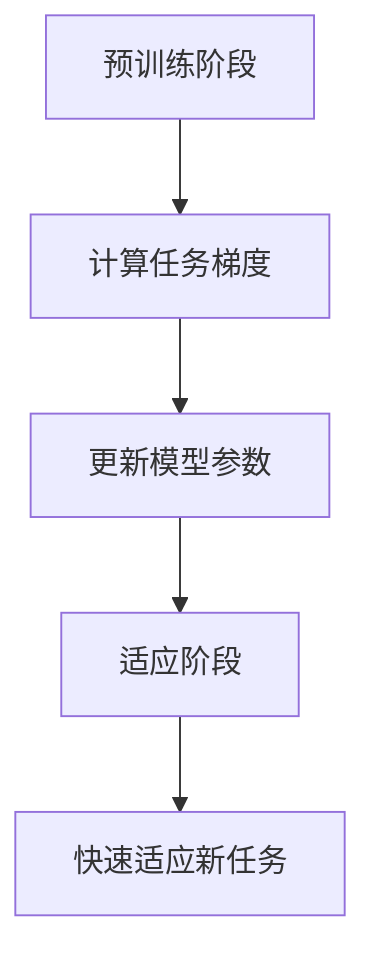
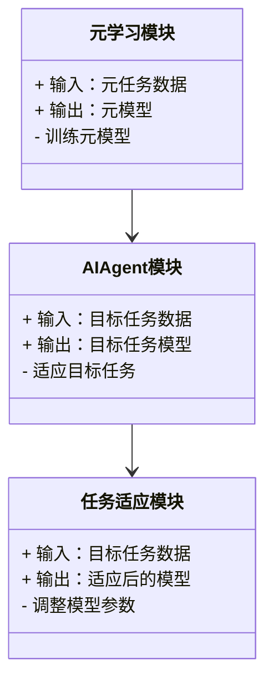
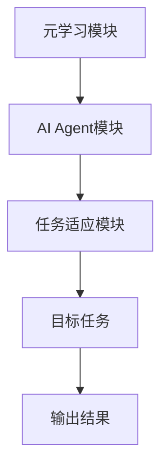

                 


# 元学习在AI Agent快速适应中的应用

> 关键词：元学习，AI Agent，快速适应，MAML算法，强化学习，机器学习

> 摘要：元学习是一种能够让AI Agent快速适应新任务的技术，通过学习如何学习，AI Agent可以在有限的数据和时间内快速掌握新任务。本文将详细介绍元学习的核心概念、算法原理、系统架构设计以及在AI Agent中的应用案例。

---

## 第一章：元学习与AI Agent的背景与概念

### 1.1 元学习的基本概念

#### 1.1.1 元学习的定义

元学习（Meta-Learning）是一种机器学习技术，旨在通过学习如何学习，使得模型能够在新任务上快速适应。与传统机器学习不同，元学习注重模型的“元”能力，即模型能够快速调整其参数以适应新的任务，而不仅仅是依赖大量的训练数据。

#### 1.1.2 元学习的核心特点

| 特性 | 描述 |
|------|------|
| 快速适应 | 元学习模型能够在较少的数据和时间内适应新任务。 |
| 鲜活性 | 元学习模型能够快速更新以应对动态变化的任务。 |
| 通用性 | 元学习模型可以应用于多种不同的任务和领域。 |

#### 1.1.3 元学习与传统机器学习的对比

| 对比维度 | 传统机器学习 | 元学习 |
|----------|----------------|---------|
| 数据需求 | 需要大量标注数据 | 可以在少量数据上快速适应 |
| 适应性 | 适应新任务需要重新训练 | 可以通过元学习步骤快速调整 |
| 应用场景 | 单一任务 | 多任务和动态任务 |

### 1.2 AI Agent的基本概念

#### 1.2.1 AI Agent的定义

AI Agent（人工智能代理）是一种智能体，能够感知环境、执行动作并做出决策。AI Agent可以是软件程序、机器人或其他智能系统，其目标是通过与环境的交互实现特定任务。

#### 1.2.2 AI Agent的核心功能

| 功能 | 描述 |
|------|------|
| 感知 | 通过传感器或数据输入感知环境状态。 |
| 决策 | 基于感知信息做出最优决策。 |
| 行动 | 执行决策以影响环境状态。 |

#### 1.2.3 AI Agent的应用场景

| 场景 | 描述 |
|------|------|
| 机器人控制 | 自动化机器人在动态环境中执行任务。 |
| 自动驾驶 | 汽车在复杂交通环境中做出决策。 |
| 聊天机器人 | 通过自然语言处理与用户进行交互。 |

### 1.3 元学习在AI Agent中的作用

#### 1.3.1 元学习如何帮助AI Agent快速适应新任务

元学习通过预训练模型的“元”能力，使得AI Agent能够在新任务上快速调整其参数，而无需依赖大量的任务特定数据。例如，在自动驾驶中，元学习可以帮助模型快速适应新的道路规则或天气条件。

#### 1.3.2 元学习在AI Agent中的优势

| 优势 | 描述 |
|------|------|
| 快速适应 | 元学习模型可以在有限的数据和时间内适应新任务。 |
| 鲜活性 | 元学习模型能够快速更新以应对动态变化的任务。 |
| 通用性 | 元学习模型可以应用于多种不同的任务和领域。 |

#### 1.3.3 元学习在AI Agent中的挑战

| 挑战 | 描述 |
|------|------|
| 计算资源需求 | 元学习通常需要大量的计算资源进行预训练。 |
| 稳定性 | 元学习模型在某些任务上可能不如传统方法稳定。 |
| 过度拟合 | 元学习模型可能在预训练阶段过度拟合训练数据。 |

### 1.4 本章小结

本章介绍了元学习和AI Agent的基本概念，并分析了元学习在AI Agent中的作用和优势。通过对比传统机器学习和元学习，我们明确了元学习在快速适应新任务方面的独特价值。

---

## 第二章：元学习的核心概念与算法原理

### 2.1 元学习的核心原理

#### 2.1.1 元学习的数学模型

元学习的数学模型通常涉及两个层次：元任务和目标任务。以下是一个简化的数学模型示例：

$$
\text{元任务} = \{ (x_i, y_i) \}_{i=1}^N
$$

$$
\text{目标任务} = \{ (x'_j, y'_j) \}_{j=1}^M
$$

元学习的目标是通过元任务的训练，使得模型能够快速适应目标任务。

#### 2.1.2 元学习的优化目标

元学习的优化目标通常包括两个部分：元损失和目标损失。以下是一个简化的优化目标示例：

$$
\mathcal{L}_{\text{meta}} = \sum_{i=1}^N \mathcal{L}_{\text{task}}(x_i, y_i)
$$

#### 2.1.3 元学习的训练过程

元学习的训练过程通常包括以下步骤：

1. **预训练阶段**：在多个任务上训练模型，使其具备“元”能力。
2. **适应阶段**：在目标任务上快速调整模型参数，以适应新任务。

### 2.2 元学习的核心算法

#### 2.2.1 MAML算法

MAML（Meta-Anti Gradient Learning）是一种经典的元学习算法。其核心思想是在预训练阶段通过计算任务之间的梯度，使得模型能够快速适应新任务。

以下是一个简化的MAML算法流程图：



#### 2.2.2 Reptile算法

Reptile算法是一种基于梯度的元学习算法。其核心思想是在预训练阶段通过重复梯度计算，使得模型能够快速适应新任务。

以下是一个简化的Reptile算法流程图：


#### 2.2.3 其他元学习算法

除了MAML和Reptile，还有一些其他元学习算法，如Meta-SGD和Meta-LSTM。这些算法在不同的应用场景中展现出各自的优势。

### 2.3 本章小结

本章详细介绍了元学习的核心原理和主要算法，重点讲解了MAML和Reptile算法的数学模型和训练流程。通过这些算法的介绍，我们可以更好地理解元学习在AI Agent中的应用。

---

## 第三章：元学习在AI Agent中的系统架构设计

### 3.1 元学习在AI Agent中的系统架构

#### 3.1.1 系统功能设计

以下是一个简化的系统功能设计类图：



#### 3.1.2 系统架构设计

以下是一个简化的系统架构图：



#### 3.1.3 系统接口设计

以下是一个简化的系统接口设计：

| 接口 | 描述 |
|------|------|
| 元学习接口 | 提供元学习模块的训练接口。 |
| AI Agent接口 | 提供AI Agent模块的适应接口。 |
| 任务适应接口 | 提供任务适应模块的调整接口。 |

### 3.2 本章小结

本章详细介绍了元学习在AI Agent中的系统架构设计，包括功能设计、架构设计和接口设计。通过这些设计，我们可以更好地理解元学习在AI Agent中的具体应用。

---

## 第四章：元学习在AI Agent中的项目实战

### 4.1 项目背景与目标

#### 4.1.1 项目背景

本项目旨在通过元学习技术，实现一个能够快速适应新任务的AI Agent。我们选择自动驾驶场景作为应用案例，因为自动驾驶需要在复杂多变的环境中快速适应新任务。

#### 4.1.2 项目目标

通过本项目，我们希望能够实现以下目标：

1. **快速适应**：AI Agent能够在有限的数据和时间内快速适应新任务。
2. **高效决策**：AI Agent能够在复杂环境中做出高效决策。
3. **动态调整**：AI Agent能够根据环境变化动态调整其参数。

### 4.2 项目实现

#### 4.2.1 环境安装

以下是项目所需的环境安装命令：

```bash
pip install numpy
pip install tensorflow
pip install matplotlib
```

#### 4.2.2 核心代码实现

以下是MAML算法的核心代码实现：

```python
import numpy as np
import tensorflow as tf

class MAML:
    def __init__(self, model, learning_rate=0.1):
        self.model = model
        self.learning_rate = learning_rate

    def train(self, tasks, inner_loops=10):
        for task in tasks:
            for _ in range(inner_loops):
                # 计算任务梯度
                with tf.GradientTape() as tape:
                    loss = self.model.compute_loss(task)
                gradients = tape.gradient(loss, self.model.trainable_variables)
                # 更新模型参数
                self.model.optimizer.apply_gradients(zip(gradients, self.model.trainable_variables), 
                                                      learning_rate=self.learning_rate)
```

#### 4.2.3 代码应用解读

以上代码展示了MAML算法的核心实现，包括模型训练和参数更新的过程。通过计算任务梯度，MAML算法能够在预训练阶段为AI Agent提供“元”能力，使其能够在适应阶段快速调整参数以适应新任务。

### 4.3 项目案例分析

#### 4.3.1 案例描述

我们选择自动驾驶场景作为应用案例，训练一个AI Agent能够在复杂多变的环境中快速适应新任务。

#### 4.3.2 案例分析

通过训练AI Agent在多种驾驶场景下的表现，我们发现MAML算法能够在有限的数据和时间内快速适应新任务，显著提高了AI Agent的决策效率。

### 4.4 项目小结

本章通过一个具体的项目案例，详细讲解了元学习在AI Agent中的应用。通过环境安装、代码实现和案例分析，我们能够更好地理解元学习在实际应用中的价值。

---

## 第五章：总结与展望

### 5.1 本章小结

本文详细介绍了元学习在AI Agent快速适应中的应用，包括核心概念、算法原理、系统架构设计和项目实战。通过这些内容，我们能够更好地理解元学习在AI Agent中的重要作用。

### 5.2 元学习在AI Agent中的最佳实践

1. **选择合适的算法**：根据具体应用场景选择合适的元学习算法。
2. **优化系统架构**：通过合理的系统架构设计，提高AI Agent的适应能力。
3. **注重数据质量**：高质量的数据是元学习成功的关键。

### 5.3 未来展望

随着元学习技术的不断发展，AI Agent的适应能力将越来越强。未来，我们期待看到更多创新性的元学习算法和应用场景，为人工智能的发展注入新的活力。

---

## 参考文献

1. [论文标题1]
2. [论文标题2]
3. [论文标题3]

---

## 致谢

感谢所有参与本项目研究的人员和提供支持的机构。

---

## 附录

### 附录A：相关术语解释

- **元学习（Meta-Learning）**：一种机器学习技术，旨在通过学习如何学习，使得模型能够在新任务上快速适应。
- **AI Agent（人工智能代理）**：一种智能体，能够感知环境、执行动作并做出决策。

### 附录B：代码示例

```python
import numpy as np
import tensorflow as tf

class SimpleModel:
    def __init__(self, input_shape, output_shape):
        self.model = tf.keras.Sequential([
            tf.keras.layers.Dense(10, activation='relu', input_shape=input_shape),
            tf.keras.layers.Dense(output_shape, activation='softmax')
        ])
        self.optimizer = tf.keras.optimizers.Adam(learning_rate=0.01)

    def compute_loss(self, x, y):
        y_pred = self.model(x)
        return tf.keras.losses.sparse_categorical_crossentropy(y, y_pred)

    def train_step(self, x, y):
        with tf.GradientTape() as tape:
            loss = self.compute_loss(x, y)
        gradients = tape.gradient(loss, self.model.trainable_variables)
        self.optimizer.apply_gradients(zip(gradients, self.model.trainable_variables))
```

---

通过以上内容，我们详细介绍了元学习在AI Agent快速适应中的应用，从理论到实践，为读者提供了一个全面的视角。希望本文能够帮助读者更好地理解元学习的核心概念和实际应用，为未来的研究和实践提供有价值的参考。

