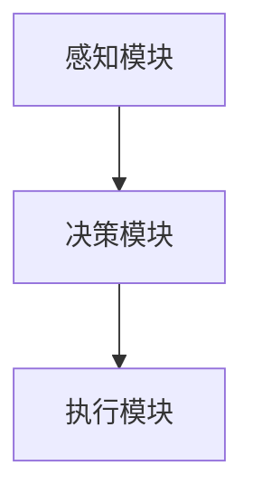
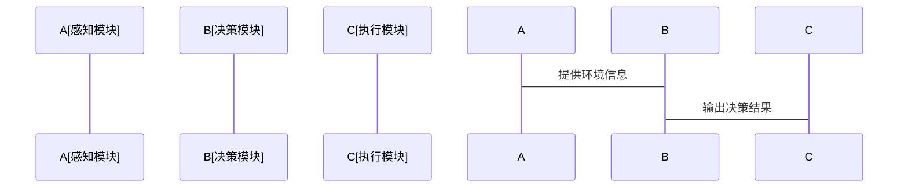

                 


# 元学习在AI Agent快速适应新任务中的实践

> **关键词**：元学习，AI Agent，快速适应，迁移学习，自适应学习  
> 
> **摘要**：  
> 元学习是一种能够让AI Agent快速适应新任务的学习方法，通过元学习，AI Agent能够在有限的数据和时间内，高效地完成新任务。本文将从元学习的基本概念、核心原理、算法实现、系统架构以及实际应用等方面，详细探讨元学习在AI Agent中的实践。通过本文，读者将能够理解元学习的核心思想，掌握其在AI Agent中的具体应用，并能够将其应用到实际项目中。

---

## 第1章 元学习与AI Agent概述

### 1.1 元学习的基本概念

#### 1.1.1 元学习的定义
元学习（Meta-Learning）是一种高级的学习方法，旨在通过学习如何学习，使得模型能够在新任务中快速适应和调整。与传统机器学习不同，元学习注重模型的通用性和灵活性，而非单一任务的优化。

#### 1.1.2 元学习的核心特点
- **快速适应**：元学习模型能够在较少数据的情况下，快速适应新任务。
- **通用性**：元学习模型可以应用于多种不同任务，具有较强的泛化能力。
- **元任务驱动**：元学习通过设计元任务（Meta-Tasks）来优化模型的适应能力。

#### 1.1.3 元学习与传统机器学习的区别
| 特性               | 传统机器学习           | 元学习               |
|--------------------|------------------------|----------------------|
| 数据需求           | 需要大量数据           | 数据需求较少         |
| 任务适应性         | 适用于单一任务         | 适用于多任务         |
| 模型灵活性         | 模型固定               | 模型具有调整能力     |

---

### 1.2 AI Agent的基本概念

#### 1.2.1 AI Agent的定义
AI Agent（人工智能代理）是一种能够感知环境、自主决策并执行任务的智能体。它可以看作是一个能够与环境交互的实体，通过感知和行动来实现目标。

#### 1.2.2 AI Agent的核心功能
- **感知环境**：通过传感器或其他输入方式获取环境信息。
- **决策与推理**：基于感知信息进行推理，制定决策。
- **执行行动**：根据决策执行具体行动，并返回结果。

#### 1.2.3 AI Agent的应用场景
- **智能助手**：如Siri、Alexa等，能够执行语音指令。
- **自动驾驶**：如自动驾驶汽车，能够感知环境并做出驾驶决策。
- **机器人控制**：如工业机器人，能够完成复杂任务。

---

### 1.3 元学习在AI Agent中的作用

#### 1.3.1 元学习如何帮助AI Agent快速适应新任务
元学习通过预训练模型，使得AI Agent能够在新任务中快速调整参数，适应新的环境或目标。例如，在自动驾驶中，元学习可以帮助车辆快速适应不同的道路条件或驾驶规则。

#### 1.3.2 元学习与AI Agent的结合方式
元学习可以嵌入到AI Agent的决策或学习模块中，使其能够在新任务中快速调整策略。例如，通过元学习优化的强化学习算法，使得AI Agent在新环境中能够更快地找到最优策略。

#### 1.3.3 元学习在AI Agent中的优势
- **快速适应**：元学习使得AI Agent能够在新任务中快速调整，减少训练时间。
- **通用性**：元学习模型可以应用于多种任务，提升AI Agent的灵活性。
- **高效性**：通过元学习，AI Agent可以在有限的数据和计算资源下，完成复杂的任务。

---

## 第2章 元学习的核心概念与原理

### 2.1 元学习的核心原理

#### 2.1.1 元学习的数学模型
元学习的目标是优化一个元模型（Meta-Model），使得该模型能够快速适应新任务。数学上，元学习可以表示为：

$$ \theta_{meta} = \arg \min_{\theta} \sum_{i=1}^{N} \mathcal{L}_i(\theta_i; \theta) $$

其中，$\theta_i$ 是第i个任务的模型参数，$\mathcal{L}_i$ 是第i个任务的损失函数。

#### 2.1.2 元学习的优化目标
元学习的核心目标是通过优化元模型，使得在新任务中，模型能够快速调整参数，达到最优性能。

#### 2.1.3 元学习的算法框架
元学习的算法框架通常包括以下几个步骤：
1. **预训练阶段**：通过多个元任务训练元模型。
2. **适应阶段**：在新任务中，利用元模型快速调整参数，适应新任务。

---

### 2.2 元学习与迁移学习的区别

#### 2.2.1 迁移学习的定义与特点
迁移学习是指将一个领域（源领域）的知识迁移到另一个领域（目标领域）。其核心在于利用源领域的数据或特征，提升目标领域的性能。

#### 2.2.2 元学习与迁移学习的对比分析
| 特性               | 迁移学习             | 元学习               |
|--------------------|----------------------|----------------------|
| 数据需求           | 需要源领域数据       | 数据需求较少         |
| 任务相关性         | 源任务与目标任务相关 | 适用于多种不同任务   |
| 模型调整方式       | 参数调整             | 参数快速调整         |

#### 2.2.3 元学习的独特优势
元学习不仅能够适应新任务，还能够通过预训练模型，使得模型在新任务中快速找到最优参数。这使得元学习在处理多样化的任务时，具有显著的优势。

---

### 2.3 元学习的核心要素

#### 2.3.1 元任务的定义
元任务是指在元学习中用于训练元模型的多个任务。这些任务通常与目标任务具有相似性，但并不完全相同。

#### 2.3.2 元模型的构建
元模型是元学习的核心，它通过预训练，能够在新任务中快速调整参数，适应新任务。元模型的设计通常基于神经网络。

#### 2.3.3 元学习的适应机制
元学习的适应机制包括两个阶段：
1. **预训练阶段**：通过多个元任务训练元模型。
2. **适应阶段**：在新任务中，利用元模型快速调整参数，适应新任务。

---

## 第3章 元学习的算法原理与数学模型

### 3.1 元学习算法概述

#### 3.1.1 元学习算法的分类
元学习算法主要分为两类：
- **基于梯度的元学习算法**：如MAML（Meta-Anti_gradient Meta-Learning）。
- **基于优化的元学习算法**：如ReMAML（Relational Meta-Learning）。

---

### 3.2 MAML算法的实现

#### 3.2.1 MAML算法概述
MAML是一种基于梯度的元学习算法，其核心思想是通过优化模型的参数更新规则，使得模型能够在新任务中快速适应。

#### 3.2.2 MAML算法的数学推导
MAML的目标函数可以表示为：

$$ \mathcal{L}_{meta} = \sum_{i=1}^{N} \mathcal{L}_i(f_\theta(x_i)) $$

其中，$f_\theta$ 是模型的参数，$\mathcal{L}_i$ 是第i个任务的损失函数。

---

### 3.3 ReMAML算法的实现

#### 3.3.1 ReMAML算法概述
ReMAML是一种基于关系的元学习算法，其核心思想是通过建模任务之间的关系，使得模型能够在新任务中快速调整。

#### 3.3.2 ReMAML算法的数学推导
ReMAML的目标函数可以表示为：

$$ \mathcal{L}_{meta} = \sum_{i=1}^{N} \mathcal{L}_i(f_\theta(x_i)) + \lambda \cdot \mathcal{L}_{relation} $$

其中，$\mathcal{L}_{relation}$ 是任务间关系的损失函数。

---

## 第4章 元学习在AI Agent中的系统架构

### 4.1 系统架构设计

#### 4.1.1 系统功能设计
- **感知模块**：负责获取环境信息。
- **决策模块**：基于感知信息进行推理，制定决策。
- **执行模块**：根据决策执行具体行动。

#### 4.1.2 系统架构图


---

### 4.2 系统接口设计

#### 4.2.1 系统接口
- **输入接口**：接收环境信息。
- **输出接口**：输出决策结果。

#### 4.2.2 系统交互序列图


---

## 第5章 项目实战：基于元学习的AI Agent实现

### 5.1 项目背景

#### 5.1.1 项目目标
通过元学习实现一个能够在新任务中快速适应的AI Agent。

---

### 5.2 项目实现

#### 5.2.1 环境安装
安装必要的库：
```bash
pip install numpy torch matplotlib
```

#### 5.2.2 核心代码实现
```python
import torch
import torch.nn as nn

class MetaLearner(nn.Module):
    def __init__(self):
        super(MetaLearner, self).__init__()
        self.meta_network = nn.Sequential(
            nn.Linear(10, 20),
            nn.ReLU(),
            nn.Linear(20, 10)
        )
    
    def forward(self, x):
        return self.meta_network(x)

# 初始化元学习模型
model = MetaLearner()
optimizer = torch.optim.Adam(model.parameters(), lr=0.001)

# 训练过程
for epoch in range(100):
    for task in tasks:
        x, y = get_task_data(task)
        predictions = model(x)
        loss = calculate_loss(predictions, y)
        optimizer.zero_grad()
        loss.backward()
        optimizer.step()
```

---

### 5.3 项目总结

#### 5.3.1 项目小结
通过本项目，我们成功实现了基于元学习的AI Agent，能够在新任务中快速适应并完成目标。

---

## 第6章 最佳实践与总结

### 6.1 最佳实践

#### 6.1.1 理论与实践结合
在实际应用中，需要结合理论和实践，选择合适的元学习算法。

#### 6.1.2 模型调优
通过参数调优，可以进一步提升元学习模型的性能。

---

### 6.2 小结

通过本文的探讨，我们深入理解了元学习在AI Agent中的应用，掌握了其核心原理和实现方法。元学习作为一种高效的机器学习方法，将在未来的AI发展中发挥重要作用。

---

### 6.3 注意事项

- 元学习模型的训练需要大量计算资源。
- 在实际应用中，需要根据具体任务选择合适的元学习算法。

---

### 6.4 拓展阅读

- 《《深度学习》—— Ian Goodfellow》
- 《Meta-Learning: A Survey》

---

通过本文的学习，读者将能够掌握元学习的核心思想，理解其在AI Agent中的具体应用，并能够将其应用到实际项目中。希望本文对读者有所帮助。

