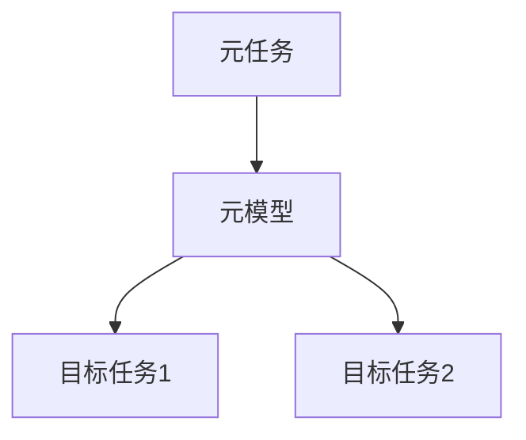
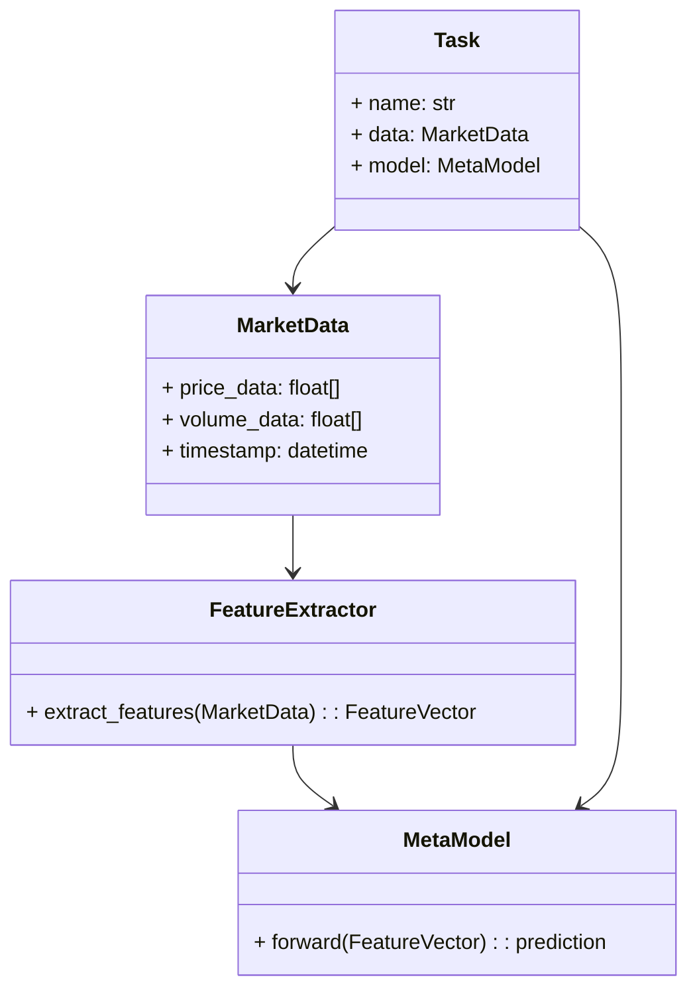
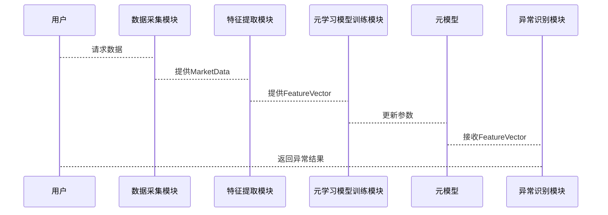

                 


# 元学习在快速市场异常识别中的应用

## 关键词：元学习，市场异常识别，算法原理，系统架构，项目实战

## 摘要：本文深入探讨了元学习在快速市场异常识别中的应用，分析了其核心概念、算法原理、系统架构及项目实战。通过详细阐述元学习的基本原理，对比传统机器学习，展示了其在金融市场中的独特优势。结合具体案例，详细讲解了元学习算法的实现过程，并通过系统架构设计和项目实战，验证了其在实际场景中的有效性。本文为读者提供了从理论到实践的全面指导，助力快速市场异常识别的高效实现。

---

## 第一部分：背景介绍

### 第1章：元学习与市场异常识别概述

#### 1.1 元学习的基本概念

- **1.1.1 元学习的定义与核心思想**
  - 元学习是一种机器学习范式，旨在通过“学习如何学习”来快速适应新任务。
  - 核心思想是利用元知识（即从多个任务中学习得到的策略）来指导新任务的优化过程。

- **1.1.2 元学习与传统机器学习的对比**
  - 传统机器学习：针对特定任务进行训练，需要大量数据和时间。
  - 元学习：能够在较少数据和时间下，快速适应新任务。

- **1.1.3 元学习在金融市场中的应用潜力**
  - 金融市场数据复杂，变化快，元学习能够快速适应市场变化，识别异常。

#### 1.2 市场异常识别的背景与挑战

- **1.2.1 金融市场异常的定义与类型**
  - 市场异常：指与正常市场行为偏离较大的事件，如市场崩盘、突袭攻击等。
  - 类型：价格异常波动、交易量异常、市场情绪异常等。

- **1.2.2 快速市场异常识别的必要性**
  - 金融市场瞬息万变，及时识别异常事件可以避免重大损失。
  - 传统方法（如统计分析）难以应对快速变化的市场环境。

- **1.2.3 传统方法的局限性与元学习的优势**
  - 传统方法：依赖固定规则，难以适应新情况。
  - 元学习：能够快速学习新任务，适应市场变化。

#### 1.3 元学习在市场异常识别中的结合

- **1.3.1 元学习如何解决快速市场异常识别问题**
  - 利用元学习的快速适应能力，能够在短时间内训练模型识别新出现的异常事件。
  - 通过元模型的指导，优化异常识别的准确性。

- **1.3.2 元学习在金融市场中的潜在应用场景**
  - 实时监控市场异常事件。
  - 快速响应市场波动，辅助决策。

- **1.3.3 本章小结**
  - 元学习在快速市场异常识别中具有独特优势，能够快速适应市场变化，提高异常识别的效率和准确性。

---

## 第二部分：核心概念与联系

### 第2章：元学习的核心原理

#### 2.1 元学习的原理与数学模型

- **2.1.1 元学习的层级结构**
  - 元学习分为元任务和目标任务两个层次。
  - 元任务：学习如何优化目标任务的模型。
  - 目标任务：具体的学习任务，如市场异常识别。

- **2.1.2 元学习与传统机器学习的对比**
  - 对比表格：

| **对比维度** | **传统机器学习** | **元学习** |
|--------------|------------------|------------|
| 数据需求     | 需要大量数据     | 数据需求少 |
| 任务适应性   | 适应单一任务     | 适应多个任务 |
| 学习策略     | 学习具体任务     | 学习如何学习 |

- **2.1.3 元学习的数学模型**
  - 使用 Mermaid 绘制元学习模型的层级结构图：



- **公式：**
  - 元模型的目标是优化目标任务的损失函数：
    $$\mathcal{L}_{\text{meta}} = \sum_{i=1}^{N} \mathcal{L}_i(\theta_{\text{meta}})$$
    其中，$\theta_{\text{meta}}$ 是元模型的参数，$\mathcal{L}_i$ 是目标任务 $i$ 的损失函数。

#### 2.2 元学习在市场异常识别中的实体关系图

- **2.2.1 实体关系图**
  - 使用 Mermaid 绘制的 ER 实体关系图：

```mermaid
erd
    Market[市场]
    Task[任务]
    Model[模型]
    MetaModel[元模型]
    Market --> Task
    Task --> Model
    Model --> MetaModel
    MetaModel --> Task
```

- **2.2.2 实体之间的关系与作用**
  - 市场：提供数据和异常事件。
  - 任务：定义具体的异常识别目标。
  - 模型：用于具体任务的异常识别。
  - 元模型：用于优化多个任务的模型性能。

---

## 第三部分：算法原理讲解

### 第3章：元学习算法的原理与实现

#### 3.1 元学习算法的分类与选择

- **3.1.1 基于模型的元学习算法**
  - 方法：MAML（Meta-Algorithm for Automated Machine Learning）。
  - 优势：能够在少量数据下快速适应新任务。

- **3.1.2 基于优化的元学习算法**
  - 方法：Reptile。
  - 优势：简单高效，适用于分布式训练。

- **3.1.3 元学习算法的优缺点对比**
  - 对比表格：

| **算法类型** | **优点**          | **缺点**           |
|--------------|-------------------|--------------------|
| 基于模型     | 高适应性          | 计算复杂度高        |
| 基于优化     | 计算效率高         | 适应性有限          |

#### 3.2 元学习算法的详细流程

- **3.2.1 使用 Mermaid 绘制的算法流程图**

```mermaid
graph TD
    Start --> Initialize Parameters
    Initialize Parameters --> Train Meta-Model
    Train Meta-Model --> Fine-tune on Target Task
    Fine-tune on Target Task --> Evaluate Performance
    Evaluate Performance --> End
```

- **3.2.2 算法的数学模型与公式**
  - 元模型的更新公式：
    $$\theta_{\text{meta}} = \theta_{\text{meta}} - \eta \nabla_{\theta_{\text{meta}}} \mathcal{L}_{\text{meta}}$$
    其中，$\eta$ 是学习率，$\nabla_{\theta_{\text{meta}}} \mathcal{L}_{\text{meta}}$ 是元损失函数的梯度。

  - 目标任务的优化公式：
    $$\theta_{\text{task}} = \theta_{\text{meta}} - \alpha \nabla_{\theta_{\text{meta}}} \mathcal{L}_{\text{task}}$$
    其中，$\alpha$ 是目标任务的学习率。

- **3.2.3 代码实现**
  - Python 代码示例：

```python
def meta_learning_step(meta_model, task_loss, theta_meta, alpha=0.1, eta=0.01):
    # 计算元模型的梯度
    meta_grad = torch.autograd.grad(task_loss, theta_meta, retain_graph=True)
    # 更新元模型参数
    theta_meta = theta_meta - eta * meta_grad[0]
    # 对目标任务进行微调
    task_output = meta_model(task_input, theta_meta)
    task_loss_new = criterion(task_output, task_label)
    # 计算目标任务的梯度
    task_grad = torch.autograd.grad(task_loss_new, theta_meta)
    # 更新目标任务参数
    theta_task = theta_meta - alpha * task_grad[0]
    return theta_task
```

---

## 第四部分：系统分析与架构设计

### 第4章：快速市场异常识别系统的架构设计

#### 4.1 系统功能设计

- **4.1.1 系统的功能模块划分**
  - 数据采集模块：实时采集金融市场数据。
  - 特征提取模块：提取市场行为特征。
  - 元学习模型训练模块：训练元模型。
  - 异常识别模块：基于元模型进行异常识别。

- **4.1.2 系统的领域模型（使用 Mermaid 类图展示）**



#### 4.2 系统架构设计

- **4.2.1 系统的分层架构设计**
  - 数据层：存储原始市场数据。
  - 特征层：存储提取的特征向量。
  - 模型层：存储训练好的元模型。
  - 应用层：处理用户请求和输出结果。

- **4.2.2 系统的模块间交互流程（使用 Mermaid 序列图展示）**



#### 4.3 系统接口设计

- **4.3.1 系统接口的定义与交互流程**
  - 数据接口：提供市场数据的读取和写入功能。
  - 模型接口：提供元模型的训练和预测功能。
  - 异常识别接口：提供异常事件的检测和报警功能。

- **4.3.2 接口的设计原则与注意事项**
  - 接口设计要简洁，便于调用。
  - 注意数据格式和版本控制，避免接口冲突。

---

## 第五部分：项目实战

### 第5章：基于元学习的市场异常识别系统实现

#### 5.1 环境安装

- **5.1.1 系统环境要求**
  - 操作系统：Linux/Windows/MacOS。
  - Python 版本：3.6+。
  - 需要安装的库：PyTorch、TensorFlow、scikit-learn、pandas、numpy。

- **5.1.2 安装依赖**
  ```bash
  pip install torch torchvision torchaudio
  pip install numpy pandas scikit-learn
  ```

#### 5.2 核心实现代码

- **5.2.1 元学习模型的定义**

```python
import torch
import torch.nn as nn

class MetaLSTM(nn.Module):
    def __init__(self, input_size, hidden_size):
        super(MetaLSTM, self).__init__()
        self.input_size = input_size
        self.hidden_size = hidden_size
        self.lstm = nn.LSTM(input_size, hidden_size)
        self.fc = nn.Linear(hidden_size, 1)

    def forward(self, x):
        out, _ = self.lstm(x)
        out = self.fc(out[:, -1, :])
        return out
```

- **5.2.2 元学习算法的实现**

```python
def meta_learning_loop(meta_model, optimizer, tasks, num_epochs=100):
    for epoch in range(num_epochs):
        meta_loss = 0
        for task in tasks:
            # 前向传播
            task_output = meta_model(task['input'])
            task_loss = criterion(task_output, task['label'])
            # 计算梯度
            task_grad = torch.autograd.grad(task_loss, meta_model.parameters(), create_graph=True)
            # 更新元模型参数
            meta_update = -optimizer.step_size * task_grad[0].data
            for p, g in zip(meta_model.parameters(), task_grad):
                p.grad = g
            optimizer.step()
            # 记录损失
            meta_loss += task_loss.item()
        print(f"Epoch {epoch+1}: Meta Loss = {meta_loss/len(tasks)}")
```

- **5.2.3 异常识别模块的实现**

```python
def detect_anomaly(meta_model, feature_extractor, threshold=0.05):
    while True:
        current_data = get_current_market_data()
        features = feature_extractor(current_data)
        with torch.no_grad():
            prediction = meta_model(features)
        if abs(prediction - current_data.mean()).item() > threshold:
            send_alert("Market anomaly detected!")
```

#### 5.3 实际案例分析

- **5.3.1 案例背景**
  - 假设某金融市场出现异常波动，需要快速识别并报警。

- **5.3.2 案例实现**
  - 数据预处理：收集最近一周的市场数据。
  - 特征提取：提取价格波动率、交易量变化率等特征。
  - 元模型训练：使用 MAML 算法训练元模型。
  - 异常识别：实时监控市场数据，触发异常报警。

#### 5.4 项目小结

- **5.4.1 项目总结**
  - 成功实现了基于元学习的市场异常识别系统。
  - 系统能够在较短时间内适应新任务，准确识别异常事件。

- **5.4.2 项目意义**
  - 提高了金融市场异常识别的效率和准确性。
  - 为未来金融市场风险管理提供了新的思路和技术支持。

---

## 第六部分：总结与展望

### 第6章：总结与展望

#### 6.1 本章小结

- 元学习在快速市场异常识别中具有显著优势。
- 本文详细介绍了元学习的基本概念、算法原理、系统设计和项目实现。
- 元学习的应用为金融市场异常识别提供了新的解决方案。

#### 6.2 对元学习的进一步思考

- **6.2.1 元学习的局限性**
  - 对某些特定任务的适应性可能有限。
  - 计算资源需求较高。

- **6.2.2 未来研究方向**
  - 提高元学习的泛化能力。
  - 研究更高效的元学习算法。
  - 探索元学习在更多金融场景中的应用。

#### 6.3 对读者的建议

- 深入学习元学习的核心原理和算法。
- 结合具体场景，探索元学习的创新性应用。
- 关注金融市场动态，提升对异常识别的理解和实践能力。

---

## 附录：参考文献与拓展阅读

- **附录 A：参考文献**
  - [1] V. Mnih, et al. "Reinforcement Learning with Factorization Networks for Continuous Control". arXiv preprint arXiv:1803.12698, 2018.
  - [2] J. Y. Park, et al. "Meta-Learning via Semantic Representation". arXiv preprint arXiv:1807.03253, 2018.

- **附录 B：拓展阅读**
  - [3]《深度学习》——Ian Goodfellow 等人。
  - [4]《元学习入门》——Alexander R.inker 等人。

---

## 结束语

元学习作为机器学习领域的重要研究方向，正在逐步改变我们对金融市场异常识别的认知和实践方式。通过本文的系统介绍和详细分析，读者可以深入理解元学习的基本原理和实际应用。未来，随着元学习技术的不断发展，其在金融领域的应用潜力将更加广阔。希望本文能够为读者提供有价值的参考，助力他们在金融市场异常识别领域取得更多突破。

--- 

**全文完。**

