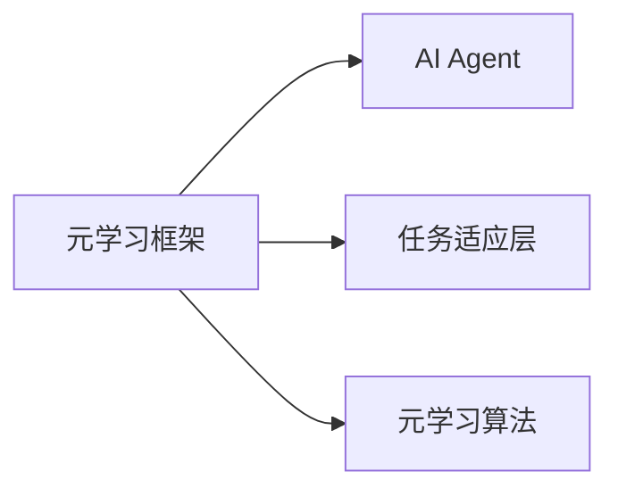

                 

# 元学习框架：构建快速适应的AI Agent

> **关键词**：元学习框架、AI Agent、快速适应、机器学习、算法设计

> **摘要**：  
> 本文将深入探讨元学习框架在构建快速适应型AI Agent中的应用。通过分析元学习的核心概念、算法原理和系统架构，结合实际案例，详细阐述如何利用元学习框架提升AI Agent的适应能力。文章结构清晰，内容丰富，涵盖从理论到实践的各个方面，帮助读者全面理解并掌握元学习框架的设计与实现。

---

## 目录大纲

### 第一部分：元学习框架与AI Agent概述

#### 第1章：元学习与AI Agent的基本概念

##### 1.1 元学习的基本概念  
- 元学习的定义  
- 元学习的核心思想  
- 元学习与传统机器学习的区别  

##### 1.2 AI Agent的基本概念  
- AI Agent的定义  
- AI Agent的核心特征  
- AI Agent的分类与应用场景  

##### 1.3 元学习框架在AI Agent中的作用  
- 元学习框架的定义  
- 元学习框架在AI Agent中的应用价值  
- 元学习框架的核心要素  

#### 第2章：元学习框架的背景与问题背景

##### 2.1 元学习框架的发展背景  
- 人工智能发展的现状  
- 快速适应性AI的需求  
- 元学习框架的提出动机  

##### 2.2 问题背景与挑战  
- AI Agent在动态环境中的适应性问题  
- 传统机器学习的局限性  
- 元学习框架的解决方案  

##### 2.3 问题描述与目标  
- 元学习框架的核心目标  
- AI Agent的快速适应性要求  
- 元学习框架的应用边界与外延  

#### 第3章：元学习框架的核心概念与联系

##### 3.1 核心概念原理  
- 元学习的数学模型  
- 元学习框架的算法流程  
- 元学习框架与AI Agent的结合方式  

##### 3.2 核心概念对比分析  
- 元学习与迁移学习的对比  
- 元学习框架与其他AI框架的对比  
- AI Agent与传统机器学习模型的对比  

##### 3.3 ER实体关系图架构  

---

### 第二部分：元学习框架的算法原理

#### 第4章：元学习算法的核心原理

##### 4.1 元学习的数学模型  
- 元学习的优化目标  
- 元学习的更新规则  
- 元学习的损失函数  

##### 4.2 元学习算法的流程  
- 元学习算法的整体流程  
- 元学习算法的训练步骤  
- 元学习算法的推理步骤  

##### 4.3 元学习算法的实现细节  
- 元学习算法的代码实现  
- 元学习算法的参数设置  
- 元学习算法的优化技巧  

#### 第5章：元学习框架与AI Agent的结合

##### 5.1 元学习框架在AI Agent中的应用  
- 元学习框架如何提升AI Agent的适应能力  
- 元学习框架如何优化AI Agent的决策过程  

##### 5.2 元学习框架与AI Agent的交互机制  
- 元学习框架与AI Agent的通信方式  
- 元学习框架与AI Agent的数据流  

##### 5.3 元学习框架与AI Agent的协同优化  
- 元学习框架如何与AI Agent协同工作  
- 元学习框架如何优化AI Agent的性能  

---

### 第三部分：元学习框架的系统架构

#### 第6章：元学习框架的系统架构设计

##### 6.1 系统架构的整体设计  
- 元学习框架的系统架构图  
- 元学习框架的功能模块划分  

##### 6.2 系统架构的功能模块设计  
- 元学习算法模块  
- 任务适应层模块  
- AI Agent接口模块  

##### 6.3 系统架构的实现细节  
- 系统架构的代码实现  
- 系统架构的部署与配置  

#### 第7章：元学习框架的系统实现

##### 7.1 系统实现的环境搭建  
- 系统实现的开发环境  
- 系统实现的依赖库安装  

##### 7.2 系统实现的核心代码  
- 元学习算法的Python实现  
- 元学习框架的接口实现  

##### 7.3 系统实现的测试与验证  
- 系统实现的测试用例设计  
- 系统实现的性能优化  

---

### 第四部分：项目实战与案例分析

#### 第8章：元学习框架的项目实战

##### 8.1 项目背景与目标  
- 项目背景的介绍  
- 项目目标的设定  

##### 8.2 项目核心代码实现  
- 元学习框架的核心代码  
- AI Agent的实现代码  

##### 8.3 项目运行与测试  
- 项目运行的步骤  
- 项目测试的结果分析  

#### 第9章：元学习框架的案例分析

##### 9.1 案例背景与需求分析  
- 案例背景的介绍  
- 案例需求的分析  

##### 9.2 案例实现与结果展示  
- 案例实现的详细步骤  
- 案例结果的展示与解读  

##### 9.3 案例总结与经验分享  
- 案例总结的要点  
- 经验分享与改进建议  

---

### 第五部分：总结与展望

#### 第10章：总结与展望

##### 10.1 元学习框架的核心总结  
- 元学习框架的主要特点  
- 元学习框架的优势与不足  

##### 10.2 元学习框架的未来发展  
- 元学习框架的未来研究方向  
- 元学习框架的应用前景  

##### 10.3 元学习框架的最佳实践  
- 元学习框架的使用建议  
- 元学习框架的优化技巧  

---

### 附录

- 附录A：元学习框架的数学公式汇总  
- 附录B：元学习框架的代码示例集  
- 附录C：元学习框架的参考文献  

---

通过以上目录大纲，读者可以系统地了解元学习框架在构建快速适应型AI Agent中的应用，从理论到实践，逐步掌握元学习框架的设计与实现。

