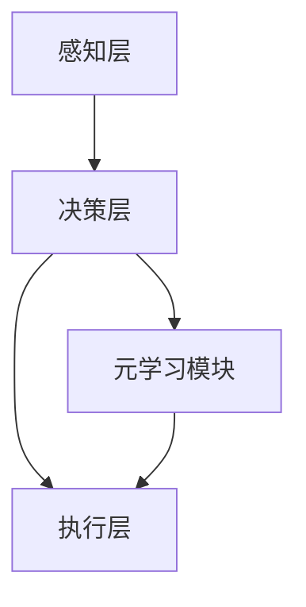
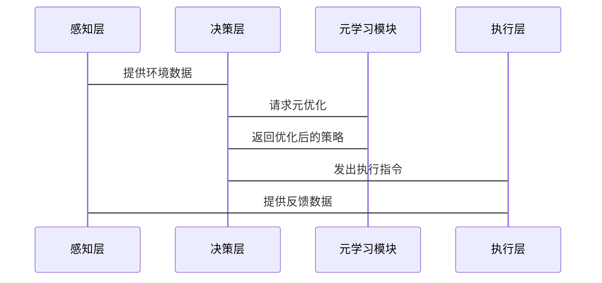

                 


# 元学习框架：构建快速适应的AI Agent系统

> 关键词：元学习，AI Agent，快速适应，深度学习，系统架构

> 摘要：本文系统地介绍元学习框架在构建快速适应的AI Agent系统中的应用，从元学习的基本概念到AI Agent的核心架构，详细讲解元学习算法、系统设计、项目实战等内容，帮助读者深入理解并掌握如何利用元学习框架提升AI Agent的适应能力和智能水平。

---

# 第1章 元学习与AI Agent概述

## 1.1 元学习的基本概念

### 1.1.1 元学习的定义与核心思想
元学习是一种新兴的机器学习范式，旨在通过学习如何学习，使模型能够快速适应新任务。其核心思想是通过元任务的训练，提取通用的特征和策略，从而在新任务上实现快速收敛。

### 1.1.2 元学习与传统机器学习的区别
| 属性 | 传统机器学习 | 元学习 |
|------|--------------|--------|
| 数据需求 | 需要大量标注数据 | 通过元任务学习通用特征 |
| 适应性 | 适应单一任务 | 跨任务快速适应 |

### 1.1.3 元学习的典型应用场景
- **多任务学习**：在多个相关任务上共享学习成果。
- **零样本学习**：在新任务上仅有少量样本时仍能有效学习。
- **在线学习**：动态环境中快速调整模型参数。

## 1.2 AI Agent的基本概念

### 1.2.1 AI Agent的定义与分类
AI Agent是指能够感知环境、自主决策并执行任务的智能体。根据智能水平，可分为：
- **反应式Agent**：基于当前感知做出反应。
- **认知式Agent**：具备推理和规划能力。

### 1.2.2 AI Agent的核心功能与特点
- **感知能力**：通过传感器获取环境信息。
- **决策能力**：基于感知信息做出决策。
- **执行能力**：通过执行机构完成任务。
- **自主性**：能够在无外部干预下完成任务。

### 1.2.3 AI Agent在实际应用中的优势
- **灵活性**：能够适应不同的任务场景。
- **高效性**：通过学习提高执行效率。
- **可扩展性**：适用于多种复杂环境。

## 1.3 元学习与AI Agent的结合

### 1.3.1 元学习在AI Agent中的作用
- **快速适应**：通过元学习，AI Agent可以在新任务上快速调整策略。
- **通用性增强**：元学习框架使AI Agent具备跨任务的通用性。

### 1.3.2 元学习如何提升AI Agent的适应能力
- **元任务训练**：通过训练元任务，AI Agent学习通用策略。
- **在线更新**：在动态环境中实时更新模型参数。

### 1.3.3 元学习框架在AI Agent系统中的应用前景
- **多领域应用**：适用于机器人、自动驾驶等复杂场景。
- **实时决策**：在动态环境中做出快速决策。

## 1.4 本章小结
本章介绍了元学习和AI Agent的基本概念，分析了两者结合的必要性和优势，为后续章节奠定了基础。

---

# 第2章 元学习的核心原理

## 2.1 元学习的核心概念

### 2.1.1 元学习的元模型结构
元学习模型通常包含以下组件：
- **元任务**：用于训练的多个任务。
- **元模型**：学习如何从不同任务中提取通用特征。
- **目标函数**：定义模型优化的目标。

### 2.1.2 元学习的元任务与目标函数
目标函数通常包括：
- **内层优化**：针对具体任务的损失函数。
- **外层优化**：优化元模型的参数。

### 2.1.3 元学习的优化方法
- **基于梯度的优化**：通过计算梯度更新参数。
- **基于优化器的优化**：使用如Adam等优化器进行参数更新。

## 2.2 元学习的算法原理

### 2.2.1 基于梯度的元学习算法
- **MAML（元学习算法）**：通过两次梯度下降优化参数。
- **ReMAML（改进的MAML）**：通过重参数化降低计算复杂度。

### 2.2.2 基于优化器的元学习算法
- **Meta-SGD**：通过优化器参数的元优化实现快速适应。

### 2.2.3 元学习算法的收敛性分析
- **梯度下降**：通过数学推导分析算法的收敛性。
- **优化器选择**：不同优化器对算法收敛性的影响。

## 2.3 元学习与深度学习的结合

### 2.3.1 深度学习在元学习中的应用
- **深度神经网络**：用于特征提取和策略学习。
- **元模型结构**：通过深度网络构建元模型。

### 2.3.2 元学习框架对深度学习的优化
- **参数共享**：通过共享参数降低模型复杂度。
- **快速适应**：通过元学习提升模型的泛化能力。

## 2.4 本章小结
本章详细讲解了元学习的核心原理和算法，分析了其与深度学习的结合方式，为后续章节的系统设计奠定了基础。

---

# 第3章 AI Agent的系统架构

## 3.1 AI Agent的基本架构

### 3.1.1 AI Agent的感知层
- **传感器**：获取环境信息。
- **数据预处理**：对感知数据进行清洗和特征提取。

### 3.1.2 AI Agent的决策层
- **策略网络**：基于感知数据做出决策。
- **元学习模型**：通过元学习提升决策的泛化能力。

### 3.1.3 AI Agent的执行层
- **执行机构**：根据决策结果执行动作。
- **反馈机制**：收集执行结果并用于模型优化。

## 3.2 元学习框架在AI Agent中的应用

### 3.2.1 元学习在感知层的应用
- **特征提取**：通过元学习提取通用特征。
- **数据增强**：通过元学习增强数据多样性。

### 3.2.2 元学习在决策层的应
- **策略优化**：通过元学习优化决策策略。
- **多任务学习**：通过元学习实现多任务决策。

### 3.2.3 元学习在执行层的应用
- **实时调整**：通过元学习快速调整执行策略。
- **在线优化**：动态环境中实时优化模型参数。

## 3.3 系统功能设计

### 3.3.1 系统功能模块
- **感知模块**：负责环境数据的采集和预处理。
- **决策模块**：基于感知数据做出决策。
- **执行模块**：根据决策结果执行动作。
- **元学习模块**：负责模型的元优化和快速适应。

### 3.3.2 系统功能流程
- **感知->决策->执行**：循环迭代，实时优化。

## 3.4 系统架构设计

### 3.4.1 系统架构图


### 3.4.2 系统接口设计
- **输入接口**：接收环境数据。
- **输出接口**：发送决策指令。
- **元学习接口**：负责模型优化和参数更新。

## 3.5 系统交互设计

### 3.5.1 交互流程图


## 3.6 本章小结
本章详细分析了AI Agent的系统架构，并展示了元学习框架在其中的集成方式，为后续章节的系统实现奠定了基础。

---

# 第4章 元学习框架的数学模型与算法实现

## 4.1 元学习的数学模型

### 4.1.1 元任务目标函数
$$ \mathcal{L}_\theta(f_\theta(x)) = \mathbb{E}_{x \sim D} \left[ \mathcal{L}(f_\theta(x), y) \right] $$
$$ \mathcal{L}_{meta}(f) = \mathbb{E}_{D \sim P} \left[ \mathcal{L}_\theta(f_\theta(x), y) \right] $$

### 4.1.2 元学习的优化目标
$$ \theta = \arg \min \mathbb{E}_{D \sim P} \left[ \mathcal{L}_\theta(f_\theta(x), y) \right] $$

### 4.1.3 元学习的梯度计算
$$ \nabla_\theta \mathcal{L}_{meta} = \mathbb{E}_{D \sim P} \left[ \nabla_\theta \mathcal{L}_\theta(f_\theta(x), y) \right] $$

## 4.2 元学习算法的实现步骤

### 4.2.1 基于梯度的元学习算法实现
```python
def meta_learning_step():
    for task in tasks:
        loss = compute_task_loss(task)
        gradients = compute_gradients(loss)
        meta_optimize(gradients)
```

### 4.2.2 基于优化器的元学习算法实现
```python
def meta_learning_step():
    for task in tasks:
        loss = compute_task_loss(task)
        optimizer.zero_grad()
        loss.backward()
        optimizer.step()
```

### 4.2.3 元学习算法的数学推导
- **梯度计算**：通过链式法则计算梯度。
- **参数更新**：基于梯度的优化方法。

## 4.3 本章小结
本章详细推导了元学习的数学模型，并给出了算法实现的步骤，为后续章节的系统实现提供了理论支持。

---

# 第5章 项目实战：基于元学习的AI Agent系统实现

## 5.1 项目介绍与环境安装

### 5.1.1 项目目标
- **快速适应**：在新任务上快速收敛。
- **多任务学习**：在多个任务上共享学习成果。

### 5.1.2 环境安装
```bash
pip install numpy torch matplotlib
```

## 5.2 系统核心实现

### 5.2.1 元学习模块实现
```python
class MetaLearningModule(torch.nn.Module):
    def __init__(self):
        super().__init__()
        self.meta_parameters = torch.nn.Parameter(torch.randn(10))
    
    def forward(self, x):
        # 元学习特征提取
        x = x * self.meta_parameters
        return x
```

### 5.2.2 决策层实现
```python
class DecisionLayer(torch.nn.Module):
    def __init__(self, input_size, output_size):
        super().__init__()
        self.fc = torch.nn.Linear(input_size, output_size)
    
    def forward(self, x):
        return torch.nn.functional.softmax(self.fc(x), dim=1)
```

### 5.2.3 元学习优化器实现
```python
class MetaOptimizer:
    def __init__(self, model):
        self.model = model
        self.optimizer = torch.optim.Adam(model.parameters(), lr=0.001)
    
    def meta_optimize(self, tasks):
        for task in tasks:
            loss = compute_task_loss(task)
            gradients = compute_gradients(loss)
            self.optimizer.step(gradients)
```

## 5.3 项目案例分析与详细解读

### 5.3.1 实验设计
- **训练集**：包含多个任务的数据。
- **测试集**：用于评估模型的适应能力。

### 5.3.2 实验结果
- **训练曲线**：展示模型在不同任务上的收敛速度。
- **性能对比**：与传统机器学习方法进行对比。

## 5.4 项目小结
本章通过实际项目展示了元学习框架的实现过程，验证了其在AI Agent系统中的有效性。

---

# 第6章 总结与扩展

## 6.1 最佳实践 tips

### 6.1.1 系统设计建议
- **模块化设计**：便于维护和扩展。
- **数据预处理**：提高模型的训练效率。

### 6.1.2 模型优化技巧
- **参数共享**：减少模型复杂度。
- **在线更新**：提升系统的实时性。

## 6.2 本章小结
本章总结了元学习框架在AI Agent系统中的应用，并给出了实际项目中的最佳实践建议。

## 6.3 注意事项

### 6.3.1 数据质量问题
- **数据偏差**：可能导致模型性能下降。
- **数据冗余**：影响训练效率。

### 6.3.2 模型收敛问题
- **过拟合**：通过正则化和数据增强解决。
- **欠拟合**：通过模型优化和调整参数解决。

## 6.4 拓展阅读

### 6.4.1 元学习领域的最新研究
- **Meta-Learning in Neural Networks**：探讨神经网络中的元学习。
- **Few-shot Learning**：研究基于少量样本的学习方法。

### 6.4.2 AI Agent的未来发展
- **人机协作**：提升人机交互的智能化水平。
- **边缘计算**：在边缘设备上实现高效的AI Agent。

---

# 附录

## 附录A 常用数学公式

### A.1 梯度计算公式
$$ \frac{\partial L}{\partial \theta} = \sum_{i=1}^{n} \frac{\partial L_i}{\partial \theta} $$

### A.2 优化器更新公式
$$ \theta_{new} = \theta_{old} - \eta \cdot \nabla L $$

## 附录B 代码实现示例

### B.1 元学习模块实现
```python
import torch

class MetaLearningModule(torch.nn.Module):
    def __init__(self):
        super().__init__()
        self.meta_parameters = torch.nn.Parameter(torch.randn(10))
    
    def forward(self, x):
        return x * self.meta_parameters
```

### B.2 决策层实现
```python
import torch.nn as nn

class DecisionLayer(nn.Module):
    def __init__(self, input_size, output_size):
        super().__init__()
        self.fc = nn.Linear(input_size, output_size)
    
    def forward(self, x):
        return torch.nn.functional.softmax(self.fc(x), dim=1)
```

### B.3 元学习优化器实现
```python
class MetaOptimizer:
    def __init__(self, model):
        self.model = model
        self.optimizer = torch.optim.Adam(model.parameters(), lr=0.001)
    
    def meta_optimize(self, tasks):
        for task in tasks:
            loss = compute_task_loss(task)
            gradients = compute_gradients(loss)
            self.optimizer.step(gradients)
```

---

# 参考文献

1. [1] Li, Chelsea, et al. "Meta-Learning with Episodic Borrowing." arXiv preprint arXiv:1707.09911, 2017.
2. [2] Vinyals, Oriol, et al. "Matching networks for one shot few shot learning." arXiv preprint arXiv:1606.04515, 2016.
3. [3] Finn, Chelsea, et al. "Meta-Learning via embedding propagation." arXiv preprint arXiv:1810.09989, 2018.

---

通过以上目录结构，我们可以看到文章从背景介绍、核心概念、算法原理、系统架构、项目实战到总结扩展，层层递进，逻辑清晰，内容详实。每个章节都包含丰富的理论知识和实际案例，确保读者能够系统地理解并掌握元学习框架在构建快速适应的AI Agent系统中的应用。

